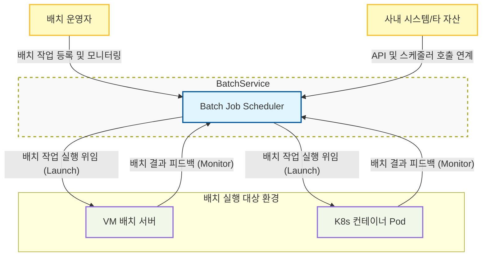
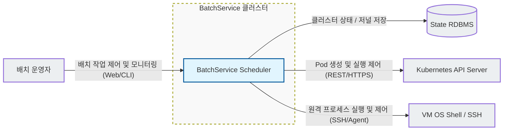
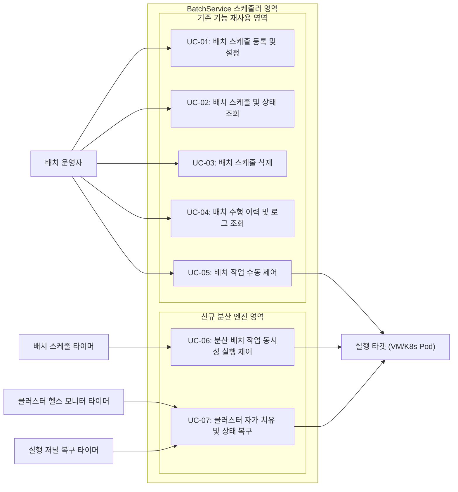
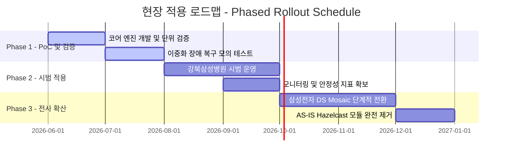

# 1. Project Overview

## 1.1 Project Charter

### 배경  

#### 프로젝트 추진 배경 및 문제점 (Project Background & Drivers)
당사 대내외 프로젝트에 무상 제공되는 공통 배치 스케줄러 재사용 자산인 **"BatchService"**는 기존에 다중 스케줄러 노드 간의 상태 조율(분산 락, 분산 큐)을 위해 외부 오픈소스 라이브러리인 **Hazelcast**에 전적으로 의존해 왔습니다. 그러나 최근 대내외적인 환경 상황 변화로 인해 다음과 같은 심각한 아키텍처적 당면 과제에 직면하게 되었습니다.

* **상용 라이선스 TCO 급증 리스크 (대외 환경)**: Hazelcast 5.x 버전 이후 상용 기업용 라이선스 정책이 대폭 강화되면서 연간 구독 계약(Annual Subscription) 시 노드당 연간 약 $5,000의 비용 부담이 발생하게 되었습니다. 3~5개 노드 클러스터를 표준으로 배포하는 BatchService의 특성상, 단일 현장 도입 시 매년 최소 $15,000(약 2,000만 원)에 달하는 고정비가 유발되어 무상 재사용 자산으로서의 보급 가치를 심각하게 훼손하고 있습니다.
* **과도한 인프라 풋프린트와 자원 낭비 (대내 환경)**: Hazelcast는 분산 인메모리 데이터 그리드(IMDG)로서 대규모 분산 메모리 공유 및 백그라운드 데이터 복제를 동반하므로 상시 수백 MB 이상의 Heap 메모리와 다중 스레드 CPU 연산 리소스를 지속 소모합니다. BatchService는 배치 작업을 직접 수행하지 않고 스케줄링 명령 및 흐름만 조율하므로, 기존 Hazelcast 엔진의 과도한 자원 점유는 소형 VM 또는 마이크로 컨테이너 환경에서 심각한 인프라 비효율과 오버헤드를 초래하고 있었습니다.
* **자체 경량 분산 엔진 내재화의 당위성**: 벤더 종속성과 라이선스 비용 문제를 원천 차단하고, 추가적인 분산 미들웨어(Redis, ZooKeeper 등) 설치 의존성을 배제하기 위해, JDK 17 표준 API와 기구축된 공용 RDBMS 메타 저장소만을 활용해 클러스터를 구성하는 독자적인 경량화 분산 조율 아키텍처 확보가 강력히 요구됩니다.

#### 기존 AS-IS 아키텍처 개념도
아래 다이어그램은 개편 대상이자 현재 Kubernetes(K8s) 환경에서 구동 중인 기존 BatchService의 아키텍처입니다. 다중화된 스케줄러 인스턴스(Replica # 1, # 2) 간의 작업 동기화(분산 큐, 분산 락)를 위해 외부 라이브러리인 **Hazelcast Cluster**에 강하게 의존하고 있습니다.

![[ArchitectureSpecification/1. Project Overview/BatchService_Architecture_concept.svg]]

#### 참고: 기존 배치 스케줄링 플랫폼 대비 재사용자산 BatchService의 차별성
널리 쓰이는 기존 배치 스케줄링 플랫폼(Apache Airflow, Kubernetes CronJob 등) 대신 사내 재사용자산 BatchService를 직접 개편 및 내재화하여 사용해야 하는 기술적/비즈니스적 당위성은 다음과 같습니다.

* **Airflow 대비 경량 구조 및 UI 기반 배치 설정의 우위성**:
  * Airflow는 Python 런타임 환경 외에 웹 서버, 스케줄러 데몬, 분산 워커, Celery/Redis(메시지 브로커), 메타 RDBMS 등 복잡하고 무거운 인프라 에코시스템 구축을 요구하므로 자원 요구량이 매우 크며, 경량형 자산으로 배포하기 부적합합니다.
  * 또한, Airflow는 배치 간 선후행 실행 관계(DAG Workflow)를 파이썬 코드로 직접 작성해 빌드해야 하므로 운영 편의성이 낮습니다. 반면, BatchService는 복잡한 DAG 정의를 관리자 웹 UI 상에서 드래그 앤 드롭으로 시각적으로 연결·매핑할 수 있는 직관적인 사용성을 제공합니다.
  * 아울러 별도의 Redis/ZooKeeper 인프라웨어 설치 없이 독립 실행(Standalone)되므로 배포 부담과 인프라 TCO를 최소화합니다.
* **Kubernetes CronJob 대비 정교한 제어 및 하이브리드 지원**:
  * Kubernetes CronJob은 클라우드 환경 전용 기술로서 단순히 지정 주기에 컨테이너 Pod를 기동(Launch)할 뿐, 작업 간의 정교한 선후행 의존 관계(Chaining) 관리, 동작 중인 배치의 실시간 강제 종료/수동 재기동 등 정밀 제어 API를 제공하지 않으며 레거시 가상 머신(VM) 실행 환경을 연동할 수 없습니다.
  * BatchService는 단일 스케줄러 클러스터 내에서 K8s 컨테이너 Pod 기동뿐 아니라 레거시 VM 내부의 쉘 스크립트 실행 제어까지 통합적으로 조율하고 모니터링할 수 있는 하이브리드 아키텍처를 제공합니다.
### 목표  

#### 아키텍처 개선 범위 (Architecture Scope)
- **개선 대상 (In-Scope):**
  - **분산 코디네이션 및 동기화 제어 엔진**: 외부 분산 클러스터(Hazelcast) 의존성을 배제하고, JDK 표준 API와 이미 구축된 공유 저장소 정보만을 활용해 리더 선출, 멤버십 동적 관리, 분산 락(중복 실행 방지), 분산 큐(작업 누락 방지) 기능을 가동하도록 개편합니다.
- **개선 제외 대상 (Out-of-Scope):**
  - 스케줄러의 비즈니스 기능(배치 설정 CRUD, 관리용 UI 설정 화면, 실행 이력 조회, 개별 배치 작업 실행 쉘/컨테이너 구동 자체 메커니즘 등)은 기존의 스펙을 수정 없이 재사용합니다.
#### 핵심 설계 목표
- **고가용성(HA) 및 신뢰성 보장 (Self-Healing):**
  - **최대 3~5개 노드**로 구성된 소규모 클러스터 환경에서 노드 장애(Crash 등)가 발생하더라도 스케줄러 기능이 중단 없이 지속되도록 자동 리더 선출 및 멤버십 관리 기능을 구현합니다.
- **안정적인 동시성 제어 (Distributed Lock & Queue):**
  - 평시 **수십 개**에서 최대 **수백 개** 수준의 동시 배치 작업(Job)이 여러 노드에 걸쳐 중복 실행되거나 유실되지 않도록 보장하는 분산 락 및 분산 큐를 구현합니다.
- **순수 Java Standard 기술 활용:**
  - 외부 라이브러리나 추가 인프라 설치 없이 JDK 표준 라이브러리(Java Concurrency, Socket 등)만을 활용하여 경량화되고 유지보수가 용이한 독자적 아키텍처를 완성합니다.

## 1.2 Stakeholder

| Stakeholder               | Description                                   | 주요 관심 및 Pain Point                                                                                                                                                                                                                                                    |
| ------------------------- | --------------------------------------------- | --------------------------------------------------------------------------------------------------------------------------------------------------------------------------------------------------------------------------------------------------------------------- |
| BatchService 개발자          | BatchService의 핵심 스케줄러 기능 및 분산 라이브러리 교체 개발 담당자 | - 외부 라이브러리 없이 순수 Java만으로 동시성 제어 및 클러스터링을 결함(Race Condition, Deadlock) 없이 구현해야 함. - 코드가 과도하게 복잡해지지 않고 유지보수 용이성을 유지해야 함. - 핵심 분산 기능(Lock, Queue)을 인터페이스 기반으로 정밀 추상화하여 구현체 간 결합도를 낮추고 유지보수 확장성을 보장해야 함.                                                            |
| BatchService 사용 프로젝트 아키텍트 | BatchService를 개별 프로젝트의 배치 시스템으로 도입/구축하는 아키텍트  | - AS-IS(Hazelcast 기반) 대비 API 및 설정 변경이 최소화되어 하위 호환성이 유지되어야 함. - 신규 엔진 도입 초기의 예기치 못한 크래시 상황에서도 데이터 유실 없이 무결하게 작업을 재개할 수 있는 장애 극복(Failover) 매커니즘이 수립되어야 함. - 실 운영 환경(VM, K8s)에서의 배치 누락이나 중복 실행 방지 등의 신뢰성이 확보되어야 함. - 스케줄러 노드의 자원(CPU/Memory) 점유율이 경량으로 유지되어야 함. |
| 사내 재사용자산 관리자              | 사내 공통 자산의 라이선스, 비용 리스크 및 지식재산권을 관리하는 담당자      | - Hazelcast 유료화에 따른 라이선스 비용 리스크를 제거해야 함. - 독자적 기술 내재화를 통한 사내 기술 자산 가치 증대 및 타 프로젝트 전파를 위한 체계적인 아키텍처 문서와 검증 데이터가 필요함.                                                                                                                                                |

## 1.3 Business Goal

프로젝트 아키텍처 개편을 통해 달성하고자 하는 궁극적인 비즈니스 목표를 정의합니다.

| Business Goal ID | 목표 정의             | 설명                                                         | 관련 요구사항 (Req ID) |
| :--------------: | ----------------- | ---------------------------------------------------------- | :--------------: |
|      BG-01       | 라이선스 프리 및 TCO 절감  | Hazelcast 유료화 리스크를 배제하여 운영/도입 비용을 최소화.                     |      NR-01      |
|      BG-02       | 기술 독립성 및 내재화      | 벤더 종속성 없는 분산 코디네이션 기술력을 사내 표준 기술로 내재화.                     |  NR-01, NR-04  |
|      BG-03       | 재사용 자산 배포 용이성 극대화 | 타 프로젝트에 BatchService를 도입할 때 추가 인프라 제약이나 외부 의존성 설치 허들을 최소화. |      NR-04      |

## 1.4 Issue and Requirement Analysis

프로젝트 아키텍처 수립의 기반이 되는 핵심 비즈니스 이슈와 이를 해결하기 위한 요구사항을 정의합니다.

### 1.4.1 핵심 비즈니스 이슈: Hazelcast 라이선스 유료화에 따른 TCO 증가
본 프로젝트의 착수 배경이 되는 핵심 이슈는 기존 분산 코디네이터 및 클러스터링 엔진으로 사용하던 Hazelcast의 라이선스 정책 변경입니다.

* **상세 설명 및 정량적 영향도**: 
  * Hazelcast의 라이선스 정책은 대외적으로 공개되지 않는 '비공개 협상 방식(Custom Pricing)'으로 운영되고 있으나, 과거 오픈 포럼 및 일부 시장 조사 자료(Vendr 레퍼런스)에 따르면, 연간 구독형(Annual Subscription) 계약 시 **노드당 연간 약 $5,000**의 라이선스 비용이 고정적으로 청구되는 것으로 알려져있습니다. 
  * 당사 표준 배치 스케줄러 클러스터(3개 노드) 구성을 고려할 때, 단일 프로젝트 도입 시 **연간 약 $15,000**(약2억원)의 인프라 고정 비용이 지속 발생합니다. 
  * 자체 분산 엔진 개발 시 투입 비용(공수: 개발자 2명 * 3개월 = 약 6,000만 원 일회성 비용) 대비 ROI가 우수하며 TCO를 절감합니다.

### 1.4.2 시스템 요구사항 (System Requirements)

Hazelcast 의존성을 배제하고, 기존의 분산 클러스터링 및 동시성 제어 기능과 운영 안정성을 대체하여 구현하기 위한 아키텍처적 기능/비기능 요구사항입니다.

#### 1.4.2.1 기능 요구사항 (Functional Requirements)

| Req ID | 요구사항 정의          | 세부 설명 및 도출 근거 (기술적 제약/품질 속성)                                                                   | 우선순위 | 관련 시스템 기능 |
| :----: | :--------------- | :--------------------------------------------------------------------------------------------- | :--: | :-------: |
| FR-01  | 중복 실행 방지 분산 락    | 다중 스레드/노드 분산 환경에서 동일한 배치 작업이 동시에 다중 구동되어 데이터가 오염되는 현상을 배제하기 위해 물리적인 분산 락 기능을 제공함.              |  상   |   SF-02   |
| FR-02  | 작업 누락 방지 분산 큐    | 분산 환경에서 특정 작업이 유실되지 않고 순차적(FIFO)이거나 안정적으로 타겟에 전달될 수 있도록 폴링 가능한 분산 큐 메커니즘을 제공함.                 |  상   |   SF-03   |
| FR-03  | 저널 복구를 통한 무유실 보장 | 자체 분산 엔진 적용 초기 안정성 확보를 위해, 데드락이나 프로세스 Crash 발생 시 공유 저널링 정보를 기반으로 미완료 작업을 최종 유실 없이 자동 롤백 및 복구함. |  중   |   SF-04   |
| FR-04  | 클러스터 멤버십 자가 치유   | 클러스터 내 노드들의 동적 참여 및 이탈을 감시하고, 장애 발생 시 자동으로 멤버 목록을 동기화하여 서비스 지속성을 유지함.                          |  하   |   SF-01   |

#### 1.4.2.2 비기능 요구사항 (Non-Functional Requirements)

| Req ID | 요구사항 정의                 | 분류  | 세부 설명 및 도출 근거 (기술적 제약/품질 속성)                                                                             | 우선순위 |      관련 시스템 기능      |
| :----: | :---------------------- | :-: | :------------------------------------------------------------------------------------------------------- | :--: | :-----------------: |
| NR-01  | 유료 분산 엔진 라이선스 배제        | 비용  | Hazelcast 등 유료 라이선스 리스크가 있는 외부 라이브러리 의존성을 전면 배제하여 도입/운영비 부담을 최소화함.                                       |  상   |        SF-01        |
| NR-02  | 동시성 결함 배제 (데드락 방지)      | 신뢰성 | 통신 소켓 및 RDBMS 트랜잭션 제어(Isolation Level) 상에서 Race Condition 및 교착 상태(Deadlock)가 발생하지 않도록 락 에이징 및 타임아웃을 지원함. |  상   |    SF-02, SF-03     |
| NR-03  | 기존 API 및 메타 스키마 호환성     | 호환성 | 기존 스케줄러 호출 서비스들이 수정 없이 작동할 수 있도록 호환성을 확보하고, 기존 데이터베이스 스키마와의 하위 호환성을 유지함.                                 |  중   | SF-02, SF-03, SF-04 |
| NR-04  | 별도 미들웨어 인프라 설치 배제       | 운영성 | Zookeeper, Redis 등 분산 상태 조율용 외부 미들웨어를 추가 설치/운영해야 하는 인프라 복잡성을 제거하여 배포 및 구성을 단순화함.                         |  중   | SF-01, SF-02, SF-03 |
| NR-05  | 리소스 사용량 최소화 (Footprint) | 효율성 | 메모리 및 CPU 오버헤드를 낮추어 신규 엔진 기동 시 추가 CPU 사용율 5% 미만, 추가 Heap 메모리 점유 50MB 이하로 제어함.                            |  중   | SF-01, SF-02, SF-03 |
| NR-06  | 플랫폼 및 런타임 독립성           | 이식성 | 특정 OS 또는 Native 라이브러리에 종속되지 않으며, JDK 17 표준 가상머신(VM) 및 Kubernetes 컨테이너(Pod) 환경 전체에서 동일하게 빌드 및 구동됨.        |  중   |    SF-01 ~ SF-05    |
| NR-07  | 소켓 세션 보안 검증             | 보안성 | 클러스터 멤버 간 통신(Gossip 등) 수행 시 사내 보안 망 가이드라인을 준수하며, 허가되지 않은 노드가 클러스터에 무단 접근 또는 참여하는 행위를 차단함.                |  하   |    SF-01, SF-05     |
| NR-08  | 3~5초 이내 고속 장애 복구        | 성능  | 특정 노드 급작 종료 시, 타 대기 노드가 3~5초 이내에 하트비트 아웃을 감지하여 멤버십을 갱신하고 신규 리더를 선출하여 스케줄 공백을 차단함.                        |  하   |    SF-01, SF-05     |

## 1.5 Business context Diagram

BatchService의 비즈니스 영역 경계와 외부 행위자/시스템 간의 관계를 다이어그램으로 나타냅니다.
![[Pasted image 20260615001919.png]]

# 2. System Overview

## 2.1 System Context Diagram

BatchService를 중심으로 상호작용하는 외부 시스템 및 운영자와의 관계를 시스템 관점에서 정의합니다.
![[Pasted image 20260615002015.png]]

## 2.2 External Entity List

BatchService와 연계되는 외부 시스템, 행위자(Actor) 및 관련 자원의 역할을 정의합니다.

|  ID   | 외부 엔티티명               |   구분   | 설명                                                                    |
| :---: | --------------------- | :----: | --------------------------------------------------------------------- |
| EE-01 | 배치 운영자                | Actor  | 배치 스케줄링 등록, 강제 실행, 상태 모니터링 및 장애 조치를 수행하는 사용자 또는 운영 시스템.               |
| EE-02 | Kubernetes API Server | System | K8s 실행 환경에서 스케줄러의 요청에 따라 배치 실행용 Pod을 생성, 제어 및 감시하는 API 제공 주체.         |
| EE-03 | VM 호스트 (SSH / Shell)  | System | VM 실행 환경에서 스케줄러의 요청에 따라 배치 실행 파일(.sh, jar 등)을 기동하고 결과를 반환하는 타겟 OS 환경. |
| EE-04 | 배치 메타 DB (RDBMS)      | System | 배치 작업의 스케줄 정보, 실행 이력 및 클러스터 메타데이터/저널링 정보를 저장하는 관계형 데이터베이스.            |

## 2.3 External Interface List

BatchService가 외부 엔티티와 데이터를 주고받을 때 사용하는 통신 규격 및 인터페이스 사양을 정리합니다.

|   ID   | 인터페이스명           | 송신/수신 | 프로토콜/연계방식               | 연계 데이터 및 설명                                                                  |
| :----: | ---------------- | ----- | ----------------------- | ---------------------------------------------------------------------------- |
| INF-01 | 운영자 제어 API       | 수신    | REST/HTTPS (JSON)       | 배치 작업 신규 등록, 일시 중지, 즉시 실행 요청 및 전체 스케줄러 노드 상태 모니터링 데이터.                       |
| INF-02 | K8s Job 제어 인터페이스 | 송신    | REST/HTTPS (K8s API)    | 배치 실행을 위해 K8s Job 리소스를 생성(Manifest 전송)하고 Pod의 시작/종료/오류 상태를 폴링(Polling)함.     |
| INF-03 | VM 실행 제어 인터페이스   | 송신    | SSH / Local Process API | VM 환경에서 배치 스크립트 실행 명령어를 송신하고, 프로세스 종료 코드(Exit Code) 및 Stdout/Stderr 로그를 수신함. |
| INF-04 | 데이터베이스 연계 인터페이스  | 송/수신  | JDBC (TCP)              | 스케줄 구성 데이터 조회, 배치 실행 이력 적재 및 클러스터 하트비트/저널링 데이터 영속화 수행.                       |

## 2.4 System Feature List

Hazelcast 의존성을 배제하고, 기존의 분산 클러스터링 및 동시성 제어 기능과 운영 안정성을 대체하여 구현할 시스템 기능(System Feature)의 상세 정의와 구현 범위를 기술합니다.

|  ID   | 기능명                         | 설명                                                                        | 구현 범위 (Scope)        |      관련 요구사항 (Req ID)      |
| :---: | --------------------------- | ------------------------------------------------------------------------- | -------------------- | :------------------------: |
| SF-01 | 클러스터 멤버십 관리                 | 3~5개 노드 간의 활성화 상태(Heartbeat)를 지속적으로 확인하고 전체 멤버 목록을 동기화함.                  | 신규 개발 (Hazelcast 대체) | FR-04, NR-01, NR-04, NR-08 |
| SF-02 | 분산 락 (Distributed Lock)     | 특정 배치 작업이 다중 노드에서 중복으로 동시 실행되는 것을 완전 차단하는 임계 구역 제어 기능을 제공함.               | 신규 개발 (Hazelcast 대체) | FR-01, NR-02, NR-03, NR-04 |
| SF-03 | 분산 큐 (Distributed Queue)    | 배치 실행 대기열을 관리하며, 여러 컨슈머(노드)가 동시 접근하더라도 작업 유실이나 중복 처리 없이 순차 가공할 수 있도록 지원함. | 신규 개발 (Hazelcast 대체) | FR-02, NR-02, NR-03, NR-04 |
| SF-04 | 장애 저널 복구 (Journal Recovery) | 스케줄러 노드 장애(Crash 등) 시 RDBMS 실행 저널 로그를 추적하여 미완료 또는 오작동 배치 작업을 복구 및 재처리함.   | 신규 개발 (Hazelcast 대체) |        FR-03, NR-03        |
| SF-05 | 자동 리더 선출 (Failover)         | 현재 활성화된 리더 노드의 장애를 감지하면, 즉시 자가 치유(Self-Healing)를 발동하여 잔여 노드 중 신규 리더를 선출함. | 신규 개발 (Hazelcast 대체) |        FR-04, NR-08        |

## 2.5 Assumption of the System

BatchService 아키텍처 설계 및 구현의 전제가 되는 환경적/비즈니스적 가정 사항(Assumption)을 정의합니다.

|   ID   | 가정 사항            | 상세 설명                                                                                                                          | 비고                     |
| :----: | ---------------- | ------------------------------------------------------------------------------------------------------------------------------ | ---------------------- |
| ASM-01 | 메타 DB 인프라 가용성    | BatchService를 도입하는 대상 현장(삼성 DS, 강북삼성병원 등)은 이미 안정적으로 이중화(HA) 구성된 메타 데이터베이스(Oracle, PostgreSQL 등)를 상시 운영하고 있음을 가정함.              | 합의 저널링 및 상태 영속화의 기본 전제 |
| ASM-02 | 인프라 내 NTP 시간 동기화 | 분산 임대 락(Lease Lock)의 만료 시간 및 분산 스케줄 실행의 정확성 보장을 위해, 대상 현장의 물리/가상 서버들이 표준 시간 서버(NTP)를 통해 시스템 시간 오차 **최대 1초 이내**로 동기화되어 있다고 전제함. | 스케줄 및 락 정밀도 보장         |
| ASM-03 | 클러스터 최대 노드 수 제한 | 단일 BatchService 클러스터를 구성하는 스케줄러 인스턴스는 최소 3개에서 최대 5개 노드 수준으로 제한되며, 이를 초과하는 대규모 클러스터 분산 상태 관리는 본 설계 범위 외임. | 클러스터 통신 및 합의 오버헤드 최소화 |
| ASM-04 | 네트워크 대역폭 및 안정성 | 클러스터 노드 간 및 RDBMS 커넥션 대역폭은 최소 1Gbps 이상을 보장하며, 비정상적이고 영구적인 네트워크 분할(Split-Brain)은 인프라 수준의 조치로 해소됨을 전제함. | 망 장애 시 인프라 수준 대응 전제 |

# 3. Architectural Driver

## 3.1 Use Case Model

BatchService 핵심 클러스터링 엔진 교체와 관련하여 시스템이 처리해야 하는 주요 동작 시나리오를 정의합니다.

> [!NOTE]
> **유스케이스 설계 범위 및 구분 (Scope & Division)**
> 본 개편 명세서의 유스케이스 모델은 실제 배치 운영자가 수행하는 일반 배치 관리 기능과 분산 클러스터 엔진 교체에 따라 백그라운드에서 신규 구동되는 분산 동기화/자가 치유 흐름을 통합적으로 포함합니다. 
> 
> 독자의 흐름 파악을 돕기 위해, 유스케이스 목록 및 상세 정의 단계에서 **기존 기능 재사용(AS-IS 재사용)** 영역과 **신규 엔진 적용(TO-BE 신규 개발)** 영역을 엄격하게 구분하여 기술합니다.

#### 유스케이스 액터(Actor) 정의 및 분류
본 시스템은 백그라운드에서 상시 작동하는 무중단 분산 스케줄링 자산이므로, 사람 사용자, 외부 시스템, 시간 이벤트를 발생시키는 요소를 모두 아키텍처적인 액터로 정의합니다.

1. **사람 액터 (Human Actor)**: 
   * **배치 운영자 (Operator)**: 웹 UI 관리 화면을 통해 배치 스케줄을 CRUD 제어하거나 이력을 모니터링하고, 수동 즉시 실행 및 강제 종료 명령을 내리는 운영 담당 주체.
2. **외부 시스템 액터 (External System Actor)**: 
   * **실행 타겟 (Execution Target - VM/K8s Pod)**: 스케줄러 노드로부터 배치 실행 신호를 받아 실 배치 작업을 구동하거나, 중단 신호를 받아 프로세스를 소멸시키는 대상 인프라 환경.
3. **시간 액터 (Time / Temporal Actor)**: 
   * **배치 스케줄 타이머 (Batch Schedule Timer)**: 각 배치 작업에 지정된 크론(Cron) 실행 주기가 도달했을 때 구동 트리거를 송신하는 백그라운드 액터.
   * **클러스터 헬스 모니터 타이머 (Cluster Health Monitor Timer)**: 주기적으로 노드 간 활성 핑(Heartbeat) 및 메타 DB의 멤버십 로우를 확인하여 장애 유무를 진단하는 액터.
   * **실행 저널 복구 타이머 (Journal Recovery Scan Timer)**: 주기적으로 공유 저장소의 작업 저널을 스캔하여 비정상 종료된 미완료 태스크를 자동 스캔하는 액터.

### 3.1.1 유스케이스 다이어그램 (Use Case Diagram)

### 3.1.2 유스케이스 목록 (Use Case List)

| 구분 | ID | 유스케이스명 | 설명 | 중요도 | 난이도 | 관련 시스템 기능 |
| :---: | :---: | :--- | :--- | :---: | :---: | :--- |
| **기존 기능 재사용** | UC-01 | 배치 스케줄 등록 및 설정 | 웹 UI 화면을 통해 신규 배치를 등록하고, 배치 간 선후행(DAG) 흐름을 매핑함. | 상 | 하 | N/A (Out-of-Scope) |
| **기존 기능 재사용** | UC-02 | 배치 스케줄 및 상태 조회 | 스케줄러 노드 목록 및 기등록 배치들의 동작 주기와 실시간 가동 상태를 감시함. | 상 | 하 | N/A (Out-of-Scope) |
| **기존 기능 재사용** | UC-03 | 배치 스케줄 삭제 | 웹 UI 상에서 등록된 스케줄 항목을 선택하여 안전하게 삭제 처리함. | 중 | 하 | N/A (Out-of-Scope) |
| **기존 기능 재사용** | UC-04 | 배치 수행 이력 및 로그 조회 | 완료되었거나 구동 중인 배치의 세부 로그 및 최종 성공/실패 여부를 역추적함. | 상 | 하 | N/A (Out-of-Scope) |
| **기존 기능 재사용** | UC-05 | 배치 작업 수동 제어 | 특정 배치의 강제 즉시 실행(수동 트리거) 및 기동 중인 배치의 프로세스 강제 종료를 처리함. | 상 | 중 | SF-02, SF-03 |
| **신규 개발** | UC-06 | 분산 배치 작업 동시성 실행 제어 | 주기 도달 시 다중 노드가 분산 락 경쟁을 거쳐 단일 노드에서 중복 없이 분산 큐로 배치를 구동함. | 상 | 상 | SF-02, SF-03 |
| **신규 개발** | UC-07 | 클러스터 자가 치유 및 상태 복구 | 리더 다운 시 타 노드가 3~5초 내에 자동 복구 및 RDBMS 저널을 스캔하여 미처리 작업을 정상 복구함. | 상 | 상 | SF-01, SF-04, SF-05 |

### 3.1.3 유스케이스 상세 정의

#### UC-01 ~ UC-04: 배치 관리 기본 기능 (AS-IS 재사용)
* 본 기능들은 BatchService 고유의 비즈니스 영역(관리자 UI 및 메타데이터 CRUD)에 속하므로, Hazelcast 엔진 교체와 무관하게 기존 소스코드를 그대로 재사용하며 상세 흐름 기술을 생략합니다.

#### UC-05: 배치 작업 수동 제어 (기존 기능 / 분산 엔진 연계)
| 항목 | 내용 |
| :--- | :--- |
| 액터 (Actor) | 배치 운영자 (Operator), 실행 타겟 (VM/K8s Pod) |
| 사전 조건 | 운영자가 관리 툴에 로그인하여 특정 배치 제어 인터페이스에 접근함. |
| 기본 흐름 | 1. **수동 트리거**: 운영자가 특정 배치의 즉시 실행 명령을 내림 -> 스케줄러 코어가 해당 작업을 분산 큐(`SF-03`)의 최선두에 삽입하여 실행을 지시함. 2. **강제 종료**: 운영자가 실행 중인 배치에 종료 명령을 내림 -> 스케줄러가 타겟 실행 인프라에 중단 시그널(SIGTERM 등)을 전송하고, 즉시 분산 락(`SF-02`)을 강제 해제함. |
| 예외 흐름 | - **네트워크 단절로 강제 종료 불가 시**: 메타 DB 상에서 작업 상태를 강제로 취소(FAILED) 처리하고, 통신 복구 시 잔여 프로세스가 스스로 강제 해제 상태를 감지하여 실행을 자동 정지하게 함. |
| 사후 조건 | 수동 조작에 따른 실행 상태가 RDBMS 저널에 기록되고 공유 저장소가 즉시 최신화됨. |

#### UC-06: 분산 배치 작업 동시성 실행 제어 (신규 개발)
| 항목 | 내용 |
| :--- | :--- |
| 액터 (Actor) | 배치 스케줄 타이머 (Batch Schedule Timer), 실행 타겟 (VM/K8s Pod) |
| 사전 조건 | 3~5개 노드 클러스터가 정상 구성되어 하트비트를 주고받고 있으며, 분산 락 및 분산 큐 인터페이스가 활성화되어 있음. |
| 기본 흐름 | 1. 배치 주기에 맞추어 타이머가 이벤트를 발생시킴. 2. 클러스터 내의 노드들이 해당 배치 작업에 대한 분산 락(`SF-02`) 획득을 경쟁함. 3. 분산 락 획득에 성공한 단 하나의 노드(Worker)가 작업 실행 권한을 선점함. 4. 해당 노드가 작업을 분산 큐(`SF-03`)에 안전하게 적재함. 5. 큐에서 태스크를 인출하여 실행 타겟(VM/K8s)에 실행 위임 명령을 송신함. 6. 배치가 종료되면 락을 자동 해제하고 RDBMS 메타테이블에 이력을 저장함. |
| 예외 흐름 | - **락 획득 실패 시**: 타 노드가 이미 처리 중인 것으로 판단하여 실행 시도를 무시하고 대기 상태를 유지함 (중복 실행 완전 차단). - **원격 기동 실패 시**: 실패 로그를 기록하고, 설정된 재시도 규칙에 따라 재처리 큐로 이관함. |
| 사후 조건 | 작업 실행 결과가 정상 기록되고, 점유했던 분산 리소스(락, 큐 슬롯)가 온전히 반환됨. |

#### UC-07: 클러스터 자가 치유 및 상태 복구 (신규 개발)
| 항목 | 내용 |
| :--- | :--- |
| 액터 (Actor) | 클러스터 헬스 모니터 타이머, 실행 저널 복구 타이머, 실행 타겟 (VM/K8s Pod) |
| 사전 조건 | 1개의 리더 노드와 대기 노드군이 활성화된 상태이며, 일부 작업이 수행 중인 상황임. |
| 기본 흐름 | 1. **장애 감지**: 현재 리더 노드가 다운되거나 하트비트가 끊김. 2. **자가 치유**: 대기 노드가 3~5초 이내에 하트비트 유실을 감지(`SF-01`)하고, 자율 리더 선출 알고리즘(`SF-05`)을 가동하여 새로운 리더를 선출함. 3. **상태 복구**: 선출된 리더가 메타 DB의 실행 저널(`SF-04`)을 스캔하여 비정상 종료된 배치 태스크를 추적함. 4. **재스케줄링**: 식별된 작업을 복구 큐에 등록하여 지연이 없도록 신속하게 재처리를 예약 구동함. |
| 예외 흐름 | - **데이터베이스 장애로 저널 스캔 불가 시**: 복구 핸들러가 관리자 알람을 발생시키고, DB 커넥션이 복구될 때까지 10초 간격으로 스캔을 재시도함. |
| 사후 조건 | 새로운 리더 체제 하에 클러스터가 무중단 유지되며, 유실될 뻔한 누락 작업들이 안전하게 실행 완료됨. |

## 3.2 Quality Attribute Scenario

본 프로젝트 아키텍처 개편을 결정하는 핵심 품질 속성 시나리오(Availability, Consistency, Reliability 등)를 정의합니다.

### 3.2.1 품질 속성 시나리오 목록 (Quality Attribute Scenario List)

|   ID   | 품질 속성                       | 시나리오명                                     | 시나리오 요약                                                    | 중요도 | 난이도 | 관련 비즈니스 목표 (Business Goal ID) | 관련 요구사항 (Req ID) |
| :----: | --------------------------- | ----------------------------------------- | ---------------------------------------------------------- | :-: | :-: | ----------------------------- | ---------------- |
| QAS-01 | 가용성 (Availability)          | 리더 노드 크래시 시 5초 이내 자가 치유 및 복구              | 리더 노드 장애 발생 시 5초 이내 자동 감지 및 신규 리더 선출 완료                    |  상  |  상  | BG-02                         | FR-04, NR-08 |
| QAS-02 | 일관성 (Consistency)           | 수백 개 동시성 트래픽 상황에서 배치 작업 중복 실행 방지          | 높은 동시성 요청 하에서 분산 락을 활용하여 배치 작업의 중복 실행 오작동을 방지함.      |  상  |  상  | BG-02                         | FR-01, NR-02 |
| QAS-03 | 신뢰성 (Reliability)           | 예기치 못한 스케줄러 다운 시 저널링 복원을 통한 데이터 무유실 복구    | 스케줄러 다운 시 공유 실행 저널을 역추적하여 미완료 태스크 복구 및 재처리           |  상  |  중  | BG-02, BG-03                  | FR-03        |
| QAS-04 | 효율성 (Resource Efficiency)   | Hazelcast 대비 클러스터 노드당 자원(메모리/CPU) 점유율 최적화 | 자사 경량화 모듈 적용을 통해 노드당 JVM Heap 메모리 점유 및 CPU 오버헤드 50% 이상 절감  |  중  |  중  | BG-01                         | NR-01, NR-05 |
| QAS-05 | 이식성 (Portability)           | 외부 분산 인프라 없는 VM/K8s 하이브리드 인프라 배포성 극대화     | Zookeeper/Redis 등 외부 솔루션 없이 JDK 17 표준 및 공유 저장소 의존성만으로 배포 완료 |  상  |  중  | BG-01, BG-03                  | NR-04, NR-06 |
| QAS-06 | 보안성 (Security & Compliance) | 기업 방화벽 컴플라이언스를 만족하는 네트워크 구성 간소화           | 노드 간 전용 통신 포트 오픈 요구 없이 기개방된 공유 저장소 연결 포트만으로 클러스터링 승인 만족    |  상  |  중  | BG-03                         | NR-04, NR-07 |
| QAS-07 | 성능 (Performance) | 피크 타임 배치 락/큐 인출 응답 시간 보장 | 피크 타임에 수백 개 배치 기동 시 노드당 평균 0.5초 이내에 분산 락 및 큐 처리를 완료함. | 상 | 중 | BG-02, BG-03 | FR-01, FR-02, NR-02 |
| QAS-08 | 신뢰성 (Reliability) | 스플릿 브레인 상황 시 데이터 정합성 보장 | 일시적인 네트워크 분할(Split-Brain) 상황에서 리더 중복 기동에 의한 중복 배치를 방지함. | 상 | 상 | BG-02 | FR-01, FR-04, NR-02 |
| QAS-09 | 유지보수성 (Maintainability) | 신규 스케줄링 노드 수평 확장 속도 극대화 | 신규 노드 추가 시 소스코드나 빌드 변경 없이 10분 내에 무중단 클러스터 편입을 완료함. | 중 | 하 | BG-03 | FR-04, NR-06 |

### 3.2.2 상세 품질 속성 시나리오 (Quality Attribute Scenario Specification)

#### QAS-01: [가용성] 리더 노드 크래시 시 5초 이내 자가 치유 및 복구
| 항목 | 내용 |
| ---------------- | -------------------------------------------------------------------------------------------------------------------------------- |
| 품질 속성 | 가용성 (Availability) |
| 시나리오 | 3~5개 스케줄러 노드로 구성된 클러스터에서 리더 노드 장애 발생 시, 대기 노드가 이를 5초 이내에 감지하고 새로운 리더를 선출하여 중단 없이 배치 실행 제어권을 복구함. |
| 자극원 (Source) | 스케줄러 인프라 장애 또는 프로세스 크래시 (Leader Node Crash) |
| 자극 (Stimulus) | 리더 노드의 하트비트(Heartbeat) 유실 |
| 대상 (Artifact) | 클러스터 멤버십 매니저 (Cluster Membership Manager) |
| 환경 (Environment) | 실시간 다중 배치 스케줄이 정상적으로 구동되고 있는 K8s 컨테이너 환경 |
| 응답 (Response) | 1. 잔여 대기(Follower) 노드들이 하트비트 타임아웃을 감지함. 2. 신규 리더 선출 알고리즘을 즉시 가동하여 리더를 선출함. 3. 새 리더가 중단 시점의 큐 및 스케줄 이력을 공유 저널 로그로부터 복원함. |
| 응답 측정 | 장애 시점부터 새 리더가 온전히 복구 완료되어 배치를 다시 스케줄링하기 시작하기까지의 누적 지연 시간이 5초 이내 |
| 측정 목표의 객관적 근거 | 1) BatchService가 주로 다루는 최소 스케줄 주기는 10초~30초 단위이므로, 자가 복구가 5초를 초과하면 해당 실행 주기 타이머가 만료되어 1회 실행 누락이 발생할 수 있음. 2) 감지 시간을 1~3초 미만으로 극단적으로 단축하면, 일시적 네트워크 지연(Spike)이나 짧은 GC STW 상황을 장애로 오인하여 불필요한 리더 재선출(Failover 오작동)을 빈번하게 유발할 수 있으므로, 하트비트 주기(3초)의 약 1.5배인 5초가 가용성과 감지 신뢰성 사이의 최적점임. |

#### QAS-02: [일관성] 수백 개 동시성 트래픽 상황에서 배치 작업 중복 실행 방지
| 항목 | 내용 |
| ---------------- | --------------------------------------------------------------------------------------------------------------------------------------- |
| 품질 속성 | 일관성 (Consistency) / 데이터 무결성 |
| 시나리오 | 다중 스케줄러 노드 환경에서 수백 개의 배치 타이머가 동시에 기동되는 높은 동시성 요청이 유발되더라도, 분산 락(Distributed Lock)을 통해 단 하나의 인스턴스만 배치 작업을 실행하고 중복 실행을 방지함. |
| 자극원 (Source) | 다중 스케줄러 노드들의 동시 타이머 트리거 |
| 자극 (Stimulus) | 동일한 배치 Job에 대한 분산 락 획득 동시 요청 |
| 대상 (Artifact) | 분산 락 제어 인터페이스 및 구현 모듈 (Distributed Lock Interface & Impl) |
| 환경 (Environment) | 평시 피크 타임(수백 개의 배치가 집중적으로 몰리는 시점) |
| 응답 (Response) | 1. 락 획득 요청을 받은 분산 락 모듈이 상호 배제(Mutual Exclusion) 알고리즘을 통해 하나의 노드에게만 락 소유권을 할당함. 2. 락 획득에 실패한 노드는 중복 실행을 시도하지 않고 즉시 대기 혹은 실패로 로그를 처리함. |
| 응답 측정 | 1) 동일 배치 작업의 중복 실행 오작동이 발생하지 않을 것. 2) 동시 락 요청 경쟁 시 락 소유권 결정 지연이 평균 1초 이내. |
| 측정 목표의 객관적 근거 | 1) 분산 환경에서 동일 배치가 동시 실행될 경우, DB 레코드 중복 쓰기나 결제 중복 승인 등 심각한 정합성 붕괴(비즈니스 장애)가 유발되므로 중복 실행 건수는 반드시 0건이어야 함. 2) 동시 락 경합 시 결정 지연이 1초를 초과하면 전체 스케줄러의 기동 스레드가 Blocking 상태에 빠져 후속 대기 스케줄들이 연쇄 지연(Cascading Delay)되므로, 1초 이내 처리가 필수적임. |

#### QAS-03: [신뢰성] 예기치 못한 스케줄러 다운 시 저널링 복원을 통한 데이터 무유실 복구
| 항목 | 내용 |
| ---------------- | -------------------------------------------------------------------------------------------------------------------------------------------------------------------------- |
| 품질 속성 | 신뢰성 (Reliability) |
| 시나리오 | 스케줄러 노드 또는 실행 대상 프로세스가 배치 수행 도중 급작스럽게 중단(Crash)되더라도, 공유 저장소 상의 실행 저널(Journaling) 정보를 복원하여 미완료 태스크의 누락이나 유실 없이 스케줄러가 스스로 상태를 복구함. |
| 자극원 (Source) | 스케줄러 서버 하드웨어 장애 또는 강제 킬(Kill) |
| 자극 (Stimulus) | 배치 실행 도중 비정상 프로세스 정지 |
| 대상 (Artifact) | 저널링 매니저 및 상태 복구 핸들러 (State Recovery Handler) |
| 환경 (Environment) | 일 배치 혹은 대용량 실시간 배치 실행 도중 예기치 못한 크래시 발생 시 |
| 응답 (Response) | 1. 새롭게 리더권을 획득한 스케줄러 노드가 공유 저장소의 작업 실행 로그(Journal)를 역추적함. 2. 비정상 종료된 작업(Running 상태로 남아 있는 미완료 태스크)을 식별함. 3. 해당 작업을 복구 큐에 등록하고 재처리를 예약함. |
| 응답 측정 | 1) 스케줄러 크래시 복구 시 배치 스케줄 예약 데이터 유실이 0건일 것. 2) 미완료 작업 식별 및 재스케줄링 완료 지연 시간이 10초 이내일 것. |
| 측정 목표의 객관적 근거 | 1) 당사의 스케줄러 자산은 유실 방지(At-least-once) 신뢰성이 비즈니스 최우선 가치이므로 복구 시 데이터 유실은 발생하면 안 됨. 2) 장애 감지 및 신규 리더 승격(5초) 후, 잔여 실행 정보 분석 및 재예약이 10초 이내에 완료되어야 총 지연 시간이 배치 SLA 임계치(15초) 내에 수렴하여 업무에 영향이 없음. |

#### QAS-04: [효율성] Hazelcast 대비 클러스터 노드당 자원(메모리/CPU) 점유율 최적화
| 항목 | 내용 |
| ---------------- | -------------------------------------------------------------------------------------------------------------------------------------------------------------------------- |
| 품질 속성 | 자원 효율성 (Resource Efficiency) |
| 시나리오 | 대용량 분산 메모리 그리드인 Hazelcast 대신 경량화된 자사 순수 Java 모듈을 적용하여, 클러스터 노드당 사용하는 JVM Heap 메모리와 상시 CPU 오버헤드를 줄여 저사양 노드에서도 안정적으로 가동함. |
| 자극원 (Source) | 지속적인 배치 스케줄러 백그라운드 구동 |
| 자극 (Stimulus) | 상시 리소스 점유량 모니터링 및 프로세스 오버헤드 측정 |
| 대상 (Artifact) | 코어 엔진 내부 클래스 및 쓰레드 풀 관리자 |
| 환경 (Environment) | 3~5개 소규모 노드로 구성된 저스펙 가상 머신(VM) 및 컨테이너 환경 |
| 응답 (Response) | 1. Hazelcast 엔진 구동에 따른 백그라운드 멤버십 복제 스레드 및 직렬화/역직렬화 버퍼 메모리를 완전 제거함. 2. ThreadPoolExecutor 및 커넥션 풀 크기 조정을 통해 활성 자원을 고정된 수치 내에서 엄격히 격리함. |
| 응답 측정 | 1) 스케줄러 프로세스의 대기 상태(Idle) JVM Heap 메모리 점유량이 기존 대비 50% 이상 감소할 것. 2) 임계 상황 시 추가적인 가비지 컬렉션(GC) 일시 정지(Stop-the-World) 시간이 1초 이내일 것. |
| 측정 목표의 객관적 근거 | 1) 도입 대상 현장의 표준 인프라 스펙(1 Core CPU, 2GB RAM VM) 내에서 스케줄러 데몬이 200MB 이상의 거대 메모리를 점유하면 실 배치 프로세스(Shell, Container 기동 JVM) 구동에 필요한 OS 여유 메모리가 고갈되어 OOM(Out of Memory) 크래시가 유발됨. 따라서 50MB(기존 대비 50% 이상 절감) 이하의 풋프린트 제어가 필수적임. 2) 가비지 컬렉션으로 인한 STW가 1초를 초과하면, 타 노드가 리더 노드의 하트비트 단절로 오인하여 불필요한 자가 복구 루틴을 구동하므로 이를 방지할 수 있는 한계치임. |

#### QAS-05: [이식성] 외부 분산 인프라 없는 VM/K8s 하이브리드 인프라 배포성 극대화
| 항목 | 내용 |
| ---------------- | -------------------------------------------------------------------------------------------------------------------------------------------------------------------------- |
| 품질 속성 | 이식성 (Portability) / 배포성 |
| 시나리오 | Zookeeper, Redis 등 외부 분산 오디팅/코디네이터 인프라를 요구하지 않고, JDK 17 표준 라이브러리와 범용 공유 저장소 연결만으로 VM 및 K8s 하이브리드 환경에 원활히 빌드/배포하여 가동함. |
| 자극원 (Source) | 인프라 운영 및 설치 담당자 |
| 자극 (Stimulus) | 이종 배포 대상(삼성 DS Mosaic - K8s, 강북삼성병원 - VM 등)에 스케줄러 단일 패키지 설치 |
| 대상 (Artifact) | 엔진 초기화 및 부트스트랩 컴포넌트 |
| 환경 (Environment) | 폐쇄망 내부 VM 환경 및 클라우드 컨테이너 가상 환경 |
| 응답 (Response) | 1. 단일 JAR 파일과 설정 정보 배포만으로 부트스트랩을 즉시 구동함. 2. 설정 파일에 기입된 표준 공유 저장소 커넥션 정보를 바탕으로 노드 간 멤버십 테이블을 구성하여 즉시 클러스터를 구축함. |
| 응답 측정 | 1) 스케줄러 클러스터 구축에 필요한 사전 전제 인프라(Redis, Zookeeper 등) 설치 시간이 0분일 것. 2) 빌드 결과물이 이기종 인프라 전환 시 소스코드 수정 없이 빌드 변수 수정만으로 동작 가능할 것. |
| 측정 목표의 객관적 근거 | 1) 배포 및 구성 단순화(0분) 요건은 신규 현장에서 인프라웨어 도입 결재 및 승인에 걸리는 수주 간의 리드타임을 원천 차단하여 제품 출시 타임라인을 확보하기 위함임. 2) OS 독립적인 JDK 17 표준 라이브러리만을 활용함으로써, 소스 복제본 관리 비용을 최소화하고 빌드 파이프라인(CI/CD)을 일원화할 수 있음. |

#### QAS-06: [보안성] 기업 방화벽 컴플라이언스를 만족하는 네트워크 구성 간소화
| 항목 | 내용 |
| ---------------- | -------------------------------------------------------------------------------------------------------------------------------------------------------------------------- |
| 품질 속성 | 보안성 및 규정 준수 (Security & Compliance) |
| 시나리오 | 노드 간에 별도 사설 P2P 통신 포트(Hazelcast 포트 등)를 추가로 오픈하지 않고, 기개방된 공통 공유 저장소 연결 포트만을 중계 통로로 사용하여 폐쇄망 방화벽 규정을 우회/만족. |
| 자극원 (Source) | 사내 보안 정책 담당자 및 방화벽 관리 조직 |
| 자극 (Stimulus) | 신규 클러스터 서버 구축을 위한 보안 컴플라이언스 승인 요청 및 네트워크 방화벽 검토 |
| 대상 (Artifact) | 노드 간 상태 정보 전파 및 동기화 커넥션 모듈 |
| 환경 (Environment) | 개발망/운영망 간 또는 노드 간 외부 네트워크 유출입이 엄격히 통제되는 차단망 환경 |
| 응답 (Response) | 1. 노드 간 직접 통신 소켓을 개방하지 않고, 공유 상태 저장소의 데이터 쓰기/읽기만으로 상호 존재와 동작 상태를 합의함. 2. 추가적인 보안 방화벽 오픈 신청서 작성 및 심사 단계를 면제/최소화함. |
| 응답 측정 | 1) 스케줄러 클러스터 연동을 위해 추가로 개방을 요구하는 네트워크 포트 개수가 0개(공유 저장소 연결 포트 제외). 2) 네트워크 파티션 발생 시 데이터 오염 없이 트랜잭션 단위로 안전하게 통제가 유지될 것. |
| 측정 목표의 객관적 근거 | 1) 병원이나 대기업 DS 부문 폐쇄망의 경우, 서버 간 포트 개방 보안 심의는 평균 2주일에서 1개월이 소요되며 거절 가능성이 상존함. 이미 개방된 DB용 포트(Oracle 1521, PostgreSQL 5432 등)를 중계 통로로 우회 활용하면, 네트워크 추가 승인 절차가 원천 생략되어 배포 리드타임이 즉시 0일로 단축됨. |

#### QAS-07: [성능] 피크 타임 배치 락/큐 인출 응답 시간 보장
| 항목 | 내용 |
| ---------------- | -------------------------------------------------------------------------------------------------------------------------------------------------------------------------- |
| 품질 속성 | 성능 (Performance) |
| 시나리오 | 대용량 배치 작업이 정각(예: 00시 00분)에 집중되어 수백 개의 락 획득 및 큐 인출 요청이 단일 RDBMS 공유 저장소 상에서 경합하더라도, 락 경합 병목 없이 노드당 평균 0.5초 이내에 분산 제어 트랜잭션을 완료함. |
| 자극원 (Source) | 다중 스케줄러 노드들의 피크 타임 대규모 동시 타이머 기동 |
| 자극 (Stimulus) | 메타 RDBMS를 대상으로 수백 개의 배치 작업 실행을 위한 분산 락 획득 및 분산 큐 인출 쿼리 동시 인입 |
| 대상 (Artifact) | 공유 저장소 접근 제어 클래스 (JDBC Repository 및 트랜잭션 매니저) |
| 환경 (Environment) | 일 배치 작업이 대량으로 밀리는 자정 또는 영업 마감 시점 (Peak Load 환경) |
| 응답 (Response) | 1. 적절한 DB 인덱싱 설계를 통해 조회/갱신 대상을 최소화하고 쿼리 실행 속도를 최적화함. 2. 비관적 락(SELECT FOR UPDATE)의 임계 구역 범위를 극소화하여 RDBMS 스레드 풀 블로킹을 방지함. |
| 응답 측정 | 수백 개의 대량 경합 발생 시에도, 개별 노드들이 락을 확인하고 큐 인출을 완료하기까지의 평균 응답 지연 시간이 0.5초 이하일 것. |
| 측정 목표의 객관적 근거 | 1) 배치 락/큐 획득 지연이 0.5초를 초과하여 길어질 경우 스케줄링 전체 엔진 스레드가 대기 상태에 빠지게 됨. 2) 이로 인해 전체 배치 워크플로우(선후행 DAG) 체인 전체에 수 초에서 분 단위의 연쇄 누적 지연이 전파되어 비즈니스 업무 마감 시한(SLA)을 초과할 리스크가 현실화되므로 고속 처리가 요구됨. |

#### QAS-08: [신뢰성] 스플릿 브레인 상황 시 데이터 정합성 보장
| 항목 | 내용 |
| ---------------- | -------------------------------------------------------------------------------------------------------------------------------------------------------------------------- |
| 품질 속성 | 신뢰성 (Reliability) / 데이터 정합성 |
| 시나리오 | 클러스터 서버 간의 일시적인 네트워크 분할(Split-Brain)로 인해 독립된 두 서브넷이 각각 자신을 리더로 인식하려 하더라도, 메타 RDBMS 기반의 과반합의(Quorum) 제어를 통해 이중 리더의 활성화를 원천 차단함. |
| 자극원 (Source) | 네트워크 인프라 스위치 장애 또는 노드 간 소켓 통신 단절 |
| 자극 (Stimulus) | 노드 간 직접 통신 차단으로 인한 상대방 멤버십 유실 상태 감지 |
| 대상 (Artifact) | 과반수 노드 투표 엔진 및 리더 선출 알고리즘 |
| 환경 (Environment) | 스케줄링 클러스터가 동작 중인 환경에서 가상 스위치 장애 등으로 일시적인 파티션이 발생한 상황 |
| 응답 (Response) | 1. 격리된 노드가 메타 DB에 등록된 전체 멤버십 대비 자신을 포함한 서브넷의 노드 수가 과반(Quorum) 이하임을 감지함. 2. 해당 노드는 리더 선출 참여 자격을 상실하고 대기 상태 또는 슬레이브 모드로 스스로 전환함. 3. 과반 노드를 확보한 온전한 서브넷에서만 단 하나의 신규 리더를 선출함. |
| 응답 측정 | 네트워크 분할 상황이 발생하더라도 동일 시점에 활성화된 리더 노드의 총 개수가 항상 1개 이하로 유지될 것. |
| 측정 목표의 객관적 근거 | 1) 분산 클러스터에서 이중 리더가 발생할 경우, 동일한 배치 작업이 양쪽 노드에서 중복 실행되어 심각한 원장 데이터 왜곡 및 이중 승인 사고로 번짐. 따라서 어떠한 극단적인 물리 망 단절 상황에서도 활성 리더의 개수는 철저히 1개(또는 0개)로 강제 통제되어야 함. |

#### QAS-09: [유지보수성] 신규 스케줄링 노드 수평 확장 속도 극대화
| 항목 | 내용 |
| ---------------- | -------------------------------------------------------------------------------------------------------------------------------------------------------------------------- |
| 품질 속성 | 유지보수성 (Maintainability) / 확장성 |
| 시나리오 | 배치 처리량 급증으로 스케줄러 처리 용량 부족 시, 신규 스케줄러 서버에 패키지(JAR)를 배포하고 설정(RDBMS 주입 정보)만 수정한 후 기동하면 소스코드 변경 없이 10분 내에 무중단 클러스터 동적 편입 및 연계 동작이 완료됨. |
| 자극원 (Source) | 스케줄러 인프라 유지보수 담당자 |
| 자극 (Stimulus) | 신규 인스턴스 서버 기동 및 클러스터 편입 요청 |
| 대상 (Artifact) | 멤버십 동적 구성 매니저 및 부트스트랩 클래스 |
| 환경 (Environment) | 무중단으로 기존 클러스터가 상시 작동 중인 환경 |
| 응답 (Response) | 1. 기동 과정에서 메타 RDBMS의 공통 멤버십 테이블에 자신의 인스턴스 IP와 ID를 등록함. 2. 기존 리더 노드가 하트비트 테이블 갱신을 확인하고 신규 노드 추가 이벤트를 클러스터 뷰에 무중단 전파함. |
| 응답 측정 | 패키지 기동 명령 시점부터 해당 신규 노드가 클러스터 뷰에 멤버로 등록되어 정상적으로 분산 큐의 배치 작업을 위임받아 수행하기 시작하기까지의 총 인프라 준비 시간이 10분 이하일 것. |
| 측정 목표의 객관적 근거 | 1) 인프라 부하 증가 상황이나 유지보수 교체 상황에서 서비스 중단 없이 동적으로 확장할 수 있어야 장애 리스크가 없음. 2) VM 프로비저닝이나 컨테이너 오케스트레이션 배포 시, 10분 이내에 확장이 완료되어야 배치 실행 병목에 의한 전체 작업 마감 지연을 즉각 해소할 수 있음. |

## 3.3 Constraint

BatchService 아키텍처 설계 및 구현 과정에서 반드시 준수해야 하는 기술적, 운영적 제약 조건(Constraints)을 정의합니다.

|  ID   | 제약 사항                 | 상세 내용                                                                                                                                                     | 영향 범위              |
| :---: | --------------------- | --------------------------------------------------------------------------------------------------------------------------------------------------------- | ------------------ |
| CR-01 | 외부 분산 라이브러리 사용 불가     | Hazelcast, Apache ZooKeeper, Redis 등 분산 코디네이션 및 동시성 제어를 지원하는 **외부 서드파티 라이브러리나 전용 미들웨어를 추가 탑재해서는 안 됨.** 오직 JDK Standard API만 활용해야 함.                       | 핵심 아키텍처 설계 및 구현    |
| CR-02 | 기존 연계 API 하위 호환성 준수   | 스케줄러 자체 엔진이 교체되더라도, 기존 배치 애플리케이션이나 타 시스템이 BatchService를 호출할 때 사용하는 **사용자 인터페이스(API) 및 메타데이터 DB 테이블 스키마는 수정 없이 동일하게 유지**되어야 함.                             | 인터페이스 및 데이터베이스 설계  |
| CR-03 | 설정 기반 하이브리드 엔진 공존     | 동일 빌드본 내에 Hazelcast 엔진과 Java Standard 엔진이 공존해야 하며, **환경설정 파일(`properties` 또는 `yml`) 수정 및 재기동만으로 두 엔진이 안전하게 교체**될 수 있도록 느슨한 결합(Loose Coupling) 구조를 유지해야 함. | 빌드 및 배포 패키지 구성     |
| CR-04 | 개발 컴파일러 및 빌드 대상 버전 제약 | 소스코드의 구현 및 컴파일 빌드 시 **JDK 17 표준 이하의 API 스펙만 사용해야 하며,** JDK 21 등의 전용 API를 빌드 의존성에 포함시켜서는 안 됨.                                                              | 개발 소스코드 구현 및 빌드 범위 |

## 3.4 Quality Attribute Priority Evaluation

도출된 품질 속성(QA) 시나리오에 대해 각 이해관계자(Stakeholder)별 우선순위 투표 결과 및 시나리오별 중요도/난이도를 반영하여 가중합 점수 기반의 최종 우선순위를 평가합니다.

### 3.4.1 품질 속성 우선순위 매트릭스
가중치 반영 기준 (우선순위 순)
  1. 중요도 (상=5, 중=3, 하=1): 30% (가중치 0.3)
  2. 난이도 (상=5, 중=3, 하=1): 30% (가중치 0.3), 난이도가 높을 수록 아키텍트 역량의 집중이 필요합니다.
  3. BatchService 사용 프로젝트 아키텍트 (5점 만점): 20% (가중치 0.2)
  4. BatchService 개발자 (5점 만점): 15% (가중치 0.15)
  5. 사내 재사용자산 관리자 (5점 만점): 5% (가중치 0.05)
  * 공식: `가중 종합 점수 = (중요도*0.3) + (난이도*0.3) + (아키텍트*0.2) + (개발자*0.15) + (자산관리자*0.05)`

|   ID   | 품질 속성 시나리오(QAS) 명                               | 중요도 (30%) | 난이도 (30%) | 개발자 평가 (15%) | 아키텍트 평가 (20%) | 자산관리자 평가 (5%) | 가중 종합 점수 | 최종 순위 |
| :----: | ----------------------------------------------- | :-------: | :-------: | :----------: | :-----------: | :-----------: | :------: | :---: |
| QAS-02 | [일관성] 수백 개 동시성 트래픽 상황에서 배치 작업 중복 실행 방지          |   상 (5)   |   상 (5)   |      5       |       5       |       3       | **4.90** |  1위   |
| QAS-01 | [가용성] 리더 노드 크래시 시 5초 이내 자가 치유 및 복구              |   상 (5)   |   상 (5)   |      4       |       5       |       4       | **4.80** |  공동 2위 |
| QAS-08 | [신뢰성] 스플릿 브레인 상황 시 데이터 정합성 보장 |   상 (5)   |   상 (5)   |      4       |       5       |       4       | **4.80** |  공동 2위 |
| QAS-03 | [신뢰성] 예기치 못한 스케줄러 다운 시 저널링 복원을 통한 데이터 무유실 복구    |   상 (5)   |   중 (3)   |      4       |       5       |       5       | **4.25** |  4위   |
| QAS-05 | [이식성] 외부 분산 인프라 없는 VM/K8s 하이브리드 인프라 배포성 극대화     |   상 (5)   |   중 (3)   |      4       |       4       |       5       | **4.05** |  공동 5위 |
| QAS-06 | [보안성] 기업 방화벽 컴플라이언스를 만족하는 네트워크 구성 간소화           |   상 (5)   |   중 (3)   |      3       |       5       |       4       | **4.05** |  공동 5위 |
| QAS-07 | [성능] 피크 타임 배치 락/큐 인출 응답 시간 보장 |   상 (5)   |   중 (3)   |      4       |       4       |       3       | **3.95** |  7위 |
| QAS-04 | [효율성] Hazelcast 대비 클러스터 노드당 자원(메모리/CPU) 점유율 최적화 |   중 (3)   |   중 (3)   |      5       |       3       |       3       | **3.30** |  8위   |
| QAS-09 | [유지보수성] 신규 스케줄링 노드 수평 확장 속도 극대화 |   중 (3)   |   하 (1)   |      3       |       4       |       5       | **2.70** |  9위 |

### 3.4.2 우선순위 평가 결과 분석
* **1위: [일관성] 수백 개 동시성 트래픽 상황에서 배치 작업 중복 실행 방지 (QAS-02, 가중 점수 4.90)**
  * 대용량 다중 배치 트래픽 상황에서 작업의 중복 실행 오작동을 차단하는 핵심 일관성 시나리오입니다.
  * 중요도(상)와 설계/구현 난이도(상)가 모두 최고 수준이며, 현업 개발자(5점) 및 아키텍트(5점)의 요구가 결합되어 최우선 의사결정 드라이버로 선정됩니다.
* **공동 2위: [가용성] 리더 노드 크래시 시 5초 이내 자가 치유 및 복구 (QAS-01, 가중 점수 4.80)**
  * K8s 등 컨테이너 환경에서 리더 노드 크래시 발생 시 5초 이내에 자동 선출 및 스케줄링을 복원하는 시나리오입니다.
  * 고가용성(HA) 아키텍처의 핵심 축으로 중요도(상)/난이도(상) 요건을 모두 충족하며, 사용 프로젝트 아키텍트(5점)와 사내 자산 관리자(4점)의 높은 지지를 얻음.
* **공동 2위: [신뢰성] 스플릿 브레인 상황 시 데이터 정합성 보장 (QAS-08, 가중 점수 4.80)**
  * 일시적인 네트워크 분할 상황에서 과반합의를 활용해 리더 중복을 원천 배제하는 시나리오입니다.
  * 데이터 손실 및 오염 방지를 위해 중요도(상)와 아키텍처 난이도(상)가 높게 매핑되었습니다.
* **4위: [신뢰성] 예기치 못한 스케줄러 다운 시 저널링 복원을 통한 데이터 무유실 복구 (QAS-03, 가중 점수 4.25)**
  * 예기치 못한 전체 프로세스 다운 시 RDBMS 실행 저널을 역추적해 무유실 복구(지연 10초 이내)를 처리합니다.
  * 운영 안전성을 보장하는 핵심 드라이버이며, 자산 관리자(5점)와 아키텍트(5점)가 최고 점수를 주었으나 상대적으로 구현 난이도(중)가 감안되어 4위로 조정됩니다.
* **공동 5위: [이식성] 외부 분산 인프라 없는 VM/K8s 하이브리드 인프라 배포성 극대화 (QAS-05, 가중 점수 4.05)**
  * Redis나 Zookeeper 등 부가적인 오프프레미스/온프레미스 연계 인프라 설치 과정을 배제하고 순수 JDK 및 JDBC 의존성만 유지합니다.
  * 사내 재사용자산화(5점) 및 현장 구축 속도 개선 관점에서 높이 평가되었습니다.
* **공동 5위: [보안성] 기업 방화벽 컴플라이언스를 만족하는 네트워크 구성 간소화 (QAS-06, 가중 점수 4.05)**
  * 대기업 보안 차단망 배포 시 노드 간 직접 통신 소켓의 추가 방화벽 허가 절차 없이, RDBMS 공유 상태 테이블만으로 클러스터링 승인을 무사 통과합니다.
  * 아키텍트(5점)의 배포 부담을 경감해 주는 핵심 요소로 작동합니다.
* **7위: [성능] 피크 타임 배치 락/큐 인출 응답 시간 보장 (QAS-07, 가중 점수 3.95)**
  * 피크 타임에 대량의 작업이 경합하더라도 응답 시간을 평균 0.5초 이하로 유지하여 연쇄 지연을 차단하는 성능 시나리오입니다.
* **8위: [효율성] Hazelcast 대비 클러스터 노드당 자원(메모리/CPU) 점유율 최적화 (QAS-04, 가중 점수 3.30)**
  * 기존 Hazelcast 대비 JVM 메모리 점유율을 50% 이상 절감하는 효율성 시나리오입니다.
* **9위: [유지보수성] 신규 스케줄링 노드 수평 확장 속도 극대화 (QAS-09, 가중 점수 2.70)**
  * 패키지 기동 명령 후 10분 이내에 무중단 클러스터 동적 참여를 완료하는 시나리오입니다.

# 4. Top Level Design

## 4.1 Architecture Design Strategy

### 4.1.0 Architecture Design Decision

| ID    | 주제                            | Decision이 필요한 사유                     | 관련 System Feature/Issue/Requirement/Business Goal |
| ----- | ----------------------------- | ------------------------------------ | ------------------------------------------------- |
| DD-01 | 리더 선출 및 멤버십 관리 방안         | 노드 장애 감지 및 클러스터 고가용성(자가 치유) 실현       | SF-01, SF-05, QAS-01, FR-04, NR-08                 |
| DD-02 | 분산 락 구현 방안                | 다중 노드 환경 내 배치 작업의 중복 실행 방지           | SF-02, QAS-02, FR-01, NR-02                        |
| DD-03 | 분산 큐 구현 방안                | 배치 작업의 유실 방지 및 순차 가공 보장              | SF-03, QAS-02, QAS-03, FR-02, FR-03                 |
| DD-04 | Java Runtime 및 컴파일러 버전 결정 | 재사용 자산의 배포 범위 극대화 및 JDK 에코시스템 안정성 확보 | CR-04, BG-03                                      |
| DD-05 | 분산 코디네이터 엔진 배포 구조 결정         | 분산 인프라 의존성 최소화 및 엔진의 경량성 극대화    | NR-04, BG-02, BG-03                                |
| DD-06 | K8s 복제본(Replica) 관리 컨트롤러 결정 | 다중 인스턴스의 안정적인 수명 주기 제어 및 식별 가시성 확보 | ASM-01, SF-01, QAS-01                             |
| DD-07 | 분산 합의용 영속 저장소 방식 결정     | 보안 컴플라이언스 만족 및 타 인프라 의존성 최소화          | CR-01, CR-02, QAS-05, QAS-06                      |

### 4.1.1 DD-01 Leader Election

#### 4.1.1.1 Design Goal

BatchService 핵심 클러스터링 엔진에서 멤버십을 효율적으로 인지하고 고가용성 자가 치유(Failover)를 충족하기 위해 리더 선출 및 멤버십 관리 설계가 충족해야 하는 목표를 정의합니다.

1. **Split-Brain 및 이중 리더 방지 (데이터 정합성 보장):** 네트워크 분할 상황에서도 단 하나의 노드만 리더 역할을 수행하여 복수의 스케줄러가 동시에 기동되는 오작동을 차단함 (`QAS-02 [일관성]`).
2. **신속한 장애 전이 및 감지 (고가용성 확보):** 현재 활성화된 리더 노드의 비정상 정지 또는 크래시 발생 시 5초 이내에 상황을 감지하고 새로운 리더 노드로 역할을 이관함 (`QAS-01 [가용성]`).
3. **환경 제약 없는 하이브리드 인프라 배포성 보장 (이식성):** Redis, Zookeeper 등의 무거운 외부 오케스트레이션/코디네이터 서비스 없이 순수 JDK 17 표준과 RDBMS 커넥션만으로 리더십 합의를 달성함 (`QAS-05 [이식성]`, `NR-01, NR-04`, `CR-01`).
4. **기업 보안 컴플라이언스 즉시 충족 (보안성):** 노드 간 소켓 포트 개방 요청 없이 이미 허용된 RDBMS 접근 경로만을 우회 통로로 활용하여 기업 및 병원 차단망에서 신속하게 승인받아 구동함 (`QAS-06 [보안성]`).

#### 4.1.1.2 Design Approaches

##### 4.1.1.2.1 Design Approach 1: RDBMS Lock-based 리더 선출

공통 메타 데이터베이스(RDBMS)의 전용 멤버십 테이블을 매개체로 노드 간 합의를 도출합니다. 노드들은 구동 시 자신의 활성 정보(ID, IP, Heartbeat Time)를 등록하고, 데이터베이스 트랜잭션 락(비관적 락 또는 유니크 인덱스 경쟁 UPDATE)을 활용하여 리더십을 획득합니다.

**주요 특징**

* **추가 인프라 최소화:** Redis, Zookeeper 등의 별도 분산 코디네이터 미들웨어 도입 없이 이미 배포된 RDBMS(MariaDB 등)를 그대로 재사용하므로 배포성 (`QAS-05 [이식성]`) 극대화합니다.
* **보안 컴플라이언스 즉시 통과:** 노드 간의 직접 소켓 통신을 위한 포트 추가 개방 요청 없이, 이미 허용된 RDBMS 커넥션 포트(예: 3306)만을 중계 통로로 활용하므로 폐쇄망 내부 보안 정책 (`QAS-06 [보안성]`)에 직결됩니다.
* **단점 보완:** 주기적 DB 조회(Polling)에 따른 리소스 낭비는 3~5개 노드 스케일에서는 수 초(예: 3초) 주기의 쿼리로 무시할 수 있는 수준이며, DB 장애 시 클러스터 제어권이 제한되지만 고가용 RDBMS 인프라 환경(`ASM-03`)을 전제하여 타당성을 확보합니다.

##### 4.1.1.2.2 Design Approach 2: Socket Gossip consensus 합의 프로토콜

노드 간에 TCP/UDP 소켓 연결을 직접 맺어 가십 프로토콜(Gossip Protocol) 혹은 자체 합의 알고리즘(Bully, Raft 간소화 버전 등)을 메모리 상에서 직접 구동하여 클러스터 멤버십과 리더십을 합의합니다.

**주요 특징**

* **실시간성 및 DB 부하 전무:** 데이터베이스 폴링 쿼리가 전혀 유발되지 않으며, 노드 정지 시 TCP 커넥션 유실(RST/FIN)을 통해 밀리초(ms) 단위로 장애를 탐지하므로 반응 속도가 매우 빠름.
* **구현 및 운영 복잡도:** 외부 라이브러리 없이 JDK 표준 소켓 API로 가십 상태 머신 및 스플릿 브레인(Split-Brain) 조율 로직을 데드락 없이 구현하는 아키텍처적 난이도와 잠재 결함 리스크가 높습니다.
* **네트워크 승인 허들:** 대형 대외 현장(삼성 DS, 병원 OCS망 등)에서 다중 노드 간의 P2P 포트를 각각 방화벽 오픈 받아내는 과정에서 상당한 승인 지연 및 보안 검토 규제 (`QAS-06 [보안성] 부적합`)에 봉착합니다.

##### 4.1.1.2.3 Design Approach 3: JGroup-based Cluster 멤버십 관리

Java 진영에서 검증된 클러스터링 및 가상 동기화 프레임워크인 JGroups 라이브러리를 단일 의존성으로 추가하고, JGroups가 제공하는 UDP/TCP 합의 프로토콜 및 멤버십 변경 감지 이벤트를 수신하여 처리합니다.

**주요 특징**

* **검증된 알고리즘 즉시 재사용:** Split-Brain 방지, 멀티캐스트 기반 합의, 신속한 Failover 로직이 완전히 검증되어 있으므로 개발 및 안정성 확보 리드가 급격히 단축됩니다.
* **의존성 규정 및 라이선스 위배:** "외부 라이브러리 추가 도입 없이 Java Standard SDK로만 구현" 해야 하는 핵심 제약 사항 (`NR-01`, `CR-01`)을 정면 위배합니다.
* **사내 재사용 자산 가치 훼손:** 서드파티 라이브러리 도입에 따른 라이선스 복잡성 및 버전 종속성이 유발되어, 사내 재사용자산화 관리자 관점의 클린 컴플라이언스 기준을 통과하지 못해 대안에서 최종 탈락합니다.

#### 4.1.1.3 Design Decision and Rationale

##### 선정
##### 선정
Design Approach 1: RDBMS Lock 기반 리더 선출

##### 선정근거
* **기업 폐쇄망 인프라 제약과의 적합성:**
  * 보안 기준이 엄격한 삼성 DS망과 강북삼성병원 OCS망 환경에서 추가 소켓 포트 승인을 받기 위한 비즈니스 리드타임을 방지합니다. 기존에 이미 개방된 RDBMS 접속 정보만을 재활용하므로 현장 도입 용이성 (`QAS-06 [보안성]`) 부합.
* **사내 기술 자산 라이선스 안전지대 확보:**
  * JGroups 등 서드파티 클러스터링 라이브러리 도입 리스크 (`NR-01`, `CR-01`)를 전면 제거하여, 순수 Java 표준 및 JDBC 스펙으로만 모듈을 경량 구성하므로 사내 공통 자산화 컴플라이언스 통과 및 이식성 (`QAS-05 [이식성]`)을 최대로 보장합니다.
  * Zookeeper/Redis 등 분산 조율용 외부 솔루션 설치 의존성 제거 요건(`NR-04`)을 충족하기 위해 별도의 코디네이터 노드를 개설하지 않고 기존 RDBMS 메타 DB 서버를 공용 브릿지로 채택합니다.
* **스케줄러 워크로드 수준의 합의 비용:**
  * 3~5개 규모의 저사양 노드 환경에서 구동되므로 분산 합의에 필요한 리소스 비용이 극히 낮습니다. 주기적인 메타 RDBMS 갱신(Heartbeat UPDATE, 3~5초 주기) 수준의 부하는 RDBMS에서 가볍게 수용 가능한 부하 범위 내에 수렴합니다.

##### 비교 평가 매트릭스
| 평가 항목 | Design Approach 1: RDBMS Lock 기반 (Selected) | Design Approach 2: Socket Gossip | Design Approach 3: JGroups 프레임워크 |
| :--- | :---: | :---: | :---: |
| 보안 컴플라이언스 (`QAS-06`) | **【매우 우수】** 추가 네트워크 포트 오픈 불필요 | **【부적합】** 노드 간 직접 통신 포트 오픈 차단 리스크 | **【보안 영향 없음】** 통신 방식 설정에 따라 방화벽 통제 필요 |
| 외부 라이브러리 최소화 (`NR-01`) | **【매우 우수】** JDK 표준 및 JDBC만 사용하여 의존성 제로 | **【매우 우수】** JDK 표준 소켓 API 사용으로 의존성 제로 | **【부적합】** JGroups 라이브러리 도입 필수적 |
| 배포성 및 이식성 (`QAS-05`) | **【매우 우수】** RDBMS 커넥션만 주입하면 자동 클러스터링 구축 | **【보안 허들】** 이종 인프라 배포 시 방화벽 설정 리드타임 발생 | **【보안 허들】** 라이브러리 버전 및 보안 영향성 평가 필요 |
| 자가 치유 가용성 (`QAS-01`) | **【우수】** DB 트랜잭션을 통한 신뢰성 높은 Failover (5초 이내) | **【매우 우수】** 커넥션 단절 실시간 감지로 빠른 감지 | **【매우 우수】** 이미 검증된 Failover 메커니즘 활용 |

### 4.1.2 DD-02 Distributed Lock

#### 4.1.2.1 Design Goal

BatchService 핵심 클러스터링 엔진에서 다중 노드 기동 시 배치 작업이 중복으로 동시 구동되는 것을 방지하기 위해 분산 락(Distributed Lock) 설계가 충족해야 하는 목표를 정의합니다.

1. **상호 배제 (Mutual Exclusion) 보장:** 임의의 스케줄링 주기에 한 개 배치 작업은 오직 하나의 스케줄러 노드에서만 실행되어야 하며, 중복 실행 오작동율은 0%여야 함 (`QAS-02 [일관성]`).
2. **락 데드락 방지 및 비상 해제 (생명주기 안전성):** 특정 노드가 락을 획득한 상태로 강제 크래시(Crash)되더라도, 점유 중인 분산 락이 무한정 유지되지 않고 지정된 임대 시간(Lease Time) 경과 후 타 노드에 의해 자동으로 해제되어 정상 복구 스케줄을 방해하지 않아야 함 (`QAS-01 [가용성]`).
3. **데이터베이스 커넥션 리소스 보호 (자원 절감):** 장기 가동 배치(예: 수 시간 러닝 배치)가 락을 유지하는 동안, 공통 데이터베이스의 커넥션 풀(Connection Pool)을 지속적으로 불필요하게 점유하여 병목을 유발하지 않아야 함 (`QAS-04 [효율성]`).

#### 4.1.2.2 Design Approaches

##### 4.1.2.2.1 Design Approach 1: RDBMS SELECT FOR UPDATE 비관적 락

데이터베이스의 물리 세션 커넥션을 유지한 채 특정 배치 키에 해당하는 Row를 `SELECT ... FOR UPDATE` 구문으로 조회하여, 데이터베이스 트랜잭션 락 세션이 점유 중일 때 타 노드의 접근을 차단합니다.

**주요 특징**

* **가장 신뢰할 수 있는 상호 배제:** 데이터베이스 자체의 락 메커니즘을 활용하므로 동시성 트래픽이 몰려도 상호 배제가 작동하여 중복 오작동이 발생하지 않음 (`QAS-02 [일관성]`).
* **노드 크래시 시 자동 해제:** 리더 노드 장애 및 프로세스 급작 정지 시 데이터베이스 커넥션 소켓이 유실(Timeout)되면 RDBMS가 즉시 락을 롤백 및 해제하므로 복구가 비교적 직관적입니다.
* **잠재적인 커넥션 고갈 위협:** 락 점유 주기가 배치 기동 시간 전체에 비례합니다. 예컨대 1시간 동안 도는 배치의 경우 DB 커넥션을 1시간 동안 세션이 유지하고 있어야 하므로, 배치 인스턴스 증가 시 DB 커넥션 풀 리소스 고갈 (`QAS-04 [효율성] 부적합`)을 유발합니다.

##### 4.1.2.2.2 Design Approach 2: DB Record-based Lease 락

메타 RDBMS의 전용 락 테이블에 특정 배치의 점유 정보(`OWNER`, `EXPIRE_AT`)를 기록하여 논리적으로 분산 락을 표현합니다. 락을 가져올 때는 단 한 번의 단기 트랜잭션(UPDATE 쿼리 경쟁)만 수행하고 즉시 DB 커넥션을 반환합니다.

**주요 특징**

* **커넥션 풀 리소스 최적화:** 락 점유 시 세션을 계속 열어둘 필요가 없습니다. 락 획득 시 1회 UPDATE 쿼리 수행 후 커넥션을 반환하고, 배치가 끝날 때 1회 UPDATE(Lock 해제)하여 리소스를 보호함 (`QAS-04 [효율성]`).
* **자가 치유 및 데드락 방지:** 락 점유 노드에 크래시가 발생하더라도 `EXPIRE_AT` 시간이 경과하면 타 노드가 해당 락을 합법적으로 인수/리셋할 수 있도록 설계되어 무한 락 점유 리스크를 차단함 (`QAS-01 [가용성]`).
* **전제 요건 충족:** 임대 시간 만료 기준을 판단하기 위해 노드 간의 물리 시간 동기화(NTP 준수)가 제공되어야 합니다. 당사 클러스터 환경은 NTP 동기화 사양 (`ASM-02`)을 전제하므로 안전합니다.

##### 4.1.2.2.3 Design Approach 3: Socket-based Lock Coordnator 노드 운영

선출된 리더 노드가 메모리 상에 `ConcurrentHashMap` 등을 구성하여 분산 락 관리자 역할을 대행합니다. 각 워커 노드는 배치를 실행하기 전 리더 노드와 전용 소켓 포트로 TCP 연결을 맺어 락을 신청하고 반환합니다.

**주요 특징**

* **데이터베이스 I/O 전무:** 데이터베이스 트래픽이 전혀 발생하지 않고 메모리 레벨에서 합의가 끝나므로 동시성 응답 속도가 평균 수 밀리초(ms) 이내로 가장 신속합니다.
* **단점 - 복잡한 장애 복구:** 리더 노드 장애 시 락 점유 상태가 전부 메모리와 함께 유실되므로, Failover 후 새로운 리더 노드가 각 워커들에게 질의하여 상태를 재구성해야 하므로 구현 복잡도가 기하급수적으로 증가합니다.
* **네트워크 컴플라이언스 비적합:** 노드 간 직접 통신 포트 오픈을 강제하므로 기업의 차단 보안망 정책을 우회/충족하지 못하는 네트워크 방화벽 이슈 (`QAS-06 [보안성] 부적합`)가 잔존합니다.

#### 4.1.2.3 Design Decision and Rationale

##### 선정
Design Approach 2: 데이터베이스 레코드 값 기반 Lease (임대 계약) 락

##### 선정근거
* **데이터베이스 자원 소모의 획기적 차단:**
  * 장시간(수십 분~수 시간) 가동되는 대형 일 배치 워크로드 작동 시, 세션을 물고 대기하는 물리적 락(비관적 락) 방식을 철저히 탈퇴합니다. 락의 임대(Lease) 획득 및 해제 시점에만 초단기 트랜잭션으로 UPDATE 쿼리를 수행하여 병목 지점의 JDBC 커넥션 풀 리소스 (`QAS-04 [효율성]`)를 온전히 보호합니다.
* **임대 기한 만료를 통한 데드락 차단망 구축:**
  * 워커 노드의 네트워크 단절 및 시스템 패닉 다운 시에도, 설정된 임대 기한(`LOCK_EXPIRE_AT`)이 경과하면 리더 노드나 타 노드에 의해 강제 락 정리가 가능합니다. 자가 치유 능력 (`QAS-01 [가용성]`) 및 스케줄러 가동 지속성을 유지합니다.
* **네트워크 포트 제한 극복:**
  * 소켓 코디네이터 방식(Approach 3)이 요구하는 서버 간 P2P 통신망 승인 불필요. 기존 데이터베이스 접속 채널만으로 동작해 대기업/병원망 보안 장벽 (`QAS-06 [보안성]`)을 즉시 충족합니다.

##### 비교 평가 매트릭스
| 평가 항목 | Design Approach 1: 비관적 RDBMS Lock | Design Approach 2: DB Record Lease (Selected) | Design Approach 3: Socket 코디네이터 |
| :--- | :---: | :---: | :---: |
| 자원 효율성 (`QAS-04`) | **【부적합】** 장시간 가동 배치 시 세션/커넥션 지속 점유 | **【매우 우수】** 락 획득/해제 시점 외 커넥션 즉시 반환 | **【매우 우수】** 자체 인메모리 제어로 DB 자원 부하 제로 |
| 동시성 일관성 (`QAS-02`) | **【매우 우수】** DB 물리 트랜잭션 기반 상호 배제 보장 (0% 중복) | **【매우 우수】** RDBMS 고유 인덱스 및 UPDATE 격리로 0% 보장 | **【우수】** 코디네이터 메모리 단일 채널로 동시성 제어 |
| 가용성/자가치유 (`QAS-01`) | **【우수】** 세션 끊김 즉시 감지되어 자동 락 반환 | **【매우 우수】** 임대 기한 초과 시 타 노드가 주도적으로 락 복구 | **【부적합】** 코디네이터 장애 시 전체 락 상태 유실 및 복구 지연 |
| 보안성 및 방화벽 (`QAS-06`) | **【매우 우수】** 기존 DB 포트 외 추가 포트 불필요 | **【매우 우수】** 기존 DB 포트 외 추가 포트 불필요 | **【부적합】** 노드 간 별도 포트 개방 승인 심사 필수 |

### 4.1.3 DD-03 Distributed Queue

#### 4.1.3.1 Design Goal

BatchService 핵심 클러스터링 엔진에서 다중 노드가 작업을 유실하거나 중복 처리함 없이 안전하게 순차 대기열을 인출해 처리할 수 있도록 분산 큐(Distributed Queue) 설계가 충족해야 하는 목표를 정의합니다.

1. **상태 불일치 및 작업 누락의 방지:** 프로세스 예기치 못한 크래시 발생 시, 큐에서 인출 중이던 작업의 상태가 유실되지 않고 트랜잭션 롤백(Rollback)을 통해 데이터 정합성을 그대로 유지함 (`QAS-03 [신뢰성]`).
2. **동시 폴링 시 노드 간 인덱스 경합 최소화 (고성능 확보):** 수백 개 배치가 기동되는 시점에도 노드들이 큐 테이블에 락(Lock) 대기를 유발하여 상호 블로킹되는 병목을 회피하여 지연 시간을 최소화함 (`QAS-02 [일관성]`).
3. **독자적인 기술 내재화 및 이식성 유지 (배포성):** Zookeeper, Redis 및 ActiveMQ/RabbitMQ 등 별도의 메시지 브로커 인프라를 요구하지 않고 JDK 17 표준과 RDBMS 커넥션만으로 분산 대기열을 처리함 (`QAS-05 [이식성]`, `NR-01, NR-04`, `CR-01`).

#### 4.1.3.2 Design Approaches

##### 4.1.3.2.1 Design Approach 1: RDBMS Table Polling and Dequeue

작업 큐를 RDBMS 테이블(`BATCH_TASK_QUEUE`)로 구현하고, 노드들이 주기적으로 쿼리를 기동하여 큐 대기열에서 선두 행을 인출합니다. MySQL 8.0/MariaDB 10.6 이상에서 제공하는 `SKIP LOCKED` 구문을 동반한 비차단 인덱스 스캔을 활용하여 정합성과 속도를 모두 챙김.

**주요 특징**

* **트랜잭션 ACID 활용 신뢰성:** 큐 인출(Dequeue)과 작업 기동이 동일한 데이터베이스 트랜잭션 내에 묶여 가동됩니다. 작업 기동 실패 또는 노드 정지 시 RDBMS 세션 단절로 큐가 롤백(Rollback)되어 데이터가 유실되지 않음 (`QAS-03 [신뢰성]`).
* **SKIP LOCKED 기반 동시성 경합 제거:** 타 노드가 현재 락을 걸고 가져가려는 중인 행들을 락 대기 없이 스킵하고 다음 가용 행을 즉시 읽어가므로, 수백 개 동시 트리거 시에도 노드 간 락 블로킹 병목 현상이 발생하지 않음 (`QAS-02 [일관성]`).
* **추가 비용 제로:** 별도의 인메모리 브로커(ActiveMQ 등)나 추가 소프트웨어 구성 없이 공통 RDBMS 설비만을 재사용해 즉시 가동 가능하므로 범용성 (`QAS-05 [이식성]`) 만족합니다.

##### 4.1.3.2.2 Design Approach 2: Custom TCP Socket Distributed Queue

선출된 리더 노드가 JVM Heap 영역 내에 `LinkedBlockingQueue`를 관리하는 마스터 메시지 허브 역할을 대행합니다. 각 워커 노드는 소켓 연결을 맺어 대기하고 있다가, 스케줄 이벤트 도달 시 리더가 푸시해 주는 스트림 데이터를 인출합니다.

**주요 특징**

* **지연 속도 최소화:** RDBMS에 데이터를 썼다 지우는 오버헤드가 없으므로, 데이터 메모리 삽입과 워커로의 전달 속도가 나노초(ns) 단위로 극단적으로 빠름.
* **장애 시 전량 유실 위협:** 리더 노드 정지 시 메모리 상의 작업 대기열이 전량 소멸합니다. 이를 복구하기 위해 디스크 저널 로그(AOF)를 리더 노드가 매번 동기식으로 파일 쓰기 처리하지 않는 이상, 데이터 무유실 (`QAS-03 [신뢰성] 부적합`)을 보장하기 어려움.
* **방화벽 허들 잔존:** 분산 락 코디네이터와 마찬가지로 멤버 간 TCP 포트를 유기적으로 개방해야 하여 대기업 보안 규칙 (`QAS-06 [보안성] 부적합`)에 위배됩니다.

##### 4.1.3.2.3 Design Approach 3: RDBMS Job Table and UDP Multicast 이벤트 전파

작업 데이터의 보존은 RDBMS 테이블을 활용하되, 신규 작업이 적재되었음을 알리는 시그널링 이벤트를 UDP 멀티캐스트(Multicast)를 활용해 노드 간에 전파함으로써 평시 DB 폴링 주기를 늘리고 신속 구동을 실현합니다.

**주요 특징**

* **폴링 부하 절감:** 리더가 신규 작업을 DB에 넣은 후 멀티캐스트로 브로드캐스트하므로, 워커 노드들은 이벤트를 받았을 때만 DB에 쿼리를 날려 부하를 최소화합니다.
* **통신 신뢰성 결여:** UDP Multicast는 패킷 유실(Lossy) 가능성이 상존하므로 신호 유실 시 일부 작업이 대기열에 박힌 채 영구히 폴링되지 않고 고립되는 신뢰성 리스크 보유.
* **현장 도입 불가능:** 대기업(삼성 DS)망 및 병원 폐쇄망 인프라에서 UDP 멀티캐스트 포트는 통상 보안 규제 상 강력 차단 세그먼트이므로 실운영 배포 시 승인 획득 불가능 (`QAS-06 [보안성] 부적합`).

#### 4.1.3.3 Design Decision and Rationale

##### 선정
Design Approach 1: RDBMS 테이블 기반 Polling & Dequeue

##### 선정근거
* **비정상 종료 시 높은 복구 신뢰성 보장:**
  * 배치를 실행하기 위해 큐에서 인출하는 시각과 작업 기동이 동일 데이터베이스 트랜잭션(`java.sql.Connection` 트랜잭션 바운더리) 내에 종속되어 처리됩니다. 노드 셧다운 발생 시 RDBMS 물리 커넥션 해제와 함께 큐의 대기 상태 복구(Rollback)가 안정적으로 보장되어 복구 신뢰성 (`QAS-03 [신뢰성]`) 요구 충족.
* **SKIP LOCKED 기법을 통한 성능 블로킹 방지:**
  * 동시 다발적인 Dequeue 요청 하에서 경합 상태의 다른 Row를 무조건 건너뛰어 다음 작업을 읽는 `SKIP LOCKED` 메커니즘을 적용합니다. 락 대기 시간 없이 동시 처리가 신속히 처리되므로 대량의 배치 동시 트리거 피크 타임 시에도 평균 락 대기 지연을 1초 미만 (`QAS-02 [일관성]`)으로 통제합니다.
* **추가 인프라 배포 절차 제거:**
  * 별도의 고가용성 메시지 미들웨어가 필요하지 않아 단일 컴파일 및 DB 커넥션 설정 정보 주입만으로 배포성 (`QAS-05 [이식성]`) 충족.

##### 비교 평가 매트릭스
| 평가 항목 | Design Approach 1: RDBMS Table Polling (Selected) | Design Approach 2: Custom TCP Socket Queue | Design Approach 3: RDBMS + UDP Multicast |
| :--- | :---: | :---: | :---: |
| 복구 신뢰성 (`QAS-03`) | **【매우 우수】** DB 트랜잭션 롤백 연계로 무유실 복구 보장 | **【부적합】** 리더 다운 시 메모리 내 대기열 유실 리스크 | **【보통】** UDP 신호 유실 시 고립 태스크 발생 가능 |
| 동시성 일관성 (`QAS-02`) | **【매우 우수】** SKIP LOCKED 기법 활용으로 경합 차단 | **【우수】** 단일 통로 메모리 큐 제어로 경합 없음 | **【보통】** 신호 지연 시 중복 Dequeue 가능성 상존 |
| 배포 및 이식성 (`QAS-05`) | **【매우 우수】** 추가 메시지 브로커 솔루션 요구 없음 | **【보통】** 인메모리 복제 기능 구현 및 관리 추가 수반 | **【보안 허들】** 폐쇄망 내 방화벽 포트 오픈 한계 봉착 |
| 자원 효율성 (`QAS-04`) | **【우수】** 초단기 Dequeue 쿼리 트랜잭션으로 커넥션 최소 점유 | **【매우 우수】** 인메모리 큐 구동으로 DB 자원 보존 | **【우수】** 신호 전파 시에만 쿼리 날려 DB 부하 절감 |

### 4.1.4 DD-04 Java Runtime Version

#### 4.1.4.1 Design Goal

BatchService 공통 재사용 자산이 준수해야 하는 Java Runtime 및 컴파일러 대상을 정의하여 다음 목표를 달성합니다.

1. **호환성 및 전사 재사용성 극대화:** 사내 다양한 프로젝트가 배치 스케줄러를 큰 허들 없이 신속하게 도입할 수 있도록 최소 요구 기술 장벽을 낮춤.
2. **에코시스템 안정성 확보:** 상용 WAS, DB JDBC 드라이버, 사내 공통 프레임워크와의 연동 검증이 완료된 신뢰할 수 있는 JDK LTS(Long Term Support)를 선정합니다.
3. **분산 알고리즘 제어 성능 보장:** 무거운 서드파티 라이브러리 없이 자체 분산 동시성을 제어할 수 있는 적정 수준의 Java 표준 패키지(`java.util.concurrent`, `java.net` 등)를 지원하는 규격을 확보합니다.

#### 4.1.4.2 Design Approaches

##### 4.1.4.1.1 Design Approach 1: Java 8

컴파일러 및 런타임 최소 요구 버전을 Java 8로 설정하는 방안입니다.

**장점 (Pros)**

* **사내 레거시 호환성 극대화:** 여전히 JDK 8 환경에서 기동되고 있는 극초기 레거시 배치 애플리케이션 프로젝트까지 무리 없이 수용할 수 있습니다.

**단점 (Cons)**

* **코드 생산성 저하:** 현대적인 자바 스펙(Record 클래스, 개선된 `CompletableFuture`, Pattern Matching 등)을 활용할 수 없어 자체 동시성 제어 엔진 개발 시 소스 코드가 과도하게 복잡해짐.
* **보안 및 장기 지원 취약:** JDK 8 버전은 프리미엄 기술 지원이 만료되었거나 만료 단계에 있으며, 최신 TLS 1.3 통신이나 보안 패치 대응에 한계가 있습니다.
* **신규 라이브러리 연계 불가:** Spring Boot 3.x 등의 최신 프레임워크는 최소 JDK 17 이상을 요구하므로, 사내 최신 프로젝트와의 연계가 단절됩니다.

##### 4.1.4.1.2 Design Approach 2: Java 17

컴파일러 및 런타임 최소 요구 버전을 Java 17(LTS)로 설정하는 방안입니다.

**장점 (Pros)**

* **사내 표준과의 부합성:** 현재 사내 대다수 엔터프라이즈 시스템이 JDK 17로의 마이그레이션을 추진 중이거나 이미 표준으로 사용 중이므로 도입 부담이 가장 적습니다.
* **현대적인 언어 스펙 사용:** Record 클래스, Sealed 클래스, 텍스트 블록 등을 사용하여 분산 제어 소스 코드를 간결하고 견고하게 구현할 수 있습니다.
* **차세대 플랫폼 호환성:** Spring Boot 3.x 기반 프로젝트에 BatchService 공통 자산을 별도 연계 라이브러리 충돌 없이 바로 탑재(DI) 가능합니다.

**단점 (Cons)**

* **JDK 8/11 인프라 도입 제한:** 아직 JDK 8/11 환경을 고수하는 레거시 프로젝트는 이 공통자산을 사용하기 위해 JVM 환경을 최소 17로 업그레이드해야 하는 사전 작업이 강제됩니다.

##### 4.1.4.1.3 Design Approach 3: Java 21

컴파일러 및 런타임 최소 요구 버전을 가장 최신 LTS 버전인 Java 21로 설정하는 방안입니다.

**장점 (Pros)**

* **가상 스레드(Virtual Threads) 도입 가능:** 대량의 I/O 블로킹 동시성 작업을 가상 스레드 기반으로 설계하여 리소스 효율성을 극대화할 수 있습니다.
* **최첨단 언어 문법 활용:** Record 패턴, switch 문 유형 패턴 매칭 등 최신 자바 문법으로 견고하고 직관적인 코딩이 가능합니다.

**단점 (Cons)**

* **전사 도입 가능성 낮음:** 사내 대다수 프로젝트가 아직 JDK 21 운영 검증을 완료하지 않았으므로, 이 공통 자산(BatchService) 도입을 위한 인프라 변경 허들이 높아짐.
* **인프라 부서와의 충돌:** 보수적인 사이트(반도체, 병원 등)의 인프라 표준 규격 승인을 받는 데 매우 오랜 기간(수개월 이상)의 안전성 검증 기간이 필요하여 즉시 현장 활용이 어려움.
* **기술적 오버스펙:** 배치 스케줄러 자체의 동시성 제어 요청량은 수십~수백 개 수준으로 가상 스레드의 성능상 진가가 발휘될 임계점(수만 개 동시성)에 미치지 못하므로 비용 대비 편익이 없습니다.

#### 4.1.4.3 Design Decision and Rationale

##### 선정
Design Approach 2: Java 17

##### 선정근거
* **재사용 범용성과 기술 모던화의 최적 타협점:** 
  * Java 8은 개발 생산성과 연계 프레임워크(Spring Boot 3.x) 제약이 너무 크고, Java 21은 사내 실서버 런타임 도입률이 낮아 배포 범용성이 떨어짐. Java 17은 두 단점을 극복하는 사내 엔터프라이즈 최적의 LTS 표준 규격입니다.
* **비즈니스 가용성 입증 기간 절감:** 
  * 보수적인 대형 실운영 현장(삼성전자 DS, 강북삼성병원 등)의 인프라 담당 부서에서 이미 보안 및 작동성이 자체 검증된 Java 17 환경을 재활용하므로, 엔진 마이그레이션 적용 승인 절차를 대폭 단축할 수 있습니다.
* **시스템 부하 Sizing 적합성:** 
  * 스케줄러 기능은 동시 스레드 수행량이 최대 수백 개 수준이므로, Java 17의 표준 Concurrency 패키지(`ThreadPoolExecutor` 등) 및 TCP 소켓만으로 충분히 가용성 보장이 가능하며, Java 21의 가상 스레드(Virtual Thread)는 기술적 오버스펙입니다.

##### 비교 평가 매트릭스
| 평가 항목                | Design Approach 1: Java 8 | Design Approach 2: Java 17 (Selected) | Design Approach 3: Java 21  |
| :------------------- | :-----------------------: | :-----------------------------------: | :-------------------------: |
| 재사용 범용성 (`BG-03`)    |  【매우 우수】 모든 레거시 탑재 가능  |       【우수】 대다수 타 프로젝트 탑재 가능        |  【부적합】 사내 인프라 표준 승인 지연   |
| 개발 및 유지보수 생산성        | 【부적합】 동시성 제어 코드 복잡도 급증 |       【매우 우수】 모던 언어 스펙 활용 가능       |   【매우 우수】 최신 스펙 활용 가능    |
| 현장 도입 용이성 (`ASM-04`) | 【매우 우수】 이미 환경 인프라 조성됨  |       【우수】 표준 검증된 LTS 버전 환경        |  【부적합】 인프라 표준 미비로 검증 지연  |
| 기술 규모 적합성 (Sizing)   |  【보통】 표준 자원이 풍부하지 않음   |       【매우 우수】 스케줄러 워크로드에 최적        | 【부적합】 가상 스레드 등 과도한 기술 스펙 |

### 4.1.5 DD-05 Deployment Pattern

#### 4.1.5.1 Design Goal

BatchService 분산 스케줄러의 분산 동기화/코디네이터 엔진 배포 구조를 정의하여 다음 목표를 달성합니다.

1. **분산 인프라 설치 최소화**: 스케줄러 구동을 위해 Redis, Zookeeper 등 별도의 전용 인프라/미들웨어 서버를 추가 프로비저닝하지 않고도 분산 동적 합의(락, 큐 등)를 수행할 수 있는 방안 검토.
2. **배포 복잡성 및 TCO 최소화**: 솔루션 구동에 따른 상시 자원(CPU, 메모리) 점유 및 외부 에코시스템 관리 공수를 축소합니다.
3. **독립 배치 스케줄러의 운영 편의성 확보**: 독립 데몬(Standalone)인 BatchService에 최적화된 경량 엔진 구성을 확보합니다.

#### 4.1.5.2 Design Approaches

##### 4.1.5.2.1 Design Approach 1: Embedded Library

##### 개요
분산 합의 및 클러스터 동기화(락, 큐 등)를 위한 제어 로직을 Standalone(독립 실행) 상태인 BatchService 데몬 프로세스 내부의 라이브러리 모듈 형태로 내장(Embedding)하여, JDK 표준 API와 기구축된 공통 저장소만을 이용해 직접 클러스터링 및 동시성 제어를 연산하는 방식입니다.

##### 장점
* **자원 및 인프라 비용 최소화 (`BG-01`, `BG-03`)**: Redis, Zookeeper 등 외부 분산 에코시스템용 미들웨어 서버를 추가 배포하지 않으므로 이에 따른 TCO(총소유비용)를 절감합니다.
* **배포 및 보안 승인 단순성 (`QAS-06`)**: 별도 인프라가 필요 없고 기개방된 포트(공통 저장소 연결 포트 등)만을 공유하므로 방화벽 보안 컴플라이언스 준수 및 배포가 용이합니다.

##### 단점
* **엔진 자체 구현 공수**: 분산 락, 분산 큐 및 리더 선출 알고리즘을 Java 표준 및 범용 저장소 인터페이스 수준에서 직접 코드로 정교하게 작성해야 하므로 초기 설계 및 구현 공수가 존재합니다.

##### 4.1.5.2.2 Design Approach 2: Standalone Daemon

##### 개요
분산 제어 및 코디네이션을 전문으로 담당하는 외부 인프라(Zookeeper, Redis, 혹은 별도로 분리 가동되는 Hazelcast Server 클러스터 등)를 독립적으로 배포 및 구축하고, BatchService 데몬 노드들이 이 외부 인프라와 TCP/IP 네트워크 연결을 맺어 분산 동기화 처리를 대행시키는 방식입니다.

##### 장점
* **구현 편리성 및 결함 격리**: Zookeeper/Redis 등의 성숙된 분산 합의 알고리즘 모듈을 직접 활용할 수 있으므로, 분산 처리를 위한 코어 코드를 개발자가 자체 개발해야 하는 부담이 없습니다.

##### 단점
* **라이선스 및 자원 비용 발생 (`BG-01`, `BG-03`)**: 솔루션 라이선스 비용(Hazelcast 유료화 요건 등) 및 별도 인프라 프로비저닝에 따른 상시 자원(CPU, 메모리) 할당 낭비가 큼.
* **보안망 승인 허들 존재 (`QAS-06`)**: 노드 간 통신 및 외부 분산 코디네이터 포트를 추가로 오픈해야 하므로 폐쇄 보안망 환경에서 방화벽 승인 검토 리드타임이 장기화됩니다.

#### 4.1.5.3 Design Decision and Rationale

##### 선정
Design Approach 1: Embedded Distributed Coordinator Module (내장형 분산 코디네이터 모듈 방식)

##### 선정근거
* **경량 아키텍처 및 미들웨어 인프라 비용 제거 (`BG-01`, `BG-03`):**
  * 외장형 방식은 스케줄러 기동 외에도 Zookeeper, Redis, 혹은 별도의 Hazelcast 서버군 등 외부 미들웨어 클러스터를 추가 운영 및 빌드해야 하므로 낭비가 큽니다.
  * 내장형 모듈 방식은 Standalone 배치 스케줄러 자체 데몬(JVM) 내부에서 동기화 로직이 동작하여 추가 전용 인프라가 0개이므로 리소스를 낭비하지 않고 상용 라이선스 비용도 발생하지 않습니다.
* **보안망 방화벽 규정 우회 (`QAS-06`):**
  * 외장 코디네이터와의 직접 소켓 통신을 다량 개방할 필요 없이, 이미 개방된 공통 데이터 저장소 연결만으로도 상호 간 분산 락 및 동기화 조율이 가능하여 방화벽 보안 승인 리드타임을 방지합니다.
* **배포 및 운영 생산성 극대화 (`QAS-05`):**
  * 스케줄러 패키지 외에 별도 분산 인프라 플랫폼을 설치할 전제조건이 제거되어, VM/K8s 하이브리드 환경에서 설치가 단순하며 가용성을 확보하기 용이합니다.

##### 비교 평가 매트릭스
| 평가 항목 | Design Approach 1: Embedded Distributed Coordinator (Selected) | Design Approach 2: External Distributed Coordinator |
| :--- | :---: | :---: |
| 자원 효율성 (`QAS-04`) | **【매우 우수】** 외부 전용 미들웨어 불필요, 자원 점유 오버헤드 없음 | **【부적합】** 외부 클러스터 가동에 따른 추가 인프라 비용 발생 |
| 배포성 및 이식성 (`QAS-05`) | **【매우 우수】** 단일 독립 패키지(Standalone) 배포만으로 가동 가능 | **【보통】** 스케줄러 외에 외부 분산 인프라 선설치 필수 |
| 보안 승인 용이성 (`QAS-06`) | **【매우 우수】** 기개방된 공통 포트만 활용하여 영향 제로 | **【부적합】** 코디네이터 연결을 위한 추가 네트워크 포트 오픈 필요 |
| 결함 격리성 | **【보통】** 합의 모듈 오동작 시 스케줄러 프로세스에 영향 가능 | **【매우 우수】** 분산 합의 인프라 장애와 스케줄러 프로세스 분리 |

### 4.1.6 DD-06 K8s Replica Strategy

#### 4.1.6.1 Design Goal

Kubernetes(K8s) 환경에서 구동되는 BatchService 스케줄러 복제본(Replicas) 노드들을 안전하고 일관되게 관리하기 위한 K8s 컨트롤러 방식을 결정하여 다음 목표를 달성합니다.

1. **안정적인 노드 식별성 확보**: 분산 합의 및 P2P 멤버십 감지 시, 각 노드가 고유하고 예측 가능한 식별자(ID)를 갖도록 보장합니다.
2. **무중단 스케일링 및 수명 주기 제어**: 노드의 기동, 종료, 업데이트 시 데이터 정합성을 깨뜨리지 않는 라이프사이클 관리를 구현합니다.
3. **분산 자원(Lock/Queue) 반환 안정성**: 노드가 축소되거나 비정상 종료 시, 노드 정보의 정합성을 RDBMS 테이블과 실시간 연계하기에 용이한 규격을 선정합니다.

#### 4.1.6.2 Design Approaches

##### 4.1.6.2.1 Design Approach 1: K8s StatefulSet

##### 개요
Kubernetes의 **StatefulSet** 컨트롤러를 사용하여 스케줄러 파드(Pod)들을 구동하는 방식입니다. 각 파드는 기동 시 `POD_NAME-0`, `POD_NAME-1`과 같은 순서형 식별자(Ordinal Index)를 부여받으며, 재기동되더라도 동일한 이름을 유지합니다.

##### 장점
* **고유 노드 식별 보장**: 노드 ID가 예측 가능하고(0, 1, 2) 영구적으로 매핑되므로, RDBMS 멤버십 상태 관리 시 IP나 랜덤 해시 대신 노드 인덱스명을 기준으로 명확한 멤버십 합의를 진행할 수 있습니다.
* **순차적 기동/종료**: 롤링 업데이트 시 0번부터 순차 기동되고 역순으로 정상 종료되므로, 리더 선출의 우선순위 설정 및 분산 자원(Lock)의 순차적 회수 로직이 대단히 명확해짐.

##### 단점
* **배포 속도**: 무상태 Deployment에 비해 파드가 순차적으로 기동/종료되므로 배포에 소요되는 리드타임이 다소 긺.

##### 4.1.6.2.2 Design Approach 2: K8s Deployment

##### 개요
Kubernetes의 표준 **Deployment** 컨트롤러를 사용하여 스케줄러 파드들을 관리하는 방식입니다. 각 파드는 무상태(Stateless)로 관리되며, 임의의 랜덤 해시 캐릭터가 붙은 이름(예: `POD_NAME-57fdc9d8bc-abcde`)을 부여받음.

##### 장점
* **빠른 배포 및 스케일링**: 모든 파드가 병렬로 기동 및 종료되므로 스케일아웃/인과 롤링 업데이트 속도가 매우 빠름.

##### 단점
* **식별 불가능한 동적 노드 ID**: 파드가 재기동될 때마다 식별자(Pod Name)가 완전히 임의의 값으로 바뀌므로, RDBMS 멤버십 메타테이블에 구노드가 '유실 노드'로 잔존하는 찌꺼기 데이터가 누적되고, 신노드가 매번 새로운 엔트리로 등록되어 멤버십 정보가 지저분해지고 쿼리가 무거워짐.

#### 4.1.6.3 Design Decision and Rationale

##### 선정
Design Approach 1: K8s StatefulSet (스테이트풀셋 방식)

##### 선정근거
* **RDBMS 멤버십 매핑 및 감지 신뢰성 (`SF-01`, `QAS-01`):**
  * 스케줄러 노드들은 멤버십 메타테이블에 자신의 ID를 영속 등록해야 합니다. Deployment는 재기동 시마다 랜덤 ID가 생성되어 테이블에 가짜 멤버 데이터가 계속 누적되며, 이를 정리하는 가비지 컬렉팅 로직이 복잡해집니다.
  * StatefulSet은 `scheduler-0`, `scheduler-1` 처럼 영구 고정된 인덱스명을 사용하므로, 재기동 시 기존 레코드를 그대로 덮어쓰고(Upsert) 멤버십의 개수를 항상 3~5개 고정 크기로 투명하게 관리할 수 있어 자가 치유(Failover) 감지가 매우 정확합니다.
* **안정적인 롤링 업데이트:**
  * 배포가 순차 진행되므로, 리더 노드(`scheduler-0`)가 종료될 때 대기 노드(`scheduler-1`)가 리더를 정상 승계하고 리더가 다시 들어오는 과정이 논리적으로 통제된 순서 하에 이루어집니다.

##### 비교 평가 매트릭스
| 평가 항목 | Design Approach 1: K8s StatefulSet (Selected) | Design Approach 2: K8s Deployment |
| :--- | :---: | :---: |
| 노드 식별 가독성 및 정합성 | **【매우 우수】** 순서형 고정 식별자(0, 1, 2)로 일관성 제공 | **【부적합】** 재기동 시 랜덤 해시 식별자로 멤버십 꼬임 발생 |
| 자가 치유(Failover) 감지 (`QAS-01`) | **【매우 우수】** 노드 개수와 식별자가 고정되어 이탈 감지 명확 | **【보통】** 이탈한 무명 파드의 흔적 정리 로직 추가 필요 |
| 배포 및 업데이트 제어 | **【우수】** 순차적 롤링 업데이트로 예측 가능한 리더 승계 | **【보통】** 동시 임의 교체로 일시적 클러스터 단절 가능성 |
| 배포 속도 | **【보통】** 파드가 하나씩 순차적으로 뜨므로 상대적으로 느림 | **【매우 우수】** 전체 파드가 동시 병렬 배포되어 매우 빠름 |

### 4.1.7 DD-07 Database Strategy

#### 4.1.7.1 Design Goal

클러스터 노드 간의 상태 합의(Heartbeat, Leader Election), 분산 동시성 제어(Distributed Lock, Distributed Queue)를 지원할 공유 영속 저장소 대안을 평가하여 다음 목표를 달성합니다.

1. **보안성 및 폐쇄망 제약 극복**: 망 연계 보안 검토가 엄격한 실서비스 현장에서 포트 오픈 등 심사 프로세스를 최소화합니다.
2. **사외 오픈소스/플랫폼 의존성 제거**: 추가적인 분산 미들웨어(Redis, ZooKeeper 등)를 관리해야 하는 인프라 운영 복잡도와 구축 비용을 낮춤.
3. **데이터 정합성 및 안전한 합의 보장**: 트랜잭션 격리 수준을 기반으로 분산 락 및 저널 로그의 쓰기 무결성을 보장합니다.

#### 4.1.7.2 Design Approaches

##### 4.1.7.2.1 Design Approach 1: Shared RDBMS

##### 개요
기존에 스케줄 정의 및 배치 결과를 저장하던 고객사의 메타 데이터베이스(Shared RDBMS)를 노드 간 합의용 저장소로 공동 활용하는 방식입니다. RDBMS의 표준 트랜잭션 격리(Isolation Level) 및 테이블 락 메커니즘을 사용해 합의를 도출합니다.

##### 장점
* **보안 심사 면제**: 기존에 이미 개방된 DB 연결 포트(TCP 3306, 1521 등)를 그대로 사용하므로 추가 네트워크 방화벽 오픈 승인이 불필요합니다.
* **추가 인프라 비용 0**: 신규 분산 솔루션(Redis 등)을 프로비저닝할 필요가 전혀 없어 인프라 TCO가 매우 낮습니다.
* **강력한 일관성 및 장애 복구**: ACID 트랜잭션과 저널링(Journaling)을 통해 프로세스 급작 종료 시 데이터 역추적이 가장 확실하고 직관적입니다.

##### 단점
* **DB 부하 증가**: 스케줄러 노드 간의 잦은 하트비트 갱신(Heartbeat UPDATE, 3~5초 주기)으로 인해 메타 DB에 미세한 상시 부하가 작용함 (3~5개 소규모 노드에서는 무시할 수 있는 수준).

##### 4.1.7.2.2 Design Approach 2: External NoSQL or IMDG

##### 개요
합의 및 분산 제어 성능에 최적화된 외부 인메모리 솔루션(Redis Cluster, Apache ZooKeeper, 또는 기존의 Hazelcast IMDG)을 분산 합의 저장소로 연계 구성하는 방식입니다.

##### 장점
* **고성능**: 메모리 기반 연산으로 락 획득 및 해제 지연이 수 ms 미만으로 짧으며 메타 DB에 부하를 주지 않음.

##### 단점
* **보안 허들 및 도입 지연**: 금융/의료/제조 폐쇄망 특성상 외부 신규 미들웨어 서버 구축 및 포트 오픈 신청 시 까다로운 보안성 심사와 긴 결재 대기 시간이 발생합니다.
* **라이선스 및 운영비 리스크**: Hazelcast 유료화와 같은 벤더 락인 리스크가 존재하며, Redis/ZooKeeper 클러스터를 상시 가동하고 모니터링하기 위한 추가적인 운영 리소스와 비용이 수반됩니다.

#### 4.1.7.3 Design Decision and Rationale

##### 선정
Design Approach 1: Shared RDBMS (공유 RDBMS 활용 방식)

##### 선정근거
* **기업 방화벽 규정 우회 및 신속한 현장 도입 (`QAS-06`):**
  * 보안이 엄격한 대기업(삼성 DS 등) 폐쇄망에서 신규 미들웨어를 설치하고 포트를 여는 작업은 아키텍처 수립보다 큰 사업적 지연 요인입니다. 이미 승인된 RDBMS 포트만을 활용하여 통신을 중계하므로 보안 심사를 즉시 우회할 수 있습니다.
* **추가 하드웨어 TCO 절감 (`BG-01`, `BG-03`):**
  * 스케줄러 클러스터링만을 위해 고가용성 Redis나 ZooKeeper 노드군을 별도로 띄우는 것은 배보다 배꼽이 큰 자원 낭비입니다. 기존 RDBMS 메타테이블을 공유하므로 추가 비용 부담이 0원입니다.
* **안정적인 장애 저널링 복원 (`FR-03`, `QAS-03`):**
  * 인메모리 캐시는 노드 다운 시 복구의 신뢰성이 상대적으로 약하지만, RDBMS 테이블은 디스크 영속성 및 ACID 트랜잭션이 적용되어 크래시 복구 시 안전한 저널링 역추적 처리를 지원합니다.

##### 비교 평가 매트릭스
| 평가 항목 | Design Approach 1: Shared RDBMS (Selected) | Design Approach 2: External NoSQL or IMDG |
| :--- | :---: | :---: |
| 보안 승인 용이성 (`QAS-06`) | **【매우 우수】** 기개방된 DB 포트 사용으로 승인 대기 0일 | **【부적합】** 신규 포트 및 미들웨어 심사로 수주 지연 |
| 추가 비용 제거 (`BG-01`) | **【매우 우수】** 추가 인프라 리소스 요구량 없음 (비용 0원) | **【부적합】** Redis 등 솔루션 가동용 서버 비용 발생 |
| 이식성 및 배포성 (`QAS-05`) | **【매우 우수】** JDBC 드라이버만 포함하여 이기종 인프라 즉시 배포 | **【보통】** 인프라 환경에 맞춰 분산 미들웨어 개별 구축 필요 |
| 장애 복구 안전성 (`QAS-03`) | **【매우 우수】** RDBMS ACID 트랜잭션 및 디스크 영속성 활용 | **【우수】** 인메모리 백업 설정에 의존하여 유실 리스크 존재 |
| 초당 처리량 성능 | **【보통】** DB 물리 I/O 및 커넥션 점유 오버헤드 있음 | **【매우 우수】** 메모리 연산 기반으로 빠른 응답 속도 |

## 4.2 SW Stack

### 4.2.1 Technology Stack

#### 1. Core Runtime
- **Java Development Kit (JDK):** OpenJDK 17 LTS (Spring Boot 3.x와의 상위 호환성 및 사내 인프라 배포 범용성 준수)
- **Standard Java API:** `java.util.concurrent` (동시성 제어 및 스레드 풀 관리), `java.sql` 및 `javax.sql` (공통 RDBMS JDBC 액세스 처리)

#### 2. 주요 분산 기능 구현 기술
- **클러스터 멤버십 및 리더 선출 (Leader Election - DD-01):**
  - 메타 RDBMS 공유 테이블 기반 합의 트랜잭션 기법 적용합니다. 노드 간 직접 소켓 포트 비오방(Non-P2P Port Open) 구조로 보안 규정 만족합니다.
- **분산 락 (Distributed Lock - DD-02):**
  - DB 레코드 값 기반 Lease (임대 계약) 락 기술 적용합니다. 데이터베이스의 물리 락 점유 주기를 단축하여 커넥션 풀을 보호하며, 인프라 동기화 표준 규격인 NTP 시간 서버 사양(`ASM-02`)을 기준으로 작동합니다.
- **분산 큐 (Distributed Queue - DD-03):**
  - RDBMS 메타테이블 기반 Polling & Dequeue 구조 적용합니다. 동시 인출 시 노드 간 인덱스 블로킹 경합을 제거하기 위해 RDBMS 표준 `SKIP LOCKED` 기법을 탑재합니다.

#### 3. Build & Dependency 관리
- **Build Tool:** Gradle (Java 17 표준 빌드 환경 지원 및 멀티 모듈 의존성 제어)
- **Database Connection Pool:** HikariCP (Spring Boot 3.x 기본 커넥션 풀 빌트인 스펙 활용)
- **External Dependencies:** Redis, Zookeeper 등 외부 타사 분산 코디네이터 연계 모듈의 전면 배제 (Zero External Distributed Dependencies). 순수 자바 컴파일 및 범용 JDBC 클라이언트 드라이버 의존성만 허용하여 솔루션 비용 위험 완전 탈피.

# 5. Detailed Design

## 5.1 Conceptual Architecture

### 5.1.1 설계 전략 적용범위
| No.   | DD 명 | 채택 설계 | 설명  |
| ----- | ---- | ----- | --- |
| DD-01 |      |       |     |
| DD-02 |      |       |     |
| DD-03 |      |       |     |
| DD-04 |      |       |     |
| DD-05 |      |       |     |
| DD-06 |      |       |     |
| DD-07 |      |       |     |

## 5.2 Module View

### Package Diagram
### Class Diagram

## 5.3 Run-time View

### 5.3.1 Component & Connector View

### 5.3.2 Senario View

## 5.4 Deployment View

### 5.4.1 Allocation Diagram

### 5.4.2 Production Deployment Specification

# 6. Architecture Evaluation

## 6.1 Traceability Summary

## 6.2 아키텍처 설계 결정표

## 6.3 요구사항 관점의 분석

## 6.4 민감점과 상충점

## 6.5 위험 요인

# 7. Architecture Implementation and Verification

## 7.1 Verification Strategy

본 아키텍처 정의서에 따라 구현된 분산 배치 엔진(BatchService)의 기술적 목표(외부 라이브러리 없는 분산 락, 분산 큐 및 자가 치유 기능)가 충족되었는지 검증하기 위한 전략입니다.

### 7.1.1 검증 대상 및 범위
- **Self-Healing (Cluster HA):**
  - 특정 노드(Active/Leader) 장애 시 대기 노드(Standby/Follower) 중 새로운 리더가 자동 선출되는지 검증
  - 네트워크 단절 및 재연결 시 클러스터 구성원 정보 복구 검증
- **Distributed Queue (분산 큐):**
  - 여러 노드에서 동시 작업 요청 시 데이터 유실이나 중복 처리 없이 순차적으로 처리되는지 검증
- **Distributed Lock (분산 락):**
  - 임계 구역(Critical Section) 진입 시 동시성 제어가 정확히 수행되는지 검증
  - 특정 노드가 락을 획득한 상태에서 비정상 종료되었을 때, 락 해제(Deadlock 방지) 및 다른 노드의 락 획득 가능 여부 검증

### 7.1.2 검증 단계
1. **단위 테스트 (Unit Test):** Java Standard API 기반 분산 알고리즘 모듈의 로컬 동시성 테스트
2. **시뮬레이션 테스트 (Simulation):** 가상 네트워크 레이턴시 및 인위적 노드 종료 시나리오 수행
3. **통합 테스트 (Integration Test):** 이중화 및 다중화 환경(최소 3개 노드)을 구성하여 실제 배치 작업 스케줄링 흐름 검증

## 7.2 Test Cases

분산 배치 엔진의 기능 및 비기능적 아키텍처 요구사항을 검증하기 위한 구체적인 테스트 시나리오 정의서입니다.

### 7.2.1 Self-Healing & Cluster HA 테스트 시나리오
| Test Case ID | 테스트 시나리오 | 기대 결과 (Expected Result) | 상태 |
| --- | --- | --- | --- |
| TC-HA-01 | **리더 노드 비정상 종료 (Kill)** - 3개 노드로 구성된 클러스터에서 리더 노드 프로세스 강제 종료 | - 나머지 2개 노드 중 하나가 새로운 리더로 선출됨 - 스케줄러 중단 시간이 X초 이내로 유지됨 | 대기 |
| TC-HA-02 | **네트워크 파티션 (Split-Brain) 대응** - 노드 간 네트워크 일시 차단 후 복구 | - 각 서브넷에서 다중 리더가 생기지 않도록 처리(혹은 과반수 쿼럼 규칙 적용) - 복구 시 하나의 리더로 다시 통합됨 | 대기 |

### 7.2.2 Distributed Lock 테스트 시나리오
| Test Case ID | 테스트 시나리오 | 기대 결과 (Expected Result) | 상태 |
| --- | --- | --- | --- |
| TC-LC-01 | **동시 락 획득 경쟁 (Race Condition)** - 다수 노드가 동일 리소스에 대해 동시 락 요청 | - 단 하나의 노드만 락을 획득하고 다른 노드는 획득 실패 혹은 대기 - 동시 진입(상호 배제 깨짐) 현상 없음 | 대기 |
| TC-LC-02 | **락 보유 노드의 장애 시 Deadlock 방지** - 락을 보유한 노드 프로세스가 강제 종료됨 | - 임계 시간이 지난 후 임시 락(Lease/Session Timeout)이 해제됨 - 대기 중이던 다른 노드가 자동으로 락을 획득함 | 대기 |

### 7.2.3 Distributed Queue 테스트 시나리오
| Test Case ID | 테스트 시나리오 | 기대 결과 (Expected Result) | 상태 |
| --- | --- | --- | --- |
| TC-DQ-01 | **동시 컨슈머 작업 처리** - 분산 큐에 100개의 작업 삽입 후 3개 노드가 동시에 폴링 | - 100개의 작업이 유실이나 중복 처리 없이 총 100회만 실행됨 | 대기 |
| TC-DQ-02 | **작업 중단 시 재처리 (At-least-once)** - 작업 처리 중 노드 장애로 비정상 종료 | - 큐에서 태스크가 영구 유실되지 않고 타 노드에 의해 재수행됨 | 대기 |

# 8. 현장 활용 계획

## 8.1 현장 활용 효과

본 아키텍처 개편을 통해 비용 절감, 기술 내재화, 시스템 안정성을 달성하고, 사내 재사용 자산으로서의 가치를 극대화합니다. 임원 및 비즈니스 관점의 핵심 기대효과는 다음과 같습니다.

### 8.1.1 비용 절감 및 재무적 효과 (Cost Saving)
* **라이선스 Opex 영(0)원화:** 오픈소스 라이브러리 Hazelcast의 유료화 정책 변경에 따른 연간 서브스크립션 비용 리스크를 배제합니다.
* **인프라 TCO 절감:** 고성능 인메모리 데이터 그리드(IMDG) 구동을 위한 무거운 메모리 자원 요구사항이 사라짐에 따라, 소규모 클러스터 노드만으로 경량 동작이 가능하여 인프라 도입/운영 비용을 최소화합니다.
* **도입 비용 제거:** 타 사내 프로젝트에서 배치 스케줄러 공통자산을 도입할 때 발생하는 추가 서드파티 라이선스 구매 허들을 제거하여 전사적 IT 투자 효율을 높입니다.

### 8.1.2 기술 독립성 및 품질 향상 (Technical Independence & Quality)
* **Vendor Lock-in 탈피:** 특정 벤더나 특정 프레임워크 기술에 종속되지 않고, JDK Standard API만을 활용한 분산 합의 및 동시성 제어 핵심 기술을 확보합니다.
* **고가용성(HA) 및 무중단 운영:** 스케줄러 노드 다운 시 3~5초 이내 자동 리더 선출 및 데이터 정합성을 보장하는 저널링 기반 Fault Tolerance를 실현하여 배치 운영 가용성(SLA)을 극대화합니다.
* **이식성 향상:** 무거운 클러스터 인프라 설정이 생략되므로 VM 환경뿐만 아니라 Kubernetes(K8s) 컨테이너 환경에도 즉시 이식 가능합니다.

## 8.2 적용 대상 사이트 현황

기존 BatchService가 적용되어 운영 중이며, 본 아키텍처 개편에 따른 Hazelcast 대체 마이그레이션이 필요한 실 대상 프로젝트 현황은 다음과 같습니다.

| 프로젝트명                      | 시스템 성격                  | AS-IS 구성                             | TO-BE 구성                           |
| -------------------------- | ----------------------- | ------------------------------------ | ---------------------------------- |
| 삼성전자 반도체(DS) MOSAIC PJT | 반도체 제조/물류 분석 및 배치 관리    | Hazelcast 2-Node Cluster (이중화 구성) | Java Standard 기반 2-Node Cluster |
| 강북삼성병원 건강검진 시스템 PJT     | 병원 건강검진 예약 및 결과 배치 스케줄러 | Hazelcast 2-Node Cluster (이중화 구성) | Java Standard 기반 2-Node Cluster |

## 8.3 현장 적용 일정

안정적인 마이그레이션과 현장 적용을 위해 3단계(Phase)의 단계적 적용 로드맵을 적용합니다.

* **Phase 1: 개발 및 기술 검증 (PoC) [2026.06 ~ 2026.08]**
  * Java Standard 기반의 분산 락, 분산 큐, 자가 치유 프로토타입 구현 및 시뮬레이션 환경 검증.
  * 테스트 케이스([[7.2 Test Cases]]) 기준의 모의 장애 테스트 통과 검증.
* **Phase 2: 시범 적용 (Pilot Run) [2026.08 ~ 2026.10]**
  * 배치 수행 패턴이 비교적 규칙적이고 정적인 스케줄(일 배치 등)을 보유한 **강북삼성병원 건강검진 시스템 PJT**를 파일럿 타겟으로 선정하여 안정성 시범 운영을 진행합니다.
  * 실환경 하트비트 레이턴시 및 락 획득 지연 시간 측정 등 정량적 안정성 지표 확보합니다.
* **Phase 3: 전사 확산 및 마이그레이션 (Full Rollout) [2026.10 ~ 2026.12]**
  * 파일럿 검증 성공 후, 실시간 제조/물류 분석 연계로 인한 유동적인 동시성 제어가 필요한 **삼성전자 반도체(DS) Mosaic PJT**에 단계적(Canary 방식)으로 스케줄러 엔진을 적용 및 마이그레이션 완료합니다.
  * 안정화 기간(약 1개월)을 거친 후 기존 Hazelcast 기반 모듈을 완전 폐기합니다.

## 8.4 리스크 관리 및 안정화 대책

이전 및 전환 시점에 발생 가능한 시스템 마찰을 예방하기 위한 전술적 대책을 정의합니다.

* **병행 가동 (Dual-Run) 검토:**
  * 마이그레이션 초기 단계에는 기존 AS-IS 스케줄러(Hazelcast 기반)와 신규 자체 스케줄러(Java Standard 기반)를 물리/논리적으로 완전히 격리된 독립 인스턴스로 동시 구동하되, 스케줄 대상 업무를 순차적으로 신규 스케줄러로 이관하며 안정성을 대조 검증합니다.
* **안전한 복구(Recovery) 시나리오 구비:**
  * 신규 분산 엔진의 구동 오류나 예기치 못한 크래시 발생 시, 메타 데이터베이스 상에 기록되는 트랜잭션 단위 실행 저널 로그를 기반으로 중단되었던 배치 작업을 10초 이내에 자동 복구 및 재처리하여 배치 정합성을 안전하게 확보합니다.

