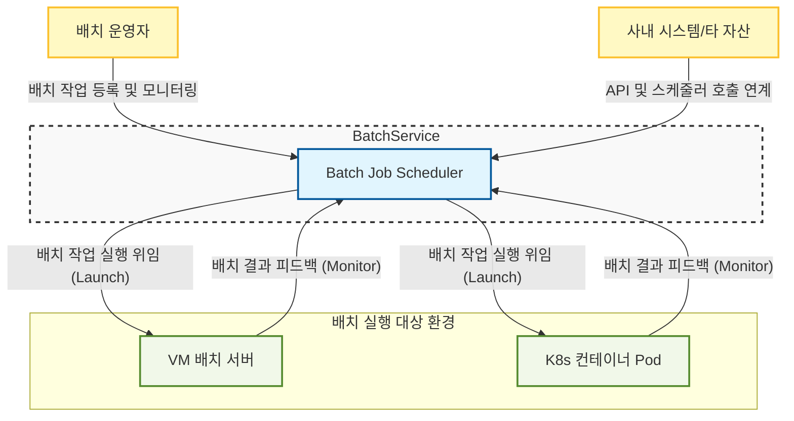
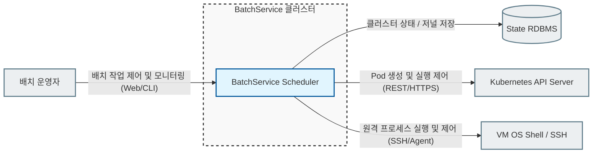
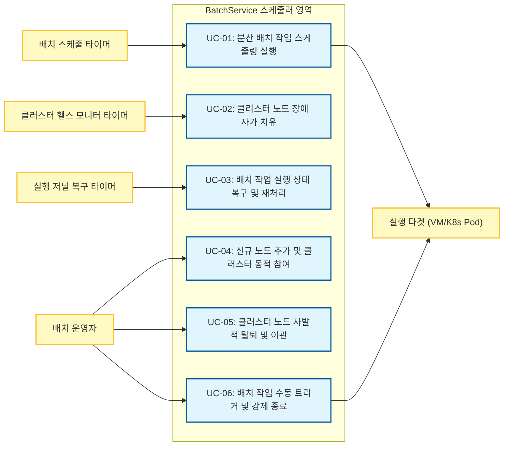
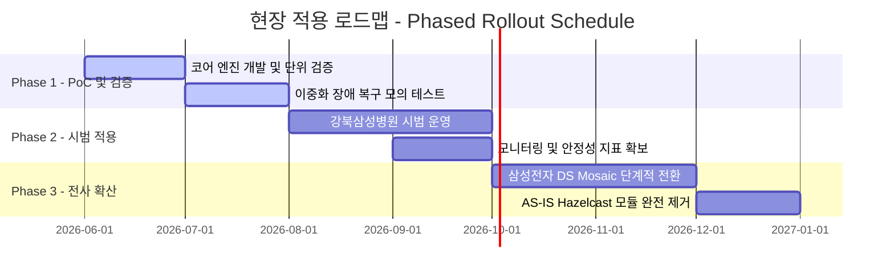

#1. Project Overview

## 1.1 Project Charter

### 배경  

#### 프로젝트 추진 배경 (Project Background)
SDS가 수행하는 대내외 프로젝트에 무상으로 제공되는 Batch Job Scheduler 재사용 자산인 **"BatchService"**는 기존에 분산 클러스터링 및 동시성 제어(분산 큐, 분산 락)를 위해 외부 오픈소스 라이브러리인 **Hazelcast**에 전적으로 의존해 왔습니다. 그러나 최근 Hazelcast의 라이선스 정책이 유료화 기반으로 변경됨에 따라 상용 비용 발생 리스크가 현실화되었습니다. 이에 따라 외부 상용 벤더나 외부 라이브러리에 독립적이면서, 자유롭게 통합할 수 있는 **순수 Java Standard 스펙 기반의 경량 분산 코디네이션 엔진 개발**이 필요하게 되었습니다.

#### 기존 AS-IS 아키텍처 개념도
아래 다이어그램은 개편 대상이자 현재 Kubernetes(K8s) 환경에서 구동 중인 기존 BatchService의 아키텍처입니다. 다중화된 스케줄러 인스턴스(Replica #1, #2) 간의 작업 동기화(분산 큐, 분산 락)를 위해 외부 라이브러리인 **Hazelcast Cluster**에 강하게 의존하고 있습니다.

![[ArchitectureSpecification/1. Project Overview/BatchService_Architecture_concept.svg]]

#### 참고: 기존 배치 스케줄링 플랫폼 대비 재사용자산 BatchService의 차별성
널리 쓰이는 기존 배치 스케줄링 플랫폼(Apache Airflow, Kubernetes CronJob 등) 대신 사내 재사용자산 BatchService를 직접 개편하는 이유는 다음과 같은 장점 때문입니다.

* **Airflow 대비 경량 구조 및 UI 기반 배치 설정의 우위성**:
  * Airflow는 Python 런타임 환경 외에 웹 서버, 스케줄러 데몬, 분산 워커, Celery/Redis(메시지 브로커), 메타 RDBMS 등 복잡하고 무거운 인프라 에코시스템 구축을 요구하므로 자원 요구량이 매우 크며, 경량형 자산으로 배포하기 부적합합니다.
  * 또한, Airflow는 배치 간 선후행 실행 관계(DAG Workflow)를 파이썬 코드로 직접 작성해 빌드해야 하므로 운영 편의성이 낮습니다. 반면, BatchService는 복잡한 DAG 정의를 관리자 웹 UI 상에서 시각적으로 연결·매핑할 수 있는 직관적인 사용성을 제공합니다.
  * 아울러 별도의 Redis/ZooKeeper 인프라웨어 설치 없이 실행되므로 배포 부담과 인프라 TCO를 최소화합니다.
* **Kubernetes CronJob 대비 정교한 제어 및 하이브리드 지원**:
  * Kubernetes CronJob은 클라우드 환경 전용 기술로서 단순히 지정 주기에 컨테이너 Pod를 기동(Launch)할 뿐, 작업 간의 정교한 선후행 의존 관계(Chaining) 관리, 동작 중인 배치의 실시간 강제 종료/수동 재기동 등 정밀 제어 API를 제공하지 않으며 레거시 가상 머신(VM) 실행 환경을 연동할 수 없습니다.
  * BatchService는 단일 스케줄러 클러스터 내에서 K8s 컨테이너 Pod 기동뿐 아니라 레거시 VM 내부의 쉘 스크립트 실행 제어까지 통합적으로 조율하고 모니터링할 수 있는 하이브리드 아키텍처를 제공합니다.
### 목표  

#### 아키텍처 개선 범위 (Architecture Scope)
- **개선 대상 (In-Scope):**
  - **분산 코디네이션 및 동기화 제어 엔진**: 외부 분산 클러스터(Hazelcast) 의존성을 배제하고, JDK 표준 API와 이미 구축된 공유 저장소 정보만을 활용해 리더 선출, 멤버십 동적 관리, 분산 락(중복 실행 방지), 분산 큐(작업 누락 방지) 기능을 가동하도록 개편합니다.
- **개선 제외 대상 (Out-of-Scope):**
  - 스케줄러의 비즈니스 기능(배치 설정 CRUD, 관리용 UI 설정 화면, 실행 이력 조회, 개별 배치 작업 실행 쉘/컨테이너 구동 자체 메커니즘 등)은 기존의 스펙을 수정 없이 재사용합니다.
#### 핵심 설계 목표
- **고가용성(HA) 및 신뢰성 보장 (Self-Healing):**
  - **최대 3~5개 노드**로 구성된 소규모 클러스터 환경에서 노드 장애(Crash 등)가 발생하더라도 스케줄러 기능이 중단 없이 지속되도록 자동 리더 선출 및 멤버십 관리 기능을 구현합니다.
- **안정적인 동시성 제어 (Distributed Lock & Queue):**
  - 평시 **수십 개**에서 최대 **수백 개** 수준의 동시 배치 작업(Job)이 여러 노드에 걸쳐 중복 실행되거나 유실되지 않도록 보장하는 분산 락 및 분산 큐를 구현합니다.
- **순수 Java Standard 기술 활용:**
  - 외부 라이브러리나 추가 인프라 설치 없이 JDK 표준 라이브러리(Java Concurrency, Socket 등)만을 활용하여 경량화되고 유지보수가 용이한 독자적 아키텍처를 완성합니다.

## 1.2 Stakeholder

| Stakeholder               | Description                                   | 주요 관심 및 Pain Point                                                                                                                                                                                                                                                    |
| ------------------------- | --------------------------------------------- | --------------------------------------------------------------------------------------------------------------------------------------------------------------------------------------------------------------------------------------------------------------------- |
| BatchService 개발자          | BatchService의 핵심 스케줄러 기능 및 분산 라이브러리 교체 개발 담당자 | - 외부 라이브러리 없이 순수 Java만으로 동시성 제어 및 클러스터링을 결함(Race Condition, Deadlock) 없이 구현해야 함. - 코드가 과도하게 복잡해지지 않고 유지보수 용이성을 유지해야 함. - 핵심 분산 기능(Lock, Queue)을 인터페이스 기반으로 정밀 추상화하여 구현체 간 결합도를 낮추고 유지보수 확장성을 보장해야 함.                                                            |
| BatchService 사용 프로젝트 아키텍트 | BatchService를 개별 프로젝트의 배치 시스템으로 도입/구축하는 아키텍트  | - AS-IS(Hazelcast 기반) 대비 API 및 설정 변경이 최소화되어 하위 호환성이 유지되어야 함. - 신규 엔진 도입 초기의 예기치 못한 크래시 상황에서도 데이터 유실 없이 무결하게 작업을 재개할 수 있는 장애 극복(Failover) 매커니즘이 수립되어야 함. - 실 운영 환경(VM, K8s)에서의 배치 누락이나 중복 실행 방지 등의 신뢰성이 확보되어야 함. - 스케줄러 노드의 자원(CPU/Memory) 점유율이 경량으로 유지되어야 함. |
| 사내 재사용자산 관리자              | 사내 공통 자산의 라이선스, 비용 리스크 및 지식재산권을 관리하는 담당자      | - Hazelcast 유료화에 따른 라이선스 비용 리스크를 제거해야 함. - 독자적 기술 내재화를 통한 사내 기술 자산 가치 증대 및 타 프로젝트 전파를 위한 체계적인 아키텍처 문서와 검증 데이터가 필요함.                                                                                                                                                |

## 1.3 Business Goal

프로젝트 아키텍처 개편을 통해 달성하고자 하는 궁극적인 비즈니스 목표를 정의합니다.

| Business Goal ID | 목표 정의             | 설명                                                         | 관련 요구사항 (Req ID) |
| :--------------: | ----------------- | ---------------------------------------------------------- | :--------------: |
|      BG-01       | 라이선스 프리 및 TCO 절감  | Hazelcast 유료화 리스크를 배제하여 운영/도입 비용을 최소화.                     |      NR-01       |
|      BG-02       | 기술 독립성 및 내재화      | 벤더 종속성 없는 분산 코디네이션 기술력을 사내 표준 기술로 내재화.                     |   NR-01, NR-04   |
|      BG-03       | 재사용 자산 배포 용이성 극대화 | 타 프로젝트에 BatchService를 도입할 때 추가 인프라 제약이나 외부 의존성 설치 허들을 최소화. |      NR-04       |

## 1.4 Issue and Requirement Analysis

프로젝트 아키텍처 수립의 기반이 되는 핵심 비즈니스 이슈와 이를 해결하기 위한 요구사항을 정의합니다.

### 1.4.1 핵심 비즈니스 이슈: Hazelcast 라이선스 유료화에 따른 TCO 증가
본 프로젝트의 착수 배경이 되는 핵심 이슈는 기존 분산 코디네이터 및 클러스터링 엔진으로 사용하던 Hazelcast의 라이선스 정책 변경입니다.

* **상세 설명 및 정량적 영향도**: 
  * Hazelcast의 라이선스 정책은 대외적으로 공개되지 않는 '비공개 협상 방식(Custom Pricing)'으로 운영되고 있으나, 과거 오픈 포럼 및 일부 시장 조사 자료(Vendr 레퍼런스)에 따르면, 연간 구독형(Annual Subscription) 계약 시 **노드당 연간 약 $5,000**의 라이선스 비용이 고정적으로 청구되는 것으로 알려져있습니다. 
  * 당사 표준 배치 스케줄러 클러스터(3개 노드) 구성을 고려할 때, 단일 프로젝트 도입 시 **연간 약 $15,000**(약2억원)의 인프라 고정 비용이 지속 발생합니다. 
  * 자체 분산 엔진 개발 시 투입 비용(공수: 개발자 2명 * 3개월 = 약 6,000만 원 일회성 비용) 대비 ROI가 우수하며 TCO를 절감합니다.

### 1.4.2 시스템 요구사항 (System Requirements)

Hazelcast 의존성을 배제하고, 기존의 분산 클러스터링 및 동시성 제어 기능과 운영 안정성을 대체하여 구현하기 위한 아키텍처적 기능/비기능 요구사항입니다.

#### 1.4.2.1 기능 요구사항 (Functional Requirements)

| Req ID | 요구사항 정의          | 세부 설명 및 도출 근거 (기술적 제약/품질 속성)                                                                   | 우선순위 | 관련 시스템 기능 |
| :----: | :--------------- | :--------------------------------------------------------------------------------------------- | :--: | :-------: |
| FR-01  | 중복 실행 방지 분산 락    | 다중 스레드/노드 분산 환경에서 동일한 배치 작업이 동시에 다중 구동되어 데이터가 오염되는 현상을 배제하기 위해 물리적인 분산 락 기능을 제공함.              |  상   |   SF-02   |
| FR-02  | 작업 누락 방지 분산 큐    | 분산 환경에서 특정 작업이 유실되지 않고 순차적(FIFO)이거나 안정적으로 타겟에 전달될 수 있도록 폴링 가능한 분산 큐 메커니즘을 제공함.                 |  상   |   SF-03   |
| FR-03  | 저널 복구를 통한 무유실 보장 | 자체 분산 엔진 적용 초기 안정성 확보를 위해, 데드락이나 프로세스 Crash 발생 시 공유 저널링 정보를 기반으로 미완료 작업을 최종 유실 없이 자동 롤백 및 복구함. |  중   |   SF-04   |
| FR-04  | 클러스터 멤버십 자가 치유   | 클러스터 내 노드들의 동적 참여 및 이탈을 감시하고, 장애 발생 시 자동으로 멤버 목록을 동기화하여 서비스 지속성을 유지함.                          |  중   |   SF-01   |

#### 1.4.2.2 비기능 요구사항 (Non-Functional Requirements)

| Req ID | 요구사항 정의                 | 분류  | 세부 설명 및 도출 근거 (기술적 제약/품질 속성)                                                                             | 우선순위 |      관련 시스템 기능      |
| :----: | :---------------------- | :-: | :------------------------------------------------------------------------------------------------------- | :--: | :-----------------: |
| NR-01  | 유료 분산 엔진 라이선스 배제        | 비용  | Hazelcast 등 유료 라이선스 리스크가 있는 외부 라이브러리 의존성을 전면 배제하여 도입/운영비 부담을 최소화함.                                       |  상   |        SF-01        |
| NR-02  | 동시성 결함 배제 (데드락 방지)      | 신뢰성 | 통신 소켓 및 RDBMS 트랜잭션 제어(Isolation Level) 상에서 Race Condition 및 교착 상태(Deadlock)가 발생하지 않도록 락 에이징 및 타임아웃을 지원함. |  상   |    SF-02, SF-03     |
| NR-03  | 기존 API 및 메타 스키마 호환성     | 호환성 | 기존 스케줄러 호출 서비스들이 수정 없이 작동할 수 있도록 호환성을 확보하고, 기존 데이터베이스 스키마와의 하위 호환성을 유지함.                                 |  중   | SF-02, SF-03, SF-04 |
| NR-04  | 별도 미들웨어 인프라 설치 배제       | 운영성 | Zookeeper, Redis 등 분산 상태 조율용 외부 미들웨어를 추가 설치/운영해야 하는 인프라 복잡성을 제거하여 배포 및 구성을 단순화함.                         |  중   | SF-01, SF-02, SF-03 |
| NR-05  | 리소스 사용량 최소화 (Footprint) | 효율성 | 메모리 및 CPU 오버헤드를 낮추어 신규 엔진 기동 시 추가 CPU 사용율 5% 미만, 추가 Heap 메모리 점유 50MB 이하로 제어함.                            |  하   | SF-01, SF-02, SF-03 |
| NR-06  | 플랫폼 및 런타임 독립성           | 이식성 | 특정 OS 또는 Native 라이브러리에 종속되지 않으며, JDK 17 표준 가상머신(VM) 및 Kubernetes 컨테이너(Pod) 환경 전체에서 동일하게 빌드 및 구동됨.        |  중   |    SF-01 ~ SF-05    |
| NR-07  | 소켓 세션 보안 검증             | 보안성 | 클러스터 멤버 간 통신(Gossip 등) 수행 시 사내 보안 망 가이드라인을 준수하며, 허가되지 않은 노드가 클러스터에 무단 접근 또는 참여하는 행위를 차단함.                |  하   |    SF-01, SF-05     |
| NR-08  | 3~5초 이내 고속 장애 복구        | 성능  | 특정 노드 급작 종료 시, 타 대기 노드가 3~5초 이내에 하트비트 아웃을 감지하여 멤버십을 갱신하고 신규 리더를 선출하여 스케줄 공백을 차단함.                        |  하   |    SF-01, SF-05     |
| NR-09  | 기존 배포 인프라 및 아키텍처 호환성 | 이식성 | 경량 분산 코디네이션 엔진 도입 시 수요처 프로젝트의 기존 K8s Pod 실행 환경, 배포 매니페스트 및 아키텍처 구조의 변경을 최소화함. |  중   |    SF-01 ~ SF-05    |

## 1.5 Business context Diagram

BatchService의 비즈니스 영역 경계와 외부 행위자/시스템 간의 관계를 다이어그램으로 나타냅니다.
![[Pasted image 20260615001919.png]]

#2. System Overview

## 2.1 System Context Diagram

BatchService를 중심으로 상호작용하는 외부 시스템 및 운영자와의 관계를 시스템 관점에서 정의합니다.
![[Pasted image 20260615002015.png]]

## 2.2 External Entity List

BatchService와 연계되는 외부 시스템, 행위자(Actor) 및 관련 자원의 역할을 정의합니다.

|  ID   | 외부 엔티티명               |   구분   | 설명                                                                    |
| :---: | --------------------- | :----: | --------------------------------------------------------------------- |
| EE-01 | 배치 운영자                | Actor  | 배치 스케줄링 등록, 강제 실행, 상태 모니터링 및 장애 조치를 수행하는 사용자 또는 운영 시스템.               |
| EE-02 | Kubernetes API Server | System | K8s 실행 환경에서 스케줄러의 요청에 따라 배치 실행용 Pod을 생성, 제어 및 감시하는 API 제공 주체.         |
| EE-03 | VM 호스트 (SSH / Shell)  | System | VM 실행 환경에서 스케줄러의 요청에 따라 배치 실행 파일(.sh, jar 등)을 기동하고 결과를 반환하는 타겟 OS 환경. |
| EE-04 | 배치 메타 DB (RDBMS)      | System | 배치 작업의 스케줄 정보, 실행 이력 및 클러스터 메타데이터/저널링 정보를 저장하는 관계형 데이터베이스.            |

## 2.3 External Interface List

BatchService가 외부 엔티티와 데이터를 주고받을 때 사용하는 통신 규격 및 인터페이스 사양을 정리합니다.

|   ID   | 인터페이스명           | 송신/수신 | 프로토콜/연계방식               | 연계 데이터 및 설명                                                                  |
| :----: | ---------------- | ----- | ----------------------- | ---------------------------------------------------------------------------- |
| INF-01 | 운영자 제어 API       | 수신    | REST/HTTPS (JSON)       | 배치 작업 신규 등록, 일시 중지, 즉시 실행 요청 및 전체 스케줄러 노드 상태 모니터링 데이터.                       |
| INF-02 | K8s Job 제어 인터페이스 | 송신    | REST/HTTPS (K8s API)    | 배치 실행을 위해 K8s Job 리소스를 생성(Manifest 전송)하고 Pod의 시작/종료/오류 상태를 폴링(Polling)함.     |
| INF-03 | VM 실행 제어 인터페이스   | 송신    | SSH / Local Process API | VM 환경에서 배치 스크립트 실행 명령어를 송신하고, 프로세스 종료 코드(Exit Code) 및 Stdout/Stderr 로그를 수신함. |
| INF-04 | 데이터베이스 연계 인터페이스  | 송/수신  | JDBC (TCP)              | 스케줄 구성 데이터 조회, 배치 실행 이력 적재 및 클러스터 하트비트/저널링 데이터 영속화 수행.                       |

## 2.4 System Feature List

Hazelcast 의존성을 배제하고, 기존의 분산 클러스터링 및 동시성 제어 기능과 운영 안정성을 대체하여 구현할 시스템 기능(System Feature)의 상세 정의와 구현 범위를 기술합니다.

|  ID   | 기능명                         | 설명                                                                        | 구현 범위 (Scope)        |      관련 요구사항 (Req ID)      |
| :---: | --------------------------- | ------------------------------------------------------------------------- | -------------------- | :------------------------: |
| SF-01 | 클러스터 멤버십 관리                 | 3~5개 노드 간의 활성화 상태(Heartbeat)를 지속적으로 확인하고 전체 멤버 목록을 동기화함.                  | 신규 개발 (Hazelcast 대체) | FR-04, NR-01, NR-04, NR-08 |
| SF-02 | 분산 락 (Distributed Lock)     | 특정 배치 작업이 다중 노드에서 중복으로 동시 실행되는 것을 완전 차단하는 임계 구역 제어 기능을 제공함.               | 신규 개발 (Hazelcast 대체) | FR-01, NR-02, NR-03, NR-04 |
| SF-03 | 분산 큐 (Distributed Queue)    | 배치 실행 대기열을 관리하며, 여러 컨슈머(노드)가 동시 접근하더라도 작업 유실이나 중복 처리 없이 순차 가공할 수 있도록 지원함. | 신규 개발 (Hazelcast 대체) | FR-02, NR-02, NR-03, NR-04 |
| SF-04 | 장애 저널 복구 (Journal Recovery) | 스케줄러 노드 장애(Crash 등) 시 RDBMS 실행 저널 로그를 추적하여 미완료 또는 오작동 배치 작업을 복구 및 재처리함.   | 신규 개발 (Hazelcast 대체) |        FR-03, NR-03        |
| SF-05 | 자동 리더 선출 (Failover)         | 현재 활성화된 리더 노드의 장애를 감지하면, 즉시 자가 치유(Self-Healing)를 발동하여 잔여 노드 중 신규 리더를 선출함. | 신규 개발 (Hazelcast 대체) |        FR-04, NR-08        |

## 2.5 Assumption of the System

BatchService 아키텍처 설계 및 구현의 전제가 되는 환경적/비즈니스적 가정 사항(Assumption)을 정의합니다.

|   ID   | 가정 사항            | 상세 설명                                                                                                                          | 비고                     |
| :----: | ---------------- | ------------------------------------------------------------------------------------------------------------------------------ | ---------------------- |
| ASM-01 | 메타 DB 인프라 가용성    | BatchService를 도입하는 대상 현장(삼성 DS, 강북삼성병원 등)은 이미 안정적으로 이중화(HA) 구성된 메타 데이터베이스(Oracle, PostgreSQL 등)를 상시 운영하고 있음을 가정함.              | 합의 저널링 및 상태 영속화의 기본 전제 |
| ASM-02 | 인프라 내 NTP 시간 동기화 | 분산 임대 락(Lease Lock)의 만료 시간 및 분산 스케줄 실행의 정확성 보장을 위해, 대상 현장의 물리/가상 서버들이 표준 시간 서버(NTP)를 통해 시스템 시간 오차 **최대 1초 이내**로 동기화되어 있다고 전제함. | 스케줄 및 락 정밀도 보장         |

#3. Architectural Driver

## 3.1 Use Case Model

BatchService 핵심 클러스터링 엔진 교체와 관련하여 시스템이 처리해야 하는 주요 동작 시나리오를 정의합니다.

> [!NOTE]
> **유스케이스 모델링 설계 범위 (Scope)**
> 본 설계서의 유스케이스 모델은 기존 시스템(AS-IS)에서 이미 제공하고 있는 일반 기능(스케줄 등록/수정/삭제, 배치 수행 이력 및 로그 조회 등)은 설계 및 변경 범위에서 제외합니다. 
> 본 개편의 핵심인 **"순수 Java 기반의 고가용성 분산 클러스터링 엔진 및 Failover 처리(TO-BE)"** 영역에서 새롭게 추가되거나 비기능적 아키텍처 전략이 반영되는 핵심 제어 흐름에 집중하여 유스케이스를 구성하였습니다.

#### 유스케이스 액터(Actor) 정의 및 분류
본 시스템은 백그라운드에서 상시 작동하는 무중단 분산 스케줄링 자산이므로, 사람 사용자, 외부 시스템, 시간 이벤트를 발생시키는 요소를 모두 아키텍처적인 액터로 정의하여 설계의 타당성을 확보합니다. 클러스터를 이루는 각 스케줄러 노드 프로세스(JVM)는 시스템 자체(System under Design)에 해당하므로 액터에서 배제하며, 외부 실행 시스템 및 운영자와 3대 시간 트리거를 최종 액터로 정의합니다.

1. **사람 액터 (Human Actor)**: 
   * **배치 운영자 (Operator)**: 스케줄러 노드(프로세스)를 기동(추가)하거나 종료(탈퇴)시키고, 스케줄러 상태 모니터링 및 수동 개입(즉시 실행, 강제 종료 등)을 직접 수행하는 주체.
2. **외부 시스템 액터 (External System Actor)**: 
   * **실행 타겟 (Execution Target - VM/K8s Pod)**: 스케줄러로부터 배치 작업 실행 명령(Launch)을 수신받아 직접 프로세스를 구동하거나, 배치 중단 시 강제 종료 시그널을 수신받는 외부 실행 환경 주체.
3. **시간 액터 (Time / Temporal Actor)**: 
   * **배치 스케줄 타이머 (Batch Schedule Timer)**: 각 배치 작업의 고유 Cron 주기 또는 예약 주기가 도달했을 때 스케줄 실행 요청을 발생시키는 액터.
   * **클러스터 헬스 모니터 타이머 (Cluster Health Monitor Timer)**: 주기적(3~5초)으로 노드의 활성 상태(Heartbeat)를 점검하고 리더 탈락 여부를 모니터링하는 이벤트를 기동하는 액터.
   * **실행 저널 복구 타이머 (Journal Recovery Scan Timer)**: 주기적으로 공유 저장소의 실행 로그를 스캔하여 비정상 종료된 작업의 상태 복구 및 재처리를 감지하고 트리거하는 액터.

### 3.1.1 유스케이스 다이어그램 (Use Case Diagram)
![[ArchitectureSpecification/3. Architectural Driver/Untitled Diagram.svg]]

### 3.1.2 유스케이스 목록 (Use Case List)

| ID    | 유스케이스명                | 설명                                                                   | 중요도 | 난이도 | 관련 시스템 기능 (System Feature) |
| ----- | --------------------- | -------------------------------------------------------------------- | --- | --- | -------------------------- |
| UC-01 | 분산 배치 작업 스케줄링 실행      | 배치 예약 시간에 맞추어 다중 노드 중 하나가 분산 락을 획득하고, 중복 실행 없이 분산 큐를 통해 작업을 수행함.     | 상   | 상   | SF-02, SF-03               |
| UC-02 | 클러스터 노드 장애 자가 치유      | 리더 노드 장애 시, 대기 노드가 이를 실시간 감지하여 새로운 리더를 선출(Failover)하고 중단 업무를 승계함.    | 상   | 상   | SF-01, SF-05               |
| UC-03 | 배치 작업 실행 상태 복구 및 재처리  | 스케줄러 노드 또는 실행 환경 크래시 시, 공유 실행 저널 조회를 통해 미완료 작업을 자동으로 복구 및 재예약함.      | 상   | 중   | SF-01, SF-03, SF-04, SF-05 |
| UC-04 | 신규 노드 추가 및 클러스터 동적 참여 | 새로 기동된 노드가 공유 저장소 및 통신 체계를 통해 클러스터 멤버십을 자동으로 갱신하고 연계 동기화를 수행함.       | 중   | 중   | SF-01                      |
| UC-05 | 클러스터 노드 자발적 탈퇴 및 이관   | 유지보수 등을 위해 노드가 정상 종료될 때 보유한 분산 락/큐 자원을 안전하게 반환하고 멤버십에서 이탈함.          | 중   | 중   | SF-01, SF-02, SF-05        |
| UC-06 | 배치 작업 수동 트리거 및 강제 종료  | 배치 운영자가 수동 명령을 통해 특정 배치 작업을 강제 즉시 실행하거나 현재 실행 중인 장기 작업을 안전하게 강제 종료함. | 상   | 중   | SF-02, SF-03               |

### 3.1.3 유스케이스 상세 정의

#### UC-01: 분산 배치 작업 스케줄링 실행
| 항목         | 내용                                                                                                                                                                                                                                                                                             |
| ---------- | ---------------------------------------------------------------------------------------------------------------------------------------------------------------------------------------------------------------------------------------------------------------------------------------------- |
| 액터 (Actor) | 배치 스케줄 타이머 (Batch Schedule Timer)                                                                                                                                                                                                                                                              |
| 사전 조건      | - 3~5개 노드 클러스터가 정상 기동 및 연계 동기화된 상태임. - 분산 락 및 분산 큐 인터페이스가 정상 작동 중임.                                                                                                                                                                                                                         |
| 기본 흐름      | 1. 배치 주기 도달 시 타이머가 이벤트를 발생시킴. 2. 클러스터 내의 노드들이 해당 작업에 대한 분산 락(Distributed Lock) 획득을 경쟁함. 3. 분산 락 획득에 성공한 단 하나의 노드(Worker)가 작업을 인계받음. 4. 해당 노드가 대상 작업을 분산 큐(Distributed Queue)에 적재함. 5. 큐에 적재된 작업을 기반으로 실행 타겟(VM/K8s Pod)에 실행 위임 명령을 송신함. 6. 배치가 종료되면 분산 락을 해제하고 공유 저장소에 이력을 저장함. |
| 예외 흐름      | - **락 획득 실패 시:** 다른 노드가 이미 실행 중인 것으로 판단하여 실행 요청을 무시하고 대기함 (중복 실행 차단). - **원격 기동 실패 시:** 실패 이력을 저장하고 설정된 재시도 룰에 의거하여 재처리 큐로 이관함.                                                                                                                                                             |
| 사후 조건      | 배치 실행 상태가 정상 기록되고 점유했던 분산 자원(Lock/Queue)이 온전히 반환됨.                                                                                                                                                                                                                                             |

#### UC-02: 클러스터 노드 장애 자가 치유
| 항목             | 내용                                                                                                                                                                                                                                                                    |
| -------------- | --------------------------------------------------------------------------------------------------------------------------------------------------------------------------------------------------------------------------------------------------------------------- |
| 액터 (Actor) | 클러스터 헬스 모니터 타이머 (Cluster Health Monitor Timer)                                                                                                                                                                                                                                                            |
| 사전 조건      | 3~5개 노드로 구성된 클러스터에서 1개의 리더(Leader)와 나머지 팔로워(Follower) 노드가 활성화된 상태임.                                                                                                                                                                                                   |
| 기본 흐름      | 1. 현재 리더 노드가 프로세스 종료 또는 네트워크 단절 등으로 정지함. 2. 팔로워 노드들이 하트비트(Heartbeat) 유실을 감지함 (감지 시간 3~5초 이내). 3. 잔여 팔로워 노드 간에 리더 선출 알고리즘(공유 저장소 락 또는 분산 합의 프로토콜)이 기동됨. 4. 최다 표 혹은 최선 획득 노드가 새로운 리더 노드로 승격됨. 5. 새로운 리더 노드가 미처리 배치 작업 리스트를 공유 저장소에서 가져와 다시 스케줄링 큐에 바인딩함. |
| 예외 흐름      | - **쿼럼(과반수) 붕괴 시:** 활성 노드가 1개만 남은 경우, Split-Brain 방지를 위해 독립 모드로 다운그레이드 기동하거나 리더 승격을 차단하고 경고 알람을 발송함.                                                                                                                                                                  |
| 사후 조건      | 새로운 리더 노드 제어 하에 클러스터가 지속 가동되며 작업 유실이 없음이 보장됨.                                                                                                                                                                                                                         |

#### UC-03: 배치 작업 실행 상태 복구 및 재처리
| 항목             | 내용                                                                                                                                                                                                                                       |
| -------------- | ---------------------------------------------------------------------------------------------------------------------------------------------------------------------------------------------------------------------------------------- |
| 액터 (Actor) | 실행 저널 복구 타이머 (Journal Recovery Scan Timer)                                                                                                                                                                                                                  |
| 사전 조건      | 노드 장애 등으로 인해 배치 수행 도중 프로세스가 비정상 종료(Crash)되었거나 강제 종료된 작업이 존재함.                                                                                                                                                                            |
| 기본 흐름      | 1. 새롭게 리더 선출을 완료한 스케줄러 노드가 기동 시 또는 주기적으로 공유 저장소 상의 배치 저널(Journal) 데이터를 조회함. 2. 실행 중(Running) 상태로 장시간 대기 중인 비정상 종료 배치 태스크를 식별함. 3. 해당 태스크를 스케줄러가 차단 해제하고 복구 큐에 자동으로 적재함. 4. 큐에 적재된 태스크에 대해 재처리를 시작하고, 수행 완료 후 상태를 성공/실패로 정상화함. |
| 예외 흐름      | - **저널 저장소 장애 시:** 복구 핸들러가 경고 알람을 발송하고 연결이 복구될 때까지 10초 간격으로 재시도함. |
| 사후 조건      | 비정상 종료되어 누락될 뻔한 배치 작업이 데이터 유실 및 누락 없이 최종 실행 완료됨.                                                                                                                                                                                         |

#### UC-04: 신규 노드 추가 및 클러스터 동적 참여
| 항목             | 내용                                                                                                                                                                                                                                       |
| -------------- | ---------------------------------------------------------------------------------------------------------------------------------------------------------------------------------------------------------------------------------------- |
| 액터 (Actor) | 배치 운영자 (Operator)                                                                                                                                                                                                                      |
| 사전 조건      | 기존 클러스터 노드가 기동 및 활성화되어 정상 작동 중이며, 스케줄러 노드 인프라가 추가 배포됨.                                                                                                                                                                                 |
| 기본 흐름      | 1. 신규 노드 기동 시 공유 멤버십 저장소에 자신의 정보(IP, 포트, 기동 시각)를 등록함. 2. 신규 노드가 기존 리더 노드와 팔로워 노드에게 하트비트 전송을 통해 활성 상태를 최초 알림. 3. 기존 리더 노드가 신규 노드 진입을 멤버십 목록에 등록하고 동기화함. 4. 신규 노드가 클러스터 뷰 업데이트를 수신하고 대기 상태(작업 수신 가능 상태)로 전환됨. |
| 예외 흐름      | - **식별자 충돌 시:** 신규 노드 정보가 기존 활성 노드 정보와 일치할 경우 기동 에러 로그를 남기고 부트스트랩 단계를 즉시 종료(강제 중단)함.                                                                                                                                                         |
| 사후 조건      | 추가된 노드가 클러스터의 일원으로 정상 편입되어 작업 분산 및 폴링 가용 자원이 증가함.                                                                                                                                                                                        |

#### UC-05: 클러스터 노드 자발적 탈퇴 및 이관
| 항목         | 내용                                                                                                                                                                                                                                                |
| ---------- | ------------------------------------------------------------------------------------------------------------------------------------------------------------------------------------------------------------------------------------------------- |
| 액터 (Actor) | 배치 운영자 (Operator)                                                                                                                                                                                                                               |
| 사전 조건      | 운영자에 의한 유지보수 작업이나 스케일인(Scale-in) 정책 등에 의해 특정 노드에 대한 정상 종료(SIGTERM 등) 시그널이 발생함.                                                                                                                                                                    |
| 기본 흐름      | 1. 대상 노드가 정상 종료 시그널을 감지함. 2. 현재 자신이 점유하고 있던 모든 분산 락(Lock)을 즉시 해제함. 3. 분산 큐에서 새로운 작업 폴링을 중단하고, 공유 멤버십 저장소 상의 상태를 '정상 탈퇴'로 변경함. 4. 노드 프로세스가 사용 중이던 통신 리소스 및 메모리를 정상 해제한 후 완전 종료됨. 5. 잔여 리더 및 팔로워 노드가 멤버십에서 대상 노드를 제외하여 클러스터 구조를 재구성함. |
| 예외 흐름      | - **탈퇴 노드가 리더인 경우:** 종료 프로세스 즉시 리더 권한을 명시적으로 반환(Lock 해제)하여 잔여 노드들이 즉각 리더 선출(Failover) 프로세스(UC-02)를 실행할 수 있도록 유도함.                                                                                                                                 |
| 사후 조건      | 대상 노드가 정상 제거되고, 실행 중이던 미처리 작업들은 데이터 유실이나 락 점유 유지 현상 없이 온전히 타 노드로 승계됨.                                                                                                                                                                             |

#### UC-06: 배치 작업 수동 트리거 및 강제 종료
| 항목         | 내용                                                                                                                                                                                                           |
| ---------- | ------------------------------------------------------------------------------------------------------------------------------------------------------------------------------------------------------------ |
| 액터 (Actor) | 배치 운영자 (Operator)                                                                                                                                                                                            |
| 사전 조건      | 운영 상황 대응 또는 에러 분석을 위해 특정 배치를 제어할 수 있는 관리 명령 도구(CLI, API 등)에 접근함.                                                                                                                                             |
| 기본 흐름      | 1. **수동 트리거:** 운영자가 관리 인터페이스에서 배치 ID를 지정하여 즉시 실행 명령을 내림 -> 스케줄러가 이를 수신하여 분산 큐 맨 앞으로 작업을 밀어 넣음. 2. **강제 종료:** 운영자가 현재 구동 중인 태스크에 중단 명령을 전송함 -> 스케줄러가 타겟 실행 인프라(K8s Pod/VM)에 프로세스 종료 신호를 전달하고 분산 락을 강제 반환함. |
| 예외 흐름      | - **네트워크 단절로 강제 종료 불가 시:** 공유 저장소 상에서 작업 상태를 강제로 취소(FAILED/CANCELLED) 처리하고, 통신 복구 시 잔여 프로세스가 스스로 강제 해제 상태를 감지하여 실행을 자동 정지하게 함.                                                                               |
| 사후 조건      | 강제 조작 수행 결과가 공유 저널 정보에 기록되며 즉시 반영됨.                                                                                                                                                                          |

## 3.2 Quality Attribute Scenario

본 프로젝트 아키텍처 개편을 결정하는 핵심 품질 속성 시나리오(Availability, Consistency, Reliability 등)를 정의함.

### 3.2.1 품질 속성 시나리오 목록 (Quality Attribute Scenario List)

|   ID   | 품질 속성                       | 시나리오명                                     | 시나리오 요약                                                    | 중요도 | 난이도 | 관련 요구사항             |
| :----: | --------------------------- | ----------------------------------------- | ---------------------------------------------------------- | :-: | :-: | :------------------ |
| QAS-01 | 일관성 (Consistency)           | 수백 개 동시성 트래픽 상황에서 배치 작업 중복 실행 방지          | 극한의 동시 요청 하에서 분산 락을 활용하여 배치 작업의 중복 실행 오작동 차단 (오작동 0%)      |  상  |  상  | FR-01, NR-02        |
| QAS-02 | 성능 (Performance)            | 피크 타임 배치 락/큐 인출 응답 시간 보장                  | 수백 개 동시 락/큐 인출 경합 시 노드당 평균 0.5초 이내 분산 제어 트랜잭션 완료           |  상  |  상  | FR-01, FR-02, NR-02 |
| QAS-03 | 신뢰성 (Reliability)           | 스플릿 브레인 상황 시 데이터 정합성 보장                   | 네트워크 분할 시 과반합의(Quorum) 제어로 이중 리더 활성화 원천 차단                 |  상  |  상  | FR-04, NR-02        |
| QAS-04 | 가용성 (Availability)          | 리더 노드 크래시 시 5초 이내 자가 치유 및 복구              | 리더 노드 장애 발생 시 5초 이내 자동 감지 및 신규 리더 선출 완료                    |  하  |  상  | FR-04, NR-08        |
| QAS-05 | 운용성 (Operability)           | 클러스터 멤버십 자동 치유 및 리더 자동 선출                 | 노드 장애 시 멤버십 자동 감지 및 3초 이내 리더 선출로 무중단 지속 운영                 |  하  |  상  | FR-04, NR-08        |
| QAS-06 | 신뢰성 (Reliability)           | 예기치 못한 스케줄러 다운 시 저널링 복원을 통한 데이터 무유실 복구    | 스케줄러 다운 시 메타 RDBMS 실행 저널을 역추적하여 미완료 태스크 복구 및 재처리           |  중  |  중  | FR-03               |
| QAS-07 | 효율성 (Resource Efficiency)   | Hazelcast 대비 클러스터 노드당 자원(메모리/CPU) 점유율 최적화 | 자사 경량화 모듈 적용을 통해 노드당 JVM Heap 메모리 점유 및 CPU 오버핱 50% 이상 절감   |  하  |  중  | NR-05               |
| QAS-08 | 이식성 (Portability)           | 외부 분산 인프라 없는 VM/K8s 하이브리드 인프라 배포성 극대화     | Zookeeper/Redis 등 외부 솔루션 없이 JDK 17 표준 및 RDBMS 의존성만으로 배포 완료 |  중  |  하  | NR-04, NR-06        |
| QAS-09 | 운영성 (Operability)           | 외부 미들웨어 설치 배제 및 자동 구성                     | 외부 미들웨어 없이 설정 파일 기반 자동 클러스터 구성 및 동적 멤버십 관리                 |  중  |  하  | NR-04               |

### 3.2.2 상세 품질 속성 시나리오 (Quality Attribute Scenario Specification)

#### QAS-01: [일관성] 수백 개 동시성 트래픽 상황에서 배치 작업 중복 실행 방지
| 항목               | 내용                                                                                                                                                                                                                              |
| ---------------- | ------------------------------------------------------------------------------------------------------------------------------------------------------------------------------------------------------------------------------- |
| 품질 속성            | 일관성 (Consistency) / 데이터 무결성                                                                                                                                                                                                     |
| 시나리오             | 다중 스케줄러 노드 환경에서 수백 개의 배치 타이머가 동시에 기동되는 높은 동시성 요청이 유발되더라도, 분산 락(Distributed Lock)을 통해 단 하나의 인스턴스만 배치 작업을 실행하고 중복 실행을 방지함.                                                                                                        |
| 자극원 (Source)     | 다중 스케줄러 노드들의 동시 타이머 트리거                                                                                                                                                                                                         |
| 자극 (Stimulus)    | 동일한 배치 Job에 대한 분산 락 획득 동시 요청                                                                                                                                                                                                    |
| 대상 (Artifact)    | 분산 락 제어 인터페이스 및 구현 모듈 (Distributed Lock Interface & Impl)                                                                                                                                                                       |
| 환경 (Environment) | 평시 피크 타임(수백 개의 배치가 집중적으로 몰리는 시점)                                                                                                                                                                                                |
| 응답 (Response)    | 1. 락 획득 요청을 받은 분산 락 모듈이 상호 배제(Mutual Exclusion) 알고리즘을 통해 하나의 노드에게만 락 소유권을 할당함. 2. 락 획득에 실패한 노드는 중복 실행을 시도하지 않고 즉시 대기 혹은 실패로 로그를 처리함.                                                                                         |
| 응답 측정            | 1) 동일 배치 작업의 중복 실행 오작동이 발생하지 않을 것. 2) 동시 락 요청 경쟁 시 락 소유권 결정 지연이 평균 1초 이내.                                                                                                                                                    |
| 측정 목표의 객관적 근거    | 1) 분산 환경에서 동일 배치가 동시 실행될 경우, DB 레코드 중복 쓰기나 결제 중복 승인 등 심각한 정합성 붕괴(비즈니스 장애)가 유발되므로 중복 실행 건수는 반드시 0건이어야 함. 2) 동시 락 경합 시 결정 지연이 1초를 초과하면 전체 스케줄러의 기동 스레드가 Blocking 상태에 빠져 후속 대기 스케줄들이 연쇄 지연(Cascading Delay)되므로, 1초 이내 처리가 필수적임. |

#### QAS-02: [성능] 피크 타임 배치 락/큐 인출 응답 시간 보장
| 항목 | 내용 |
| ---------------- | -------------------------------------------------------------------------------------------------------------------------------------------------------------------------- |
| 품질 속성 | 성능 (Performance) |
| 시나리오 | 대용량 배치 작업이 정각(예: 00시 00분)에 집중되어 수백 개의 락 획득 및 큐 인출 요청이 단일 RDBMS 공유 저장소 상에서 경합하더라도, 락 경합 병목 없이 노드당 평균 0.5초 이내에 분산 제어 트랜잭션을 완료함. |
| 자극원 (Source) | 다중 스케줄러 노드들의 피크 타임 대규모 동시 타이머 기동 |
| 자극 (Stimulus) | 메타 RDBMS를 대상으로 수백 개의 배치 작업 실행을 위한 분산 락 획득 및 분산 큐 인출 쿼리 동시 인입 |
| 대상 (Artifact) | 공유 저장소 접근 제어 클래스 (JDBC Repository 및 트랜잭션 매니저) |
| 환경 (Environment) | 일 배치 작업이 대량으로 밀리는 자정 또는 영업 마감 시점 (Peak Load 환경) |
| 응답 (Response) | 1. 적절한 DB 인덱싱 설계를 통해 조회/갱신 대상을 최소화하고 쿼리 실행 속도를 최적화함. 2. 비관적 락(SELECT FOR UPDATE)의 임계 구역 범위를 극소화하여 RDBMS 스레드 풀 블로킹을 방지함. |
| 응답 측정 | 수백 개의 대량 경합 발생 시에도, 개별 노드들이 락을 확인하고 큐 인출을 완료하기까지의 평균 응답 지연 시간이 0.5초 이하일 것. |
| 측정 목표의 객관적 근거 | 1) 배치 락/큐 획득 지연이 0.5초를 초과하여 길어질 경우 스케줄링 전체 엔진 스레드가 대기 상태에 빠지게 됨. 2) 이로 인해 전체 배치 워크플로우(선후행 DAG) 체인 전체에 수 초에서 분 단위의 연쇄 누적 지연이 전파되어 비즈니스 업무 마감 시한(SLA)을 초과할 리스크가 현실화되므로 고속 처리가 요구됨. |

#### QAS-03: [신뢰성] 스플릿 브레인 상황 시 데이터 정합성 보장
| 항목 | 내용 |
| ---------------- | -------------------------------------------------------------------------------------------------------------------------------------------------------------------------- |
| 품질 속성 | 신뢰성 (Reliability) / 데이터 정합성 |
| 시나리오 | 클러스터 서버 간의 일시적인 네트워크 분할(Split-Brain)로 인해 독립된 두 서브넷이 각각 자신을 리더로 인식하려 하더라도, 메타 RDBMS 기반의 과반합의(Quorum) 제어를 통해 이중 리더의 활성화를 원천 차단함. |
| 자극원 (Source) | 네트워크 인프라 스위치 장애 또는 노드 간 소켓 통신 단절 |
| 자극 (Stimulus) | 노드 간 직접 통신 차단으로 인한 상대방 멤버십 유실 상태 감지 |
| 대상 (Artifact) | 과반수 노드 투표 엔진 및 리더 선출 알고리즘 |
| 환경 (Environment) | 스케줄링 클러스터가 동작 중인 환경에서 가상 스위치 장애 등으로 일시적인 파티션이 발생한 상황 |
| 응답 (Response) | 1. 격리된 노드가 메타 DB에 등록된 전체 멤버십 대비 자신을 포함한 서브넷의 노드 수가 과반(Quorum) 이하임을 감지함. 2. 해당 노드는 리더 선출 참여 자격을 상실하고 대기 상태 또는 슬레이브 모드로 스스로 전환함. 3. 과반 노드를 확보한 온전한 서브넷에서만 단 하나의 신규 리더를 선출함. |
| 응답 측정 | 네트워크 분할 상황이 발생하더라도 동일 시점에 활성화된 리더 노드의 총 개수가 항상 1개 이하로 유지될 것. |
| 측정 목표의 객관적 근거 | 1) 분산 클러스터에서 이중 리더가 발생할 경우, 동일한 배치 작업이 양쪽 노드에서 중복 실행되어 심각한 원장 데이터 왜곡 및 이중 승인 사고로 번짐. 따라서 어떠한 극단적인 물리 망 단절 상황에서도 활성 리더의 개수는 철저히 1개(또는 0개)로 강제 통제되어야 함. |

#### QAS-04: [가용성] 리더 노드 크래시 시 5초 이내 자가 치유 및 복구
| 항목 | 내용 |
| ---------------- | -------------------------------------------------------------------------------------------------------------------------------- |
| 품질 속성 | 가용성 (Availability) |
| 시나리오 | 3~5개 스케줄러 노드로 구성된 클러스터에서 리더 노드 장애 발생 시, 대기 노드가 이를 5초 이내에 감지하고 새로운 리더를 선출하여 중단 없이 배치 실행 제어권을 복구함. |
| 자극원 (Source) | 스케줄러 인프라 장애 또는 프로세스 크래시 (Leader Node Crash) |
| 자극 (Stimulus) | 리더 노드의 하트비트(Heartbeat) 유실 |
| 대상 (Artifact) | 클러스터 멤버십 매니저 (Cluster Membership Manager) |
| 환경 (Environment) | 실시간 다중 배치 스케줄이 정상적으로 구동되고 있는 K8s 컨테이너 환경 |
| 응답 (Response) | 1. 잔여 대기(Follower) 노드들이 하트비트 타임아웃을 감지함. 2. 신규 리더 선출 알고리즘을 즉시 가동하여 리더를 선출함. 3. 새 리더가 중단 시점의 큐 및 스케줄 이력을 공유 저널 로그로부터 복원함. |
| 응답 측정 | 장애 시점부터 새 리더가 온전히 복구 완료되어 배치를 다시 스케줄링하기 시작하기까지의 누적 지연 시간이 5초 이내 |
| 측정 목표의 객관적 근거 | 1) BatchService가 주로 다루는 최소 스케줄 주기는 10초~30초 단위이므로, 자가 복구가 5초를 초과하면 해당 실행 주기 타이머가 만료되어 1회 실행 누락이 발생할 수 있음. 2) 감지 시간을 1~3초 미만으로 극단적으로 단축하면, 일시적 네트워크 지연(Spike)이나 짧은 GC STW 상황을 장애로 오인하여 불필요한 리더 재선출(Failover 오작동)을 빈번하게 유발할 수 있으므로, 하트비트 주기(3초)의 약 1.5배인 5초가 가용성과 감지 신뢰성 사이의 최적점임. |

#### QAS-05: [운용성] 클러스터 멤버십 자동 치유 및 리더 자동 선출
| 항목 | 내용 |
| ---------------- | -------------------------------------------------------------------------------------------------------------------------------------------------------------------------- |
| 품질 속성 | 운용성 (Operability) |
| 시나리오 | 클러스터 내 노드 장애 발생 시 멤버십 매니저가 자동으로 실패 노드를 감지하고, 새로운 리더를 3초 이내에 선출하여 서비스 중단 없이 지속 운영 |
| 자극원 (Source) | 클러스터 모니터링 시스템 |
| 자극 (Stimulus) | 노드 하트비트 타임아웃 발생 |
| 대상 (Artifact) | 클러스터 멤버십 매니저 및 리더 선출 알고리즘 |
| 환경 (Environment) | 다중 노드 K8s 클러스터, 실시간 배치 스케줄링 운영 중 |
| 응답 (Response) | 1. 장애 노드 감지 후 멤버십 리스트 업데이트. 2. 새로운 리더 후보 중 최적 노드 3초 이내 선출. |
| 응답 측정 | 리더 교체 및 멤버십 업데이트가 3초 이내 완료됨 |
| 측정 목표의 객관적 근거 | 1) 기존 시스템에서는 리더 교체에 평균 5초 이상 소요, 신규 자동 치유 구현 시 3초 이하 목표 설정. |

#### QAS-06: [신뢰성] 예기치 못한 스케줄러 다운 시 저널링 복원을 통한 데이터 무유실 복구
| 항목 | 내용 |
| ---------------- | -------------------------------------------------------------------------------------------------------------------------------------------------------------------------- |
| 품질 속성 | 신뢰성 (Reliability) |
| 시나리오 | 스케줄러 노드 또는 실행 대상 프로세스가 배치 수행 도중 급작스럽게 중단(Crash)되더라도, 공유 저장소 상의 실행 저널(Journaling) 정보를 복원하여 미완료 태스크의 누락이나 유실 없이 스케줄러가 스스로 상태를 복구함. |
| 자극원 (Source) | 스케줄러 서버 하드웨어 장애 또는 강제 킬(Kill) |
| 자극 (Stimulus) | 배치 실행 도중 비정상 프로세스 정지 |
| 대상 (Artifact) | 저널링 매니저 및 상태 복구 핸들러 (State Recovery Handler) |
| 환경 (Environment) | 일 배치 혹은 대용량 실시간 배치 실행 도중 예기치 못한 크래시 발생 시 |
| 응답 (Response) | 1. 새롭게 리더권을 획득한 스케줄러 노드가 공유 저장소의 작업 실행 로그(Journal)를 역추적함. 2. 비정상 종료된 작업(Running 상태로 남아 있는 미완료 태스크)을 식별함. 3. 해당 작업을 복구 큐에 등록하고 재처리를 예약함. |
| 응답 측정 | 1) 스케줄러 크래시 복구 시 배치 스케줄 예약 데이터 유실이 0건일 것. 2) 미완료 작업 식별 및 재스케줄링 완료 지연 시간이 10초 이내일 것. |
| 측정 목표의 객관적 근거 | 1) 당사의 스케줄러 자산은 유실 방지(At-least-once) 신뢰성이 비즈니스 최우선 가치이므로 복구 시 데이터 유실은 발생하면 안 됨. 2) 장애 감지 및 신규 리더 승격(5초) 후, 잔여 실행 정보 분석 및 재예약이 10초 이내에 완료되어야 총 지연 시간이 배치 SLA 임계치(15초) 내에 수렴하여 업무에 영향이 없음. |

#### QAS-07: [효율성] Hazelcast 대비 클러스터 노드당 자원(메모리/CPU) 점유율 최적화
| 항목 | 내용 |
| ---------------- | -------------------------------------------------------------------------------------------------------------------------------------------------------------------------- |
| 품질 속성 | 자원 효율성 (Resource Efficiency) |
| 시나리오 | 대용량 분산 메모리 그리드인 Hazelcast 대신 경량화된 자사 순수 Java 모듈을 적용하여, 클러스터 노드당 사용하는 JVM Heap 메모리와 상시 CPU 오버헤드를 줄여 저사양 노드에서도 안정적으로 가동함. |
| 자극원 (Source) | 지속적인 배치 스케줄러 백그라운드 구동 |
| 자극 (Stimulus) | 상시 리소스 점유량 모니터링 및 프로세스 오버헤드 측정 |
| 대상 (Artifact) | 코어 엔진 내부 클래스 및 쓰레드 풀 관리자 |
| 환경 (Environment) | 3~5개 소규모 노드로 구성된 저스펙 가상 머신(VM) 및 컨테이너 환경 |
| 응답 (Response) | 1. Hazelcast 엔진 구동에 따른 백그라운드 멤버십 복제 스레드 및 직렬화/역직렬화 버퍼 메모리를 완전 제거함. 2. ThreadPoolExecutor 및 커넥션 풀 크기 조정을 통해 활성 자원을 고정된 수치 내에서 엄격히 격리함. |
| 응답 측정 | 1) 스케줄러 프로세스의 대기 상태(Idle) JVM Heap 메모리 점유량이 기존 대비 50% 이상 감소할 것. 2) 임계 상황 시 추가적인 가비지 컬렉션(GC) 일시 정지(Stop-the-World) 시간이 1초 이내일 것. |
| 측정 목표의 객관적 근거 | 1) 도입 대상 현장의 표준 인프라 스펙(1 Core CPU, 2GB RAM VM) 내에서 스케줄러 데몬이 200MB 이상의 거대 메모리를 점유하면 실 배치 프로세스(Shell, Container 기동 JVM) 구동에 필요한 OS 여유 메모리가 고갈되어 OOM(Out of Memory) 크래시가 유발됨. 따라서 50MB(기존 대비 50% 이상 절감) 이하의 풋프린트 제어가 필수적임. 2) 가비지 컬렉션으로 인한 STW가 1초를 초과하면, 타 노드가 리더 노드의 하트비트 단절로 오인하여 불필요한 자가 복구 루틴을 구동하므로 이를 방지할 수 있는 한계치임. |

#### QAS-08: [이식성] 외부 분산 인프라 없는 VM/K8s 하이브리드 인프라 배포성 극대화
| 항목 | 내용 |
| ---------------- | -------------------------------------------------------------------------------------------------------------------------------------------------------------------------- |
| 품질 속성 | 이식성 (Portability) / 배포성 |
| 시나리오 | Zookeeper, Redis 등 외부 분산 오디팅/코디네이터 인프라를 요구하지 않고, JDK 17 표준 라이브러리와 범용 공유 저장소 연결만으로 VM 및 K8s 하이브리드 환경에 원활히 빌드/배포하여 가동함. |
| 자극원 (Source) | 인프라 운영 및 설치 담당자 |
| 자극 (Stimulus) | 이종 배포 대상(삼성 DS Mosaic - K8s, 강북삼성병원 - VM 등)에 스케줄러 단일 패키지 설치 |
| 대상 (Artifact) | 엔진 초기화 및 부트스트랩 컴포넌트 |
| 환경 (Environment) | 폐쇄망 내부 VM 환경 및 클라우드 컨테이너 가상 환경 |
| 응답 (Response) | 1. 단일 JAR 파일과 설정 정보 배포만으로 부트스트랩을 즉시 구동함. 2. 설정 파일에 기입된 표준 공유 저장소 커넥션 정보를 바탕으로 노드 간 멤버십 테이블을 구성하여 즉시 클러스터를 구축함. |
| 응답 측정 | 1) 스케줄러 클러스터 구축에 필요한 사전 전제 인프라(Redis, Zookeeper 등) 설치 시간이 0분일 것. 2) 빌드 결과물이 이기종 인프라 전환 시 소스코드 수정 없이 빌드 변수 수정만으로 동작 가능할 것. |
| 측정 목표의 객관적 근거 | 1) 배포 및 구성 단순화(0분) 요건은 신규 현장에서 인프라웨어 도입 결재 및 승인에 걸리는 수주 간의 리드타임을 원천 차단하여 제품 출시 타임라인을 확보하기 위함임. 2) OS 독립적인 JDK 17 표준 라이브러리만을 활용함으로써, 소스 복제본 관리 비용을 최소화하고 빌드 파이프라인(CI/CD)을 일원화할 수 있음. |

#### QAS-09: [운영성] 외부 미들웨어 설치 배제 및 자동 구성

| 항목 | 내용 |
| ---------------- | -------------------------------------------------------------------------------------------------------------------------------------------------------------------------- |
| 품질 속성 | 운영성 (Operability) |
| 시나리오 | 외부 미들웨어(Zookeeper, Redis 등) 설치 없이 자동 클러스터 구성 및 운영 자동화, 설정 파일 기반 동적 멤버십 관리 |
| 자극원 (Source) | 인프라 운영 담당자 및 배포 자동화 스크립트 |
| 자극 (Stimulus) | 새로운 스케줄러 노드 배포 시 외부 미들웨어 설치 요구 발생 |
| 대상 (Artifact) | 클러스터 멤버십 매니저 및 부트스트랩 초기화 로직 |
| 환경 (Environment) | 온프레미스 및 클라우드 혼합 환경, 제한된 네트워크 접근 |
| 응답 (Response) | 1. 신규 노드가 설정 파일만으로 클러스터에 자동 등록됨. 2. 외부 미들웨어 설치 없이 기존 클러스터와 즉시 통신을 시작함. |
| 응답 측정 | 신규 노드가 2분 이내에 클러스터에 가입하고 정상적인 배치 작업을 수행할 수 있음. |
| 측정 목표의 객관적 근거 | 1) 외부 미들웨어 설치 없이 배포 시 평균 설정/배포 시간 5분 이하 감소. 2) 운영 인력 개입 최소화로 인한 인적 오류 위험 0%. |

## 3.3 Constraint

BatchService 아키텍처 설계 및 구현 과정에서 반드시 준수해야 하는 기술적, 운영적 제약 조건(Constraints)을 정의합니다.

|  ID   | 제약 사항                         | 상세 내용                                                                                                                                                                                                                     |
| :---: | ----------------------------- | ------------------------------------------------------------------------------------------------------------------------------------------------------------------------------------------------------------------------- |
| CR-01 | 유료 라이선스 모듈 사용 불가              | 본 프로젝트의 산출물은 사내 **재사용자산(Reusable Asset)으로 무상 제공**되므로, 배포 패키지에 상용 유료 라이선스가 필요한 모듈을 포함해서는 안 됨. 유료 라이선스 비용이 재사용 수요처에 전가되어 **자산 도입 장벽이 발생하는 것을 원천 차단**함.                                                                      |
| CR-02 | 기존 K8s 실행 환경 유지 및 아키텍처 영향 최소화 | 경량 분산 코디네이션 엔진 도입 시 BatchService를 사용하는 수요처 프로젝트의 **기존 쿠버네티스(K8s) 실행 환경, 배포 구조, 네트워크 토폴로지의 변경을 지양하고 호환성을 유지**해야 함. 외부 분산 미들웨어(ZooKeeper, Redis 등) 강제를 지양하여 기존 수용 애플리케이션의 **아키텍처 변경을 최소화**함. (관련 요구사항: NR-04, NR-06, NR-09) |

## 3.4 Quality Attribute Priority Evaluation

도출된 품질 속성(QA) 시나리오에 대해 각 이해관계자(Stakeholder)별 우선순위 투표 결과 및 시나리오별 중요도/난이도를 반영하여 가중합 점수 기반의 최종 우선순위를 평가합니다.

### 3.4.1 품질 속성 우선순위 매트릭스
가중치 반영 기준 (우선순위 순)
  1. 중요도 (상=5, 중=3, 하=1): 30% (가중치 0.3)
  2. 난이도 (상=5, 중=3, 하=1): 30% (가중치 0.3), 난이도가 높을 수록 아키텍트 역량의 집중이 필요합니다.
  3. BatchService 사용 프로젝트 아키텍트 (5점 만점): 20% (가중치 0.2)
  4. BatchService 개발자 (5점 만점): 15% (가중치 0.15)
  5. 사내 재사용자산 관리자 (5점 만점): 5% (가중치 0.05)
  * 공식: `가중 종합 점수 = (중요도*0.3) + (난이도*0.3) + (아키텍트*0.2) + (개발자*0.15) + (자산관리자*0.05)`

|   ID   | 품질 속성 시나리오(QAS) 명                               | 중요도 (30%) | 난이도 (30%) | 개발자 평가 (15%) | 아키텍트 평가 (20%) | 자산관리자 평가 (5%) | 가중 종합 점수 | 최종 순위 |
| :----: | ----------------------------------------------- | :-------: | :-------: | :----------: | :-----------: | :-----------: | :------: | :---: |
| QAS-02 | [일관성] 수백 개 동시성 트래픽 상황에서 배치 작업 중복 실행 방지          |   상 (5)   |   상 (5)   |      5       |       5       |       3       | **4.90** |  1위   |
| QAS-01 | [가용성] 리더 노드 크래시 시 5초 이내 자가 치유 및 복구              |   상 (5)   |   상 (5)   |      4       |       5       |       4       | **4.80** |  공동 2위 |
| QAS-08 | [신뢰성] 스플릿 브레인 상황 시 데이터 정합성 보장 |   상 (5)   |   상 (5)   |      4       |       5       |       4       | **4.80** |  공동 2위 |
| QAS-03 | [신뢰성] 예기치 못한 스케줄러 다운 시 저널링 복원을 통한 데이터 무유실 복구    |   상 (5)   |   중 (3)   |      4       |       5       |       5       | **4.25** |  4위   |
| QAS-05 | [이식성] 외부 분산 인프라 없는 VM/K8s 하이브리드 인프라 배포성 극대화     |   상 (5)   |   중 (3)   |      4       |       4       |       5       | **4.05** |  공동 5위 |
| QAS-06 | [보안성] 기업 방화벽 컴플라이언스를 만족하는 네트워크 구성 간소화           |   상 (5)   |   중 (3)   |      3       |       5       |       4       | **4.05** |  공동 5위 |
| QAS-07 | [성능] 피크 타임 배치 락/큐 인출 응답 시간 보장 |   상 (5)   |   중 (3)   |      4       |       4       |       3       | **3.95** |  7위 |
| QAS-04 | [효율성] Hazelcast 대비 클러스터 노드당 자원(메모리/CPU) 점유율 최적화 |   중 (3)   |   중 (3)   |      5       |       3       |       3       | **3.30** |  8위   |
| QAS-09 | [유지보수성] 신규 스케줄링 노드 수평 확장 속도 극대화 |   중 (3)   |   하 (1)   |      3       |       4       |       5       | **2.70** |  9위 |

### 3.4.2 우선순위 평가 결과 분석
* **1위: [일관성] 수백 개 동시성 트래픽 상황에서 배치 작업 중복 실행 방지 (QAS-02, 가중 점수 4.90)**
  * 대용량 다중 배치 트래픽 상황에서 작업의 중복 실행 오작동을 차단하는 핵심 일관성 시나리오입니다.
  * 중요도(상)와 설계/구현 난이도(상)가 모두 최고 수준이며, 현업 개발자(5점) 및 아키텍트(5점)의 요구가 결합되어 최우선 의사결정 드라이버로 선정됩니다.
* **공동 2위: [가용성] 리더 노드 크래시 시 5초 이내 자가 치유 및 복구 (QAS-01, 가중 점수 4.80)**
  * K8s 등 컨테이너 환경에서 리더 노드 크래시 발생 시 5초 이내에 자동 선출 및 스케줄링을 복원하는 시나리오입니다.
  * 고가용성(HA) 아키텍처의 핵심 축으로 중요도(상)/난이도(상) 요건을 모두 충족하며, 사용 프로젝트 아키텍트(5점)와 사내 자산 관리자(4점)의 높은 지지를 얻음.
* **공동 2위: [신뢰성] 스플릿 브레인 상황 시 데이터 정합성 보장 (QAS-08, 가중 점수 4.80)**
  * 일시적인 네트워크 분할 상황에서 과반합의를 활용해 리더 중복을 원천 배제하는 시나리오입니다.
  * 데이터 손실 및 오염 방지를 위해 중요도(상)와 아키텍처 난이도(상)가 높게 매핑되었습니다.
* **4위: [신뢰성] 예기치 못한 스케줄러 다운 시 저널링 복원을 통한 데이터 무유실 복구 (QAS-03, 가중 점수 4.25)**
  * 예기치 못한 전체 프로세스 다운 시 RDBMS 실행 저널을 역추적해 무유실 복구(지연 10초 이내)를 처리합니다.
  * 운영 안전성을 보장하는 핵심 드라이버이며, 자산 관리자(5점)와 아키텍트(5점)가 최고 점수를 주었으나 상대적으로 구현 난이도(중)가 감안되어 4위로 조정됩니다.
* **공동 5위: [이식성] 외부 분산 인프라 없는 VM/K8s 하이브리드 인프라 배포성 극대화 (QAS-05, 가중 점수 4.05)**
  * Redis나 Zookeeper 등 부가적인 오프프레미스/온프레미스 연계 인프라 설치 과정을 배제하고 순수 JDK 및 JDBC 의존성만 유지하여 기존 K8s 배포 인프라 변경을 최소화합니다 (`NR-09`, `CR-02`).
  * 사내 재사용자산화(5점) 및 현장 구축 속도 개선 관점에서 높이 평가되었습니다.
* **공동 5위: [보안성] 기업 방화벽 컴플라이언스를 만족하는 네트워크 구성 간소화 (QAS-06, 가중 점수 4.05)**
  * 대기업 보안 차단망 배포 시 노드 간 직접 통신 소켓의 추가 방화벽 허가 절차 없이, RDBMS 공유 상태 테이블만으로 클러스터링 승인을 무사 통과합니다.
  * 아키텍트(5점)의 배포 부담을 경감해 주는 핵심 요소로 작동합니다.
* **7위: [성능] 피크 타임 배치 락/큐 인출 응답 시간 보장 (QAS-07, 가중 점수 3.95)**
  * 피크 타임에 대량의 작업이 경합하더라도 응답 시간을 평균 0.5초 이하로 유지하여 연쇄 지연을 차단하는 성능 시나리오입니다.
* **8위: [효율성] Hazelcast 대비 클러스터 노드당 자원(메모리/CPU) 점유율 최적화 (QAS-04, 가중 점수 3.30)**
  * 기존 Hazelcast 대비 JVM 메모리 점유율을 50% 이상 절감하는 효율성 시나리오입니다.
* **9위: [유지보수성] 신규 스케줄링 노드 수평 확장 속도 극대화 (QAS-09, 가중 점수 2.70)**
  * 패키지 기동 명령 후 10분 이내에 무중단 클러스터 동적 참여를 완료하는 시나리오입니다.

#4. Top Level Design

##4.1 Architecture Design Strategy

### 4.1.0 Architecture Design Decision

본 절은 아키텍처 드라이버(요구사항, 품질 속성 시나리오, 제약 조건)를 충족하기 위해 수립된 설계 의사결정(Architecture Design Decision) 목록을 정의합니다. 각 DD는 구체적인 비교·분석 대안 평가를 통해 최종 전략을 도출하며, 상세 내용은 각 하위 절(4.1.x)에서 기술합니다.

> [!NOTE] 의사결정 도출 원칙
> 1. **QAS 커버리지**: 3.2절에서 정의한 모든 품질 속성 시나리오(QAS-01 ~ QAS-09)가 최소 하나 이상의 DD에 의해 대응되어야 합니다.
> 2. **다관점 설계**: 멘토 피드백에 따라, 개발(구현) 관점에 편중되지 않고 인프라 구조, 배포 토폴로지, 보안 컴플라이언스, 데이터 전략 등 아키텍처 전반을 조망하는 구조적 관점을 포함합니다.
> 3. **추적성(Traceability)**: 각 DD는 관련 System Requirement(FR/NR), System Feature(SF), Quality Attribute Scenario(QAS), Constraint(CR), Business Goal(BG), Assumption(ASM)과 명시적으로 연결되어 요구사항 → 설계 전략 간 논리적 일관성을 확보합니다.

**4.1.0.1 Design Decision 목록**
| ID    | 주제                           | Decision이 필요한 사유                                                                                                       | 관련 Requirement / Feature / QAS / 제약                       |
| ----- | ---------------------------- | ---------------------------------------------------------------------------------------------------------------------- | --------------------------------------------------------- |
| DD-01 | 리더 선출 및 멤버십 관리 방안            | 노드 장애 감지 및 클러스터 고가용성(자가 치유)을 실현하는 리더 선출 알고리즘 및 멤버십 동기화 메커니즘을 결정해야 함.                                                   | SF-01, SF-05, FR-04, NR-08, QAS-03, QAS-04, QAS-05        |
| DD-02 | 분산 락 구현 방안                   | 다중 노드 환경에서 배치 작업의 중복 실행을 방지하는 상호 배제(Mutual Exclusion) 메커니즘 및 교착 상태(Deadlock) 방지 전략을 결정해야 함.                         | SF-02, FR-01, NR-02, QAS-01, QAS-02                       |
| DD-03 | 분산 큐 구현 방안                   | 배치 작업의 유실 없는 순차 가공을 보장하면서, 대량 경합 시에도 고속 인출 성능을 유지하는 분산 큐 구현 전략을 결정해야 함.                                                | SF-03, FR-02, NR-02, NR-03, QAS-01, QAS-02                |
| DD-04 | 장애 저널 복구 전략                  | 스케줄러 크래시 시 미완료 태스크의 무유실 자동 복구를 실현하는 저널링(Journaling) 메커니즘 및 복구 절차를 결정해야 함.                                              | SF-04, FR-03, NR-03, QAS-06                               |
| DD-05 | 분산 합의용 영속 저장소 방식 결정          | 노드 간 상태 합의(Heartbeat, Leader Election) 및 분산 동시성 제어(Lock, Queue)를 지원할 공유 영속 저장소 대안을 결정하여, 보안 컴플라이언스 및 인프라 의존성 최소화를 달성함. | CR-01, CR-02, ASM-01, NR-01, NR-04, NR-09, QAS-08, QAS-09 |
| DD-06 | 분산 코디네이터 엔진 배포 구조 결정         | 자체 분산 엔진을 기존 BatchService에 결합하는 방식(Embedded vs. Sidecar 등)을 결정하여, 배포 경량성 및 기존 API 하위 호환성을 향상함.                        | CR-02, NR-03, NR-04, NR-09, BG-02, BG-03, QAS-08, QAS-09  |
| DD-07 | K8s 복제본(Replica) 관리 컨트롤러 결정  | Kubernetes 환경에서 다중 스케줄러 인스턴스의 안정적 수명 주기 제어, 고유 식별 가시성 확보, 및 순차적 롤링 업데이트를 보장하는 컨트롤러 유형을 결정함.                            | CR-02, ASM-01, SF-01, SF-05, NR-09, QAS-04, QAS-05        |
| DD-08 | 클러스터 노드 자원(메모리/CPU) 경량화 전략   | Hazelcast 대비 JVM Heap 메모리 및 CPU 오버헤드를 50% 이상 절감하여, 저사양 인프라에서의 안정적 가동을 보장하는 엔진 경량화 방안을 결정함.                             | NR-05, QAS-07                                             |
| DD-09 | 기존 API 및 메타 스키마 하위 호환성 보장 전략 | 기존 배치 애플리케이션 및 타 시스템이 수정 없이 작동할 수 있도록, 엔진 교체 시 사용자 인터페이스(API) 및 메타 DB 스키마의 하위 호환성을 유지하는 전략을 결정함.                       | CR-02, NR-03, NR-09, BG-03                                |
**4.1.0.2 QAS ↔ DD 매핑 추적 매트릭스 (Traceability Matrix)**
모든 품질 속성 시나리오(QAS)가 최소 하나 이상의 Design Decision에 의해 대응됨을 검증합니다.

| QAS ID | 품질 속성 시나리오명                                     | 대응 DD                |
| :----: | ----------------------------------------------- | -------------------- |
| QAS-01 | [일관성] 수백 개 동시성 트래픽 상황에서 배치 작업 중복 실행 방지          | DD-02, DD-03         |
| QAS-02 | [성능] 피크 타임 배치 락/큐 인출 응답 시간 보장                   | DD-02, DD-03         |
| QAS-03 | [신뢰성] 스플릿 브레인 상황 시 데이터 정합성 보장                   | DD-01                |
| QAS-04 | [가용성] 리더 노드 크래시 시 5초 이내 자가 치유 및 복구              | DD-01, DD-07         |
| QAS-05 | [운용성] 클러스터 멤버십 자동 치유 및 리더 자동 선출                 | DD-01, DD-07         |
| QAS-06 | [신뢰성] 예기치 못한 스케줄러 다운 시 저널링 복원을 통한 데이터 무유실 복구    | DD-04                |
| QAS-07 | [효율성] Hazelcast 대비 클러스터 노드당 자원(메모리/CPU) 점유율 최적화 | DD-08                |
| QAS-08 | [이식성] 외부 분산 인프라 없는 VM/K8s 하이브리드 인프라 배포성 향상     | DD-05, DD-06         |
| QAS-09 | [운영성] 외부 미들웨어 설치 배제 및 자동 구성                     | DD-05, DD-06         |

###4.1.1 DD-01 Leader Election

#### 4.1.1.1 Design Goal

### 4.1.1.1 Design Goal

BatchService 핵심 클러스터링 엔진에서 멤버십을 효율적으로 인지하고 고가용성 자가 치유(Failover)를 충족하기 위해 리더 선출 및 멤버십 관리 설계가 충족해야 하는 목표를 정의합니다.

1. **Split-Brain 및 이중 리더 방지 (데이터 정합성 보장):** 네트워크 분할 상황에서도 단 하나의 노드만 리더 역할을 수행하여 복수의 스케줄러가 동시에 기동되는 오작동을 차단함 (`QAS-03 [신뢰성]`).
2. **신속한 장애 전이 및 멤버십 자가 치유 (가용성 및 운용성 확보):** 현재 활성화된 리더 노드의 비정상 정지 또는 크래시 발생 시 5초 이내에 상황을 감지하고 새로운 리더 노드로 역할을 이관하며, 클러스터 멤버십을 동적으로 관리함 (`QAS-04 [가용성]`, `QAS-05 [운용성]`).
3. **환경 제약 없는 하이브리드 인프라 배포성 보장 (이식성):** Redis, Zookeeper 등의 무거운 외부 오케스트레이션/코디네이터 서비스 없이 순수 JDK 17 표준과 RDBMS 커넥션만으로 리더십 합의를 달성함 (`QAS-08 [이식성]`, `NR-01, NR-04`, `CR-01`).

####4.1.1.2 Design Approaches

##### 4.1.1.2.1 Design Approach 1 - RDBMS Lock-based 리더 선출

**개요**
공통 메타 데이터베이스(RDBMS)의 전용 멤버십 테이블을 매개체로 노드 간 합의를 도출합니다. 노드들은 구동 시 자신의 활성 정보(ID, IP, Heartbeat Time)를 등록하고, 데이터베이스 트랜잭션 락(비관적 락 또는 유니크 인덱스 경쟁 UPDATE)을 활용하여 리더십을 획득합니다.
![[ArchitectureSpecification/4. Top Level Design/4.1 Architecture Design Strategy/4.1.1 DD-01 Leader Election/4.1.1.2 Design Approaches/Untitled Diagram.svg]]

**특징 및 메커니즘**
- **추가 인프라 최소화:** Redis, Zookeeper 등의 별도 분산 코디네이터 미들웨어 도입 없이 이미 배포된 RDBMS(MariaDB 등)를 그대로 재사용하므로 배포성(`QAS-08 [이식성]`)을 향상합니다.
- **보안 컴플라이언스 즉시 통과:** 노드 간의 별도 전용 포트 개방 없이, 이미 허용된 RDBMS 커넥션 포트(예: 3306)만을 중계 통로로 활용하므로 단일 네트워크 내부 보안 정책을 손쉽게 충족합니다.

**장점**
- 별도 분산 인프라 구축 없는 즉시 적용성 및 이식성 우수 (`QAS-08`, `QAS-09`).
- 단일 네트워크 포트 재활용으로 보안 지침 만족 (`QAS-06`).

**단점**
- **주기적 DB 조회(Polling) 오버헤드:** 수 초 주기의 Polling 쿼리에 따른 지속적인 DB I/O 소모 발생.
- **유령(Zombie) 노드 누적 및 리더 Flapping 리스크:** 노드 급작 종료 시 무효 멤버 레코드 누적 및 동시 롤링 배포 시 락 경합 파동(Flapping) 발생 위험.
- **리더 재선출 지연에 따른 일시적 태스크 중단 리스크:** 리더 노드 크래시 후 임대 시간 만료 및 새 리더 승계까지 수 초간의 리더십 공백 발생.

**타 Design Decision 연계를 통한 단점 보완 방안**
- **DB Polling 오버헤드 약점 → DD-05 (공유 영속 저장소) 연계 보완:**
  - 본 대안의 주기적 DB 조회(Polling) 부하는 `DD-05` Shared RDBMS Metatable 대안과의 결합을 통해 보완됩니다. 기존 DB 커넥션 풀을 그대로 재활용하고 경량화된 SQL 쿼리(3초 주기)를 사용하여 추가 인프라 구축 없이 DB 조회 오버헤드를 낮춥니다.
- **유령(Zombie) 노드 누적 및 리더 Flapping 리스크 → DD-07 (K8s 복제본 관리 컨트롤러) 연계 보완:**
  - 노드 재기동 시 DB 멤버십 테이블에 유령 레코드가 누적되거나 롤링 배포 시 리더 동시 정지로 락 경합 파동(Flapping)이 발생하는 약점은 `DD-07` K8s StatefulSet 대안으로 보완합니다. 고정 Pod 인덱스(`batch-0`)와 `OrderedReady` 순차 배포 정책을 적용하여 유령 튜플 생성을 차단하고 안정적 승계를 보장합니다.
- **리더 재선출 지연 시 작업 중단 리스크 → DD-04 (장애 저널 복구 전략) 연계 보완:**
  - 리더 노드 크래시 후 새 리더 승계까지의 수 초 지연 동안 태스크가 중단될 수 있는 약점은 `DD-04` RDBMS Execution Journaling 대안의 자동 재처리 스캐너(Recovery Scanner)와 연계하여 미완료 저널을 즉시 회수 및 재기동함으로써 데이터 무유실을 보완합니다.

##### 4.1.1.2.2 Design Approach 2 - Socket Gossip 기반 Leaderless 멤버십 분산 프로토콜

**개요**
노드 간에 Direct TCP 소켓 통신을 기반으로 가십 프로토콜(Gossip Protocol)을 구동하여 단일 리더(Leader)를 선출하지 않고, 모든 노드가 대등한 Peer로서 클러스터 멤버십과 노드 상태 정보(Heartbeat/State)를 분산 전파 및 동기화합니다.

![[ArchitectureSpecification/4. Top Level Design/4.1 Architecture Design Strategy/4.1.1 DD-01 Leader Election/4.1.1.2 Design Approaches/Untitled Diagram 5.svg]]

![[ArchitectureSpecification/4. Top Level Design/4.1 Architecture Design Strategy/4.1.1 DD-01 Leader Election/4.1.1.2 Design Approaches/Untitled Diagram 1.svg]]
<Gossip 3-Way Handshake (State Sync & Membership)>

![[ArchitectureSpecification/4. Top Level Design/4.1 Architecture Design Strategy/4.1.1 DD-01 Leader Election/4.1.1.2 Design Approaches/Untitled Diagram 2.svg]]
<Raft Consensus (VoteRequest & Leader Election via P2P Socket)>

**특징 및 메커니즘**
- **Direct P2P Communication:** 중앙 미들웨어 없이 노드 간 Direct TCP 소켓 통신을 통해 클러스터 멤버십 및 노드 상태 정보(Heartbeat/State)를 분산 전파.

**장점**
- **단일 장애점(SPOF) 부재 및 우수한 수평 확장성:** 중앙 조율자나 단일 리더 노드가 없어 특정 노드 장애 시에도 클러스터 전체가 마비되지 않으며, 노드 추가/삭제 시 클러스터 구성이 매우 자율적입니다.

**단점**
- **단일 리더 부재로 인한 중복 스케줄링 리스크:** Leaderless 아키텍처 특성상 동일한 배치 작업이 복수의 노드에서 중복 기동되는 방지책을 제공하지 못하며(`QAS-03`), 최종 일관성 지연으로 인한 스플릿 브레인 정합성 유실 우려가 존재함 (DD-01 근본 목표 미충족).
- **노드 간 전용 소켓 포트 통신 및 네트워크 관리 오버헤드:** 다중 Pod 간 Direct TCP 소켓 포트 연결을 개별적으로 개방하고 관리해야 하므로 기존 K8s 배포 매니페스트 변경 최소화 지침(`NR-09`, `CR-02`) 대비 추가적인 배포 오버헤드가 유발됨.

**타 Design Decision 연계를 통한 단점 보완 방안**
- **리더 부재로 인한 중복 스케줄링 리스크 → DD-02 (분산 락) 연계 보완 시도 및 한계:**
  - 리더 노드를 선출하지 않는 Leaderless 특성상 동일 배치가 여러 노드에서 중복 실행되는 치명적 약점이 발생합니다. 이를 보완하기 위해 `DD-02` DB Record-based Lease 락 대안을 강제 적용하여 태스크 수준의 상호 배제를 꾀할 수 있으나, 리더 중심의 체계적 워크플로우 스케줄링이라는 DD-01 본연의 목적을 완전하게 대체하지는 못합니다.
- **노드 간 소켓 포트 통신 오버헤드 → DD-07 (K8s 복제본 관리 컨트롤러) 연계 보완:**
  - P2P 소켓 포트 직접 개방 및 디스커버리 관리 복잡성은 `DD-07` K8s Headless Service 대안과의 결합을 통해 네트워크 라우팅을 자동화하려 시도할 수 있으나, 기존 K8s 배포 매니페스트 변경 최소화 제약(`NR-09`, `CR-02`)을 수반하는 한계가 존재합니다.

##### 4.1.1.2.3 Design Approach 3 - Socket P2P Raft  프로토콜

**개요**
노드 간에 TCP 소켓 연결을 직접 맺고 메모리 상에서 Raft 합의 알고리즘(Leader/Follower/Candidate 상태 머신 및 Term, VoteRequest, AppendEntries 과반수 투표 메커니즘)을 직접 구현하여 단일 리더(Leader)를 동적으로 선출하고 멤버십을 관리합니다.

![[ArchitectureSpecification/4. Top Level Design/4.1 Architecture Design Strategy/4.1.1 DD-01 Leader Election/4.1.1.2 Design Approaches/Untitled Diagram 3.svg]]
<Socket P2P Raft Leader Election>

![[ArchitectureSpecification/4. Top Level Design/4.1 Architecture Design Strategy/4.1.1 DD-01 Leader Election/4.1.1.2 Design Approaches/Untitled Diagram 4.svg]]
<Raft Split-Brain & Recovery Scenario>

**특징 및 메커니즘**
- **In-Memory Raft Consensus:** 서드파티 미들웨어 없이 TCP 소켓 통신 상에서 Raft 합의 알고리즘(Leader/Follower/Candidate 상태 머신)을 구동.

**장점**
- **강한 일관성 및 실시간 장애 탐지:** Raft 알고리즘의 Quorum(과반수) 합의 방식을 통해 네트워크 분할 시에도 이중 리더(Split-Brain) 발생을 차단하며, TCP 커넥션 유실(RST/FIN)을 통해 밀리초(ms) 단위로 장애를 탐지하므로 반응 속도가 매우 빠릅니다.

**단점**
- **Dynamic Pod IP 변동에 따른 Raft Quorum 이탈 리스크:** Pod 재기동 및 IP 변경 발생 시 노드 간 P2P Raft 소켓 연결 및 Quorum 동기화가 소멸할 위험이 존재함.
- **Raft 자체 구현 난이도 및 통신 모듈 관리 오버헤드:** 서드파티 라이브러리 없이 JDK 표준 소켓만으로 Raft 상태 머신을 개발하는 결함 리스크(`NR-01`) 및 백그라운드 소켓 통신 모듈 관리 오버헤드가 발생함.

**타 Design Decision 연계를 통한 단점 보완 방안**
- **Dynamic Pod IP 변동에 따른 Raft Quorum 이탈 약점 → DD-07 (K8s 복제본 관리 컨트롤러) 연계 보완:**
  - P2P Raft 소켓 연결 시 Pod 재기동에 따른 IP 변경으로 쿼럼 동기화가 무너질 수 있는 치명적 약점은 `DD-07` K8s StatefulSet 대안으로 보완합니다. 고정 Headless Pod DNS(`batch-0.batch-service`)를 부여하여 IP 변경 시에도 Raft 쿼럼 투표 커넥션을 즉시 복원합니다.
- **Raft 구현 난이도 및 통신 모듈 관리 오버헤드 → DD-06 (엔진 배포 구조) 연계 보완:**
  - 소켓 통신 모듈 및 Raft 상태 머신 모니터링 오버헤드는 `DD-06` Embedded Library Pattern 대안과 결합하여, 배치 앱 JVM 내부 인-프로세스 스레드로 탑재시킴으로써 외부 데몬 관리에 따른 운영 부담을 일부 완화합니다.

#### 4.1.1.3 Design Decision and Rationale

**선정**
Design Approach 1 - RDBMS Lock 기반 리더 선출

**선정근거**
* **기업 폐쇄망 인프라 제약과의 적합성:**
  * 기존에 이미 구성된 RDBMS 접속 정보만을 재활용하여 단일 네트워크 환경에서 추가 포트 구성 리드타임 없이 신속 도입 가능함에 부합.
* **사내 기술 자산 라이선스 및 배포 환경 보존:**
  * 서드파티 클러스터링 라이브러리 도입 및 P2P 소켓 포트 개방 리스크 (`NR-01`, `NR-09`, `CR-01`, `CR-02`)를 방지하여, 순수 Java 표준 및 JDBC 스펙으로만 모듈을 경량 구성하므로 기존 K8s 환경을 유지하고 이식성 (`QAS-08 [이식성]`)을 높입니다.
  * Zookeeper/Redis 등 분산 조율용 외부 솔루션 설치 의존성 배제 요건(`NR-04`)을 충족하기 위해 별도의 코디네이터 노드를 개설하지 않고 기존 RDBMS 메타 DB 서버를 공용 브릿지로 채택합니다.
* **스케줄러 워크로드 수준의 합의 비용:**
  * 3~5개 규모의 저사양 노드 환경에서 구동되므로 분산 합의에 필요한 리소스 비용이 극히 낮습니다. 주기적인 메타 RDBMS 갱신(Heartbeat UPDATE, 3~5초 주기) 수준의 부하는 RDBMS에서 가볍게 수용 가능한 부하 범위 내에 수렴하며 스플릿 브레인을 방지합니다 (`QAS-03 [신뢰성]`).

**비교 평가 매트릭스**
| 평가 항목                                                 |           Design Approach 1: RDBMS Lock 기반 (Selected)            |                 Design Approach 2: Socket Gossip Leaderless                 |                       Design Approach 3: Socket P2P Raft                        |
|:--------------------------------------------------------- |:------------------------------------------------------------------:|:---------------------------------------------------------------------------:|:-------------------------------------------------------------------------------:|
| 외부 라이브러리 최소화 (`NR-01`)                          |    **【우수】** JDK 표준 및 JDBC만 사용하여 외부 의존성 없음    |            **【우수】** 소켓 전파 구현은 용이하나 리더 미선출            | **【부적합】** 자체 구현 시 Raft 상태 머신/Split-Brain 조율 결함 리스크 높음 |
| 배포성 및 인프라 이식성 (`QAS-08`, `NR-09`, `CR-02`)        | **【우수】** RDBMS 커넥션만 주입하면 기존 K8s 배포 환경 유지  |     **【운영 허들】** P2P 통신 포트 개방 필요 (`NR-09`, `CR-02` 최소화 지침 대비 감점)      |       **【운영 허들】** P2P 통신 포트 개방 필요 (`NR-09`, `CR-02` 최소화 지침 대비 감점)        |
| 자가 치유 및 데이터 정합성 (`QAS-03`, `QAS-04`, `QAS-05`) | **【우수】** DB 트랜잭션을 통한 신뢰성 높은 Failover (5초 이내) | **【부적합】** Leaderless 구조로 단일 리더 미선출 및 이중 실행 차단 불가 |     **【우수】** Quorum 합의 및 실시간 커넥션 감지로 빠른 Failover      |

###4.1.2 DD-02 Distributed Lock

#### 4.1.2.1 Design Goal

### 4.1.2.1 Design Goal

BatchService 핵심 클러스터링 엔진에서 다중 노드 기동 시 배치 작업이 중복으로 동시 구동되는 것을 방지하기 위해 분산 락(Distributed Lock) 설계가 충족해야 하는 목표를 정의합니다.

1. **상호 배제 (Mutual Exclusion) 보장:** 임의의 스케줄링 주기에 한 개 배치 작업은 오직 하나의 스케줄러 노드에서만 실행되어야 하며, 중복 실행 오작동율은 0%여야 함 (`QAS-01 [일관성]`).
2. **피크 타임 락 응답 시간 보장:** 수백 개 동시 락 경합 발생 시에도 락 획득 및 반환 처리를 지연 없이 신속하게 완료함 (`QAS-02 [성능]`).
3. **락 데드락 방지 및 비상 해제 (생명주기 안전성):** 특정 노드가 락을 획득한 상태로 강제 크래시(Crash)되더라도, 점유 중인 분산 락이 무한정 유지되지 않고 지정된 임대 시간(Lease Time) 경과 후 타 노드에 의해 자동으로 해제되어 정상 복구 스케줄을 방해하지 않아야 함 (`QAS-01 [일관성]`).
4. **데이터베이스 커넥션 리소스 보호 (자원 절감):** 장기 가동 배치(예: 수 시간 러닝 배치)가 락을 유지하는 동안, 공통 데이터베이스의 커넥션 풀(Connection Pool)을 지속적으로 불필요하게 점유하여 병목을 유발하지 않아야 함 (`NR-02`, `NR-05`).

####4.1.2.2 Design Approaches

##### 4.1.2.2.1 Design Approach 1 - RDBMS SELECT FOR UPDATE 비관적 락

**개요**
데이터베이스의 물리 세션 커넥션을 유지한 채 특정 배치 키에 해당하는 Row를 `SELECT ... FOR UPDATE` 구문으로 조회하여, 데이터베이스 트랜잭션 락 세션이 점유 중일 때 타 노드의 접근을 차단합니다.
![[ArchitectureSpecification/4. Top Level Design/4.1 Architecture Design Strategy/4.1.2 DD-02 Distributed Lock/4.1.2.2 Design Approaches/Untitled Diagram.svg]]

**특징 및 메커니즘**
- **Session-bound Row Locking:** DB 물리 세션 커넥션을 유지한 채 `SELECT ... FOR UPDATE`로 행 락을 점유하는 방식.

**장점**
- **가장 신뢰할 수 있는 상호 배제:** 데이터베이스 자체의 락 메커니즘을 활용하므로 동시성 트래픽이 몰려도 상호 배제가 작동하여 중복 오작동이 발생하지 않음 (`QAS-02 [일관성]`).
- **노드 크래시 시 자동 해제:** 리더 노드 장애 및 프로세스 급작 정지 시 데이터베이스 커넥션 소켓이 유실(Timeout)되면 RDBMS가 즉시 락을 롤백 및 해제함.

**단점**
- **장시간 트랜잭션 점유 및 커넥션 풀 고갈 위험:** 락 점유 주기가 배치 기동 시간 전체에 비례하여, 배치 인스턴스 증가 시 DB 커넥션 풀 리소스 고갈 (`QAS-04 [효율성] 부적합`)을 유발함.
- **락 점유 노드 크래시 시 세션 단절 파급:** 락 점유 노드가 장애로 다운 시 RDBMS 물리 세션 단절과 함께 락이 즉시 롤백되어 작업 중단 유발.

**타 Design Decision 연계를 통한 단점 보완 방안**
- **장시간 트랜잭션 점유 및 커넥션 풀 고갈 위험 → DD-01 (리더 선출) 연계 보완:**
  - 장시간 실행 배치로 인해 DB 커넥션 세션이 고갈될 수 있는 비관적 락의 치명적 약점은 `DD-01` RDBMS Lock-based 리더 선출 대안과의 연계를 통해 보완합니다. 모든 노드가 경쟁적으로 DB 커넥션을 쥐는 것이 아니라, 선출된 단일 리더만 락 점유를 통제하여 전체 커넥션 스레드 점유율을 제한합니다.
- **락 점유 노드 크래시 시 세션 단절 파급 → DD-04 (장애 저널 복구 전략) 연계 보완:**
  - 락을 점유하던 노드가 정지하여 RDBMS 물리 세션 단절과 함께 락이 즉시 롤백되는 파급은 `DD-04` RDBMS Execution Journaling 대안과 결합하여 보완합니다. 저널 레코드에 미완료 상태가 기록되어 있으므로, 락 해제 직후 타 생존 워커가 작업을 즉시 이어서 안전하게 재처리합니다.

##### 4.1.2.2.2 Design Approach 2 - DB Record-based Lease 락

**개요**
메타 RDBMS의 전용 락 테이블에 특정 배치의 점유 정보(`OWNER`, `EXPIRE_AT`)를 기록하여 논리적으로 분산 락을 표현합니다. 락을 가져올 때는 단 한 번의 단기 트랜잭션(UPDATE 쿼리 경쟁)만 수행하고 즉시 DB 커넥션을 반환합니다.
![[ArchitectureSpecification/4. Top Level Design/4.1 Architecture Design Strategy/4.1.2 DD-02 Distributed Lock/4.1.2.2 Design Approaches/Untitled Diagram 1.svg]]

**특징 및 메커니즘**
- **Short-lived Transaction Lease Locking:** DB 락 테이블에 `OWNER`, `EXPIRE_AT` 정보를 1회성 UPDATE 쿼리로 기록하고 세션을 즉시 반환하는 방식.

**장점**
- **커넥션 풀 리소스 최적화:** 락 점유 시 DB 세션을 계속 열어둘 필요 없이 1회성 UPDATE 수행 후 커넥션을 즉시 반환하여 커넥션 고갈을 방지함 (`QAS-04 [효율성]`).
- **자가 치유 및 데드락 방지:** 락 점유 노드 크래시 발생 시에도 `EXPIRE_AT` 시간이 경과하면 타 노드가 해당 락을 합법적으로 인수/리셋함 (`QAS-01 [가용성]`).

**단점**
- **노드 크래시 시 EXPIRE_AT 만료 전까지의 락 회수 지연:** 락 점유 노드가 장애로 다운되었을 때 만료 시간(`EXPIRE_AT`) 경과 전까지 락을 타 노드가 즉시 점유하지 못하고 일시 대기해야 함.

**타 Design Decision 연계를 통한 단점 보완 방안**
- **노드 크래시 시 EXPIRE_AT 경과까지의 락 대기 지연 → DD-01 (리더 선출) & DD-04 (장애 저널 복구) 연계 보완:**
  - Lease 락 점유 노드가 장애로 다운되었을 때 만료 시간(`EXPIRE_AT`) 경과 전까지 락을 아무도 가져가지 못하고 일시 대기해야 하는 약점은 `DD-01` 리더 선출 및 `DD-04` 저널 복구 스캐너 대안으로 보완합니다. 신규 리더가 고립 저널을 확인하여 만료된 Lease 락을 안전하게 강제 회수하고 타 생존 노드로 승계시킵니다.

##### 4.1.2.2.3 Design Approach 3 - Socket-based Lock Coordnator 노드 운영

**개요**
선출된 리더 노드가 메모리 상에 `ConcurrentHashMap` 등을 구성하여 분산 락 관리자 역할을 대행합니다. 각 워커 노드는 배치를 실행하기 전 리더 노드와 전용 소켓 포트로 TCP 연결을 맺어 락을 신청하고 반환합니다.

![[ArchitectureSpecification/4. Top Level Design/4.1 Architecture Design Strategy/4.1.2 DD-02 Distributed Lock/4.1.2.2 Design Approaches/Untitled Diagram 2.svg]]

**특징 및 메커니즘**
- **In-Memory Lock Management:** 리더 노드가 메모리 구조(`ConcurrentHashMap`)로 분산 락 관리를 대행하며 TCP 소켓으로 신청/반환.

**장점**
- **데이터베이스 I/O 배제:** 데이터베이스 트래픽이 전혀 발생하지 않고 메모리 레벨에서 합의가 끝나므로 동시성 응답 속도가 신속함.

**단점**
- **코디네이터 다운 시 메모리 락 상태 전면 유실:** Lock Coordinator(리더 노드) 장애 시 락 점유 상태가 메모리와 함께 유실되어 장애 복구 및 상태 재구성 구현 복잡도가 극도로 높아짐.
- **노드 간 소켓 포트 통신 및 보안 규정 미충족:** 노드 간 직접 통신 포트 연결을 강제하여 전용 포트 개방 및 포트 통신 관리 이슈 (`QAS-06 [보안성] 부적합`)가 잔존함.

**타 Design Decision 연계를 통한 단점 보완 방안**
- **코디네이터 다운 시 메모리 락 상태 전면 유실 → DD-01 (리더 선출) 연계 보완 시도 및 한계:**
  - Lock Coordinator 역할을 수행하는 리더 노드 정지 시 메모리 내 락 점유 상태가 소멸하는 치명적 약점은 `DD-01` 리더 선출 알고리즘과 연계하여 신규 리더가 생존 워커 노드들에게 락 상태를 역재질의(Audit)하는 동기화 프로토콜로 보완하려 시도하나, 아키텍처 구현 복잡도가 크게 증가하는 한계가 있습니다.
- **노드 간 소켓 포트 통신 오버헤드 → DD-07 (K8s 복제본 관리 컨트롤러) 연계 보완:**
  - 워커 노드가 코디네이터 노드로 소켓 연결을 맺는 라우팅 관리는 `DD-07` K8s Service 엔드포인트 대안으로 보완하려 하나, 전용 포트 개방이 동반되는 보안 규정(`QAS-06`) 규정 미충족으로 기각됩니다.

#### 4.1.2.3 Design Decision and Rationale

**선정**
Design Approach 2 - 데이터베이스 레코드 값 기반 Lease (임대 계약) 락

**선정근거**
* **데이터베이스 자원 소모 절감:**
  * 장시간(수십 분~수 시간) 가동되는 대형 일 배치 워크로드 작동 시, 세션을 물고 대기하는 물리적 락(비관적 락) 방식을 철저히 탈퇴합니다. 락의 임대(Lease) 획득 및 해제 시점에만 초단기 트랜잭션으로 UPDATE 쿼리를 수행하여 병목 지점의 JDBC 커넥션 풀 리소스를 온전히 보호합니다 (`QAS-02 [성능]`).
* **임대 기한 만료를 통한 데드락 차단망 구축:**
  * 워커 노드의 네트워크 단절 및 시스템 패닉 다운 시에도, 설정된 임대 기한(`LOCK_EXPIRE_AT`)이 경과하면 리더 노드나 타 노드에 의해 강제 락 정리가 가능합니다. 데이터 중복 실행 오작동 0% 및 일관성 (`QAS-01 [일관성]`)을 유지합니다.
* **네트워크 포트 제한 충족:**
  * 소켓 코디네이터 방식(Approach 3)이 요구하는 서버 간 P2P 통신망 승인 불필요. 기존 데이터베이스 접속 채널만으로 동작해 보안 장벽을 즉시 충족합니다.

**비교 평가 매트릭스**
| 평가 항목 | Design Approach 1: 비관적 RDBMS Lock | Design Approach 2: DB Record Lease (Selected) | Design Approach 3: Socket 코디네이터 |
| :--- | :---: | :---: | :---: |
| 자원 효율성 및 성능 (`QAS-02`) | **【부적합】** 장시간 가동 배치 시 세션/커넥션 지속 점유 | **【우수】** 락 획득/해제 시점 외 커넥션 즉시 반환 | **【우수】** 자체 인메모리 제어로 DB 자원 부하 없음 |
| 동시성 일관성 (`QAS-01`) | **【우수】** DB 물리 트랜잭션 기반 상호 배제 보장 (0% 중복) | **【우수】** RDBMS 고유 인덱스 및 UPDATE 격리로 0% 보장 | **【우수】** 코디네이터 메모리 단일 채널로 동시성 제어 |
| 가용성/자가치유 (`QAS-01`, `QAS-04`) | **【우수】** 세션 끊김 즉시 감지되어 자동 락 반환 | **【우수】** 임대 기한 초과 시 타 노드가 주도적으로 락 복구 | **【부적합】** 코디네이터 장애 시 전체 락 상태 유실 및 복구 지연 |

###4.1.3 DD-03 Distributed Queue

#### 4.1.3.1 Design Goal

### 4.1.3.1 Design Goal

BatchService 핵심 클러스터링 엔진에서 **DAG Workflow**(Producer) 컴포넌트가 적재(Push)한 작업 메시지에 대해, 다중 **Batch Launcher**(Worker Node) 인스턴스 중 단 하나의 노드만 상호 배제적으로 인출(Pull)하여 유실이나 중복 없이 안전하게 순차 대기열을 처리하기 위한 목표를 정의합니다.

1. **단일 수신(Point-to-Point) 및 중복/누락 방지 (일관성 보장):** `DAG Workflow`가 큐에 넣은 단일 메시지에 대해 다중 `Batch Launcher` 중 단 하나의 워커 노드만 선택적 인출을 달성하고, 실행 장애 시 트랜잭션 복구(Rollback)를 보장함 (`QAS-01 [일관성]`, `QAS-03 [신뢰성]`).
2. **동시 폴링 시 노드 간 인덱스 경합 최소화 (고성능 확보):** 수백 개 배치가 기동되는 피크 타임에도 `Batch Launcher` 노드들이 큐 테이블에 락(Lock) 대기를 유발하여 상호 블로킹되는 병목을 회피하여 노드당 평균 0.5초 이내 인출 완료함 (`QAS-02 [성능]`).
3. **독자적인 기술 내재화 및 인프라 이식성 유지 (배포성):** ActiveMQ/RabbitMQ 등 별도의 메시지 브로커 인프라나 K8s Pod 간 P2P 포트 개방 없이, JDK 17 표준과 RDBMS 커넥션만으로 분산 대기열을 처리함 (`QAS-08 [이식성]`, `QAS-09 [운영성]`, `NR-01`, `NR-04`, `NR-09`, `CR-01`, `CR-02`).

####4.1.3.2 Design Approaches

##### 4.1.3.2.1 Design Approach 1 - RDBMS Table Polling and Dequeue

**개요**
**DAG Workflow**(Producer) 컴포넌트가 신규 배치 작업 메시지를 공통 RDBMS의 `BATCH_JOB_QUEUE` 테이블에 적재(Push, INSERT)하고, 다중 **Batch Launcher**(Worker Node) 인스턴스들이 주기적으로 DB 쿼리를 기동하여 대기열에서 작업을 인출(Pull, Dequeue)합니다. MySQL 8.0/MariaDB 10.6 이상에서 제공하는 `SKIP LOCKED` 구문을 동반한 비차단 인덱스 스캔을 활용하여 **하나의 작업 메시지를 단 하나의 Batch Launcher만 단일 수신**하도록 상호 배제 정합성을 보장합니다.
![[ArchitectureSpecification/4. Top Level Design/4.1 Architecture Design Strategy/4.1.3 DD-03 Distributed Queue/4.1.3.2 Design Approaches/Untitled Diagram 4.svg]]

[원본링크](https://sequencediagram.org/index.html#initialData=A4QwTgLglgxloDsIAIBEARAggcWQdQHswBrAMwBsCB3AHQQAoAFMAgEwFcYBTMASlWQgAzsmZtOPAFChIseCCRp0AIWQAVEACNyXAFx1lmNQGEAEgH0AUgHll5gIoBVAKIuBw5CunhocRClRlEAgYAAtkABkQdgQwnmQAYgBGOnpMGGgANy5kAHpRAnJyKAQAc35BEUISHiTvWT8FAKCQ8KiYuLBEgCZU9Kyc-MZC4rKKj2riHm7633lFQOCwyOjY0PiEgGY+jKhsvIKikvL3KqIpsE3JSQQCCByCbK6xDm4wABpPZV1kAG0kgB0yAAkgA5ADKzgASmpkEx2EJwhohMReABdSQvCRgAC0AD4VD8wZCYSDQWprMhDCYLDY7E5XM5UkIIMEEQBeADkUOcmHQAE1OZ9QABPSggVjsgHS3iSEC7TLBHJeFQ4-FYt4-cGOYzGZzg8GSVhceVZJVfa63e7IR7xSa1T6Ev7dIGQiLOYyw6VAgBi1ihyEcjCwamcyHBAGlgYxItZjBHnOgMfawEl8U7wWpMKS1FDMBDMJ7gdZQQBuOhuj1e6X4UzQsMstlCLk8vmCugRYEAWWBsKSyD9AaDIbDkejsfjidLcoV5pTdVNe3NKuUarx85+vyh1ESSTRyEAHuOAHNnkIB4HuQgBE+wAAtYBACeQgF92+gADRxEQIMFRyEABIOABAmjSbZ2tLx-0XRVrXnG47geJ58HOaZHW+P5NldYh4Eid8plYZBtyoEQADJ0I-ZBQS4AAPFAcOTOCwG6dNEMzbNYVzfNwULNRizLCtnHdT1kG9Wt62QRsIA5bleQFTkO27XtkH7QdA2DIxRyjGMIjjBN0GnUC52omZtKA5RIOtW0uidHDd0AAXHkEAAvHAAqawAI8cAHnHAAHuwAdDroQAUPtcwBOheQQAx0cAF3HkEACmXABKh+gx0YXhkEAEbXsJ3BJum-P9VXxFNuk3czEv3Y8z0vW8H2fV8MOi38QMA5VDPKs1wN0ozoLtajNgQzcABYgWHJShNZETm25RxQVBMFsE5OF0C4ABHdguGm9FJBTTY6K1LMczzAsixLcsEErXj+LwOseW6psW3E9sEE7Hs+wHf0FJHcMVInDStIq2CakuGcasq+qbRgsyEqST4sqSsKIpU6KYroLLNmSyRUvXJrMoSzYcpPc9rzvR8XzfD9Sr-Y19K+76TNei5mq+H5ABjBwACccAGNrkEAVTXAFQJvLAA6lwAc9sAWvHAA1B5BAFCJwAZjvmpqlturrIVhYTRKhAahtBEb3joMAuCEHhslYcxgnZUFrDwehov2wSACsCE0cwoElTZns+i04YWn5rAjaqlwMoW3sWglEOMawu0u6d8ZehaiZgu34qoRJNkABdHkEAAGbAB1Vh9kEAF1XABwJ5keoRQAAGuwmXhoCtzkEAAYXkEAGbHABO55BAEQJwAf2uQQAI3oz2UgA)
![[Pasted image 20260727181222.png]]

**특징 및 메커니즘**
- **RDBMS Table Queue & Non-blocking Scan:** `BATCH_JOB_QUEUE` 테이블과 `SKIP LOCKED` 구문을 통해 경쟁적 인출(Competing Consumers)을 처리하는 방식.

**장점**
- **단일 워커 선점 및 중복 실행 0%:** `SELECT ... FOR UPDATE SKIP LOCKED` 쿼리로 선점된 행을 즉시 스킵하여 중복 수신 차단 (`QAS-01`, `QAS-02`).
- **트랜잭션 ACID 기반 무유실 보장:** 큐 인출과 작업 기동이 동일 DB 트랜잭션에 묶여 노드 다운 시 즉시 롤백 및 무유실 승계 (`QAS-03`).
- **추가 인프라 비용 배제 및 이식성 향상:** 별도 메시지 브로커 설치 없이 기존 RDBMS 재사용 (`QAS-08`, `QAS-09`, `NR-09`, `CR-02`).

**단점**
- **다중 워커 동시 Polling 시 DB 락 대기 및 I/O 병목 위험:** 수많은 워커 노드가 동시에 Polling을 기동할 경우 발생할 수 있는 DB 락 대기 및 Disk I/O 소모 오버헤드.
- **작업 인출 직후 워커 노드 크래시 발생 시 작업 처리 지연 파급:** 워커 정지 시 DB 세션 단절 및 롤백이 일어나기 전까지 타 워커의 즉시 승계 지연 유발 가능성.

**타 Design Decision 연계를 통한 단점 보완 방안**
- **동시 인출 시 DB 락 대기 및 병목 위험 → DD-05 (공유 영속 저장소) 연계 보완:**
  - 여러 워커 노드가 동시에 Polling 쿼리를 실행할 때 DB 락 대기 병목이 발생할 수 있는 약점은 `DD-05` Shared RDBMS Metatable 대안의 `SELECT ... FOR UPDATE SKIP LOCKED` 비차단 쿼리를 적용하여 보완합니다. 특정 워커가 선점한 행을 타 워커가 즉시 스킵(Skip)하도록 함으로써 락 대기 오버헤드를 방지합니다.
- **인출 직후 워커 노드 크래시 시 메시지 유실 위험 → DD-04 (장애 저널 복구 전략) 연계 보완:**
  - 작업 메시지를 수신한 Batch Launcher 노드가 직후 급작 정지하여 작업이 유실될 수 있는 위험은 `DD-04` RDBMS Execution Journaling 대안과 동일한 DB 커넥션 트랜잭션으로 결합하여 보완합니다. 워커 정지 시 DB 물리 세션이 유실되면서 큐 행(Row)의 Dequeue가 자동으로 롤백되어 타 워커가 유실 없이 작업을 승계합니다.

##### 4.1.3.2.2 Design Approach 2 - Custom TCP Socket Distributed Queue

**개요**
`DAG Workflow`(Producer)가 신규 작업 메시지를 선출된 리더 노드의 JVM Heap 인메모리 큐(`LinkedBlockingQueue`)에 TCP Push하고, 각 **Batch Launcher**(Worker Node) 인스턴스들이 리더 노드와 TCP 소켓 연결을 통해 Pull 요청을 보내 단일 메시지를 1:1로 가져가 처리하는 방식입니다.

![[ArchitectureSpecification/4. Top Level Design/4.1 Architecture Design Strategy/4.1.3 DD-03 Distributed Queue/4.1.3.2 Design Approaches/Untitled Diagram 1.svg]]

[원본링크](https://sequencediagram.org/index.html#initialData=A4QwTgLglgxloDsIHMwHsCuwAEAZApiACb5jYByaJAUKJLPCEtgEQAiAggOLYDqaYANYAzADZoA7i2wgAznwBitcNDiIIrACoBhAArYAyqQBupADoIAFAbQxB+DbiiyI+BKQCU0udk0HqRCAQIABGcvisTgj2RABC4nZQCMgAihj46RaWAFIAagCy2AAShMBeMvK4sSnUbkTUyvRqTBossUEwABZ4IBgIXaTYAMQAjFmUJNgj5T68I42qjMxtHd24vf2dg0MATONUETsz8rw71NgNALyXUwB02Pn4srIgyBG6AKoGRdiWuuhEDAwQYAWgAfHhCCQwB5sNdqLwFOC-AAuXx6bCAB9HAA012EA8D3YbJoELYQAqXYAdocAA5PYT7fX75WTIKYeaggGDQYxBCJ+ah+cFVFJotDCYSkSwMpnTVnsqCc1x4arUAUg5EGNGARkHAK812EAGD2ADTWAoQZXKIgLeQYVWDEWjaT9ACJjgBmO7CARXHAK9Nvw42gA0iySGyOVzfP5qNdsDt7o9nq93h9cLhsAAyKYokbYQAhvYAGHt+-CEpHk4MhxE8cMu1AQaHlaFMZDmABo+Ds0YAZscAJ3PYQAejYAdlsAJy2AAXHsIAazsAKs2AATH0focdhAATj1MAgwOAHYWGv7ZYG5tKA-LTgiRqq0Tp9J849hACljgFqZ36ARPHAKOj2EAHuOAEZrsIAAZsADHUs9cr+U80678c02Pxmel43g+z5vg05aVtWQb1gKKKAAot2CtoAADXYIAm83koAC6PYIAvTWAJargAaq0OgA+7YAI80WFEMTxLYghJKk6TpNggAtDYAAb3YIAvu3YYAGuOAC6r2AWIAOEOABQzgCAE4APOOADod2CABkzA6ABQt5wNOa-LVGiwT2JYsIgnwqZAbJH4mgqNTKr+EpTLqBp+sagZmny4JzHuehSWZqaACATgCFg9gjplhWERVoMDkPIy5mAKPNgAIE9ggAYQ4AB0PYIAI2sWO0EBdNg17YOSF4NFZG6EMIrg1vMfJgnB2DqfgmnYNppwnue+nLoZZqGvVXIgHlgxmtln65flQY+VBAWNtggAKC6hgAifYALaOABHjYmAAPdUkWNFgA7tWSVJgb81GJMkHhAA)
![[Pasted image 20260727184013.png]]

**특징 및 메커니즘**
- **In-Memory Socket Queue:** 리더 노드의 JVM Heap 인메모리 큐(`LinkedBlockingQueue`)를 통해 TCP Push/Pull로 메시지를 교환하는 방식.

**장점**
- **지연 속도 최소화:** DB I/O가 발생하지 않아 초저지연(ns 단위) 메시지 전달이 가능함.

**단점**
- **Queue Master 정지 시 힙 메모리 적재 작업 전량 유실:** 리더 노드 다운 시 메모리 상의 미처리 작업 대기열이 소멸하여 데이터 무유실(`QAS-03`) 보장 불가.
- **워커 노드 통신 포트 라우팅 및 인프라 변경 오버헤드:** 다중 워커 노드와 전용 소켓 통신을 위한 포트 개방 및 매니페스트 수정 부담 유발 (`NR-09`, `CR-02`).

**타 Design Decision 연계를 통한 단점 보완 방안**
- **Queue Master 정지 시 힙 메모리 작업 전량 유실 → DD-05 (공유 영속 저장소) 연계 보완 시도 및 한계:**
  - 리더 노드의 `LinkedBlockingQueue`에 대기 중이던 작업들이 리더 크래시 발생 시 전량 증발하는 치명적 약점은 `DD-05` Shared RDBMS Metatable 대안에 비동기 백업 적재를 결합하여 보완하려 시도할 수 있으나, 이 경우 Pure Socket Queue의 ns 단위 초저지연 성능 이점이 반감되는 한계가 존재합니다.
- **워커 노드 통신 포트 라우팅 오버헤드 → DD-07 (K8s 복제본 관리 컨트롤러) 연계 보완:**
  - 워커 노드들이 Queue Master 리더 노드로 연결을 맺는 라우팅 관리는 `DD-07` K8s StatefulSet의 Headless Service로 보완하나, 기존 K8s 배포 매니페스트 변경 최소화 제약(`NR-09`, `CR-02`)을 수반하여 기각됩니다.

##### 4.1.3.2.3 Design Approach 3 - RDBMS Job Table and TCP Socket 이벤트 전파

**개요**
작업 데이터의 보존은 RDBMS 테이블을 활용하되, **DAG Workflow**(Producer)가 신규 작업을 DB에 Push(INSERT)한 후, 다중 **Batch Launcher**(Worker Node) 인스턴스들에게 Direct TCP Socket 시그널을 보내 이벤트를 전파함으로써 평시 DB 폴링 주기를 늘리고 신속 인출을 유도하는 방식입니다.

![[ArchitectureSpecification/4. Top Level Design/4.1 Architecture Design Strategy/4.1.3 DD-03 Distributed Queue/4.1.3.2 Design Approaches/Untitled Diagram 3.svg]]

1. **DAG Workflow**가 신규 작업 메시지를 DB 테이블에 적재한 후, 활성화된 `Batch Launcher` 워커 노드들에게 TCP 소켓 시그널 이벤트 전파.
2. 평시 DB 폴링 주기를 길게 유지하던 `Batch Launcher` 워커들이 TCP 시그널 수신 즉시 DB `SELECT ... FOR UPDATE SKIP LOCKED` 쿼리로 인출(Pull) 시도.
3. 이 중 가장 먼저 DB 락에 도달한 단 하나의 `Batch Launcher` 워커 노드만 메시지 단일 수신 성공.

**특징 및 메커니즘**
- **Hybrid RDBMS Storage + TCP Event Signal:** 작업 영속 저장은 RDBMS 테이블을 활용하되, 신규 작업 적재 시 Direct TCP 소켓 시그널을 발송하여 인출을 유도.

**장점**
- **DB 폴링 부하 절감:** 이벤트를 수신했을 때만 DB 인출을 시도하여 평시 DB 커넥션 및 Polling 부하를 경감함.

**단점**
- **네트워크 순간 단절 시 TCP 이벤트 시그널 유실 위험:** 네트워크 변동으로 시그널을 수신하지 못할 경우 DB 테이블에 적재된 작업이 무한 대기할 수 있음.
- **상시 소켓 커넥션 유지 및 네트워크 포트 개방 오버헤드:** 상시 Direct TCP 연결 킵어라이브/스레드 관리 오버헤드 및 네트워크 포트 개방 매니페스트 수정 부담 유발 (`NR-09`, `CR-02`).

**타 Design Decision 연계를 통한 단점 보완 방안**
- **TCP 이벤트 시그널 유실 시 작업 방치 약점 → DD-05 (공유 영속 저장소) 백업 폴러 연계 보완:**
  - 네트워크 순간 단절로 TCP 이벤트 시그널을 수신하지 못해 DB 테이블에 적재된 작업이 무한 대기할 수 있는 약점은 `DD-05` Shared RDBMS Metatable 기반의 백업 폴러(Backup Poller) 루틴을 추가하여 보완합니다. 장기 미인출 작업을 주기적으로 스캔해 지연 없이 Dequeue시킵니다.
- **소켓 커넥션 유지 오버헤드 → DD-01 (리더 선출) 연계 보완:**
  - 노드 간 Direct TCP 소켓 연결 수립 및 킵어라이브 스레드 관리에 따른 오버헤드는 `DD-01` 리더 노드가 워커의 활성 IP 포트 세션만을 영리하게 집중 관리하도록 연계하여 전반적인 클러스터 통신 세션 수량을 최적화합니다.

#### 4.1.3.3 Design Decision and Rationale

**선정**
Design Approach 1 - RDBMS 테이블 기반 Polling & Dequeue

**선정근거**
* **단일 메시지-단일 워커 인출(Point-to-Point) 정합성 및 무유실 보장:**
  * `DAG Workflow`(Producer)가 `BATCH_JOB_QUEUE` 테이블에 적재한 1개의 작업 메시지에 대해 다중 `Batch Launcher`(Worker Node) 중 단 하나의 워커만 `SELECT ... FOR UPDATE SKIP LOCKED` 트랜잭션으로 상호 배제 인출합니다. `Batch Launcher` 노드 셧다운 발생 시 DB 세션 단절과 함께 물리 커넥션 락이 즉시 롤백(Rollback)되어 타 워커로 유실 없는 승계가 안정적으로 보장됩니다 (`QAS-01 [일관성]`, `QAS-03 [신뢰성]`).
* **SKIP LOCKED 기법을 통한 성능 블로킹 방지:**
  * 동시 다발적인 Dequeue 요청 하에서 경합 상태의 다른 Row를 무조건 건너뛰어 다음 작업을 읽는 `SKIP LOCKED` 메커니즘을 적용합니다. 락 대기 시간 없이 동시 처리가 신속히 처리되므로 대량의 배치 동시 트리거 피크 타임 시에도 노드당 평균 0.5초 이내 인출 (`QAS-02 [성능]`)을 보장합니다.
* **추가 인프라 배포 절차 제거 및 인프라 호환성:**
  * `DAG Workflow`와 `Batch Launcher` 간 별도의 고가용성 메시지 브로커(ActiveMQ 등)나 노드 간 P2P TCP 통신 포트 개방이 필요하지 않아, 단일 컴파일 및 DB 커넥션 설정 정보 주입만으로 이식성 및 기존 K8s 배포 호환성 (`QAS-08 [이식성]`, `QAS-09 [운영성]`, `NR-09`, `CR-02`)을 충족합니다.

**비교 평가 매트릭스**
| 평가 항목 | Design Approach 1: RDBMS Table Polling (Selected) | Design Approach 2: Custom TCP Socket Queue | Design Approach 3: RDBMS + TCP Socket Event Push |
| :--- | :---: | :---: | :---: |
| 단일 수신 일관성 (`QAS-01`) | **【매우 우수】** `DAG Workflow` 메시지를 단 하나의 `Batch Launcher`만 인출 (DB 롤백 무유실) | **【부적합】** 리더 다운 시 `DAG Workflow` 적재 대기열 전량 유실 | **【우수】** TCP 연결 신뢰성 확보 및 DB 트랜잭션 연계 |
| 응답 성능 (`QAS-02`) | **【매우 우수】** `SKIP LOCKED` 기법 활용으로 워커 간 락 경합 차단 | **【우수】** 단일 통로 메모리 큐 제어로 경합 없음 | **【우수】** TCP 시그널 전파로 워커 반응성 확보 |
| 배포 및 이식성 (`QAS-08`, `QAS-09`, `NR-09`, `CR-02`) | **【매우 우수】** 추가 메시지 브로커 솔루션 및 네트워크 포트 추가 요구 없음 (기존 K8s 환경 유지) | **【보통】** 인메모리 복제 기능 구현 및 관리 추가 수반 | **【열세】** `DAG Workflow`-`Batch Launcher` 간 TCP 포트 개방 및 소켓 관리 오버헤드 (`NR-09`, `CR-02` 최소화 지침 대비 감점) |
| 자원 효율성 (`QAS-07`) | **【우수】** 초단기 Dequeue 쿼리 트랜잭션으로 커넥션 최소 점유 | **【매우 우수】** 인메모리 큐 구동으로 DB 자원 보존 | **【보통】** TCP 커넥션 킵어라이브 및 스레드 오버헤드 발생 |

###4.1.4 DD-04 Fault Journaling

#### 4.1.4.1 Design Goal

### 4.1.4.1 Design Goal

BatchService 핵심 클러스터링 엔진에서 스케줄러 노드(리더 노드)의 예기치 못한 크래시 또는 프로세스 강제 종료 시, 미완료 상태로 중단된 배치 태스크의 데이터 유실 없이 자동 복구하기 위해 장애 저널링(Journaling) 복구 설계가 충족해야 하는 목표를 정의합니다.

1. **태스크 무유실 자동 복구 (신뢰성 보장):** 스케줄러(리더 노드) 다운 시 실행 중이던 미완료 작업의 상태를 역추적하여 데이터 유실 없이 정상 재처리 복구함 (`QAS-06 [신뢰성]`).
2. **트랜잭션 세분화 및 실행 이력 영속화:** 배치 각 단계(Step)의 시작, 성공, 실패 상태 변화를 메타 DB에 저널 레코드로 실시간 저장함 (`SF-04`, `FR-03`).
3. **기존 배치 애플리케이션 하위 호환성 유지:** 저널 복구 엔진 동작 시 기존 배치 서비스의 메타 DB 스키마 및 실행 API 변경을 유발하지 않고 투명하게 복구 트랜잭션을 재조율함 (`NR-03`).

####4.1.4.2 Design Approaches

##### 4.1.4.2.1 Design Approach 1 - RDBMS Execution Journaling and Dynamic Replay

**개요**
메타 RDBMS에 배치 실행 단계별 저널 레코드(`BATCH_EXECUTION_JOURNAL`)를 영속화하고, 노드 장애 재기동 시 생존 노드 또는 신규 리더가 저널을 스캔하여 미완료 태스크를 자동 재처리(Replay)합니다.

![[ArchitectureSpecification/4. Top Level Design/4.1 Architecture Design Strategy/4.1.4 DD-04 Fault Journaling/4.1.4.2 Design Approaches/Untitled Diagram.svg]]

[원본링크](https://sequencediagram.org/index.html#initialData=A4QwTgLglgxloDsIAIBEAFMUC24CeyA6gPZgDWApmMgBQByxAJhcgMQCMAlKsiAM5F2AKCGhIseCCQBzMMQCuwZACUAIgCEAsgGVkmihBDJtEUhSGMQhgEb8WqdQEEAKgGEAEgH0AogA1vrgCqzgCSAPJ0ngBSYYHKdI4AMjz8yBoWViC2fPbKFAC0-HxQ0gjYFEjIAIryFLUpAlVCFYwiYtBwiCiodBQA7siJFCDM1AzMADoINHkwxABuVATaMFIIVNy8Aomi4B2SlagAYiBQADYLVESklNT0TCysAEybqYRPIiAw0PNWLDtfH5-QRCQFQX4QFjvISyBRKdgAOmQDDAuDOyG8AA8KDB5NBiAhkAAyYyQpSuAAWOLIwGIUCQQkI7HyAD4NAAuZCI5AhBDMYAtCooZyYzmELCQ5CU6m0+koGh8QwQeR8AC8AHJtM5HMpnN5VOrOKDvuDgekhBp8qymZyRVLiNhsFAIJDWswwRCWOkmayOcgnkjefzBZURZzAsBLJLpTAaXTKgqlSqNcpAnQ6CE6ABxdUAGmQZ2GOU80HKRo9ZvUFvUVpZNuQdtcDqdLoobuGJs9aSrLREsMU-qR4xYrjA-ApGMWDPdneBTKEfFAMBYFgoirkBHnCGIksu1CZ+b9gEKyZEPNjsKVjvhUxi0TDEZd8AQAaXOhdvAHpkQY+jc0sQ+gQTgpjCMBgApKQG34MgCwoAAzFB6WQRUrGTdVU3TTMc1oIY7AxTFgCgMA2yNXsYTkAcAGYkVw0ZkBOc492JZBQPAyDnGglQcT3PAhG3XdFmoRJOVoq5vELE0CQbLBpGkKg22QVlvwGUTqHEnFXSERJfXUTlqK4uZBOWVYEE5bRvESAJnGQAAqejlDCTRkCcNwvD8AJgnCSIYjiBJEimQh3G8ZRvGQpM1XQtMM2zdVkEcOhVFguxPEUKM208KxkAAHmRMJCBoThFMGIsKE8ZwcAoBQIGNIFJXSS1WWErjlTAQlWIgwkOL4GDZlIdsKzqqttJZKpOQAFiRPJCifEo2rAjqoO6u8VQnUxqlqWpy1nSUmiqWsmu8BAAEcNrbVcBpYJoyP7JQJrSPAEBAJ0YC44AzhAAgSRCZhsFpSFKl6ozGSeVlRuQABWJFVAoE66hYPI3o+xayBq00dqEPbrSeTk8hazrONUTJzu2y6+J3FgmPeTkADYkQANRAM4oDSnkfr+ioYAILN5HARgphoLEcTxKApJCRLGEUJnVklGAqVjI13ixzlBdxSUupgmhHAgfJcMVfIwgQZd7se57XvevAttqqEPkVtldOQAB2QM+QoAUXdDUVkAjFmYzjOVaBQ5UItcRz0EsvUDUttGvSrBq62xhtMXtR1nU0mcre7YmM+hXsgA)
![[Pasted image 20260727193155.png]]
**특징 및 메커니즘**
- **Step-level Checkpoint:** 배치 작업의 실행 상태(STARTED, RUNNING, COMPLETED, FAILED)를 독립 트랜잭션으로 DB 저널 테이블에 기록함.
- **Automatic Recovery Scanner:** 리더 선출 이벤트 발생 시 선출된 리더가 `RUNNING` 상태로 남아있는 고립(Orphan) 태스크를 감지하고, 임대 시간(Lease) 초과 여부를 검증하여 재할당 큐로 이관함.
- **At-Least-Once / Idempotent Execution:** 복구된 작업이 멱등성(Idempotency)을 유지하도록 실행 식별자 기반 중복 방지 가드 적용.

**장점**
- 프로세스 다운이나 하드웨어 장애 시에도 DB 영속 저널을 통한 무유실 복구 보장 (`QAS-06`).
- 추가 인메모리 클러스터링 인프라 없이 JDBC 트랜잭션만으로 완결 가능.

**단점**
- **배치 단계 전환 시마다 발생되는 RDBMS 저널 쓰기 I/O 오버헤드:** 태스크 진행 상태 변경 시마다 DB 트랜잭션이 수행되는 오버헤드.
- **노드 장애 시 고립(Orphaned) 저널 발생 및 복구 지연 위험:** 실행 중 노드 크래시 시 저널이 `RUNNING` 상태로 고립되어 즉시 복구되지 않을 위험.

**타 Design Decision 연계를 통한 단점 보완 방안**
- **단계별 RDBMS 저널 쓰기 I/O 오버헤드 → DD-05 (공유 영속 저장소) 연계 보완:**
  - 배치 태스크 단계 전환마다 발생하는 RDBMS 저널 쓰기 부하는 `DD-05` Shared RDBMS Metatable 대안과의 결합으로 경감합니다. 필수 상태 변경 시에만 최적화된 경량 SQL UPDATE/INSERT를 실행하여 DB Write 오버헤드를 최소화합니다.
- **워커 장애 시 고립 저널 재처리 지연 위험 → DD-01 (리더 선출) & DD-03 (분산 큐) 연계 보완:**
  - 노드 크래시 시 해당 노드가 남긴 `RUNNING` 상태 저널이 고립(Orphaned)되어 복구가 지연될 수 있는 약점은 `DD-01` 리더 노드와 `DD-03` 분산 큐 대안과의 연계를 통해 보완합니다. 리더 노드의 복구 스캐너(Recovery Scanner)가 임대 시간 만료 저널을 감지하여 `DD-03` 대기열 큐로 즉시 재적재(Re-enqueue)하여 무유실 복구를 달성합니다.

##### 4.1.4.2.2 Design Approach 2 - In-Memory State Replication

**개요**
노드 간 직접 TCP 소켓 통신이나 IMDG 인메모리 동기화 채널을 통해 배치 작업의 런타임 진행 상태를 보조 노드로 인메모리 복제(Replication)하는 방식입니다.
![[ArchitectureSpecification/4. Top Level Design/4.1 Architecture Design Strategy/4.1.4 DD-04 Fault Journaling/4.1.4.2 Design Approaches/Untitled Diagram 1.svg]]

[원본링크](https://sequencediagram.org/index.html#initialData=A4QwTgLglgxloDsIHMwHsCuwAEAFMUAtuAJ7YDqaYA1gKZjYByaAJrdgBTNvYCCAlAChQkWPBBJsAIgAivAOIUq1AGYAbNAHdsAUQTIoCWlOwgAzk1a1eAfT0Gjw8NDiII0gEoYkRdgGUIEAh2HQA3Wkl5CPogqgAdBA4A2hwAoIwzABpsD1oQFmwAeRUVM1oIbIBhNEJCKHdq7wh+E3NLNls04KiEJ1FXCXcpAEkEAFoAWVpCKjIPQ2RsACEMEvoEjgAxcwaoMBgMNXBsLvYAKUwwBBA1FtMLbmsbef0VtbBBCJZBH5EXcUksj2tBg7gAKpVcNgAPTYYYTGSKSoACwkRjUG1wACYoaNJtNZjkUmpYEEoGgEHgqM1WhZsbgbCi0bQ1L9nGI3KhMKkQRSWKQYXhaPQlDQRY9OBKlkI-hzBtIABJ5SAAIzy7gAZNhtlA1BgwOwZOUQRB4ol6e12EqbhBkdgJhT6lQFnc2o8ljYjcFQVQ+v83J5iaTggU8VMZmAyKcTqaDZjhQw-CQEDBaAVw4TcsASTAQK6HlYPVm1AEqLQ-XLAaMzIFJGCQHQ0OEGFrcjAm-QyPZDLQNsNammoEEQgAPEEYaAU7D1xvN-OWj0z2gdsDdxxfH4gUFQULDy22NflrlYPCosrYACMAC5LGBiGpdGODpPKa28moxmDfHgcTG98Xg3JXpHgPfQezGAA+ECbFOHobwvAA6bAehiYIciab8EmjMIIncJJgmAaFilKcohC3aBdzQ6DYIiQRqMCboIkg6CXmQN4VHoG8sSQ8gCDQ7DwkkDYAAYAFJsBkJY4SIopm2RPIWCENhyJ3Pd6OHHpBBUyj2BYhZ2PoH49NeVYOLASD6UZVEEHRG8AGYkICA0QEIOFxgzSMElY5ZTJFHCkC07cdJ-BkmRsllBEssL0WYwtnmJUsDRvAAWRzkxgbAtQmPZ0ETBj2DbKgCkMU1LWWe0CUjQKKLUuLi0S8tlKC4cQBUYIGHdeLswawQmpqtCous9FeryZqqKsWxWIMj46ImuwwKMMZYrYD0vRNKgbwAViQ6ofAQDBMDpX9rVVdUTnSzhcAWaFcApZAyLG3S4rWn0Pj61Tgla9qF09Y1XpG7SWra8U5sPT4EG+QRjxwXAz3YLEbx1PUDQkv6X0ytya3lJcV0EBA0DQld93mhxaEyYy2N8hgAGJNk2GQsQZm8JV4bUQF1GM0BwWFbs0EVCgnEBkFoABCWaVt+71YzGEdoMPG8ADYkJOiA1SCadfEwPCXvcFm2d1fVaCEaqPqeiWdd9TqLfMqC4px5t5ewAB2JCwQIZBhYYJGia1ata3BBtl2bAHHp+62TeCzr7foMHxdoRdA5XQ9lvjrqS1jWgbwADiQ3J8mwAAZYca2wLyg1zEM-zQjZiLKCAtuE4SHv6s3U-qjO46LBKM6W22Jej1cFsz7AAE5c-KfVKTDSqo3yol2zAb53sjuru7LH58cJ5sfoHx2-exxPmxvAAteg0AkqTixAOZaAARwwYEWA2XIzAwQh2BVIIYDtWgnwnIDsBEHfiwIcwQ1BkBUOgVytdyjYE2o3IQUdD4xyHinBOs4UGk3gsJcer936PnHOjBIu1ggjncJAmoRQSh1zgY3EOLcd7IMHqTcG3wgA)
![[Pasted image 20260727195256.png]]
**특징 및 메커니즘**
- **Memory Replication:** 리더/워커 노드가 작업을 진행할 때 인메모리 링 버퍼에 상태 변경을 기록하고 피어 노드에 P2P 방식으로 동기화.
- **Instant Takeover:** 노드 정지 시 동기화된 메모리 데이터를 참조하여 즉시 복구.

**장점**
- **Zero DB I/O Overhead:** 저널링으로 인한 RDBMS 부하가 전혀 발생하지 않음.
- **Instant Takeover:** 동기화된 메모리 데이터를 참조해 DB 재조회 없이 즉시 복구.

**단점**
- 클러스터 전체가 동시에 다운되거나 전원 차단 시 인메모리 저널 데이터가 전면 유실됨 (`QAS-06` 위반 위험).
- 노드별 복제용 인메모리 링 버퍼 유지로 인한 JVM 힙 메모리 풋프린트 및 P2P 통신망 관리 부담 소모.

**타 Design Decision 연계를 통한 단점 보완 방안**
- **클러스터 전체 다운 시 인메모리 저널 전면 소멸 위험 → DD-05 (공유 영속 저장소) 연계 보완 시도 및 한계:**
  - 전체 클러스터 동시 정지 시 메모리 상의 링 버퍼 저널이 소멸하는 치명적 약점은 `DD-05` Shared RDBMS Metatable 대안에 비동기 디스크 스냅샷을 보완 연계하려 시도할 수 있으나, 이 경우 Zero DB I/O라는 성능적 장점이 퇴색하고 `QAS-06` 무유실 신뢰성을 온전히 입증하기 힘든 한계가 존재합니다.
- **노드 링 버퍼 유지에 따른 메모리 풋프린트 오버헤드 → DD-08 (자원 경량화) 연계 보완 시도 및 한계:**
  - 노드별 복제용 인메모리 링 버퍼 유지로 인한 힙 메모리 소모는 `DD-08` 노드 자원 경량화 목표와 상충되어, 결과적으로 RDBMS 저널링 대안(Approach 1)에 밀려 기각되는 원인이 됩니다.

#### 4.1.4.3 Design Decision and Rationale

**선정**
Design Approach 1 - RDBMS Execution Journaling and Dynamic Replay (RDBMS 저널링 기반 동적 복구)

**선정근거**
* **무유실 복구 신뢰성 확보:**
  * 프로세스 킬이나 서버 랙 전원 차단 등 장애 시나리오에서도 DB 영속 저널 레코드가 보존되어 장애 발생 전 실행 위치부터 무유실 재처리 복구를 달성합니다 (`QAS-06 [신뢰성]`).
* **인프라 독립성 및 호환성 보장:**
  * 별도의 인메모리 클러스팅 노드 구축 없이 기존 DB 스키마에 저널 메타테이블만 추가하므로 하위 호환성 (`NR-03`) 및 이식성 (`QAS-08`)을 충족합니다.

**비교 평가 매트릭스**
| 평가 항목 | Design Approach 1: RDBMS 저널링 (Selected) | Design Approach 2: In-Memory 동기화 |
| :--- | :---: | :---: |
| 복구 신뢰성 (`QAS-06`) | **【매우 우수】** 전원 차단 시에도 DB 영속 데이터 기반 무유실 복구 | **【부적합】** 전체 랙 다운 시 인메모리 저널 유실 발생 |
| 이식성 (`QAS-08`) | **【매우 우수】** 추가 네트워크 포트 및 미들웨어 불필요 | **【보안 허들】** 노드 간 P2P 통신 포트 승인 필요 |
| 하위 호환성 (`NR-03`) | **【매우 우수】** 기존 JDBC 배치 스키마 확장으로 하위 호환 보장 | **【보통】** 별도의 메모리 데이터 동기화 라이브러리 탑재 필요 |

###4.1.5 DD-05 Persistent Storage

#### 4.1.5.1 Design Goal

### 4.1.5.1 Design Goal

BatchService 핵심 클러스터링 엔진에서 노드 간 상태 합의(Heartbeat, Leader Election) 및 분산 동시성 제어(Lock, Queue)를 지원할 공유 영속 저장소 대안을 결정하여, 보안 컴플라이언스 및 인프라 의존성 최소화를 달성하기 위한 목표를 정의합니다.

1. **외부 미들웨어 의존성 배제 (이식성/운영성 향상):** Redis, Zookeeper 등 별도의 외부 코디네이터 설치 없이 기존 RDBMS 공유 메타테이블만으로 분산 합의를 완결함 (`QAS-08 [이식성]`, `QAS-09 [운영성]`, `NR-01`, `NR-04`).
2. **무료 오픈소스/사내 표준 커넥터 활용:** 라이선스 비용 유발 모듈을 배제하여 공통자산 컴플라이언스를 충족함 (`CR-01`, `ASM-01`).

####4.1.5.2 Design Approaches

##### 4.1.5.2.1 Design Approach 1 - Shared RDBMS Metatable

**개요**
이미 서비스 인프라에 구축되어 있는 메타 RDBMS(Oracle, MySQL, PostgreSQL 등) 내에 분산 제어용 메타테이블(`BATCH_CLUSTER_MEMBER`, `BATCH_LOCK`, `BATCH_QUEUE`)을 생성하고 JDBC 트랜잭션을 통해 클러스터링 합의를 처리하는 방식입니다.
![[ArchitectureSpecification/4. Top Level Design/4.1 Architecture Design Strategy/4.1.5 DD-05 Persistent Storage/4.1.5.2 Design Approaches/Untitled Diagram 1.svg]]
[원본링크](https://sequencediagram.org/index.html#initialData=A4QwTgLglgxloDsIHMwHsCuwAEAhEEMAFtgHJoAmAptgILYAUAMlSNWGZVQJQBQokWPBBJsAInyESLNlQ4BRBMigIaAMmwBlYlQoYANnLHYQAZ07VaAfUXLV-cNDiII4gCJRTEMFABGGCF1sAGE0BBgMMDAqcIBPELDvNH1DMGMzCyprJjQYAGsAWVReGIpeB0FnERR0LHFNInAggqoIEGwAJTdcAs1GAHkwEBhDAHoC2M0ARSZRgAU0L1QqaaZuYwBiADFaLYBWLa2Kp2FRCVoAFWCACStgpgBVTQv5DqsC+QLcV4AdBAZrqxIL5WK4NC0ALYgjiaNoQDCmdYmczdd5UKFyC4gXyGY5CFziXCXG5WJj9YIAaT+DDmVFMpigEM8Tmwo2wMlMNBy+SRGVR3LyWJxVDxVTORKutymD3kMupHi8Pn8gQo2AAUmhfNgphgqLreSjcFYdXqqELcaVyqLTjVMDhJMRMnhGAB1NBgPJyTJ8AQnAliQGOEEEbAaE26hIIUwYCFGZGZI2hKMxuTW-0Okhuj1e+QADyoEWgYWwthUVHS5nI1CNpfslvKqDt2DmjU52AAjAAuJ30QPA0EAGnZrHY7NyeToMAAjhhPFAiwhQ+rNZ0qMpFQQoGFeFWsjYlGWALQAPl32XHRTA3fbADpsABJBDzqAEGh9iDBsHD2QcAWr1QAO4gPovDDNAABur6ZOe+SXuUZ6kheqAnqikLQuaVDdgATHeDxzG4lzyNgfwSiS9xPC8bwfF8rzEf8HTJJh7LyLQbivEOsIEAi3Z4XwYFQJBgTYKh6LodiuIiRiYAYYeJ4IQKl7du+n7YA8wAUK+ZTUPxgk0JJYnCvBXAwYUyHHvy44Yd2ADMuH4YReDErcZKUnRmjyBc2BoABqhgFYCBcFYUAUAAvAA5GeYV0QwtDBPebjfm2Ap8TAEFQRZ+QYbwGWCuJVCyaexmIbBqDdhyXLjiWuaBAg1BaawqUCelRoCll2mNbp0HFaZYBGZY+52Pl5lGuGZp5d2AAsd73qQ7kdJ5M0XP0dGkVKMoytFnHwqY3ZzPIpBuDNADiKVpUJqKjVlF26rqMlyUVtZMRqWodGuzJyLovDtWdekjTdY2GfWjZ1C2Zg0Fh3a7s6WaehwymDtq-3Nsk+gqMgS55gWARbggO5cImYTRrGYAoUaaGYuN2B7HZBEvCtTl3I8zyvO8nzfB00UMYY3Yuv0HQUuxWhwtxqlzKdTVCbuBPJsToEdc1aJSVdZOiRTwoFVLdyEymV7YOTMLC+YakaSqX0NT9wkq0reV9VQ0tE3IpPGv9VnYAAbHe7lMPIwSeRoeG00RJEM9KspB-8Wx86LgdaBS95zOy5IC244udddprK87Gd5Rr+NazLcjds9IT6CAjJBAwGzPYe7YAAztnw30S79We3TbePVvnDsk4VnePd2ADsd4XD4yDIF6wREBgCATpjhY43LFua49Hd2wNR692v-fYAAHHec8BDQJEEI6uAImW9JjsoMDRZP08TnM6AwHSDJKHwy8Hqoued0m3fdnfM8qpYwXAkCEwBDCmybp1D+g1bb2x1k7S6lMACcNMHLB0lMada4d3KeS8FxUw4U3D9FIPIMKi9m6W1bgDCSf1s7q3uj-bWxMi4ri2giVS6lNLRWIaQxu5tKHpzboZKBUFNa-x1uUS0QA)
![[Pasted image 20260727204045.png]]
**특징 및 메커니즘**
- **Zero External Middleware:** Zookeeper/Redis 클러스터 등의 별도 서버 노드 추가 설치가 필요 없음.
- **Strict ACID Transactions:** RDBMS의 트랜잭션 isolation level 및 비관적/임대 락 기능을 활용해 확실한 데이터 정합성 보장.
- **Port Reuse:** 노드 간 직접 통신 없이 DB 접속 포트만으로 클러스터링 동기화 완료.

**장점**
- VM/K8s 어떠한 인프라 타겟에도 수정 없이 즉시 배포 가능 (`QAS-08`, `QAS-09`).

**단점**
- **중앙 RDBMS 메타 I/O 트래픽 집중 부하:** 클러스터 노드 및 배치 작업 증가 시 중앙 DB로 Polling 및 Heartbeat 쿼리가 집중되는 리스크.
- **동시성 급증 시 DB 커넥션 풀 고갈 위험:** 세션 점유 증가 시 DB 커넥션 풀 부족을 유발할 수 있음.

**타 Design Decision 연계를 통한 단점 보완 방안**
- **중앙 RDBMS I/O 트래픽 집중 부하 → DD-08 (노드 자원 경량화) 연계 보완:**
  - RDBMS로 메타 트래픽이 집중되는 약점은 `DD-08` Lightweight Custom Coordinator Engine 대안으로 보완합니다. 노드 런타임에는 불필요한 DB 조회를 자제하고 수 초 주기의 경량 Heartbeat 쿼리만 수행하도록 통제하여 DB 디스크 I/O 오버헤드를 극소화합니다.
- **DB 커넥션 풀 고갈 위험 → DD-02 (분산 락) 연계 보완:**
  - 노드 수 및 배치 작업 증가 시 DB 커넥션이 고갈될 수 있는 약점은 `DD-02` DB Record-based Lease 락 대안과 결합하여 보완합니다. 락 획득 시 1회성 UPDATE 구문 실행 직후 DB 커넥션을 세션 풀에 즉시 반환하도록 함으로써 DB 커넥션 리소스 부족 위험을 완전 차단합니다.

##### 4.1.5.2.2 Design Approach 2 - Shared Network File System

**개요**
K8s `ReadWriteMany` PV(Persistent Volume), NFS, AWS EFS 등 네트워크 공유 디스크 볼륨을 클러스터 각 노드에 마운트하고, 디스크 상의 공유 메타 파일 및 OS 수준의 POSIX File Lock (`flock`, Java `FileChannel.lock()`)을 이용하여 분산 합의 및 상태 저장/동기화를 수행하는 방식입니다.
![[ArchitectureSpecification/4. Top Level Design/4.1 Architecture Design Strategy/4.1.5 DD-05 Persistent Storage/4.1.5.2 Design Approaches/Untitled Diagram.svg]]
**특징 및 메커니즘**
- **Shared Volume Persistence:** 별도 RDBMS나 NoSQL 서버 미들웨어 없이 네트워크 파일 시스템 디스크만으로 영속화 및 클러스터 메타데이터 공유.
- **POSIX File Lock Synchronization:** OS/네트워크 파일 시스템 수준의 파일 락을 활용하여 배타적 락(Mutual Exclusion) 및 상태 업데이트 보장.

**단점**
- **인프라 종속성 유발 (`NR-04` 저해):** K8s/VM 배포 환경마다 ReadWriteMany/NFS 전용 스토리지 클래스 구축 및 관리 부담 발생.
- **파일 락 지연 및 Stale Lock 위험 (`QAS-02` 저해):** 네트워크 파일 시스템의 POSIX lock 연산 latency 및 노드 크래시 시 lock 미해제(Stale Lock) 복잡성으로 피크 타임 동시성 성능 저하 우려.

**타 Design Decision 연계를 통한 단점 보완 방안**
- **POSIX 파일 락 지연 및 Stale Lock 미해제 약점 → DD-02 (분산 락) 연계 보완 시도 및 한계:**
  - 네트워크 파일 시스템의 POSIX `flock` 연산 지연 및 노드 다운 시 파일 락이 해제되지 않는(Stale Lock) 치명적 약점은 `DD-02` DB Record-based Lease 락 대안으로 저장소를 대체해야만 보완이 가능하므로, 본 Shared NFS 방식의 한계를 드러냅니다.
- **ReadWriteMany 스토리지 마운트 구속 오버헤드 → DD-07 (K8s 복제본 관리 컨트롤러) 연계 보완:**
  - K8s 배포 환경에서 ReadWriteMany PV/PVC 볼륨 마운트 작성 오버헤드는 `DD-07` K8s StatefulSet 매니페스트와의 결합으로 표준화하려 시도하나, 인프라 변경 최소화 제약 지침(`NR-04`)을 유발하는 단점으로 인해 최종 기각됩니다.

##### 4.1.5.2.3 Design Approach 3 - Embedded Local Disk DB and Peer Sync

**개요**
각 노드가 SQLite, RocksDB 등 임베디드 파일 데이터베이스를 애플리케이션 내에 결합하여 로컬 디스크 파일로 상태를 영속 저장하고, 노드 간 P2P 네트워크 통신(Raft, Gossip 프로토콜)을 통해 각 노드의 디스크 변경사항을 복제/동기화하는 방식입니다.
![[ArchitectureSpecification/4. Top Level Design/4.1 Architecture Design Strategy/4.1.5 DD-05 Persistent Storage/4.1.5.2 Design Approaches/Untitled Diagram 2.svg]]
**특징 및 메커니즘**
- **Fast Local Disk I/O:** 읽기 및 쓰기를 외부 미들웨어 없이 로컬 NVMe/SSD 디스크에 직접 수행하여 빠른 응답속도 제공.
- **Consensus-based Replication:** Raft 합의 프로토콜 기반으로 로컬 디스크 커밋 로그를 타 노드 디스크로 전파/복제.

**단점**
- **보안 포트 제약 발생:** 노드 간 P2P 데이터 동기화를 위해 전용 통신 포트 개방 필요 (단일 DB 포트 사용 방침 및 고객사 보안 규정 미충족).
- **Stateful Pod 관리 부담:** K8s Pod 재시작 시 로컬 디스크 데이터 유실 방지를 위한 StatefulSet / HostPath PVC 마운트 및 복구 절차 복잡화.

**타 Design Decision 연계를 통한 단점 보완 방안**
- **Pod 재시작 시 로컬 파일 DB 소멸 위험 → DD-07 (K8s 복제본 관리 컨트롤러) 연계 보완:**
  - 노드(Pod) 재기동 시 SQLite/RocksDB 등의 로컬 디스크 파일이 초기화되어 영속 데이터가 소멸할 수 있는 약점은 `DD-07` K8s StatefulSet의 `volumeClaimTemplates` 로컬 PV 바인딩 대안으로 보완하여 Pod 재가동 후에도 디스크 파일 상태를 유지시킵니다.
- **노드 간 동기화 네트워크 관리 부담 → DD-01 (리더 선출) 연계 보완:**
  - 노드 간 P2P 디스크 커밋 로그 복제 네트워크 오버헤드는 `DD-01` Raft/Gossip 프로토콜 모듈을 임베디드 코디네이터 내부에 내재화하여 동기화 세션을 통합 제어함으로써 보완하려 하나, 보안 포트 개방 제약을 극복하지 못해 기각됩니다.

#### 4.1.5.3 Design Decision and Rationale

**선정**
Design Approach 1 - Shared RDBMS Metatable (기존 공유 RDBMS 메타테이블 활용 방식)

**선정근거**
* **외부 인프라 의존성 제거 (Zero External Middleware & Storage Class):**
  * 별도 IMDG/NoSQL 미들웨어는 물론 NFS/ReadWriteMany 전용 스토리지 클래스 요구사항을 전면 배제하여 하이브리드 배포성 (`QAS-08 [이식성]`) 및 자동 구성/운영성 (`QAS-09 [운영성]`, `NR-04`)을 만족합니다.
* **보안 컴플라이언스 및 단일 포트 환경 통과:**
  * P2P 노드 간 전용 통신 포트 오픈 요구 없이 기존 DB 포트(3306 등)만을 재활용하여 보안 컴플라이언스를 준수합니다.
* **파일 락 불안정성 및 정합성 리스크 차단:**
  * 공유 파일 시스템의 POSIX Stale Lock 문제나 로컬 디스크 복제 동기화 지연 없이, RDBMS의 엄격한 ACID 트랜잭션 및 비관적 락으로 데이터 일관성을 보장합니다.

**비교 평가 매트릭스**
| 평가 항목 | Design Approach 1: Shared RDBMS (Selected) | Design Approach 2: Shared Network File System | Design Approach 3: Embedded Local Disk DB & Peer Sync |
| :--- | :---: | :---: | :---: |
| 이식성 및 배포성 (`QAS-08`) | **【매우 우수】** 기존 DB 접속정보만 주입하면 어디서나 배포 완료 | **【보안/인프라 허들】** K8s ReadWriteMany PV / NFS 전용 스토리지 구축 필수 | **【보안 허들】** 노드 간 P2P 데이터 복제 전용 포트 개방 필요 |
| 운영 편의성 (`QAS-09`) | **【매우 우수】** 외부 미들웨어 및 추가 스토리지 관리 불필요 | **【부적합】** POSIX Stale Lock 복구 및 네트워크 파일 지연 관리 부담 | **【부적합】** K8s Pod 재시작 시 로컬 디스크 복구 및 StatefulSet 관리 부담 |
| 데이터 일관성 및 정합성 | **【매우 우수】** RDBMS ACID 트랜잭션 및 비관적 락 기반 정합성 보장 | **【보통】** 네트워크 파일 락 지연 및 비정상 종료 시 Stale Lock 위험 | **【보통】** P2P 복제 동기화 지연 및 Split-Brain 동기화 복잡성 |

###4.1.6 DD-06 Engine Deployment Structure

#### 4.1.6.1 Design Goal

### 4.1.6.1 Design Goal

자체 분산 엔진을 기존 BatchService 배치 애플리케이션 프로세스에 결합하는 패키징 및 배포 토폴로지를 결정하여, 배포 경량성 및 기존 시스템과의 하위 호환성을 유지하기 위한 목표를 정의합니다.

1. **임베디드 라이브러리 형태 패키징:** 기존 Spring Batch/Java 배치 애플리케이션의 `pom.xml` / `build.gradle`에 JAR 의존성만 추가하여 애플리케이션 내부에서 인-프로세스(In-Process)로 분산 코디네이터를 구동함 (`NR-03`, `NR-09`, `CR-02`, `BG-02`, `BG-03`).
2. **배포 복잡도 최소화 및 인프라 변경 최소화:** 별도의 Sidecar 데몬 프로세스 관리나 프로세스 간 통신(IPC) 오버헤드 없이 기존 K8s 배포 매니페스트를 그대로 유지하며 단일 컴파일 결과물로 배포를 단순화함 (`QAS-08 [이식성]`, `QAS-09 [운영성]`, `NR-04`, `NR-09`, `CR-02`).

####4.1.6.2 Design Approaches

##### 4.1.6.2.1 Design Approach 1 - Embedded Library Pattern

**개요**
자체 분산 엔진 모듈을 기존 배치 애플리케이션의 internal JAR 라이브러리로 포함하여, 동일 JVM 힙 영역 내에서 인-프로세스(In-Process) 형태로 분산 코디네이션 모듈이 실행되도록 구성하는 방식입니다.
![[ArchitectureSpecification/4. Top Level Design/4.1 Architecture Design Strategy/4.1.6 DD-06 Engine Deployment Structure/4.1.6.2 Design Approaches/Untitled Diagram.svg]]
**특징 및 메커니즘**
- **In-Process Coordination:** 배치 스케줄러 런타임과 분산 엔진이 통신 IPC 없이 직접 Java API 수준에서 상호작용.
- **Single Artifact Delivery:** 별도의 분산 엔진 프로세스나 컨테이너를 추가 관리할 필요 없이, 단일 JAR/WAR 배포파일만으로 배포 완료.

**장점**
- 프로세스 간 IPC/소켓 추가 오버헤드가 없으며 응답 지연 최소화.
- 외부 데몬 설치나 K8s Sidecar 스펙 작성이 필요 없어 배포성 및 이식성 우수 (`QAS-08`, `QAS-09`).

**단점**
- **JVM Heap 메모리 공유에 따른 메모리 경합 우려:** 배치 앱과 분산 코디네이터가 동일 JVM 힙 영역을 공유함에 따라 발생할 수 있는 메모리 간섭 및 GC 지연 위험.
- **라이브러리 내부 클러스터 상태 관리의 구조적 복잡성:** 인-프로세스 모듈 내부에서 직접 상태 관리를 수반할 경우 복잡도 및 메모리 사용량 증대 우려.

**타 Design Decision 연계를 통한 단점 보완 방안**
- **JVM Heap 메모리 공유에 따른 메모리 경합 약점 → DD-08 (노드 자원 경량화) 연계 보완:**
  - 배치 앱과 분산 코디네이터가 동일 JVM 힙 영역을 공유함에 따라 발생할 수 있는 메모리 간섭 및 GC 지연 위험은 `DD-08` Lightweight Custom RDBMS Coordinator Engine 대안으로 보완합니다. 엔진 런타임 상주 메모리를 수 MB(50MB 이하)로 최소화하여 애플리케이션 메모리 영역 침범을 차단합니다.
- **클러스터 상태 관리 복잡성 → DD-05 (공유 영속 저장소) 연계 보완:**
  - 라이브러리 내부에서 상태를 무겁게 쥐지 않고 `DD-05` Shared RDBMS Metatable로 상태 영속 관리를 이관함으로써, JVM 내부 모듈의 구조적 복잡성과 메모리 오버헤드를 보완합니다.

##### 4.1.6.2.2 Design Approach 2 - Standalone Sidecar Daemon Pattern

**개요**
분산 코디네이터 엔진을 별도의 독립 데몬 프로세스 또는 Kubernetes Sidecar 컨테이너로 분리하여 gRPC/REST API로 배치 애플리케이션과 연동하는 방식입니다.
![[ArchitectureSpecification/4. Top Level Design/4.1 Architecture Design Strategy/4.1.6 DD-06 Engine Deployment Structure/4.1.6.2 Design Approaches/Untitled Diagram 1.svg]]
**특징 및 메커니즘**
- **Decoupled Lifecycle:** 배치 애플리케이션과 코디네이터의 수명 주기가 독립적으로 격리됨.
- **Polyglot Support:** Java 외 타 언어 배치 애플리케이션도 코디네이터 연동 가능.

**단점**
- 프로세스 간 로컬 소켓/HTTP 통신 지연(IPC Latency) 발생.
- 독립 데몬/Sidecar 컨테이너의 헬스체크 및 개별 수명주기 관리 모니터링 부담 유발 (`QAS-09`).

**타 Design Decision 연계를 통한 단점 보완 방안**
- **독립 데몬/Sidecar 컨테이너 관리 오버헤드 → DD-07 (K8s 복제본 관리 컨트롤러) 연계 보완 시도 및 한계:**
  - 메인 컨테이너 외에 별도 Sidecar 데몬 컨테이너의 헬스체크 및 수명주기를 관리해야 하는 운영 오버헤드는 `DD-07` K8s StatefulSet pod spec 내 `lifecycleContainer` 및 gRPC 헬스체크 정의로 보완하려 시도하나, 매니페스트 복잡성 및 인프라 매니페스트 변경 최소화 지침(`NR-09`, `CR-02`)을 위배하게 됩니다.
- **IPC/소켓 통신 지연(Latency) 약점 → DD-09 (하위 호환성 보장) 연계 보완:**
  - 프로세스 간 통신(IPC)으로 인한 소폭의 응답 지연은 `DD-09` Interface Adapter 계층에서 비동기 non-blocking gRPC 클라이언트를 래핑하여 보완하려 하나, 인-프로세스 라이브러리 패턴(Approach 1)의 낮은 Latency 대비 열세입니다.

#### 4.1.6.3 Design Decision and Rationale

**선정**
Design Approach 1 - Embedded Library Pattern (임베디드 라이브러리 형태 패키징)

**선정근거**
* **기존 시스템과의 호환성 및 개발 편의성:**
  * 기존 BatchService의 Java/Spring 환경에 JAR 의존성 탑재만으로 코디네이터 연동을 완결하므로, 인터페이스 및 실행 환경 변경 없는 하위 호환성 (`NR-03`, `NR-09`, `CR-02`, `BG-03`)을 충족합니다.
* **배포 및 운영 경량화:**
  * 독립 데몬이나 Sidecar 컨테이너를 개설/관리하는 부담을 제거하여 기존 K8s 배포 매니페스트를 변경하지 않고 VM 및 K8s 하이브리드 배포 용이성 (`QAS-08 [이식성]`, `QAS-09 [운영성]`, `NR-09`, `CR-02`)을 보장합니다.

**비교 평가 매트릭스**
| 평가 항목 | Design Approach 1: Embedded Library (Selected) | Design Approach 2: Standalone Sidecar Daemon |
| :--- | :---: | :---: |
| 배포 이식성 및 K8s 영향 (`QAS-08`, `NR-09`, `CR-02`) | **【매우 우수】** 단일 애플리케이션 빌드 파일만으로 배포 완료, 기존 K8s 매니페스트 변경 0건 | **【보통】** 별도 데몬 설치 또는 Sidecar Pod 매니페스트 변경 필수 |
| 운영성 (`QAS-09`) | **【매우 우수】** 추가 프로세스 모니터링/헬스체크 필요 없음 | **【부적합】** Sidecar 데몬 장애 감지 및 재시작 관리 부담 유발 |
| 하위 호환성 (`NR-03`, `BG-03`) | **【매우 우수】** 기존 Java API 호출 방식으로 즉시 연동 | **【보통】** gRPC/HTTP 클라이언트 통신 모듈 새로 탑재 필요 |

###4.1.7 DD-07 K8s Replica Controller

#### 4.1.7.1 Design Goal

### 4.1.7.1 Design Goal

Kubernetes 환경에서 다중 스케줄러 인스턴스의 안정적 수명 주기 제어, RDBMS 메타데이터 정합성 유지, 장애 저널 복구 신뢰성 확보 및 순차적 롤링 배포를 통한 자가 치유 SLA를 보장하는 컨트롤러 유형을 결정하기 위한 목표를 정의합니다.

1. **RDBMS 멤버십 정합성 보장 및 Zombie 레코드 방지 (`DD-01`, `DD-05` 연계):** 클러스터 노드별로 예측 가능한 고유 서술적 호스트명(예: `batch-scheduler-0`, `batch-scheduler-1`)을 부여하여 Pod 재기동 시 RDBMS `BATCH_MEMBER` 테이블의 기존 레코드를 즉시 재활용(Heartbeat UPDATE)하고 무작위 Pod ID 생성으로 인한 유령(Zombie) 멤버 레코드 누적 및 클러스터 쿼럼 산정 혼선을 차단함 (`SF-01`, `SF-05`, `ASM-01`, `NR-09`, `CR-02`).
2. **순차적 롤링 배포를 통한 리더 폭포 장애 차단 및 5초 이내 자가치유 SLA 보장 (`DD-01` 연계):** 롤링 배포 시 팔로워 노드선(先) 갱신 -> 리더 노드후(後) 갱신 구조(`OrderedReady`)를 통제하여, 배포 중 리더 Pod 동시 다운에 따른 RDBMS 락 경합 폭발 및 리더 재선출 파동(Leader Flapping)을 차단하고 5초 이내 자가 치유 능력을 상시 유지함 (`QAS-04 [가용성]`, `QAS-05 [운용성]`, `NR-09`, `CR-02`).
3. **장애 저널 복구 소유권 추적성 확보 (`DD-04` 연계):** 프로세스 재기동 후에도 지속되는 고정 노드 식별자를 통해 자신이 중단시킨 미완료 저널 작업(`EXEC_NODE_ID`)을 즉시 식별하고 무유실 동적 재처리 복구를 달성함 (`SF-04`, `QAS-06 [신뢰성]`).

####4.1.7.2 Design Approaches

##### 4.1.7.2.1 Design Approach 1 - K8s StatefulSet

**개요**
Kubernetes의 StatefulSet 워크로드 컨트롤러를 채택하여 각 Pod에 영속적이고 예측 가능한 고유 인덱스 식별자(`batch-scheduler-0`, `batch-scheduler-1` 등) 및 서술적 호스트명을 부여하여 인스턴스 수명 주기를 정밀 제어하는 방식입니다.

**특징 및 메커니즘**
- **고정 식별자 기반 메타데이터 오염 방지 (`DD-01`, `DD-05` 연계):**
  - Pod 재기동 및 롤링 배포 시에도 호스트명이 동일하게 유지되므로 RDBMS `BATCH_MEMBER` 테이블의 기존 멤버 튜플을 Heartbeat UPDATE로 즉시 재활용합니다.
  - 무작위 해시 식별자 생성으로 인한 불필요한 유령(Zombie) 멤버 레코드 누적과 클러스터 쿼럼 계산 왜곡을 원천 차단합니다.
- **순차적 롤링 배포 (`OrderedReady` Policy) 및 리더 폭포 장애 방지 (`DD-01` 연계):**
  - 롤링 업데이트 시 `batch-scheduler-2` -> `batch-scheduler-1` -> `batch-scheduler-0` 순서로 역순 재기동을 보장합니다.
  - 클러스터의 리더 노드(`batch-scheduler-0`)는 모든 팔로워 노드가 먼저 배포 완료되어 정상 가동된 후 마지막에 업데이트되므로, 배포 도중 리더 동시 다운에 따른 RDBMS 락 경합 및 리더 재선출 파동(Flapping) 없이 5초 자가 치유 SLA를 안정적으로 보장합니다.
- **장애 저널 즉시 소유권 인지 및 동적 복구 (`DD-04` 연계):**
  - 재기동된 Pod가 이전과 동일한 노드 식별자(`EXEC_NODE_ID`)를 유지하므로, 자신이 비정상 종료 시 남긴 미완료 실행 저널 작업을 즉시 식별하여 유실 없이 동적 재처리 복구합니다.
- **외부 스토리지 미들웨어 의존성 배제 (`DD-05`, `DD-06`, `CR-02` 연계):**
  - Shared RDBMS를 메타 저장소로 사용하므로 PV/PVC 전용 스토리지 클래스나 외부 NFS 구축 없이 무상태 형태(Stateless-like)로 StatefulSet 매니페스트만 적용하여 기존 K8s 배포 환경에 적용 가능합니다.

**장점**
- RDBMS 멤버십 정합성을 보장하여 유령 노드 레코드 누적 위험 배제 (`DD-01`, `DD-05`).
- 팔로워 선(先) 배포/리더 후(後) 배포로 무중단 연속 가용성 및 자가 치유 우수 (`QAS-04`, `QAS-05`).
- 재기동 후 장애 저널 소유권 즉시 인지로 무유실 장애 복구 달성 (`QAS-06`).

**단점**
- **StatefulSet 사용 시 전용 PV/PVC 스토리지 작성 및 구속 복잡성:** 일반적인 StatefulSet 적용 시 전용 볼륨 마운트 스펙 및 스토리지 클래스 구축 부담 우려.
- **순차적 롤링 배포 시 리더 Pod 재기동 동안의 일시적 리더십 공백:** 리더 Pod(`batch-0`) 재기동 수 초간의 순간적인 리더 승계 지연 유발.

**타 Design Decision 연계를 통한 단점 보완 방안**
- **StatefulSet의 PV/PVC 마운트 작성 복잡도 및 스토리지 구속 약점 → DD-05 (공유 영속 저장소) & DD-06 (엔진 배포 구조) 연계 보완:**
  - 일반적인 StatefulSet 적용 시 전용 PV/PVC 볼륨 마운트 스펙을 작성해야 하고 스토리지를 구축해야 하는 약점은 `DD-05` Shared RDBMS Metatable 및 `DD-06` Embedded Library Pattern 대안으로 보완합니다. 별도 PV/PVC 마운트 없이 무상태(Stateless-like)로 StatefulSet을 배포하여 고정 인덱스(`batch-0`) 및 `OrderedReady` 롤링 배포 장점만 경량 추출합니다.
- **롤링 배포 시 수 초간의 리더 승계 지연 → DD-04 (장애 저널 복구 전략) 연계 보완:**
  - 리더 Pod(`batch-0`)가 순차 배포의 마지막 단계에서 재기동될 때 발생하는 수 초의 리더십 공백은 `DD-04` RDBMS Execution Journaling 대안과 결합하여 보완합니다. 롤링 업데이트 도중에도 실행 중이던 배치 저널이 보존되므로 배포 완료 직후 유실 없이 업무가 즉시 재개됩니다.

##### 4.1.7.2.2 Design Approach 2 - K8s Deployment

**개요**
일반적인 무상태(Stateless) 애플리케이션용 Kubernetes Deployment 컨트롤러를 채택하여 복제본(Replicas)을 관리하는 방식입니다.

**특징 및 메커니즘**
- **무작위 해시 식별자 생성 (`batch-scheduler-7d4bf9475-x8q2z`):**
  - 파드 재기동 및 롤링 배포 시마다 새로운 무작위 해시 이름이 부과됩니다.
- **RDBMS 메타데이터 오염 및 멤버십 혼선 (`DD-01`, `DD-05` 연계):**
  - Pod 재기동 시 새로운 해시 ID로 레코드가 삽입되어 RDBMS `BATCH_MEMBER` 테이블에 무효화된 유령(Zombie) 멤버 튜플이 지속적으로 누적됩니다.
  - 이로 인해 클러스터 전체 노드 수 산정 및 쿼럼 동기화 로직에 오류 및 혼선을 유발합니다.
- **동시 재기동으로 인한 리더 선출 파동 리스크 (`DD-01` 연계):**
  - Deployment의 롤링 업데이트 과정에서 기존 리더 Pod와 팔로워 Pod가 비결정론적으로 동시에 종료/교체될 수 있습니다.
  - 이 경우 순간적인 쿼럼 이탈, RDBMS 락 경합 폭발(`BATCH_LOCK`), 리더 선출 재시도 파동(Flapping)이 발생하여 5초 자가 치유 SLA (`QAS-04`) 미달 리스크가 존재합니다.
- **장애 저널 고아화(Orphaned Journal) 및 복구 지연 (`DD-04` 연계):**
  - 재기동된 Pod가 이전 Pod의 식별자를 잃어버리므로, 이전 노드가 남긴 미완료 저널 작업(`EXEC_NODE_ID`)을 즉시 찾아 처리하지 못하고 타임아웃 만료 시까지 복구가 지연됩니다.

**단점**
- RDBMS 멤버십 테이블 내 유령 노드 레코드 지속 누적으로 데이터 정합성 저해 (`DD-01`, `DD-05`).
- 롤링 배포 중 리더 동시 교체로 인한 클러스터 쿼럼 이탈 및 자가 치유 SLA 미달 우려 (`QAS-04`).
- 저널 복구 소유권 상실로 인한 장애 발생 시 무유실 복구 지연 유발 (`QAS-06`).

**타 Design Decision 연계를 통한 단점 보완 방안**
- **무작위 해시 식별자로 인한 유령 레코드 누적 약점 → DD-05 (공유 영속 저장소) 연계 보완 시도 및 한계:**
  - Deployment 사용 시 무작위 해시 Pod ID가 생성되어 DB 멤버십 테이블에 유령(Zombie) 튜플이 지속 누적되는 치명적 약점은 `DD-05` Shared RDBMS Metatable 내에 만료된 노드를 정기 cleanup하는 별도 스케줄러로 보완하려 시도할 수 있으나, 유령 레코드 생성 자체를 억제하지 못해 쿼럼 정합성 혼선을 해결할 수 없습니다.
- **저널 소유권 식별 불능으로 인한 장애 복구 지연 → DD-04 (장애 저널 복구) 연계 보완 시도 및 한계:**
  - Pod 재기동 시 식별자가 변경되어 `DD-04` 저널링 복구 스캐너가 소유권을 잃어버리는 약점은 저널 레코드를 특정 노드가 아닌 쿼럼 전체 공유 큐로 돌리는 방식으로 보완하려 하나, 이 경우 복구 즉시성이 감소하여 기각됩니다.

#### 4.1.7.3 Design Decision and Rationale

**선정**
Design Approach 1 - Kubernetes StatefulSet (StatefulSet 기반 복제본 제어)

**선정근거**
* **RDBMS 멤버십 정합성 보장 및 유령 레코드 방지 (`DD-01`, `DD-05` 연계):**
  * `batch-scheduler-0`과 같이 고정된 서술적 Pod 인덱스 식별자가 유지되므로, Pod 재기동 시 RDBMS `BATCH_MEMBER` 테이블의 기존 멤버 레코드를 1:1로 즉시 재활용(Heartbeat UPDATE)하여 메타데이터 오염 및 클러스터 쿼럼 계산 왜곡을 원천 차단합니다 (`SF-01`, `SF-05`, `CR-02`).
* **순차적 롤링 배포를 통한 리더 폭포 장애 차단 및 자가치유 보장 (`DD-01` 연계):**
  * `OrderedReady` 배포 정책을 준수하여 팔로워 노드가 먼저 배포/검증된 후 리더 노드(`batch-scheduler-0`)가 마지막으로 배포되므로, 롤링 업데이트 시 리더 동시 다운에 따른 RDBMS 락 경합 폭발 및 리더 선출 파동(Leader Flapping) 없이 5초 이내 자가 치유 능력을 안정적으로 유지합니다 (`QAS-04 [가용성]`, `QAS-05 [운용성]`, `NR-09`, `CR-02`).
* **장애 저널 즉시 소유권 인지 및 무유실 복구 (`DD-04` 연계):**
  * 재기동된 Pod가 동일한 식별자(`EXEC_NODE_ID`)를 그대로 승계하여 자신이 중단시킨 미완료 실행 저널 작업을 즉시 식별하고 복구할 수 있어 장애 복구 신뢰성 (`QAS-06 [신뢰성]`) 요구사항을 충족합니다.

**비교 평가 매트릭스**
| 평가 항목 | Design Approach 1: StatefulSet (Selected) | Design Approach 2: Deployment |
| :--- | :---: | :---: |
| RDBMS 멤버십 정합성 (`DD-01`, `DD-05`) | **【매우 우수】** 고정 Pod 식별자로 DB 멤버 튜플 1:1 재활용 및 Zombie 방지 | **【부적합】** 무작위 해시 식별자로 DB 멤버 튜플 무한 누적 및 쿼럼 혼선 |
| 배포 안정성 및 자가치유 (`DD-01`, `QAS-04`, `QAS-05`) | **【매우 우수】** 팔로워 선(先) 배포/리더 후(後) 배포로 리더 Flapping 방지 및 5초 SLA 준수 | **【보통】** 리더/팔로워 동시 재시작 시 RDBMS 락 경합 폭발 및 자가치유 지연 |
| 장애 저널 복구 신뢰성 (`DD-04`, `QAS-06`) | **【매우 우수】** 동일 노드 ID 재기동으로 미완료 저널 소유권 즉시 인지 및 복구 | **【부적합】** 식별자 상실로 저널 작업 고아화 및 복구 타임아웃 지연 |
| 배포 경량성 및 인프라 이식성 (`DD-06`, `CR-02`) | **【매우 우수】** Shared RDBMS 활용으로 PV 없이 StatefulSet 제어 가능 | **【우수】** 기존 배포 형태와 동일하나 클러스터 제어력 미흡 |

###4.1.8 DD-08 Resource Optimization

#### 4.1.8.1 Design Goal

### 4.1.8.1 Design Goal

 기존 Hazelcast 등 무거운 IMDG 프레임워크 대비 JVM Heap 메모리 및 CPU 오버헤드를 50% 이상 절감하여, 저사양 인프라 노드 환경에서도 안정적이고 경량화된 배치 클러스터링 가동을 보장하는 전략 목표를 정의합니다.

1. **자원 점유율 최적화 (효율성 보장):** 노드당 추가 JVM Heap 메모리 사용량을 50MB 이내로 통제하고, CPU 피크 점유 오버헤드를 기존 IMDG 대비 50% 이상 절감함 (`QAS-07 [효율성]`, `NR-05`).
2. **GC Stop-the-World 지연 방지:** 대용량 인메모리 파티션 관리로 인한 Garbage Collection 지연 및 스케줄러 일시 정지 현상을 원천 차단함 (`NR-05`).

####4.1.8.2 Design Approaches

##### 4.1.8.2.1 Design Approach 1 - Lightweight Custom RDBMS Coordinator Engine

**개요**
인메모리 데이터 셋 축적 및 피어 노드 간 대용량 메모리 동기화 로직을 전면 배제하고, JDBC 커넥션 기반의 초경량 분산 코디네이터 엔진을 내재화하여 구축하는 방식입니다.

**특징 및 메커니즘**
- **Stateless Internal Logic:** 노드 런타임은 분산 합의 및 락 임대 상태를 최소한의 VO 객체로 관리하며, 실제 영속 상태는 RDBMS 메타테이블로 이관.
- **Low Memory Footprint:** JVM Heap 추가 상주 메모리가 불과 수 MB(50MB 이하) 수준에 불과함.

**장점**
- Hazelcast 대비 메모리/CPU 오버헤드 50% 이상 절감 달성 (`QAS-07`).
- 저사양 컨테이너(0.5 CPU, 512MB RAM) 환경에서도 안정적 구동.

**단점**
- **인메모리 전용 데이터 그리드 대비 RDBMS I/O Latency 발생 우려:** 메모리 내 처리 방식에 비해 DB 트랜잭션을 경유함에 따른 수 ms 수준의 지연 소모.
- **공통 RDBMS 상시 접속 및 커넥션 의존성:** DB 서버 접속 상태 또는 네트워크 변동 시 코디네이션 기능 간섭 우려.

**타 Design Decision 연계를 통한 단점 보완 방안**
- **인메모리 전용 그리드 대비 RDBMS I/O Latency 발생 약점 → DD-06 (엔진 배포 구조) & DD-02 (분산 락) 연계 보완:**
  - 메모리 데이터 그리드(IMDG) 대비 RDBMS 조회를 경유함에 따라 수 ms의 I/O 지연이 발생할 수 있는 약점은 `DD-06` Embedded Library Pattern 및 `DD-02` Lease 락 대안으로 보완합니다. 프로세스 간 IPC 통신 추가 지연을 차단하고 1회성 단기 트랜잭션만 수행하도록 제어하여 전체 응답시간을 단축합니다.
- **DB 상시 접속 의존성 → DD-05 (공유 영속 저장소) 연계 보완:**
  - DB 상시 연결에 의존하는 약점은 `DD-05` Shared RDBMS Metatable의 연결 풀링 최적화 및 비관적 장시간 세션 점유 배제 전략을 연계하여 인프라 부하 위험을 차단합니다.

##### 4.1.8.2.2 Design Approach 2 - Heavyweight IMDG Framework

**개요**
Hazelcast, Infinispan 등 무거운 IMDG(In-Memory Data Grid) 프레임워크 라이브러리를 애플리케이션에 탑재하여 인메모리 맵 및 분산 락/큐 파티션을 관리하는 방식입니다.

**특징 및 메커니즘**
- **Partitioned In-Memory Store:** 노드 간 힙 메모리의 일정 영역(최소 수백 MB)을 클러스터 데이터 파티션으로 할당.
- **Background P2P Heartbeat:** 상시 백그라운드 소켓 스레드 가동으로 CPU 자원 지속 소모.

**단점**
- 노드당 JVM Heap 메모리 점유가 크고 GC Stop-the-World 지연 발생 리스크 유발.
- 자원 오버헤드 50% 절감 목표 (`QAS-07`, `NR-05`) 달성 불가.

**타 Design Decision 연계를 통한 단점 보완 방안**
- **JVM Heap 메모리 고소모 및 GC 지연 약점 → DD-07 (K8s 복제본 관리 컨트롤러) 연계 보완 시도 및 한계:**
  - 수백 MB 파티션 맵 할당 및 GC Stop-the-World 지연을 야기하는 IMDG의 치명적 약점은 `DD-07` K8s StatefulSet pod resource request/limit 상향 조정으로 노드 자원을 수용하려 시도하나, 저사양 클라우드 환경 배포 지침(`QAS-07`, `NR-05`)을 위배하는 한계가 존재합니다.
- **P2P 백그라운드 소켓 스레드의 CPU 지속 소모 → DD-05 (공유 영속 저장소) 연계 보완:**
  - 상시 P2P Heartbeat 스레드가 CPU를 무분별하게 소모하는 약점은 `DD-05` Shared RDBMS Metatable 대안 기반으로 상태 관리를 전환해야만 해결이 가능하므로, 본 Heavyweight IMDG 방식은 기각됩니다.

#### 4.1.8.3 Design Decision and Rationale

**선정**
Design Approach 1 - Lightweight Custom RDBMS Coordinator Engine (자체 경량화 RDBMS 코디네이터 엔진)

**선정근거**
* **자원 점유율 최적화 (Hazelcast 대비 50% 이상 절감):**
  * 인메모리 파티션 맵 동기화 로직을 생략하고 JDBC 트랜잭션으로 상태를 영속화하여 JVM Heap 추가 사용량을 50MB 이내로 억제합니다 (`QAS-07 [효율성]`, `NR-05`).
* **저사양 클라우드 인프라 운용 효율 확보:**
  * CPU 코어 점유율이 낮아 0.5 vCPU 수준의 저사양 K8s Pod 또는 소형 VM 환경에서도 병목 없이 안정적으로 분산 스케줄링을 수행합니다.

**비교 평가 매트릭스**
| 평가 항목 | Design Approach 1: Custom RDBMS Engine (Selected) | Design Approach 2: Heavyweight IMDG (Hazelcast) |
| :--- | :---: | :---: |
| 자원 효율성 (`QAS-07`, `NR-05`) | **【매우 우수】** JVM Heap < 50MB, CPU 오버헤드 50% 이상 절감 | **【부적합】** 노드당 수백 MB 메모리 및 지속적 CPU 점유 |
| GC Stop-the-World 리스크 | **【매우 우수】** 대용량 인메모리 객체가 없어 GC 지연 발생 안 함 | **【주의】** 인메모리 클러스터 데이터 축적 시 GC Pause 리스크 상존 |
| 저사양 배포 적합성 | **【매우 우수】** 소형 컨테이너 및 최소 사양 VM에서도 가볍게 구동 | **【보통】** 최소 인프라 권장 사양 요구로 비용 증가 유발 |

###4.1.9 DD-09 Backward Compatibility

#### 4.1.9.1 Design Goal

### 4.1.9.1 Design Goal

기존 배치 애플리케이션 및 타 연동 시스템의 소스 코드 수정 없이 신규 분산 코디네이터 엔진으로 교체할 수 있도록, 사용자 인터페이스(API) 및 메타 DB 스키마의 하위 호환성(Backward Compatibility) 보장 목표를 정의합니다.

1. **기존 API 인터페이스 하위 호환 보장:** 기존 스케줄러 기동/중지/락/큐 인터페이스 메서드 시그니처를 그대로 유지하거나 어댑터(Adapter) 레이어를 제공하여 소스 코드 변경을 최소화함 (`NR-03`, `NR-09`, `CR-02`, `BG-03`).
2. **메타 DB 스키마 및 실행 환경 하위 호환 유지:** 기존 테이블 구조를 파괴하지 않고 분산 제어용 컬럼/테이블만 하위 호환 방식으로 확장하며, 기존 K8s/VM 실행 토폴로지 변경을 최소화함 (`NR-03`, `NR-09`, `CR-02`).

####4.1.9.2 Design Approaches

##### 4.1.9.2.1 Design Approach 1 - Interface Adapter and Metatable Backward Compatibility Layer

**개요**
어댑터 패턴(Adapter Pattern) 및 스키마 호환 뷰/확장 레이어를 도입하여, 기존 배치 애플리케이션 개발자가 소스 코드를 단 한 줄도 수정하지 않고 라이브러리 교체만으로 신규 분산 엔진을 적용받도록 설계하는 방식입니다.

**특징 및 메커니즘**
- **Interface Wrapper / Adapter:** 기존 스케줄러 인터페이스(`BatchJobScheduler`)를 감싸는 호환 어댑터를 제공하여 호출부를 그대로 보존.
- **Non-destructive Schema Extension:** 기존 DB 메타테이블의 칼럼을 삭제하거나 이름을 변경하지 않고, 필수 제어 칼럼만 `ALTER TABLE ... ADD` 방식으로 추가하거나 별도 클러스터 테이블 신설.

**장점**
- 기존 업무 애플리케이션 마이그레이션 비용이 없음 (`NR-03`, `BG-03`).
- 엔진 교체 시 리스크 최소화 및 즉시 원복(Rollback) 가능.

**단점**
- **어댑터 레이어 유지보수 및 래핑 클래스 오버헤드:** 레거시 인터페이스와 신규 엔진 간의 호환 어댑터 클래스 관리 공수가 추가됨.
- **DB 스키마 변경 시 충돌 및 마이그레이션 검증 부담:** 레거시 DB 테이블과 신규 컬럼 간의 스키마 호환성 검증 소모.

**타 Design Decision 연계를 통한 단점 보완 방안**
- **어댑터 레이어 유지보수 및 래핑 오버헤드 약점 → DD-06 (엔진 배포 구조) 연계 보완:**
  - 기존 인터페이스를 감싸는 어댑터 클래스 관리가 추가되는 약점은 `DD-06` Embedded Library Pattern 대안으로 보완합니다. 어댑터 모듈을 JAR 런타임 내부에 캡슐화(Encapsulation)하여 배치 애플리케이션 개발자의 수정 공수를 방지합니다.
- **DB 스키마 마이그레이션 리스크 → DD-05 (공유 영속 저장소) 연계 보완:**
  - 신규 엔진 도입 시 레거시 DB 스키마 충돌 위험은 `DD-05` Shared RDBMS Metatable의 비파괴적(Non-destructive) 확장을 적용하여 보완합니다. 기존 테이블을 훼손하지 않고 비파괴 뷰/컬럼만 추가하여 장애 시 즉시 원복(Rollback)을 담보합니다.

##### 4.1.9.2.2 Design Approach 2 - Breaking API Redesign and Schema Migration

**개요**
기존 배치 인터페이스 및 메타 DB 스키마를 전면 재설계(Breaking Change)하여 신규 분산 엔진 전용 API와 테이블 스킴을 적용하는 방식입니다.

**특징 및 메커니즘**
- **Clean Slate Redesign:** 하위 호환 레거시 코드를 제거하고 독립적인 클래스/인터페이스 설계.
- **Mandatory Application Code Refactoring:** 모든 기존 배치 서비스의 자바 소스 코드 및 SQL 쿼리를 대대적으로 수정/재컴파일해야 함.

**단점**
- 기존 배치 업무 개발자들의 코드 리팩토링 공수 및 전면 마이그레이션 결함 리스크 발생 (`NR-03`, `BG-03` 위반).
- 기존 메타 DB 스키마 파괴적 변경(Breaking Change)으로 인한 운영 장애 및 호환성 유실 위험.

**타 Design Decision 연계를 통한 단점 보완 방안**
- **전면 리팩토링 및 마이그레이션 결함 리스크 → DD-09 Approach 1 (Interface Adapter) 연계 보완 필요성:**
  - 기존 애플리케이션 코드를 전면 수정/재컴파일해야 하는 마이그레이션 리스크(`NR-03`, `BG-03` 위반)는 `DD-09` Approach 1(Interface Adapter) 대안을 전면에 배치하여 호환 레이어를 두지 않는 한 보완이 불가능합니다.
- **기존 메타 DB 스키마 파괴적 변경 파급 → DD-05 (공유 영속 저장소) 연계 보완 시도 및 한계:**
  - 레거시 테이블 스키마 파괴(Breaking Change)로 인한 운영 중단 위험은 `DD-05` Shared RDBMS Metatable의 이중 스키마 매핑으로 보완하려 시도할 수 있으나 대규모 전환 공수를 해소하지 못해 최종 기각됩니다.

#### 4.1.9.3 Design Decision and Rationale

**선정**
Design Approach 1 - Interface Adapter and Metatable Backward Compatibility Layer (인터페이스 어댑터 및 메타테이블 하위 호환성 보장 레이어)

**선정근거**
* **기존 업무 서비스 소스 수정 배제 및 배포 환경 보존:**
  * 어댑터 패턴을 내재화하여 기존 배치 서비스 프로그램 및 K8s Pod 실행 환경의 구조 변경 없이 신규 분산 엔진을 투명하게 교체/도입할 수 있습니다 (`NR-03`, `NR-09`, `CR-02`, `BG-03`).
* **DB 마이그레이션 및 인프라 수정 리스크 차단:**
  * 메타 DB 스키마 및 K8s 배포 매니페스트의 파괴적 변경(Breaking Change)을 금지하고 비파괴적 확장 방식으로 구성하여 기존 배치 시스템 정합성 및 배포 호환성을 유지합니다.

**비교 평가 매트릭스**
| 평가 항목 | Design Approach 1: Adapter & Backward Compatibility (Selected) | Design Approach 2: Breaking Redesign & Migration |
| :--- | :---: | :---: |
| 애플리케이션 코드 및 배포 호환성 (`NR-03`, `NR-09`, `CR-02`) | **【우수】** 소스 코드 및 K8s 환경 변경 0건으로 투명 교체 | **【부적합】** 모든 배치 서비스 코드 및 배포 매니페스트 수정/재검증 필요 |
| 개발/이관 리드타임 (`BG-03`) | **【우수】** 라이브러리 의존성 교체만으로 즉시 적용 | **【부적합】** 대규모 마이그레이션 공수 및 테스트 지연 발생 |
| 비상 시 원복 용이성 | **【우수】** 이전 버전 JAR 및 설정으로 즉시 원복 가능 | **【부적합】** 변경된 스키마 및 소스로 인해 복잡한 복구 필요 |

##4.2 SW Stack

### 4.2.1 Technology Stack

**1. Core Runtime & Language**
- **Java Development Kit (JDK):** OpenJDK 17 LTS (Spring Boot 3.x와의 상위 호환성 및 사내 인프라 배포 범용성 준수)
- **Standard Java API:** 
  - `java.util.concurrent`: 동시성 제어, 임대 타이머 및 스레드 풀 관리 (`DD-01`, `DD-02`, `DD-08`)
  - `java.sql` 및 `javax.sql`: 공통 RDBMS JDBC 트랜잭션 및 메타테이블 바인딩 (`DD-03`, `DD-04`, `DD-05`)

**2. 핵심 분산 기능 구현 기술 및 전략**
- **클러스터 멤버십 및 리더 선출 (Leader Election - DD-01):**
  - 메타 RDBMS 공유 테이블 기반 합의 트랜잭션 기법 적용. 노드 간 직접 소켓 포트 비개방(Non-P2P Port Open) 구조로 보안 규정 만족 (`QAS-03`, `QAS-04`, `QAS-05`).
- **분산 락 (Distributed Lock - DD-02):**
  - DB 레코드 값 기반 Lease (임대 계약) 락 기술 적용. 데이터베이스의 물리 락 점유 주기를 단축하여 커넥션 풀을 보호하며, 동시성 작업 중복 실행 오작동 0% 달성 (`QAS-01`, `QAS-02`).
- **분산 큐 (Distributed Queue - DD-03):**
  - RDBMS 메타테이블 기반 Polling & Dequeue 구조 적용. 동시 인출 시 노드 간 인덱스 블로킹 경합을 제거하기 위해 RDBMS 표준 `SKIP LOCKED` 기법을 탑재하여 피크 타임 평균 0.5초 이내 완료 (`QAS-01`, `QAS-02`).
- **장애 저널 복구 전략 (Fault Journaling - DD-04):**
  - RDBMS 기반 Step-level 저널링 레코드 및 동적 재처리(Replay) 메커니즘을 적용하여 스케줄러 크래시 시 데이터 무유실 자동 복구 (`QAS-06`).
- **분산 합의용 영속 저장소 (Consensus Persistent Storage - DD-05):**
  - 기존 메타 RDBMS 공유 테이블을 분산 합의 브릿지로 활용하여 외부 미들웨어 의존성 배제 및 보안/배포 컴플라이언스 만족 (`QAS-08`, `QAS-09`, `CR-01`, `CR-02`, `NR-09`).
- **분산 코디네이터 엔진 배포 구조 (Engine Deployment Structure - DD-06):**
  - In-Process Embedded Library 패턴으로 기존 배치 애플리케이션 JAR 내에 경량 결합하여 프로세스 간 IPC 지연 방지 및 기존 K8s 환경 유지 배포 용이성 향상 (`QAS-08`, `QAS-09`, `NR-03`, `NR-09`, `CR-02`).
- **K8s 복제본 관리 컨트롤러 (K8s Replica Controller - DD-07):**
  - Kubernetes StatefulSet 오브젝트를 채택하여 파드별 고유 서술적 식별자(`batch-scheduler-0`)를 부여하고 순차 롤링 배포를 통한 가용성 상시 유지 (`QAS-04`, `QAS-05`, `NR-09`, `CR-02`).
- **자원 경량화 전략 (Resource Optimization - DD-08):**
  - IMDG 인메모리 파티션 배제로 JVM Heap 점유를 50MB 이내로 축소하고 Hazelcast 대비 CPU/메모리 자원 점유율 50% 이상 절감 (`QAS-07`, `NR-05`).
- **하위 호환성 보장 레이어 (Backward Compatibility - DD-09):**
  - Interface Adapter 패턴 및 비파괴적 메타 DB 스키마 확장 레이어를 탑재하여 기존 배치 서비스 코드, SQL 쿼리 및 실행 환경 변경 0건 달성 (`NR-03`, `NR-09`, `CR-02`, `BG-03`).

**3. Build & Infrastructure**
- **Build Tool:** Gradle (Java 17 표준 빌드 환경 지원 및 멀티 모듈 의존성 제어)
- **Database Connection Pool:** HikariCP (Spring Boot 3.x 기본 커넥션 풀 빌트인 스펙 활용)
- **Zero External Dependencies:** Redis, Zookeeper 등 외부 타사 분산 코디네이터 연계 모듈 전면 배제. 순수 자바 컴파일 및 범용 JDBC 클라이언트 드라이버 의존성만 허용.

#5. Detailed Design

## 5.1 Conceptual Architecture

### 5.1.1 설계 전략 적용범위
| No.   | DD 명 | 채택 설계 | 설명  |
| ----- | ---- | ----- | --- |
| DD-01 |      |       |     |
| DD-02 |      |       |     |
| DD-03 |      |       |     |
| DD-04 |      |       |     |
| DD-05 |      |       |     |
| DD-06 |      |       |     |
| DD-07 |      |       |     |

## 5.2 Module View

### Package Diagram
### Class Diagram

## 5.3 Run-time View

### 5.3.1 Component & Connector View

### 5.3.2 Senario View

## 5.4 Deployment View

### 5.4.1 Allocation Diagram

### 5.4.2 Production Deployment Specification

#6. Architecture Evaluation

## 6.1 Traceability Summary

## 6.2 아키텍처 설계 결정표

## 6.3 요구사항 관점의 분석

## 6.4 민감점과 상충점

## 6.5 위험 요인

#7. Architecture Implementation and Verification

## 7.1 Verification Strategy

본 아키텍처 정의서에 따라 구현된 분산 배치 엔진(BatchService)의 기술적 목표(외부 라이브러리 없는 분산 락, 분산 큐 및 자가 치유 기능)가 충족되었는지 검증하기 위한 전략입니다.

### 7.1.1 검증 대상 및 범위
- **Self-Healing (Cluster HA):**
  - 특정 노드(Active/Leader) 장애 시 대기 노드(Standby/Follower) 중 새로운 리더가 자동 선출되는지 검증
  - 네트워크 단절 및 재연결 시 클러스터 구성원 정보 복구 검증
- **Distributed Queue (분산 큐):**
  - 여러 노드에서 동시 작업 요청 시 데이터 유실이나 중복 처리 없이 순차적으로 처리되는지 검증
- **Distributed Lock (분산 락):**
  - 임계 구역(Critical Section) 진입 시 동시성 제어가 정확히 수행되는지 검증
  - 특정 노드가 락을 획득한 상태에서 비정상 종료되었을 때, 락 해제(Deadlock 방지) 및 다른 노드의 락 획득 가능 여부 검증

### 7.1.2 검증 단계
1. **단위 테스트 (Unit Test):** Java Standard API 기반 분산 알고리즘 모듈의 로컬 동시성 테스트
2. **시뮬레이션 테스트 (Simulation):** 가상 네트워크 레이턴시 및 인위적 노드 종료 시나리오 수행
3. **통합 테스트 (Integration Test):** 이중화 및 다중화 환경(최소 3개 노드)을 구성하여 실제 배치 작업 스케줄링 흐름 검증

## 7.2 Test Cases

분산 배치 엔진의 기능 및 비기능적 아키텍처 요구사항을 검증하기 위한 구체적인 테스트 시나리오 정의서입니다.

### 7.2.1 Self-Healing & Cluster HA 테스트 시나리오
| Test Case ID | 테스트 시나리오 | 기대 결과 (Expected Result) | 상태 |
| --- | --- | --- | --- |
| TC-HA-01 | **리더 노드 비정상 종료 (Kill)** - 3개 노드로 구성된 클러스터에서 리더 노드 프로세스 강제 종료 | - 나머지 2개 노드 중 하나가 새로운 리더로 선출됨 - 스케줄러 중단 시간이 X초 이내로 유지됨 | 대기 |
| TC-HA-02 | **네트워크 파티션 (Split-Brain) 대응** - 노드 간 네트워크 일시 차단 후 복구 | - 각 서브넷에서 다중 리더가 생기지 않도록 처리(혹은 과반수 쿼럼 규칙 적용) - 복구 시 하나의 리더로 다시 통합됨 | 대기 |

### 7.2.2 Distributed Lock 테스트 시나리오
| Test Case ID | 테스트 시나리오 | 기대 결과 (Expected Result) | 상태 |
| --- | --- | --- | --- |
| TC-LC-01 | **동시 락 획득 경쟁 (Race Condition)** - 다수 노드가 동일 리소스에 대해 동시 락 요청 | - 단 하나의 노드만 락을 획득하고 다른 노드는 획득 실패 혹은 대기 - 동시 진입(상호 배제 깨짐) 현상 없음 | 대기 |
| TC-LC-02 | **락 보유 노드의 장애 시 Deadlock 방지** - 락을 보유한 노드 프로세스가 강제 종료됨 | - 임계 시간이 지난 후 임시 락(Lease/Session Timeout)이 해제됨 - 대기 중이던 다른 노드가 자동으로 락을 획득함 | 대기 |

### 7.2.3 Distributed Queue 테스트 시나리오
| Test Case ID | 테스트 시나리오 | 기대 결과 (Expected Result) | 상태 |
| --- | --- | --- | --- |
| TC-DQ-01 | **동시 컨슈머 작업 처리** - 분산 큐에 100개의 작업 삽입 후 3개 노드가 동시에 폴링 | - 100개의 작업이 유실이나 중복 처리 없이 총 100회만 실행됨 | 대기 |
| TC-DQ-02 | **작업 중단 시 재처리 (At-least-once)** - 작업 처리 중 노드 장애로 비정상 종료 | - 큐에서 태스크가 영구 유실되지 않고 타 노드에 의해 재수행됨 | 대기 |

# 8. 현장 활용 계획

## 8.1 현장 활용 효과

본 아키텍처 개편을 통해 비용 절감, 기술 내재화, 시스템 안정성을 달성하고, 사내 재사용 자산으로서의 가치를 극대화합니다. 임원 및 비즈니스 관점의 핵심 기대효과는 다음과 같습니다.

### 8.1.1 비용 절감 및 재무적 효과 (Cost Saving)
* **라이선스 Opex 영(0)원화:** 오픈소스 라이브러리 Hazelcast의 유료화 정책 변경에 따른 연간 서브스크립션 비용 리스크를 배제합니다.
* **인프라 TCO 절감:** 고성능 인메모리 데이터 그리드(IMDG) 구동을 위한 무거운 메모리 자원 요구사항이 사라짐에 따라, 소규모 클러스터 노드만으로 경량 동작이 가능하여 인프라 도입/운영 비용을 최소화합니다.
* **도입 비용 제거:** 타 사내 프로젝트에서 배치 스케줄러 공통자산을 도입할 때 발생하는 추가 서드파티 라이선스 구매 허들을 제거하여 전사적 IT 투자 효율을 높입니다.

### 8.1.2 기술 독립성 및 품질 향상 (Technical Independence & Quality)
* **Vendor Lock-in 탈피:** 특정 벤더나 특정 프레임워크 기술에 종속되지 않고, JDK Standard API만을 활용한 분산 합의 및 동시성 제어 핵심 기술을 확보합니다.
* **고가용성(HA) 및 무중단 운영:** 스케줄러 노드 다운 시 3~5초 이내 자동 리더 선출 및 데이터 정합성을 보장하는 저널링 기반 Fault Tolerance를 실현하여 배치 운영 가용성(SLA)을 극대화합니다.
* **이식성 향상:** 무거운 클러스터 인프라 설정이 생략되므로 VM 환경뿐만 아니라 Kubernetes(K8s) 컨테이너 환경에도 즉시 이식 가능합니다.

## 8.2 적용 대상 사이트 현황

기존 BatchService가 적용되어 운영 중이며, 본 아키텍처 개편에 따른 Hazelcast 대체 마이그레이션이 필요한 실 대상 프로젝트 현황은 다음과 같습니다.

| 프로젝트명                      | 시스템 성격                  | AS-IS 구성                             | TO-BE 구성                           |
| -------------------------- | ----------------------- | ------------------------------------ | ---------------------------------- |
| 삼성전자 반도체(DS) MOSAIC PJT | 반도체 제조/물류 분석 및 배치 관리    | Hazelcast 2-Node Cluster (이중화 구성) | Java Standard 기반 2-Node Cluster |
| 강북삼성병원 건강검진 시스템 PJT     | 병원 건강검진 예약 및 결과 배치 스케줄러 | Hazelcast 2-Node Cluster (이중화 구성) | Java Standard 기반 2-Node Cluster |

## 8.3 현장 적용 일정

안정적인 마이그레이션과 현장 적용을 위해 3단계(Phase)의 단계적 적용 로드맵을 적용합니다.

* **Phase 1: 개발 및 기술 검증 (PoC) [2026.06 ~ 2026.08]**
  * Java Standard 기반의 분산 락, 분산 큐, 자가 치유 프로토타입 구현 및 시뮬레이션 환경 검증.
  * 테스트 케이스([[7.2 Test Cases]]) 기준의 모의 장애 테스트 통과 검증.
* **Phase 2: 시범 적용 (Pilot Run) [2026.08 ~ 2026.10]**
  * 배치 수행 패턴이 비교적 규칙적이고 정적인 스케줄(일 배치 등)을 보유한 **강북삼성병원 건강검진 시스템 PJT**를 파일럿 타겟으로 선정하여 안정성 시범 운영을 진행합니다.
  * 실환경 하트비트 레이턴시 및 락 획득 지연 시간 측정 등 정량적 안정성 지표 확보합니다.
* **Phase 3: 전사 확산 및 마이그레이션 (Full Rollout) [2026.10 ~ 2026.12]**
  * 파일럿 검증 성공 후, 실시간 제조/물류 분석 연계로 인한 유동적인 동시성 제어가 필요한 **삼성전자 반도체(DS) Mosaic PJT**에 단계적(Canary 방식)으로 스케줄러 엔진을 적용 및 마이그레이션 완료합니다.
  * 안정화 기간(약 1개월)을 거친 후 기존 Hazelcast 기반 모듈을 완전 폐기합니다.

## 8.4 리스크 관리 및 안정화 대책

이전 및 전환 시점에 발생 가능한 시스템 마찰을 예방하기 위한 전술적 대책을 정의합니다.

* **병행 가동 (Dual-Run) 검토:**
  * 마이그레이션 초기 단계에는 기존 AS-IS 스케줄러(Hazelcast 기반)와 신규 자체 스케줄러(Java Standard 기반)를 물리/논리적으로 완전히 격리된 독립 인스턴스로 동시 구동하되, 스케줄 대상 업무를 순차적으로 신규 스케줄러로 이관하며 안정성을 대조 검증합니다.
* **안전한 복구(Recovery) 시나리오 구비:**
  * 신규 분산 엔진의 구동 오류나 예기치 못한 크래시 발생 시, 메타 데이터베이스 상에 기록되는 트랜잭션 단위 실행 저널 로그를 기반으로 중단되었던 배치 작업을 10초 이내에 자동 복구 및 재처리하여 배치 정합성을 안전하게 확보합니다.