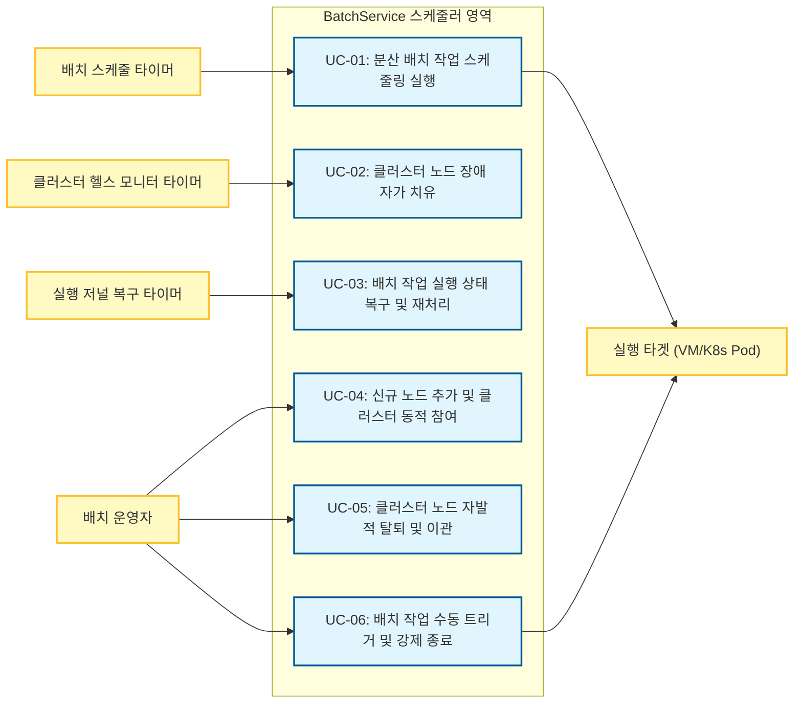
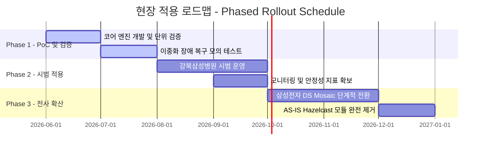

# 1. Project Overview


## 1.1 Project Charter

### 배경  

#### 프로젝트 추진 배경 (Project Background)
SDS가 수행하는 대내외 프로젝트에 무상으로 제공되는 Batch Job Scheduler 재사용 자산인 **"BatchService"** 는 기존에 분산 클러스터링 및 동시성 제어(분산 큐, 분산 락)를 위해 외부 오픈소스 라이브러리인 **Hazelcast**에 전적으로 의존해 왔습니다. 그러나 최근 Hazelcast의 라이선스 정책이 유료화 기반으로 변경됨에 따라 상용 비용 발생 리스크가 현실화되었습니다. 이에 따라 외부 상용 벤더나 외부 라이브러리에 독립적이면서, 자유롭게 통합할 수 있는 **순수 Java Standard 스펙 기반의 경량 분산 코디네이션 엔진 개발**이 필요하게 되었습니다.

#### 기존 AS-IS 아키텍처 개념도
아래 다이어그램은 개편 대상이자 현재 Kubernetes(K8s) 환경에서 구동 중인 기존 BatchService의 아키텍처입니다. 다중화된 스케줄러 인스턴스(Replica # 1, # 2) 간의 작업 동기화(분산 큐, 분산 락)를 위해 외부 라이브러리인 **Hazelcast Cluster**에 강하게 의존하고 있습니다.

![[ArchitectureSpecification/1. Project Overview/BatchService_Architecture_concept.svg]]

#### AS-IS 아키텍처의 분산 큐 활용 배경 (작업 분배 및 부하 분산)
다중 인스턴스(Active-Active HA) 환경에서 스케줄링된 배치 작업(Job)을 복수 노드에 안전하게 분산 실행(Triggering)하고 클러스터 리소스를 효율적으로 활용하기 위해 분산 큐가 적용되어있습니다.

- **작업 중복 실행 방지 및 부하 균등 분산 (Load Balancing & De-duplication)**:
  다중 인스턴스가 동일한 스케줄 주기에 도래한 작업을 동시에 기동할 경우 중복 실행(Duplicate Execution)이나 특정 노드로의 부하 집중이 발생할 수 있습니다. 이를 방지하기 위해 실행 대상 작업을 분산 큐에 등록(Enqueue)하고, 각 인스턴스가 가용 자원에 맞춰 작업을 경쟁적으로 인출(Dequeue/Fetch)하여 처리함으로써 노드 간 작업 부하를 균등하게 분산하고 중복 기동을 억제합니다.
- **스케줄링과 작업 실행 간의 결합도 완화 (Decoupling & Buffering)**:
  작업 트리거(스케줄링 판단)와 실제 작업 실행(Job Launching)을 분산 큐를 매개로 비동기 분리(Decoupling)합니다. 다량의 배치 작업이 일시에 트리거되더라도 분산 큐를 통한 버퍼링으로 개별 인스턴스의 리소스 급증을 완화하며, 특정 노드 장애 시에도 큐에 대기 중인 작업을 생존 노드가 인계하여 처리할 수 있는 구조를 제공합니다.

![[ArchitectureSpecification/1. Project Overview/Untitled Diagram 1.svg]]

[원본링크](https://sequencediagram.org/index.html#initialData=A4QwTgLglgxloDsIAIBEAhEEYAtkCkB7AI2QGdcBTAEwFcAbSsZAJUuHthGQGIBGVMhBlkAEQCCAcT4AoGaEix4IJGkzY8RUhRw0GTVu04xuPAEyDhYqWbkLocRClSioZCGCjFaESsgCKtJRBliL+vMBQCADWduAOykgA5mCEtMDIAKIAHpQwPlCECFkIAG5QqQgAtpRI8vFKTmpYuAQkvAJCIuiy9o0qzuqtWrwWXcjotn2OA80abaQ8AMyhE0sytdRyMiAw0KVYfhLScsd8ALQAfJcAVD0AXPQgtAitAFbt-Dt7UAe+E7JqJRdvtDiAAGa+Zg9GRA9ypACeEKhAJ29BQCEo2RQ7nYyA+pEAJ0OASNXkIAAGsApU2AA1XkIBemsADWMyM7nADaPDANAA3GYALqXfz3YC0Mh4THY-HtAAUBNGABoJYslgBKb6g-7+WHAn5-YGQgwazbbIEg35gvXMM4yMigGCUVWm-7HWxMmys9lc3n8+7gyjzGXme06gKak065H606u653MyPZ6vPD+2yhw4TWzG7VmlGTTXwwhI81puQgdHIMU43wZGUk8nUumMp1XAVCkVlrEoGXSz4AFhVKfVIczvnDzANCC2GbVupRTu21t2dv7RyksmZbI51G5fIFPr9n3WS+Dk4d04jzOj6CWcZe733gdTl8HU5Ha1zHnzL8faIx7fIlYVyA1pSNIMi60hNoKwqir+nb+r294DseYaFmOWxyEAA)
![[Pasted image 20260818040545.png]]

#### AS-IS 아키텍처의 분산 락 활용 배경 (DAG 상태 전이 동기화)
다중 인스턴스(Replica # 1, Replica # 2) 환경에서 DAG(Directed Acyclic Graph) 기반 워크플로우가 분산 실행될 때, 선행 작업들의 완료 처리와 후속 작업(Job # 4)의 기동 조건 판정 과정에서 분산 락을 통한 동기화가 필요합니다.

- **동시 검증 시 후속 작업 판정 누락 위험 (Missed Triggering)**:
  복수의 선행 작업(Job # 2, Job # 3)이 서로 다른 인스턴스에서 거의 동시에 완료될 때, 적절한 동기화 제어가 없으면 각 인스턴스가 상대방의 작업 완료 상태가 최종 반영되기 전에 후속 작업(Job # 4)의 실행 조건을 조회하게 됩니다. 이 경우 'Replica # 1'과 'Replica # 2' 모두 "선행 조건 미충족"으로 잘못 판정(False Negative)하여, 'Job # 2'와 'Job # 3'가 모두 완료되었음에도 후속 작업(Job # 4)이 트리거되지 않고 워크플로우가 영구 정체(Starvation)되는 결함이 발생할 수 있습니다.
- **분산 락을 통한 상태 전이 원자성(Atomicity) 확보**:
  선행 작업의 완료 상태 반영, 전체 선행 조건 충족 여부 검토, 후속 작업 기동(트리거)에 이르는 일련의 상태 전이 로직을 분산 락 기반의 **Critical Section** 으로 직렬화(Mutual Exclusion)합니다. 이를 통해 다중 노드 환경에서도 최신 완료 상태에 기반한 정확한 판정을 보장하여 후속 작업의 누락 없는 안전한 기동을 달성합니다.

![[ArchitectureSpecification/1. Project Overview/Untitled Diagram.svg]]

[원본링크](https://sequencediagram.org/index.html#initialData=A4QwTgLglgxloDsIAIBEAhEEYAtkCkB7AI2QGdcBTAEwFcAbSsZAJUuHthGQGIBGVMhBlkAEQCCAcT4AoGaEix4IJGkzY8RUhRw0GTVu04xuPAEyDhYqWbkLocRClSioZCGCjFaESsgAyhDAA1pYigSG8wFAIwfLgDsqqLm4eXj5+AIq0lDlhyJlRMXHUWCDEwn4uUsgA6oRgwQBm9IQA7siAgwOAOwv5bXYJSk4A5mCEtMDIAKIAHpQwPlCECNMIAG5QYwgAtpRI8YqOKs7quAQkvBZCIui29kPHalhnWrwAzPnobzJ71HIyIBg0DWWD8Ekkthk4LMAFoAHyZABcTUoGmQACsSACgVAQb4CjJqJRAcDQSAmr5mJk5ND4XCAFS3RH0EC0BBnTHEKE2eFMtrPPCc7Gk-G3QnEnF44kUgxionuMYAT3JlOQYu5EPhEWCiO1yEAsWuAXZbhbjQQEgiUJSLpartTIYJ4HCB6LwmiiiX9aQBtHhgGgAbjMAF04W1EeDkG0Gs1Wh0eshAA4TgBi15AACkAAwvIQAe44ASocALIs55CARPHAKOjgBaGwCVYwBKE1SyPikmm3wqgz9Wlw6GIhCUGYodzsDEXQAnQ4BI1eQgAAawClTchAJPL44B9BQ3d75F8k05yFHE8ngANV5CAXprAA1jGthPr91EDIbDEajjRa7S63WQgEYawAHQ7Wzf0iY2pS3mG2eQRRFgFoMg8GXFAhR-M1qW-SUyRlKkfgQP5fhPLULV1C1kEAF1XABwJj98TtODrT-c0QgbeDm0Q6wITkaD8XBWQaSkPh4SRFE0Sgqisko0iaOpJi6UZN5mVZdlBSxIS4S+RF+S4rEGL8L4+KbG1ZW+eUPEIZUaJUjU2LhbUsJCI1CL8YirTUsi7QdKAnRdHg3RoGgDJhM8A2DUNwxqW8YwfeNkzTTNcwLYty2rcz6xI6yaIA6R4SYrsez7NdB1ILcp1nednSXFLVwHDdMt3A9jyEjyLy869fOje84yfN8oq-KzfzitygJAsDkAg9KotglqENVak0LQliEqMzDtXwqLLKUmyLSAA)
![[Pasted image 20260818033215.png]]

#### 참고: 기존 배치 스케줄링 플랫폼 대비 재사용자산 BatchService의 차별성
널리 쓰이는 기존 배치 스케줄링 플랫폼(Apache Airflow, Kubernetes CronJob 등) 대신 사내 재사용자산 BatchService를 직접 개편하는 이유는 다음과 같은 장점 때문입니다.

* **Airflow 대비 경량 구조 및 UI 기반 배치 설정의 우위성**:
  * Airflow는 Python 런타임 환경 외에 웹 서버, 스케줄러 데몬, 분산 워커, Celery/Redis(메시지 브로커), 메타 RDBMS 등 복잡하고 무거운 인프라 에코시스템 구축을 요구하므로 자원 요구량이 매우 크며, 경량형 자산으로 배포하기 부적합합니다.
  * 또한, Airflow는 배치 간 선후행 실행 관계(DAG Workflow)를 파이썬 코드로 직접 작성해 빌드해야 하므로 운영 편의성이 낮습니다. 반면, BatchService는 복잡한 DAG 정의를 관리자 웹 UI 상에서 시각적으로 연결·매핑할 수 있는 직관적인 사용성을 제공합니다.
  * 아울러 별도의 Redis/ZooKeeper 인프라웨어 설치 없이 실행되므로 배포 부담과 인프라 TCO를 최소화합니다.
* **Kubernetes CronJob 대비 정교한 제어 및 하이브리드 지원**:
  * Kubernetes CronJob은 클라우드 환경 전용 기술로서 단순히 지정 주기에 컨테이너 Pod를 기동(Launch)할 뿐, 작업 간의 정교한 선후행 의존 관계(Chaining) 관리, 동작 중인 배치의 실시간 강제 종료/수동 재기동 등 정밀 제어 API를 제공하지 않으며 레거시 가상 머신(VM) 실행 환경을 연동할 수 없습니다.
  * BatchService는 단일 스케줄러 클러스터 내에서 K8s 컨테이너 Pod 기동뿐 아니라 레거시 VM 내부의 쉘 스크립트 실행 제어까지 통합적으로 조율하고 모니터링할 수 있는 하이브리드 아키텍처를 제공합니다.

### 목표  

#### 아키텍처 개선 범위 (Architecture Scope)
- **개선 대상 (In-Scope):**
  - **분산 코디네이션 및 동기화 제어 엔진**: 외부 분산 클러스터(Hazelcast) 의존성을 배제하고, JDK 표준 API와 이미 구축된 공유 저장소 정보만을 활용해 리더 선출, 멤버십 동적 관리, 분산 락(중복 실행 방지), 분산 큐(작업 누락 방지) 기능을 가동하도록 개편합니다.
- **개선 제외 대상 (Out-of-Scope):**
  - 스케줄러의 비즈니스 기능(배치 설정 CRUD, 관리용 UI 설정 화면, 실행 이력 조회, 개별 배치 작업 실행 쉘/컨테이너 구동 자체 메커니즘 등)은 기존의 스펙을 수정 없이 재사용합니다.
#### 핵심 설계 목표
- **고가용성(HA) 및 신뢰성 보장 (Self-Healing):**
  - **최대 3~5개 노드**로 구성된 소규모 클러스터 환경에서 노드 장애(Crash 등)가 발생하더라도 스케줄러 기능이 중단 없이 지속되도록 자동 리더 선출 및 멤버십 관리 기능을 구현합니다.
- **안정적인 동시성 제어 (Distributed Lock & Queue):**
  - 평시 **50개**에서 최대 **200개** 수준의 동시 배치 작업(Job)이 여러 노드에 걸쳐 중복 실행되거나 유실되지 않도록 보장하는 분산 락 및 분산 큐를 구현합니다.
- **순수 Java Standard 기술 활용:**
  - 외부 라이브러리나 추가 인프라 설치 없이 JDK 표준 라이브러리(Java Concurrency, Socket 등)만을 활용하여 경량화되고 유지보수가 용이한 독자적 아키텍처를 완성합니다.


## 1.2 Stakeholder

| Stakeholder               | Description                                   | 주요 관심 및 Pain Point                                                                                                                                                                                                                                                    |
| ------------------------- | --------------------------------------------- | --------------------------------------------------------------------------------------------------------------------------------------------------------------------------------------------------------------------------------------------------------------------- |
| BatchService 개발자          | BatchService의 핵심 스케줄러 기능 및 분산 라이브러리 교체 개발 담당자 | - 외부 라이브러리 없이 순수 Java만으로 동시성 제어 및 클러스터링을 결함(Race Condition, Deadlock) 없이 구현해야 함.<br>- 코드가 과도하게 복잡해지지 않고 유지보수 용이성을 유지해야 함.<br>- 핵심 분산 기능(Lock, Queue)을 인터페이스 기반으로 정밀 추상화하여 구현체 간 결합도를 낮추고 유지보수 확장성을 보장해야 함.                                                            |
| BatchService 사용 프로젝트 아키텍트 | BatchService를 개별 프로젝트의 배치 시스템으로 도입/구축하는 아키텍트  | - AS-IS(Hazelcast 기반) 대비 API 및 설정 변경이 최소화되어 하위 호환성이 유지되어야 함.<br>- 신규 엔진 도입 초기의 예기치 못한 크래시 상황에서도 데이터 유실 없이 무결하게 작업을 재개할 수 있는 장애 극복(Failover) 매커니즘이 수립되어야 함.<br>- 실 운영 환경(VM, K8s)에서의 배치 누락이나 중복 실행 방지 등의 신뢰성이 확보되어야 함.<br>- 스케줄러 노드의 자원(CPU/Memory) 점유율이 경량으로 유지되어야 함. |
| 사내 재사용자산 관리자              | 사내 공통 자산의 라이선스, 비용 리스크 및 지식재산권을 관리하는 담당자      | - Zookeeper, Redis 등 분산 상태 조율용 외부 미들웨어가 추가적으로 필요하지 않는 단순한 배포 및 아키텍처를 구현하여, 재사용자산으로서 당사가 수행하는 프로젝트에 적용하는 허들을 낮춰야함.<br>- Hazelcast 유료화에 따른 라이선스 비용 리스크를 제거해야 함.<br>- 독자적 기술 내재화를 통한 사내 기술 자산 가치 증대 및 타 프로젝트 전파를 위한 체계적인 아키텍처 문서와 검증 데이터가 필요함.                           |


## 1.3 Business Goal

프로젝트 아키텍처 개편을 통해 달성하고자 하는 궁극적인 비즈니스 목표를 정의합니다.

| Business Goal ID | 목표 정의             | 설명                                                         | 관련 요구사항 (Req ID) |
| :--------------: | ----------------- | ---------------------------------------------------------- | :--------------: |
|      BG-01       | 라이선스 프리 및 TCO 절감  | Hazelcast 유료화 리스크를 배제하여 운영/도입 비용을 최소화.                     |      NR-01       |
|      BG-02       | 기술 독립성 및 내재화      | 벤더 종속성 없는 분산 코디네이션 기술력을 사내 표준 기술로 내재화.                     | FR-01 ~ FR-04, NR-01, NR-02, NR-03, NR-04, NR-05 |
|      BG-03       | 재사용 자산 배포 용이성 확보 | 타 프로젝트에 BatchService를 도입할 때 추가 인프라 제약이나 외부 의존성 설치 허들을 최소화. | NR-03, NR-07, NR-08 |


## 1.4 Issue and Requirement Analysis

프로젝트 아키텍처 수립의 기반이 되는 핵심 비즈니스 이슈와 이를 해결하기 위한 요구사항을 정의합니다.

### 1.4.1 핵심 비즈니스 이슈: Hazelcast 라이선스 유료화에 따른 TCO 증가
본 프로젝트의 착수 배경이 되는 핵심 이슈는 기존 분산 코디네이터 및 클러스터링 엔진으로 사용하던 Hazelcast의 라이선스 정책 변경입니다.

* **상세 설명 및 정량적 영향도**: 
  * Hazelcast의 라이선스 정책은 대외적으로 공개되지 않는 '비공개 협상 방식(Custom Pricing)'으로 운영되고 있으나, 과거 오픈 포럼 및 일부 시장 조사 자료(Vendr 레퍼런스)에 따르면, 연간 구독형(Annual Subscription) 계약 시 **노드당 연간 약 $5,000**의 라이선스 비용이 고정적으로 청구되는 것으로 알려져있습니다. 
  * 당사 표준 배치 스케줄러 클러스터(3개 노드) 구성을 고려할 때, 단일 프로젝트 도입 시 **연간 약 $15,000**(약2억원)의 인프라 고정 비용이 지속 발생합니다. 
  * 자체 분산 엔진 개발 시 투입 비용(공수: 개발자 2명 * 3개월 = 약 6,000만 원 일회성 비용) 대비 ROI가 우수하며 TCO를 절감합니다.

### 1.4.2 시스템 요구사항 (System Requirements)

Hazelcast 의존성을 배제하고, 기존의 분산 클러스터링 및 동시성 제어 기능과 운영 안정성을 대체하여 구현하기 위한 아키텍처적 기능/비기능 요구사항입니다.

#### 1.4.2.1 기능 요구사항 (Functional Requirements)

| Req ID | 요구사항 정의          | 세부 설명 및 도출 근거 (기술적 제약/품질 속성)                                                                   | 우선순위 |  관련 시스템 기능   |
| :----: | :--------------- | :--------------------------------------------------------------------------------------------- | :--: | :----------: |
| FR-01  | 중복 실행 방지 분산 락    | 다중 스레드/노드 분산 환경에서 동일한 배치 작업이 동시에 다중 구동되어 데이터가 오염되는 현상을 배제하기 위해 물리적인 분산 락 기능을 제공함.              |  상   |    SF-02     |
| FR-02  | 작업 누락 방지 분산 큐    | 분산 환경에서 특정 작업이 유실되지 않고 순차적(FIFO)이거나 안정적으로 타겟에 전달될 수 있도록 폴링 가능한 분산 큐 메커니즘을 제공함.                 |  상   |    SF-03     |
| FR-03  | 저널 복구를 통한 무유실 보장 | 자체 분산 엔진 적용 초기 안정성 확보를 위해, 데드락이나 프로세스 Crash 발생 시 공유 저널링 정보를 기반으로 미완료 작업을 최종 유실 없이 자동 롤백 및 복구함. |  상   |    SF-04     |
| FR-04  | 클러스터 멤버십 자가 치유   | 클러스터 내 노드들의 동적 참여 및 이탈을 감시하고, 장애 발생 시 자동으로 멤버 목록을 동기화하여 서비스 지속성을 유지함.                          |  상   | SF-01, SF-05 |

#### 1.4.2.2 비기능 요구사항 (Non-Functional Requirements)

| Req ID | 요구사항 정의                   | 분류  | 세부 설명 및 도출 근거 (기술적 제약/품질 속성)                                                                                                                                           | 우선순위 |      관련 시스템 기능      |
| :----: | :------------------------ | :-: | :--------------------------------------------------------------------------------------------------------------------------------------------------------------------- | :--: | :-----------------: |
| NR-01  | 유료 분산 엔진 라이선스 배제          | 비용  | Hazelcast 등 유료 라이선스 리스크가 있는 외부 라이브러리 의존성을 전면 배제하여 도입/운영비 부담을 최소화함.                                                                                                     |  상   |        SF-01        |
| NR-02  | 동시성 결함 배제 (데드락 방지)        | 신뢰성 | 통신 소켓 및 RDBMS 트랜잭션 제어(Isolation Level) 상에서 Race Condition 및 교착 상태(Deadlock)가 발생하지 않도록 락 에이징 및 타임아웃을 지원함.                                                               |  상   |    SF-02, SF-03     |
| NR-03  | 별도 미들웨어 인프라 설치 배제         | 운영성 | Zookeeper, Redis 등 분산 상태 조율용 외부 미들웨어를 추가 설치/운영해야 하는 인프라 복잡성을 제거하여 배포 및 구성을 단순화함.                                                                                       |  중   | SF-01, SF-02, SF-03 |
| NR-04  | 3초 이내 자동 장애 복구            | 성능  | 특정 노드 급작 종료 시, 타 대기 노드가 3초 이내에 하트비트 아웃을 감지하여 멤버십을 갱신하고 신규 리더를 선출하여 스케줄 공백을 차단함.                                                                                        |  중   |    SF-01, SF-05     |
| NR-05  | 기존 API 및 메타 스키마 호환성       | 호환성 | 기존 스케줄러 호출 서비스들이 수정 없이 작동할 수 있도록 호환성을 확보하고, 기존 데이터베이스 스키마와의 하위 호환성을 유지함.                                                                                               |  하   | SF-02, SF-03, SF-04 |
| NR-06  | 리소스 사용량 최소화 (Footprint)   | 효율성 | 메모리 및 CPU 오버헤드를 낮추어 신규 엔진 기동 시 추가 CPU 사용율 5% 미만, 추가 Heap 메모리 점유 50MB 이하로 제어함.                                                                                          |  하   | SF-01, SF-02, SF-03 |
| NR-07  | 플랫폼 및 런타임 독립성             | 이식성 | 특정 OS 또는 Native 라이브러리에 종속되지 않으며, JDK 17 표준 가상머신(VM) 및 Kubernetes 컨테이너(Pod) 환경 전체에서 동일하게 빌드 및 구동됨.                                                                      |  하   |    SF-01 ~ SF-05    |
| NR-08  | 기존 배포 인프라 및 아키텍처 호환성      | 이식성 | 경량 분산 코디네이션 엔진 도입 시 수요처 프로젝트의 기존 K8s Pod 실행 환경, 배포 매니페스트 및 아키텍처 구조의 변경을 최소화함.                                                                                          |  하   |    SF-01 ~ SF-05    |
| NR-09  | DB 장애 내구성 (분산 락·큐 무중단 운영) | 가용성 | 메타 DB 인프라에 장애가 발생하여 DB 접속이 불가한 상태에서도 분산 락(Distributed Lock) 및 분산 큐(Distributed Queue)의 핵심 기능이 중단 없이 동작하여야 하며, DB가 복구된 시점에 클러스터 상태 및 작업 이력을 RDBMS와 정합하여 전체 시스템을 정상 복구함. |  상   |    SF-01 ~ SF-05    |


## 1.5 Business context Diagram

BatchService의 비즈니스 영역 경계와 외부 행위자/시스템 간의 관계를 다이어그램으로 나타냅니다.
![[Pasted image 20260615001919.png]]


# 2. System Overview


## 2.1 System Context Diagram

BatchService를 중심으로 상호작용하는 외부 시스템 및 운영자와의 관계를 시스템 관점에서 정의합니다.
![[Pasted image 20260615002015.png]]


## 2.2 External Entity List

BatchService와 연계되는 외부 시스템, 행위자(Actor) 및 관련 자원의 역할을 정의합니다.

|  ID   | 외부 엔티티명               |   구분   | 설명                                                                    |
| :---: | --------------------- | :----: | --------------------------------------------------------------------- |
| EE-01 | 배치 운영자                | Actor  | 배치 스케줄링 등록, 강제 실행, 상태 모니터링 및 장애 조치를 수행하는 사용자 또는 운영 시스템.               |
| EE-02 | Kubernetes API Server | System | K8s 실행 환경에서 스케줄러의 요청에 따라 배치 실행용 Pod을 생성, 제어 및 감시하는 API 제공 주체.         |
| EE-03 | VM 호스트 (SSH / Shell)  | System | VM 실행 환경에서 스케줄러의 요청에 따라 배치 실행 파일(.sh, jar 등)을 기동하고 결과를 반환하는 타겟 OS 환경. |
| EE-04 | 배치 메타 DB (RDBMS)      | System | 배치 작업의 스케줄 정보, 실행 이력 및 클러스터 메타데이터/저널링 정보를 저장하는 관계형 데이터베이스.            |


## 2.3 External Interface List

BatchService가 외부 엔티티와 데이터를 주고받을 때 사용하는 통신 규격 및 인터페이스 사양을 정리합니다.

|   ID   | 인터페이스명           | 송신/수신 | 프로토콜/연계방식               | 연계 데이터 및 설명                                                                  |
| :----: | ---------------- | ----- | ----------------------- | ---------------------------------------------------------------------------- |
| INF-01 | 운영자 제어 API       | 수신    | REST/HTTPS (JSON)       | 배치 작업 신규 등록, 일시 중지, 즉시 실행 요청 및 전체 스케줄러 노드 상태 모니터링 데이터.                       |
| INF-02 | K8s Job 제어 인터페이스 | 송신    | REST/HTTPS (K8s API)    | 배치 실행을 위해 K8s Job 리소스를 생성(Manifest 전송)하고 Pod의 시작/종료/오류 상태를 폴링(Polling)함.     |
| INF-03 | VM 실행 제어 인터페이스   | 송신    | SSH / Local Process API | VM 환경에서 배치 스크립트 실행 명령어를 송신하고, 프로세스 종료 코드(Exit Code) 및 Stdout/Stderr 로그를 수신함. |
| INF-04 | 데이터베이스 연계 인터페이스  | 송/수신  | JDBC (TCP)              | 스케줄 구성 데이터 조회, 배치 실행 이력 적재 및 클러스터 하트비트/저널링 데이터 영속화 수행.                       |


## 2.4 System Feature List

Hazelcast 의존성을 배제하고, 기존의 분산 클러스터링 및 동시성 제어 기능과 운영 안정성을 대체하여 구현할 시스템 기능(System Feature)의 상세 정의와 구현 범위를 기술합니다.

|  ID   | 기능명                         | 설명                                                                        | 구현 범위 (Scope)        |      관련 요구사항 (Req ID)      |
| :---: | --------------------------- | ------------------------------------------------------------------------- | -------------------- | :----------------------------------: |
| SF-01 | 클러스터 멤버십 관리                 | 3개 노드 간의 활성화 상태(Heartbeat)를 지속적으로 확인하고 전체 멤버 목록을 동기화함.                    | 신규 개발 (Hazelcast 대체) | FR-04, NR-01, NR-03, NR-04, NR-06 |
| SF-02 | 분산 락 (Distributed Lock)     | 특정 배치 작업이 다중 노드에서 중복으로 동시 실행되는 것을 방지하는 임계 구역 제어 기능을 제공함.                     | 신규 개발 (Hazelcast 대체) | FR-01, NR-02, NR-03, NR-05, NR-06    |
| SF-03 | 분산 큐 (Distributed Queue)    | 배치 실행 대기열을 관리하며, 여러 컨슈머(노드)가 동시 접근하더라도 작업 유실이나 중복 처리 없이 순차 가공할 수 있도록 지원함. | 신규 개발 (Hazelcast 대체) | FR-02, NR-02, NR-03, NR-05, NR-06    |
| SF-04 | 장애 저널 복구 (Journal Recovery) | 스케줄러 노드 장애(Crash 등) 시 RDBMS 실행 저널 로그를 추적하여 미완료 또는 오작동 배치 작업을 복구 및 재처리함.   | 신규 개발 (Hazelcast 대체) |        FR-03, NR-05                 |
| SF-05 | 자동 리더 선출 (Failover)         | 현재 활성화된 리더 노드의 장애를 감지하면, 즉시 자가 치유(Self-Healing)를 발동하여 잔여 노드 중 신규 리더를 선출함. | 신규 개발 (Hazelcast 대체) |           FR-04, NR-04              |

*참고: 플랫폼 및 런타임 독립성(NR-07)과 기존 배포 인프라 및 아키텍처 호환성(NR-08)은 모든 시스템 기능(SF-01 ~ SF-05)에 공통 적용되는 횡단 비기능 요구사항입니다.*


## 2.5 Assumption of the System

BatchService 아키텍처 설계 및 구현의 전제가 되는 환경적/비즈니스적 가정 사항(Assumption)을 정의합니다. 본 가정 사항들은 외부 미들웨어 종속을 제거하고 상용 수준의 신뢰성을 유지하면서도 분산 엔진의 구현 복잡도를 간소화하기 위한 기본 전제입니다.

|   ID   | 가정 사항                     | 상세 설명                                                                                                                          | 비고              |
| :----: | :------------------------ | :----------------------------------------------------------------------------------------------------------------------------- | :-------------- |
| ASM-01 | 인프라 내 NTP 시간 동기화          | 분산 임대 락(Lease Lock)의 만료 시간 및 분산 스케줄 실행의 정확성 보장을 위해, 대상 현장의 물리/가상 서버들이 표준 시간 서버(NTP)를 통해 시스템 시간 오차 **최대 1초 이내**로 동기화되어 있다고 전제함. | 스케줄 및 락 정밀도 보장  |
| ASM-02 | 단일 DAG 단위 분산 락            | 분산 락의 제어 단위는 **단일 DAG Workflow(Job)**에 한정되며, 워크플로우 하위 태스크 간의 중첩 락(Nested Lock)이나 다중 이기종 리소스 간 분산 트랜잭션(2PC/XA)은 요구되지 않는다고 전제함.  | 동시성 제어 단순화      |
| ASM-03 | 단일 망 사설 통신 및 Fail-Stop 모델 | 모든 엔진 노드는 동일 VPC 사설망 또는 동일 K8s 클러스터 내부에서 통신하며, 노드 고장은 악의적 왜곡(Byzantine Fault)이 없는 **Fail-Stop / Crash-Recovery 모델**을 전제함.      | 경량 합의 알고리즘 적용   |
| ASM-04 | 클러스터 토폴로지 규모              | 배치 서비스 노드 풀은 통상 **3~7대(최대 10대 미만)**의 소규모로 구성되며, 실시간 대규모 노드 증감이 빈번하게 발생하지 않는 정적/준정적 클러스터 구성을 전제함.                               | P2P 동기화 오버헤드    |
| ASM-05 | 메타 DB 복구 주기 및 로컬 저널 용량    | 공유 RDBMS는 단기 장애 후 복구 가능한 인프라로 관리되며, 메타 DB 장애 지속 중 각 노드가 보관하는 로컬 저널 로그 용량은 사전 할당된 로컬 디스크 범위 내로 제한된다고 전제함.                       | 장애 버퍼링 용량 기준 수립 |
| ASM-06 | 단일 노드 장애 격리 범위            | 분산 엔진의 자동 합의 및 멤버십 자가 치유는 런타임 중 발생하는 **단일 노드(또는 소수 노드의 순차적) 장애**를 기본 복구 범위로 하며, 클러스터 과반수 동시 영구 다운은 재해 복구(DR) 절차로 격리함.          | 쿼럼 복구 복잡도       |


# 3. Architectural Driver


## 3.1 Use Case Model

BatchService 핵심 클러스터링 엔진 교체와 관련하여 시스템이 처리해야 하는 주요 동작 시나리오를 정의합니다.

> [!NOTE]
> **유스케이스 모델링 설계 범위 (Scope)**
> 본 설계서의 유스케이스 모델은 기존 시스템(AS-IS)에서 이미 제공하고 있는 일반 기능(스케줄 등록/수정/삭제, 배치 수행 이력 및 로그 조회 등)은 설계 및 변경 범위에서 제외합니다. 
> 본 개편의 핵심인 **"순수 Java 기반의 고가용성 분산 클러스터링 엔진 및 Failover 처리(TO-BE)"** 영역에서 새롭게 추가되거나 비기능적 아키텍처 전략이 반영되는 핵심 제어 흐름에 집중하여 유스케이스를 구성하였습니다.

#### 유스케이스 액터(Actor) 정의 및 분류
본 시스템은 백그라운드에서 상시 작동하는 무중단 분산 스케줄링 자산이므로, 사람 사용자, 외부 시스템, 시간 이벤트를 발생시키는 요소를 모두 아키텍처적인 액터로 정의하여 설계의 타당성을 확보합니다. 클러스터를 이루는 각 스케줄러 노드 프로세스(JVM)는 시스템 자체(System under Design)에 해당하므로 액터에서 배제하며, 외부 실행 시스템 및 운영자와 3대 시간 트리거를 최종 액터로 정의합니다.

1. **사람 액터 (Human Actor)**: 
   * **배치 운영자 (Operator)**: 스케줄러 노드(프로세스)를 기동(추가)하거나 종료(탈퇴)시키고, 스케줄러 상태 모니터링 및 수동 개입(즉시 실행, 강제 종료 등)을 직접 수행하는 주체.
2. **외부 시스템 액터 (External System Actor)**: 
   * **실행 타겟 (Execution Target - VM/K8s Pod)**: 스케줄러로부터 배치 작업 실행 명령(Launch)을 수신받아 직접 프로세스를 구동하거나, 배치 중단 시 강제 종료 시그널을 수신받는 외부 실행 환경 주체.
3. **시간 액터 (Time / Temporal Actor)**: 
   * **배치 스케줄 타이머 (Batch Schedule Timer)**: 각 배치 작업의 고유 Cron 주기 또는 예약 주기가 도달했을 때 스케줄 실행 요청을 발생시키는 액터.
   * **클러스터 헬스 모니터 타이머 (Cluster Health Monitor Timer)**: 주기적(1초)으로 노드의 활성 상태(Heartbeat)를 점검하고 리더 탈락 여부를 모니터링하는 이벤트를 기동하는 액터.
   * **실행 저널 복구 타이머 (Journal Recovery Scan Timer)**: 주기적으로 공유 저장소의 실행 로그를 스캔하여 비정상 종료된 작업의 상태 복구 및 재처리를 감지하고 트리거하는 액터.

### 3.1.1 유스케이스 다이어그램 (Use Case Diagram)
![[ArchitectureSpecification/3. Architectural Driver/Untitled Diagram.svg]]


### 3.1.2 유스케이스 목록 (Use Case List)

| ID    | 유스케이스명                | 설명                                                                   | 중요도 | 난이도 | 관련 시스템 기능 (System Feature) |
| ----- | --------------------- | -------------------------------------------------------------------- | --- | --- | -------------------------- |
| UC-01 | 분산 배치 작업 스케줄링 실행      | 배치 예약 시간에 맞추어 다중 노드 중 하나가 분산 락을 획득하고, 중복 실행 없이 분산 큐를 통해 작업을 수행함.     | 상   | 상   | SF-02, SF-03               |
| UC-02 | 클러스터 노드 장애 자가 치유      | 리더 노드 장애 시, 대기 노드가 이를 실시간 감지하여 새로운 리더를 선출(Failover)하고 중단 업무를 승계함.    | 상   | 상   | SF-01, SF-05               |
| UC-03 | 배치 작업 실행 상태 복구 및 재처리  | 스케줄러 노드 또는 실행 환경 크래시 시, 공유 실행 저널 조회를 통해 미완료 작업을 자동으로 복구 및 재예약함.      | 상   | 중   | SF-01, SF-03, SF-04, SF-05 |
| UC-04 | 신규 노드 추가 및 클러스터 동적 참여 | 새로 기동된 노드가 공유 저장소 및 통신 체계를 통해 클러스터 멤버십을 자동으로 갱신하고 연계 동기화를 수행함.       | 중   | 중   | SF-01                      |
| UC-05 | 클러스터 노드 자발적 탈퇴 및 이관   | 유지보수 등을 위해 노드가 정상 종료될 때 보유한 분산 락/큐 자원을 안전하게 반환하고 멤버십에서 이탈함.          | 중   | 중   | SF-01, SF-02, SF-05        |
| UC-06 | 배치 작업 수동 트리거 및 강제 종료  | 배치 운영자가 수동 명령을 통해 특정 배치 작업을 강제 즉시 실행하거나 현재 실행 중인 장기 작업을 안전하게 강제 종료함. | 상   | 중   | SF-02, SF-03               |

### 3.1.3 유스케이스 상세 정의

#### UC-01: 분산 배치 작업 스케줄링 실행
| 항목         | 내용                                                                                                                                                                                                                                                                                             |
| ---------- | ---------------------------------------------------------------------------------------------------------------------------------------------------------------------------------------------------------------------------------------------------------------------------------------------- |
| 액터 (Actor) | 배치 스케줄 타이머 (Batch Schedule Timer)                                                                                                                                                                                                                                                              |
| 사전 조건      | - 3개 노드 클러스터가 정상 기동 및 연계 동기화된 상태임.<br>- 분산 락 및 분산 큐 인터페이스가 정상 작동 중임.                                                                                                                                                                                                                         |
| 기본 흐름      | 1. 배치 주기 도달 시 타이머가 이벤트를 발생시킴.<br>2. 클러스터 내의 노드들이 해당 작업에 대한 분산 락(Distributed Lock) 획득을 경쟁함.<br>3. 분산 락 획득에 성공한 단 하나의 노드(Worker)가 작업을 인계받음.<br>4. 해당 노드가 대상 작업을 분산 큐(Distributed Queue)에 적재함.<br>5. 큐에 적재된 작업을 기반으로 실행 타겟(VM/K8s Pod)에 실행 위임 명령을 송신함.<br>6. 배치가 종료되면 분산 락을 해제하고 공유 저장소에 이력을 저장함. |
| 예외 흐름      | - **락 획득 실패 시:** 다른 노드가 이미 실행 중인 것으로 판단하여 실행 요청을 무시하고 대기함 (중복 실행 차단).<br>- **원격 기동 실패 시:** 실패 이력을 저장하고 설정된 재시도 룰에 의거하여 재처리 큐로 이관함.                                                                                                                                                             |
| 사후 조건      | 배치 실행 상태가 정상 기록되고 점유했던 분산 자원(Lock/Queue)이 온전히 반환됨.                                                                                                                                                                                                                                             |

#### UC-02: 클러스터 노드 장애 자가 치유
| 항목             | 내용                                                                                                                                                                                                                                                                    |
| -------------- | --------------------------------------------------------------------------------------------------------------------------------------------------------------------------------------------------------------------------------------------------------------------- |
| 액터 (Actor) | 클러스터 헬스 모니터 타이머 (Cluster Health Monitor Timer)                                                                                                                                                                                                                                                            |
| 사전 조건      | 3개 노드로 구성된 클러스터에서 1개의 리더(Leader)와 나머지 팔로워(Follower) 노드가 활성화된 상태임.                                                                                                                                                                                                   |
| 기본 흐름      | 1. 현재 리더 노드가 프로세스 종료 또는 네트워크 단절 등으로 정지함.<br>2. 팔로워 노드들이 하트비트(Heartbeat) 유실을 감지함 (감지 시간 2초 이내, 선출 포함 총 3초 이내).<br>3. 잔여 팔로워 노드 간에 리더 선출 알고리즘(공유 저장소 락 또는 분산 합의 프로토콜)이 기동됨.<br>4. 최다 표 혹은 최선 획득 노드가 새로운 리더 노드로 승격됨.<br>5. 새로운 리더 노드가 미처리 배치 작업 리스트를 공유 저장소에서 가져와 다시 스케줄링 큐에 바인딩함. |
| 예외 흐름      | - **쿼럼(과반수) 붕괴 시:** 활성 노드가 1개만 남은 경우, Split-Brain 방지를 위해 독립 모드로 다운그레이드 기동하거나 리더 승격을 차단하고 경고 알람을 발송함.                                                                                                                                                                  |
| 사후 조건      | 새로운 리더 노드 제어 하에 클러스터가 지속 가동되며 작업 유실이 없음이 보장됨.                                                                                                                                                                                                                         |

#### UC-03: 배치 작업 실행 상태 복구 및 재처리
| 항목             | 내용                                                                                                                                                                                                                                       |
| -------------- | ---------------------------------------------------------------------------------------------------------------------------------------------------------------------------------------------------------------------------------------- |
| 액터 (Actor) | 실행 저널 복구 타이머 (Journal Recovery Scan Timer)                                                                                                                                                                                                                  |
| 사전 조건      | 노드 장애 등으로 인해 배치 수행 도중 프로세스가 비정상 종료(Crash)되었거나 강제 종료된 작업이 존재함.                                                                                                                                                                            |
| 기본 흐름      | 1. 새롭게 리더 선출을 완료한 스케줄러 노드가 기동 시 또는 주기적으로 공유 저장소 상의 배치 저널(Journal) 데이터를 조회함.<br>2. 실행 중(Running) 상태로 장시간 대기 중인 비정상 종료 배치 태스크를 식별함.<br>3. 해당 태스크를 스케줄러가 차단 해제하고 복구 큐에 자동으로 적재함.<br>4. 큐에 적재된 태스크에 대해 재처리를 시작하고, 수행 완료 후 상태를 성공/실패로 정상화함. |
| 예외 흐름      | - **저널 저장소 장애 시:** 복구 핸들러가 경고 알람을 발송하고 연결이 복구될 때까지 10초 간격으로 재시도함. |
| 사후 조건      | 비정상 종료되어 누락될 뻔한 배치 작업이 데이터 유실 및 누락 없이 최종 실행 완료됨.                                                                                                                                                                                         |

#### UC-04: 신규 노드 추가 및 클러스터 동적 참여
| 항목             | 내용                                                                                                                                                                                                                                       |
| -------------- | ---------------------------------------------------------------------------------------------------------------------------------------------------------------------------------------------------------------------------------------- |
| 액터 (Actor) | 배치 운영자 (Operator)                                                                                                                                                                                                                      |
| 사전 조건      | 기존 클러스터 노드가 기동 및 활성화되어 정상 작동 중이며, 스케줄러 노드 인프라가 추가 배포됨.                                                                                                                                                                                 |
| 기본 흐름      | 1. 신규 노드 기동 시 공유 멤버십 저장소에 자신의 정보(IP, 포트, 기동 시각)를 등록함.<br>2. 신규 노드가 기존 리더 노드와 팔로워 노드에게 하트비트 전송을 통해 활성 상태를 최초 알림.<br>3. 기존 리더 노드가 신규 노드 진입을 멤버십 목록에 등록하고 동기화함.<br>4. 신규 노드가 클러스터 뷰 업데이트를 수신하고 대기 상태(작업 수신 가능 상태)로 전환됨. |
| 예외 흐름      | - **식별자 충돌 시:** 신규 노드 정보가 기존 활성 노드 정보와 일치할 경우 기동 에러 로그를 남기고 부트스트랩 단계를 즉시 종료(강제 중단)함.                                                                                                                                                         |
| 사후 조건      | 추가된 노드가 클러스터의 일원으로 정상 편입되어 작업 분산 및 폴링 가용 자원이 증가함.                                                                                                                                                                                        |

#### UC-05: 클러스터 노드 자발적 탈퇴 및 이관
| 항목         | 내용                                                                                                                                                                                                                                                |
| ---------- | ------------------------------------------------------------------------------------------------------------------------------------------------------------------------------------------------------------------------------------------------- |
| 액터 (Actor) | 배치 운영자 (Operator)                                                                                                                                                                                                                               |
| 사전 조건      | 운영자에 의한 유지보수 작업이나 스케일인(Scale-in) 정책 등에 의해 특정 노드에 대한 정상 종료(SIGTERM 등) 시그널이 발생함.                                                                                                                                                                    |
| 기본 흐름      | 1. 대상 노드가 정상 종료 시그널을 감지함.<br>2. 현재 자신이 점유하고 있던 모든 분산 락(Lock)을 즉시 해제함.<br>3. 분산 큐에서 새로운 작업 폴링을 중단하고, 공유 멤버십 저장소 상의 상태를 '정상 탈퇴'로 변경함.<br>4. 노드 프로세스가 사용 중이던 통신 리소스 및 메모리를 정상 해제한 후 완전 종료됨.<br>5. 잔여 리더 및 팔로워 노드가 멤버십에서 대상 노드를 제외하여 클러스터 구조를 재구성함. |
| 예외 흐름      | - **탈퇴 노드가 리더인 경우:** 종료 프로세스 즉시 리더 권한을 명시적으로 반환(Lock 해제)하여 잔여 노드들이 즉각 리더 선출(Failover) 프로세스(UC-02)를 실행할 수 있도록 유도함.                                                                                                                                 |
| 사후 조건      | 대상 노드가 정상 제거되고, 실행 중이던 미처리 작업들은 데이터 유실이나 락 점유 유지 현상 없이 온전히 타 노드로 승계됨.                                                                                                                                                                             |

#### UC-06: 배치 작업 수동 트리거 및 강제 종료
| 항목         | 내용                                                                                                                                                                                                           |
| ---------- | ------------------------------------------------------------------------------------------------------------------------------------------------------------------------------------------------------------ |
| 액터 (Actor) | 배치 운영자 (Operator)                                                                                                                                                                                            |
| 사전 조건      | 운영 상황 대응 또는 에러 분석을 위해 특정 배치를 제어할 수 있는 관리 명령 도구(CLI, API 등)에 접근함.                                                                                                                                             |
| 기본 흐름      | 1. **수동 트리거:** 운영자가 관리 인터페이스에서 배치 ID를 지정하여 즉시 실행 명령을 내림 -> 스케줄러가 이를 수신하여 분산 큐 맨 앞으로 작업을 밀어 넣음.<br>2. **강제 종료:** 운영자가 현재 구동 중인 태스크에 중단 명령을 전송함 -> 스케줄러가 타겟 실행 인프라(K8s Pod/VM)에 프로세스 종료 신호를 전달하고 분산 락을 강제 반환함. |
| 예외 흐름      | - **네트워크 단절로 강제 종료 불가 시:** 공유 저장소 상에서 작업 상태를 강제로 취소(FAILED/CANCELLED) 처리하고, 통신 복구 시 잔여 프로세스가 스스로 강제 해제 상태를 감지하여 실행을 자동 정지하게 함.                                                                               |
| 사후 조건      | 강제 조작 수행 결과가 공유 저널 정보에 기록되며 즉시 반영됨.                                                                                                                                                                          |


## 3.2 Quality Attribute Scenario

본 프로젝트 아키텍처 개편을 결정하는 핵심 품질 속성 시나리오(Availability, Consistency, Reliability 등)를 정의함.

### 3.2.1 품질 속성 시나리오 목록 (Quality Attribute Scenario List)

|   ID   | 품질 속성                                | 시나리오명                                              | 시나리오 요약                                                                                   | 중요도 | 난이도 | 관련 요구사항             |
| :----: | ------------------------------------ | -------------------------------------------------- | ----------------------------------------------------------------------------------------- | :-: | :-: | :------------------ |
| QAS-01 | 일관성 (Consistency)                    | 동시 100개 트래픽 상황에서 DAG 워크플로우 원자적 오케스트레이션 및 상태 정합성 보장 | 동시 상태 전이 요청(100건) 하에서 상호 배제 제어를 통해 작업의 원자성을 확보하고 복잡한 DAG 선후행 작업의 오동작 방지                   |  상  |  상  | FR-01, NR-02        |
| QAS-02 | 성능 (Performance)                     | 피크 타임 대규모 분산 큐 작업 인출 응답 시간 보장                      | 동시 200건 큐 인출 경합 시 비차단(Non-blocking) 작업 선점을 통해 개별 인출 지연 평균 20ms 이하 및 전체 200건 인출 0.5초 이내 완료 |  상  |  상  | FR-02, NR-02        |
| QAS-03 | 신뢰성 (Reliability)                    | 스플릿 브레인 상황 시 데이터 정합성 보장                            | 네트워크 분할 시 파티션 격리 제어를 통해 이중 마스터(리더) 활성화 차단                                                 |  상  |  상  | FR-04, NR-02        |
| QAS-04 | 운용성 / 가용성 (Operability/Availability) | 일반 멤버 노드 장애 감지 및 3초 이내 멤버십 자가 치유                   | 일반 노드 장애 시 3초 이내 자동 감지 및 활성 멤버십 제외 갱신 완료                                                  |  상  |  중  | FR-04, NR-04        |
| QAS-05 | 가용성 (Availability)                   | 리더 노드 장애 시 3초 이내 신규 리더 자동 선출 및 서비스 정상화             | 리더 노드 장애 시 3초 이내 부재 감지 및 신규 리더 선출/승격을 통한 제어권 정상화                                          |  상  |  상  | FR-04, NR-04        |
| QAS-06 | 신뢰성 (Reliability)                    | 예기치 못한 스케줄러 다운 시 상태 복원을 통한 데이터 무유실 복구              | 스케줄러 다운 시 작업 실행 이력을 추적하여 미완료 태스크 복구 및 재처리                                                 |  중  |  중  | FR-03, NR-05        |
| QAS-07 | 효율성 (Resource Efficiency)            | 클러스터 노드당 자원(메모리/CPU) 점유율 최적화                       | 외부 고중량 분산 프레임워크 의존을 최소화하여 노드당 추가 JVM Heap 메모리 점유 50MB 이하(기존 대비 75% 이상 절감) 및 CPU 오버헤드 최소화  |  중  |  중  | NR-06               |
| QAS-08 | 이식성 / 운용성 (Portability/Operability)  | 별도 외부 미들웨어 종속 없는 VM/K8s 하이브리드 환경 자동 구성 및 배포        | 별도의 분산 코디네이터 미들웨어 없이 표준 런타임 및 기본 인프라 설정 기반 자동 클러스터 구성 및 배포 완료                             |  중  |  하  | NR-03, NR-07, NR-08 |
| QAS-09 | 가용성 / 내구성 (Availability/Durability)  | 메타 DB 장기 장애 중 분산 락·큐 무중단 운영 및 DB 복구 후 정합성 복원       | 메타 DB 접속 불가 장애 상태에서도 분산 락 및 분산 큐가 지속 동작하고, DB 복구 시 장애 기간 중의 상태 변경 이력을 동기화하여 정합성 복원        |  상  |  상  | NR-09               |

### 3.2.2 상세 품질 속성 시나리오 (Quality Attribute Scenario Specification)

#### QAS-01: [일관성] 동시 100개 트래픽 상황에서 DAG 워크플로우 원자적 오케스트레이션 및 상태 정합성 보장
| 항목               | 내용                                                                                                                                                                                                                                             |
| ---------------- | ---------------------------------------------------------------------------------------------------------------------------------------------------------------------------------------------------------------------------------------------- |
| 품질 속성            | 일관성 (Consistency) / 데이터 무결성                                                                                                                                                                                                                    |
| 시나리오             | 3개 스케줄러 노드 환경에서 정기 스케줄 또는 이벤트로 인해 단일 DAG 워크플로우에 동시 100건의 작업 상태 전이 요청이 유발되더라도, 상호 배제 제어를 통해 동시에 단 하나의 인스턴스만 DAG 워크플로우 스케줄링을 오케스트레이션함으로써 작업 상태 전이의 원자성을 확보하고 복잡한 선후행 작업이 오동작 없이 정상 진행되도록 보장함.                                                                     |
| 자극원 (Source)     | 3개 스케줄러 노드들의 정기 스케줄러 및 DAG 워크플로우 태스크 완료에 의한 동시 100건 상태 전이 트리거 이벤트                                                                                                                                                                                        |
| 자극 (Stimulus)    | 동일한 배치 Job 및 DAG 워크플로우에 대한 동시 100건의 실행 권한 및 상태 전이 요청                                                                                                                                                                                           |
| 대상 (Artifact)    | 배치 작업 스케줄링 및 DAG 오케스트레이션 엔진                                                                                                                                                                                                                    |
| 환경 (Environment) | 평시 피크 타임(동일 DAG 워크플로우 내 동시 100건의 태스크 상태 전이가 집중 경합하는 시점)                                                                                                                                                                                                         |
| 응답 (Response)    | 1. 실행 권한 요청을 받은 시스템이 상호 배제(Mutual Exclusion)를 보장하여 단 하나의 인스턴스에게만 DAG 워크플로우 스케줄링 오케스트레이션 및 상태 전이 권한을 부여함.<br>2. 작업 전이의 원자성을 확보하여 선행 태스크의 완료 상태를 정확히 확인한 후 후행 태스크를 발화하며, 경합으로 인한 오케스트레이션 오동작을 배제함.                                               |
| 응답 측정            | 1) 복잡한 DAG 워크플로우 선후행 작업 전이 과정에서 다중 인스턴스 경합으로 인한 상태 왜곡 및 오동작 발생 0건.<br>2) 동일 DAG 워크플로우에 대한 동시 100건의 상태 전이 경합 발생 시, 개별 상태 판정(임계 구역) 지연은 평균 10ms 이하이며, 100건 전체의 원자적 상태 전이 및 큐 인입 완료는 총 1초 이내일 것.                                                                                                                  |
| 측정 목표의 객관적 근거    | 1) 분산 환경에서 다중 인스턴스가 동일 워크플로우를 동시에 제어하면 선행 작업 미완료 상태에서 후행 작업이 기동되거나 상태가 덮어씌워지는 등 파이프라인 왜곡이 발생하므로 원자적 오케스트레이션 오작동은 0건이어야 함.<br>2) 동시 100건 경합 시 개별 임계 구역 지연이 10ms(전체 1초)를 초과하여 길어지면 전체 스케줄러의 기동 스레드가 Blocking 상태에 빠져 후속 대기 스케줄들이 연쇄 지연(Cascading Delay)되므로, 개별 10ms 이하 및 전체 1초 이내 처리가 유효함. |

#### QAS-02: [성능] 피크 타임 대규모 분산 큐 작업 인출 응답 시간 보장
| 항목               | 내용                                                                                                                                                                                            |
| ---------------- | --------------------------------------------------------------------------------------------------------------------------------------------------------------------------------------------- |
| 품질 속성            | 성능 (Performance) / 처리율 (Throughput)                                                                                                                                                           |
| 시나리오             | DAG 워크플로우를 통해 분산 큐에 적재된 대량 배치 대기열에 대해 다중 워커 노드가 동시에 인출(Dequeue)을 시도하더라도, 노드 간 경합 대기 없이 개별 작업 인출 지연은 평균 20ms 이하, 200건 전체 대기열 인출은 0.5초 이내에 안전하게 완료함.                                            |
| 자극원 (Source)     | 3개 스케줄러 워커(Batch Launcher) 노드들의 동시 큐 폴링 트리거                                                                                                                                                   |
| 자극 (Stimulus)    | 분산 큐에 적재된 200건의 배치 실행 대기열에 대한 다중 노드의 동시 인출(Dequeue) 요청                                                                                                                                        |
| 대상 (Artifact)    | 작업 큐 관리 및 인출 처리 엔진                                                                                                                                                                            |
| 환경 (Environment) | 일 배치 작업이 대기열에 대량 인입되는 자정 또는 영업 마감 시점 (동시 200건 대기열 경합 환경)                                                                                                                                      |
| 응답 (Response)    | 1. 다중 워커 노드가 작업 인출 시 선점 경합으로 인한 블로킹 없이 즉시 가용한 대기 작업을 인출함.<br>2. 작업 인출 대기(Lock Contention)에 따른 워커 스레드 블로킹 및 시스템 자원 고갈을 방지함.                                                                    |
| 응답 측정            | 동시 200건의 대량 큐 인출 경합 발생 시에도, 개별 작업 인출(Fetch) 평균 지연 시간은 20ms 이하(최대 50ms 이하)이며, 200건 전체 인출 및 워커 디스패치 완료는 총 0.5초 이내일 것.                                                                           |
| 측정 목표의 객관적 근거    | 1) 분산 인메모리 큐 기준 개별 인출 지연을 20ms 이내로 제어하여 워커 스레드의 Lock Contention 블로킹을 방지함.<br>2) 3개 노드(다중 워커 스레드) 환경에서 200건 대기열을 0.5초 이내에 분산 인출 완료함으로써 피크 타임 배치 워크플로우(선후행 DAG) 체인의 연쇄 누적 지연 및 SLA 초과 리스크를 방지함. |

#### QAS-03: [신뢰성] 스플릿 브레인 상황 시 데이터 정합성 보장
| 항목               | 내용                                                                                                                                                             |
| ---------------- | -------------------------------------------------------------------------------------------------------------------------------------------------------------- |
| 품질 속성            | 신뢰성 (Reliability) / 데이터 정합성                                                                                                                                    |
| 시나리오             | 클러스터 서버 간의 일시적인 네트워크 분할(Split-Brain)로 인해 독립된 두 서브넷이 각각 자신을 리더로 인식하려 하더라도, 파티션 분할 감지 및 격리 제어를 통해 이중 리더의 활성화를 차단함.                                               |
| 자극원 (Source)     | 네트워크 인프라 스위치 장애 또는 노드 간 소켓 통신 단절                                                                                                                               |
| 자극 (Stimulus)    | 노드 간 직접 통신 차단으로 인한 상대방 멤버십 유실 상태 감지                                                                                                                            |
| 대상 (Artifact)    | 클러스터 노드 관리 및 리더십 제어 메커니즘                                                                                                                                       |
| 환경 (Environment) | 스케줄링 클러스터가 동작 중인 환경에서 가상 스위치 장애 등으로 일시적인 파티션이 발생한 상황                                                                                                           |
| 응답 (Response)    | 1. 네트워크 분할로 격리된 노드 그룹이 독립적으로 마스터 권한을 활성화하지 못하도록 차단함.<br>2. 분할된 상황에서도 전체 클러스터에서 유효한 활성 리더는 단 하나만 유지되도록 보장함.<br>3. 격리된 노드는 마스터 권한 행사 없이 안전하게 대기 또는 슬레이브 모드를 유지함. |
| 응답 측정            | 네트워크 분할 상황이 발생하더라도 동일 시점에 활성화된 리더 노드의 총 개수가 항상 1개 이하로 유지될 것.                                                                                                   |
| 측정 목표의 객관적 근거    | 1) 분산 클러스터에서 이중 리더가 발생할 경우, 동일한 배치 작업이 양쪽 노드에서 중복 실행되어 원장 데이터 왜곡 및 이중 승인 문제가 유발됨. 따라서 물리 망 단절 상황에서도 활성 리더의 개수는 1개(또는 0개)로 통제되어야 함.                             |

#### QAS-04: [운용성/가용성] 일반 멤버 노드 장애 감지 및 3초 이내 멤버십 자가 치유
| 항목               | 내용                                                                                                                                                                                                                                                                                 |
| ---------------- | ---------------------------------------------------------------------------------------------------------------------------------------------------------------------------------------------------------------------------------------------------------------------------------- |
| 품질 속성            | 운용성 (Operability) / 가용성 (Availability)                                                                                                                                                                                                                                           |
| 시나리오             | 3개 스케줄러 노드로 구성된 클러스터에서 일반 멤버(Follower) 노드 장애 발생 시, 실패 노드를 감지하여 3초 이내에 활성 멤버 목록에서 제외하고 클러스터 상태를 동기화하여 안정적인 클러스터 풀을 유지함.                                                                                                                   |
| 자극원 (Source)     | 스케줄러 워커 인프라 장애 또는 프로세스 비정상 종료 (Follower Node Crash)                                                                                                                                                                                                             |
| 자극 (Stimulus)    | 일반 멤버 노드의 주기적 하트비트(1초 주기) 갱신 중단 및 타임아웃 발생                                                                                                                                                                                                                  |
| 대상 (Artifact)    | 클러스터 노드 상태 감시 및 멤버십 관리 메커니즘                                                                                                                                                                                                                                         |
| 환경 (Environment) | 다중 노드가 정상 분산 스케줄링을 수행하고 있는 VM 및 K8s 컨테이너 환경                                                                                                                                                                                                                |
| 응답 (Response)    | 1. 시스템이 하트비트 누락을 주기적으로 감지하여 해당 노드의 상태를 Dead(장애)로 전환함.<br>2. 활성 클러스터 멤버십 목록에서 해당 노드를 자동 제외하고 최신 클러스터 상태를 갱신함.<br>3. 잔여 정상 노드들에게 최신 상태 정보를 동기화하여 작업 분배 대상에서 배제함.                                                     |
| 응답 측정            | 1) **장애 감지 단계**: 하트비트 2회 연속 누락 감지 및 Dead 상태 전환이 **2초 이내**일 것.<br>2) **멤버십 갱신 단계**: 활성 멤버십 테이블 제외 및 잔여 노드 동기화 완료가 **1초 이내**일 것.<br>3) **총 누적 소요 시간**: 장애 발생 시점부터 멤버십 자가 치유 완료까지 **총 3초 이내**일 것.                     |
| 측정 목표의 객관적 근거    | 1) 하트비트 주기를 1초로 설정하고 2회 연속 누락(2초)을 감지 임계치로 정의함으로써, 일시적 JVM GC STW(최대 1초: QAS-07)로 인한 오탐을 배제함.<br>2) 감지(2초) 및 멤버십 제외 갱신(1초)을 통해 총 3초 이내에 자가 치유를 완료하여 비정상 노드로의 작업 분배 실패를 방지함.                              |

#### QAS-05: [가용성] 리더 노드 장애 시 3초 이내 신규 리더 자동 선출 및 서비스 정상화
| 항목               | 내용                                                                                                                                                                                                                                                                                 |
| ---------------- | ---------------------------------------------------------------------------------------------------------------------------------------------------------------------------------------------------------------------------------------------------------------------------------- |
| 품질 속성            | 가용성 (Availability)                                                                                                                                                                                                                                                               |
| 시나리오             | 3개 스케줄러 노드로 구성된 클러스터의 리더 노드 장애 발생 시, 잔여 노드들이 리더 부재를 신속히 감지하고 신규 리더를 3초 이내에 자동 선출·승격하여 스케줄링 마스터 제어권을 무중단으로 복구함.                                                                                                                                  |
| 자극원 (Source)     | 스케줄러 리더 인프라 장애 또는 프로세스 크래시 (Leader Node Crash)                                                                                                                                                                                                                   |
| 자극 (Stimulus)    | 리더 노드의 주기적 하트비트(1초 주기) 갱신 중단 및 리더 임차권(Lease) 만료                                                                                                                                                                                                           |
| 대상 (Artifact)    | 리더십 감시 및 리더 선출 메커니즘                                                                                                                                                                                                                                                 |
| 환경 (Environment) | 실시간 다중 배치 스케줄이 정상적으로 구동되고 있는 VM 및 K8s 컨테이너 환경                                                                                                                                                                                                            |
| 응답 (Response)    | 1. 잔여 멤버 노드들이 리더 하트비트 타임아웃을 감지함.<br>2. 잔여 노드 간 리더 선출 절차를 즉시 가동하여 신규 리더를 선출함.<br>3. 새 리더가 스케줄러 마스터 제어권을 승격받아 스케줄링 디스패치 루프를 재개함. *(단, 미완료 태스크 복구는 QAS-06으로 연계)*                                                        |
| 응답 측정            | 1) **리더 부재 감지 단계**: 리더 하트비트 2회 연속 누락 감지 및 임차권 만료 처리가 **2초 이내**일 것.<br>2) **리더 선출·승격 단계**: 잔여 노드 간 분산 락 획득 및 마스터 제어권 승격 완료가 **1초 이내**일 것.<br>3) **총 누적 소요 시간**: 리더 다운 시점부터 신규 리더 정상화까지 **총 3초 이내**일 것.             |
| 측정 목표의 객관적 근거    | 1) BatchService의 최소 스케줄 주기가 10초~30초 단위이므로, 리더 선출이 3초 이내에 완료되어야 스케줄 디스패치 누락을 안정적으로 차단할 수 있음.<br>2) 1초 하트비트 주기 기준 2회 누락 감지(2초)와 분산 락 선점(1초)을 통해 GC STW(1초) 오인을 방지하면서도 3초 이내에 마스터 권한을 정상화함.                 |

#### QAS-06: [신뢰성] 예기치 못한 스케줄러 다운 시 상태 복원을 통한 데이터 무유실 복구
| 항목 | 내용 |
| ---------------- | -------------------------------------------------------------------------------------------------------------------------------------------------------------------------- |
| 품질 속성 | 신뢰성 (Reliability) |
| 시나리오 | 3개 스케줄러 노드 환경에서 노드 또는 실행 대상 프로세스가 배치 수행 도중 급작스럽게 중단(Crash)되더라도, 작업 실행 상태 및 이력 정보를 복원하여 미완료 태스크의 누락이나 유실 없이 3초 내 리더 승격 후 스스로 상태를 복구함. |
| 자극원 (Source) | 스케줄러 서버 하드웨어 장애 또는 강제 종료(Kill) |
| 자극 (Stimulus) | 배치 실행 도중 비정상 프로세스 정지 |
| 대상 (Artifact) | 작업 상태 복원 및 재스케줄링 메커니즘 |
| 환경 (Environment) | 3개 스케줄러 노드 구동 환경에서 일 배치 혹은 대용량 실시간 배치 실행 도중 예기치 못한 크래시 발생 시 |
| 응답 (Response) | 1. 새롭게 리더권을 획득한 스케줄러 노드가 중단 시점의 작업 실행 상태 및 이력 정보를 확인함.<br>2. 비정상 종료된 작업(Running 상태로 남아 있는 미완료 태스크)을 식별함.<br>3. 해당 작업을 복구 대상으로 등록하고 재처리를 예약함. |
| 응답 측정 | 1) 스케줄러 크래시 복구 시 배치 스케줄 예약 데이터 유실이 발생하지 않을 것.<br>2) 미완료 작업 식별 및 재스케줄링 완료 지연 시간이 10초 이내일 것. |
| 측정 목표의 객관적 근거 | 1) 스케줄러 자산은 유실 방지(At-least-once) 신뢰성을 준수하여 복구 시 데이터 유실이 없어야 함.<br>2) 장애 감지 및 신규 리더 승격(3초) 후, 잔여 실행 정보 분석 및 재예약이 10초 이내에 완료되어 총 지연 시간이 배치 SLA 임계치(13초) 내에 수렴함. |

#### QAS-07: [효율성] 클러스터 노드당 자원(메모리/CPU) 점유율 최적화
| 항목 | 내용 |
| ---------------- | -------------------------------------------------------------------------------------------------------------------------------------------------------------------------- |
| 품질 속성 | 자원 효율성 (Resource Efficiency) |
| 시나리오 | 3개 스케줄러 노드로 구성된 분산 스케줄링 운영 시 노드당 사용하는 JVM Heap 메모리와 상시 CPU 오버헤드를 최소화하여 저사양 노드에서도 안정적으로 가동함. |
| 자극원 (Source) | 지속적인 배치 스케줄러 백그라운드 구동 |
| 자극 (Stimulus) | 상시 리소스 점유량 모니터링 및 프로세스 오버헤드 측정 |
| 대상 (Artifact) | 스케줄러 런타임 엔진 및 리소스 관리 메커니즘 |
| 환경 (Environment) | 3개 소규모 노드로 구성된 저스펙 가상 머신(VM) 및 컨테이너 환경 |
| 응답 (Response) | 1. 백그라운드 클러스터 관리 및 데이터 직렬화/역직렬화에 따른 부가적 자원 낭비를 방지함.<br>2. 스레드 및 커넥션 풀 등의 시스템 자원을 제한된 임계치 내에서 격리 및 제어함. |
| 응답 측정 | 1) 스케줄러 프로세스의 대기 상태(Idle) 추가 JVM Heap 메모리 점유량이 50MB 이하(기존 200MB 대비 75% 이상 감소)일 것.<br>2) 임계 상황 시 추가적인 가비지 컬렉션(GC) 일시 정지(Stop-the-World) 시간이 1초 이내일 것. |
| 측정 목표의 객관적 근거 | 1) 표준 인프라 스펙(1 Core CPU, 2GB RAM VM) 내에서 기존 분산 프레임워크가 200MB 이상의 메모리를 점유하면 실 배치 프로세스 구동에 필요한 OS 여유 메모리가 고갈되어 OOM 현상이 유발됨. 따라서 추가 점유량 50MB 이하(기존 200MB 대비 75% 이상 절감)로 풋프린트를 제어해야 함.<br>2) 가비지 컬렉션으로 인한 STW가 1초를 초과하면, 타 노드가 리더 노드의 하트비트 단절로 오인하여 불필요한 자가 복구 루틴을 구동하므로 이를 방지할 수 있는 한계치임. |

#### QAS-08: [이식성/운용성] 별도 외부 미들웨어 종속 없는 VM/K8s 하이브리드 환경 자동 구성 및 배포
| 항목 | 내용 |
| ---------------- | -------------------------------------------------------------------------------------------------------------------------------------------------------------------------- |
| 품질 속성 | 이식성 (Portability) / 운용성 (Operability) |
| 시나리오 | 별도의 외부 분산 코디네이터 미들웨어를 요구하지 않고, 표준 런타임 환경과 기본 인프라 설정 정보만으로 VM 및 K8s 하이브리드 환경에 자동 클러스터 구성 및 배포를 수행함. |
| 자극원 (Source) | 인프라 운영 담당자 및 배포 자동화 스크립트 |
| 자극 (Stimulus) | 신규 배포 대상 환경(VM/K8s)에 스케줄러 패키지 배포 및 기동 |
| 대상 (Artifact) | 배포 및 클러스터 부트스트랩 메커니즘 |
| 환경 (Environment) | 온프레미스 VM 환경 및 클라우드 컨테이너 환경 |
| 응답 (Response) | 1. 추가 분산 미들웨어 클러스터 설치 없이 단일 패키지와 기본 설정 파일 기반으로 부트스트랩을 구동함.<br>2. 설정 파일에 기입된 인프라 연결 정보를 바탕으로 노드 간 멤버십을 자동으로 등록하고 통신을 개시함. |
| 응답 측정 | 1) 스케줄러 클러스터 구축에 필요한 사전 필수 미들웨어 설치 시간이 0분일 것.<br>2) 신규 노드 배포 후 클러스터 가입 및 정상 배치 작업 수행까지 2분 이내 완료될 것. |
| 측정 목표의 객관적 근거 | 1) 사전 필수 미들웨어 부재(0분) 요건은 신규 현장에서 인프라웨어 도입 결재 및 승인에 걸리는 수주 간의 리드타임을 방지하여 구성 절차를 단순화하기 위함임.<br>2) OS 독립적인 표준 런타임 환경을 활용하여 운영 인력 개입 및 인적 오류 위험을 최소화함. |

#### QAS-09: [가용성/내구성] 메타 DB 장기 장애 중 분산 락·큐 무중단 운영 및 DB 복구 후 정합성 복원
| 항목               | 내용                                                                                                                                                                                                                                                                                  |
| ---------------- | ------------------------------------------------------------------------------------------------------------------------------------------------------------------------------------------------------------------------------------------------------------------------------------- |
| 품질 속성            | 가용성 (Availability) / 내구성 (Durability)                                                                                                                                                                                                                                               |
| 시나리오             | 메타 DB 인프라(Oracle, PostgreSQL 등)에 장애가 발생하여 DB 접속이 불가한 상태가 지속되더라도, 분산 락(Distributed Lock) 및 분산 큐(Distributed Queue)의 핵심 기능은 중단 없이 정상 동작하여야 함. DB가 정상 복구된 시점에는 장애 기간 중 발생한 상태 변경 및 처리 이력을 데이터베이스와 동기화하여 전체 시스템의 데이터 정합성을 복원함. |
| 자극원 (Source)     | 메타 DB 서버 하드웨어 장애, 네트워크 단절, 또는 DB 프로세스 비정상 종료                                                                                                                                                                                                                                        |
| 자극 (Stimulus)    | 모든 클러스터 노드에서 DB 커넥션 획득 실패 및 DB 접속 불가 상태 감지                                                                                                                                                                                                                                          |
| 대상 (Artifact)    | 분산 락 관리 엔진, 분산 큐 관리 엔진, 상태 영속성 관리 메커니즘, 데이터 동기화 메커니즘                                                                                                                                                                                                                       |
| 환경 (Environment) | 3개 스케줄러 노드로 구성된 클러스터가 정상 스케줄링을 수행하는 중 메타 DB 인프라가 장애 상태에 진입한 상황                                                                                                                                                                                                                    |
| 응답 (Response)    | 1. 클러스터 노드들이 DB 접속 불가를 감지하더라도, 노드 간 분산 제어 메커니즘을 통해 분산 락 획득·해제 및 작업 큐 인출·적재 처리를 중단 없이 지속함.<br>2. 락 및 큐 상태 변경 이력을 노드 자체적으로 영속화하여 노드 재기동 또는 전원 차단 상황에서도 상태 유실을 방지함.<br>3. DB 복구 감지 시 데이터 동기화 절차를 수행하여 장애 기간 중 처리된 상태 이력을 데이터베이스에 반영하고, 정상 운영 모드로 복귀함. |
| 응답 측정            | 1) DB 접속 불가 장애 상황에서도 분산 락 및 분산 큐의 서비스 처리 중단 시간이 **0초**일 것 (클러스터 노드 과반수 정상 동작 조건 하에서).<br>2) DB 정상 복구 감지 시점부터 미반영 이력의 동기화 완료 및 시스템 정상화까지의 소요 시간이 **30초 이내**일 것.<br>3) DB 장애 기간 중 처리된 락 및 큐 관련 상태 변경 이력의 동기화 누락/유실이 **0건**일 것.                                                           |
| 측정 목표의 객관적 근거    | 1) 분산 락 및 분산 큐는 배치 스케줄러 핵심 실행 경로이므로, 외부 메타 DB 인프라 장애로 인해 배치 작업 실행 전체가 중단되는 것을 방지하기 위해 중단 시간 0초를 목표로 함.<br>2) DB 복구 후 지연 없는 데이터 동기화(30초 이내)를 완료하여 스케줄러 복구(QAS-06, 10초 이내)와 연계된 전체 복구 목표 시간 내에 데이터 정합성을 확보함.<br>3) 장애 기간 동안 처리된 모든 분산 작업 상태의 정합성 유지를 위해 동기화 누락 및 데이터 유실 0건을 준수해야 함. |


## 3.3 Constraint

BatchService 아키텍처 설계 및 구현 과정에서 반드시 준수해야 하는 기술적, 운영적 제약 조건(Constraints)을 정의합니다.

|  ID   | 제약 사항                         | 상세 내용                                                                                                                                                                                                                     |
| :---: | ----------------------------- | ------------------------------------------------------------------------------------------------------------------------------------------------------------------------------------------------------------------------- |
| CR-01 | 유료 라이선스 모듈 사용 불가              | 본 프로젝트의 산출물은 사내 **재사용자산(Reusable Asset)으로 무상 제공**되므로, 배포 패키지에 상용 유료 라이선스가 필요한 모듈을 포함해서는 안 됨. 유료 라이선스 비용이 재사용 수요처에 전가되어 **자산 도입 장벽이 발생하는 것을 원천 차단**함.                                                                      |
| CR-02 | 기존 K8s 실행 환경 유지 및 아키텍처 영향 최소화 | 경량 분산 코디네이션 엔진 도입 시 BatchService를 사용하는 수요처 프로젝트의 **기존 쿠버네티스(K8s) 실행 환경, 배포 구조, 네트워크 토폴로지의 변경을 지양하고 호환성을 유지**해야 함. 외부 분산 미들웨어(ZooKeeper, Redis 등) 강제를 지양하여 기존 수용 애플리케이션의 **아키텍처 변경을 최소화**함. (관련 요구사항: NR-03, NR-07, NR-08) |


## 3.4 Quality Attribute Priority Evaluation

도출된 품질 속성(QA) 시나리오에 대해 각 이해관계자(Stakeholder)별 우선순위 투표 결과 및 시나리오별 중요도/난이도를 반영하여 가중합 점수 기반의 최종 우선순위를 평가합니다.

### 3.4.1 품질 속성 우선순위 매트릭스
가중치 반영 기준 (우선순위 순)
  1. 중요도 (상=5, 중=3, 하=1): 30% (가중치 0.3)
  2. 난이도 (상=5, 중=3, 하=1): 30% (가중치 0.3), 난이도가 높을 수록 아키텍트 역량의 집중이 필요합니다.
  3. BatchService 사용 프로젝트 아키텍트 (5점 만점): 20% (가중치 0.2)
  4. BatchService 개발자 (5점 만점): 15% (가중치 0.15)
  5. 사내 재사용자산 관리자 (5점 만점): 5% (가중치 0.05)
  * 공식: `가중 종합 점수 = (중요도*0.3) + (난이도*0.3) + (아키텍트*0.2) + (개발자*0.15) + (자산관리자*0.05)`

|   ID   | 품질 속성 시나리오(QAS) 명                               | 중요도 (30%) | 난이도 (30%) | 개발자 평가 (15%) | 아키텍트 평가 (20%) | 자산관리자 평가 (5%) | 가중 종합 점수 | 최종 순위 |
| :----: | ----------------------------------------------- | :-------: | :-------: | :----------: | :-----------: | :-----------: | :------: | :---: |
| QAS-01 | [일관성] 동시 100개 트래픽 상황에서 DAG 워크플로우 원자적 오케스트레이션 및 상태 정합성 보장 |   상 (5)   |   상 (5)   |      5       |       5       |       3       | **4.90** |  1위   |
| QAS-03 | [신뢰성] 스플릿 브레인 상황 시 데이터 정합성 보장                   |   상 (5)   |   상 (5)   |      4       |       5       |       4       | **4.80** |  공동 2위 |
| QAS-05 | [가용성] 리더 노드 장애 시 3초 이내 신규 리더 자동 선출 및 서비스 정상화   |   상 (5)   |   상 (5)   |      4       |       5       |       4       | **4.80** |  공동 2위 |
| QAS-09 | [가용성/내구성] 메타 DB 장기 장애 중 분산 락·큐 무중단 운영 및 DB 복구 후 정합성 복원 |   상 (5)   |   상 (5)   |      4       |       5       |       4       | **4.80** |  공동 2위 |
| QAS-02 | [성능] 피크 타임 대규모 분산 큐 작업 인출 응답 시간 보장             |   상 (5)   |   상 (5)   |      4       |       4       |       3       | **4.55** |  5위   |
| QAS-04 | [운용성/가용성] 일반 멤버 노드 장애 감지 및 3초 이내 멤버십 자가 치유       |   상 (5)   |   중 (3)   |      4       |       4       |       4       | **4.00** |  6위   |
| QAS-06 | [신뢰성] 예기치 못한 스케줄러 다운 시 상태 복원을 통한 데이터 무유실 복구     |   중 (3)   |   중 (3)   |      4       |       5       |       5       | **3.65** |  7위   |
| QAS-07 | [효율성] 클러스터 노드당 자원(메모리/CPU) 점유율 최적화              |   중 (3)   |   중 (3)   |      5       |       3       |       3       | **3.30** |  8위   |
| QAS-08 | [이식성/운용성] 별도 외부 미들웨어 종속 없는 VM/K8s 하이브리드 환경 자동 구성 및 배포 |   중 (3)   |   하 (1)   |      4       |       4       |       5       | **2.85** |  9위   |


# 4. Top Level Design


## 4.1 Architecture Design Strategy


### 4.1.0 Architecture Design Decision

본 절은 아키텍처 드라이버(요구사항, 품질 속성 시나리오, 제약 조건)를 충족하기 위해 수립된 설계 의사결정(Architecture Design Decision) 목록을 정의합니다. 각 DD는 구체적인 비교·분석 대안 평가를 통해 최종 전략을 도출하며, 상세 내용은 각 하위 절(4.1.x)에서 기술합니다.

> [!NOTE] 의사결정 도출 원칙
> 1. **QAS 커버리지**: 3.2절에서 정의한 모든 품질 속성 시나리오(QAS-01 ~ QAS-09)가 최소 하나 이상의 DD에 의해 대응되어야 합니다.
> 2. **다관점 설계**: 멘토 피드백에 따라, 개발(구현) 관점에 편중되지 않고 인프라 구조, 배포 토폴로지, 보안 컴플라이언스, 데이터 전략 등 아키텍처 전반을 조망하는 구조적 관점을 포함합니다.
> 3. **추적성(Traceability)**: 각 DD는 관련 System Requirement(FR/NR), System Feature(SF), Quality Attribute Scenario(QAS), Constraint(CR), Business Goal(BG), Assumption(ASM)과 명시적으로 연결되어 요구사항 → 설계 전략 간 논리적 일관성을 확보합니다.

**4.1.0.1 Design Decision 목록**

| ID    | 주제                          | Decision이 필요한 사유                                                                                                                                                                                                | 관련 Requirement / Feature / QAS / 제약                        |
| ----- | --------------------------- | --------------------------------------------------------------------------------------------------------------------------------------------------------------------------------------------------------------- | ---------------------------------------------------------- |
| DD-01 | 리더 선출 및 멤버십 관리 방안           | 스플릿 브레인을 방지(QAS-03)하면서, 일반 노드 장애 시 3초 이내 멤버십 자가 치유(SF-01, FR-04, QAS-04), 리더 장애 시 3초 이내 신규 리더 선출(SF-05, QAS-05), 그리고 메타 DB 장애 중에도 단일 리더 선출 및 멤버십 상태를 안정적으로 유지(NR-09, QAS-09)하기 위한 합의 알고리즘 및 동기화 메커니즘을 결정해야 함.   | SF-01, SF-05, FR-04, QAS-03, QAS-04, QAS-05, NR-09, QAS-09 |
| DD-02 | 분산 락 구현 방안                  | 다중 노드 동시 요청 시 배치 작업의 원자적 상태 정합성을 보장(SF-02, FR-01, QAS-01)하고, 교착 상태(Deadlock) 등 동시성 결함을 배제(NR-02)하며, 메타 DB 장애 중에도 분산 상호 배제를 유지(NR-09, QAS-09)하기 위한 동시성 제어 및 락 생명주기 관리 메커니즘을 결정해야 함.                              | SF-02, FR-01, NR-02, QAS-01, NR-09, QAS-09                 |
| DD-03 | 분산 큐 구현 방안                  | 대기열 작업의 유실·누락 없는 순차 처리를 보장(SF-03, FR-02)하면서, 피크 타임 대규모 경합 상황에서도 0.5초 이내 인출 성능(QAS-02)을 충족하고, 메타 DB 장애 중에도 큐 인출·적재가 무중단으로 동작(NR-09, QAS-09)하기 위한 분산 큐 아키텍처 및 작업 분배 방식을 결정해야 함.                                   | SF-03, FR-02, QAS-02, NR-09, QAS-09                        |
| DD-04 | 장애 저널 복구 전략                 | 스케줄러 노드 비정상 종료(Crash) 시 미완료 태스크를 누락 없이 10초 이내에 자동 복구 및 재스케줄링(SF-04, FR-03, QAS-06)하고, 메타 DB 장애 중에도 작업 실행 이력을 보존하며 DB 복구 후 데이터 정합성을 복원(NR-09, QAS-09)하기 위한 저널링 구조 및 상태 복원 절차를 결정해야 함.                            | SF-04, FR-03, QAS-06, NR-09, QAS-09                        |
| DD-05 | 분산 합의용 영속 저장소 방식 결정         | 유료 라이선스를 배제(CR-01, NR-01)하고 외부 미들웨어 설치 없이(CR-02, NR-03, QAS-08), 메타 DB 장애 중에도 분산 합의 및 동시성 제어 상태를 안전하게 영속화하고 DB 복구 후 데이터 정합성을 복원(NR-09, QAS-09)하기 위한 영속 저장소 아키텍처 및 동기화 전략을 결정해야 함.                               | CR-01, CR-02, NR-01, NR-03, NR-09, QAS-08, QAS-09          |
| DD-06 | 분산 코디네이터 엔진 배포 구조 결정        | 별도 미들웨어 없는 자동 배포(NR-03, QAS-08)와 플랫폼 독립성(NR-07)을 만족하며, 노드당 자원 점유를 최소화(NR-06, QAS-07)하고 기존 API 및 인프라 호환성(NR-05, NR-08, CR-02)을 유지하기 위해 분산 코디네이터 엔진의 패키징 및 결합 구조를 결정해야 함.                                         | CR-02, NR-03, NR-05, NR-06, NR-07, NR-08, QAS-07, QAS-08   |
| DD-07 | K8s 복제본(Replica) 관리 컨트롤러 결정 | 기존 K8s 배포 환경 호환성을 유지(CR-02, NR-08)하면서, 노드 장애 감지 시 3초 이내의 자동 장애 복구 및 순차적 롤링 배포(NR-04, QAS-04, QAS-05)를 지원하고, 노드 간 직접 통신 및 영속 상태 유지를 위한 안정적인 네트워크 식별성과 스토리지 접근성을 보장(NR-09, QAS-09)하기 위한 K8s 워크로드 컨트롤러 유형을 결정해야 함. | CR-02, NR-04, NR-08, QAS-04, QAS-05, NR-09, QAS-09         |

**4.1.0.2 QAS ↔ DD 매핑 추적 매트릭스 (Traceability Matrix)**
모든 품질 속성 시나리오(QAS)가 최소 하나 이상의 Design Decision에 의해 대응됨을 검증합니다.

| QAS ID | 품질 속성 시나리오명                                              | 대응 DD        |
| :----: | -------------------------------------------------------- | ------------ |
| QAS-01 | [일관성] 동시 100개 트래픽 상황에서 DAG 워크플로우 원자적 오케스트레이션 및 상태 정합성 보장 | DD-02, DD-03 |
| QAS-02 | [성능] 피크 타임 대규모 분산 큐 작업 인출 응답 시간 보장                       | DD-02, DD-03 |
| QAS-03 | [신뢰성] 스플릿 브레인 상황 시 데이터 정합성 보장                            | DD-01        |
| QAS-04 | [운용성/가용성] 일반 멤버 노드 장애 감지 및 3초 이내 멤버십 자가 치유               | DD-01, DD-07 |
| QAS-05 | [가용성] 리더 노드 장애 시 3초 이내 신규 리더 자동 선출 및 서비스 정상화             | DD-01, DD-07 |
| QAS-06 | [신뢰성] 예기치 못한 스케줄러 다운 시 상태 복원을 통한 데이터 무유실 복구              | DD-04, DD-07 |
| QAS-07 | [효율성] 클러스터 노드당 자원(메모리/CPU) 점유율 최적화                       | DD-06        |
| QAS-08 | [이식성/운용성] 별도 외부 미들웨어 종속 없는 VM/K8s 하이브리드 환경 자동 구성 및 배포    | DD-05, DD-06 |
| QAS-09 | [가용성/내구성] 메타 DB 장기 장애 중 분산 락·큐 무중단 운영 및 DB 복구 후 정합성 복원   | DD-01, DD-02, DD-03, DD-04, DD-05 |


### 4.1.1 DD-01 Leader Election


#### 4.1.1.1 Design Goal

BatchService 핵심 클러스터링 엔진에서 멤버십을 효율적으로 인지하고 고가용성 자가 치유(Failover)를 충족하기 위해 리더 선출 및 멤버십 관리 설계가 충족해야 하는 목표를 정의합니다.

1. **Split-Brain 및 이중 리더 방지 (데이터 정합성 보장):** 네트워크 분할 상황에서도 단 하나의 노드만 리더 역할을 수행하여 복수의 스케줄러가 동시에 기동되는 오작동을 차단함 (`QAS-03 [신뢰성]`).
2. **신속한 장애 전이 및 멤버십 자가 치유 (가용성 및 운용성 확보):** 현재 활성화된 리더 노드의 비정상 정지 또는 크래시 발생 시 3초 이내에 상황을 감지하고 새로운 리더 노드로 역할을 이관하며, 일반 멤버 노드 장애 시에도 3초 이내에 멤버십을 자가 치유함 (`QAS-04 [운용성/가용성]`, `QAS-05 [가용성]`, `NR-04`).
3. **DB 장애 중 리더 선출 지속성 보장 (DB 장애 내구성):** 메타 DB 인프라 장애로 DB 접속이 불가한 상태에서도 노드 간 직접 통신 및 합의 메커니즘을 통해 단일 리더 선출 및 멤버십 유지를 지속 수행하여 클러스터 정상 동작을 보장함 (`NR-09`, `QAS-09 [가용성/내구성]`).
4. **환경 제약 하에서의 하이브리드 인프라 배포성 보장 (이식성):** Redis, Zookeeper 등의 무거운 외부 코디네이터 서비스 없이 표준 런타임 기반 경량 분산 제어 메커니즘만으로 리더십 합의를 달성함 (`QAS-08 [이식성/운용성]`, `NR-01`, `NR-03`, `NR-07`).


#### 4.1.1.2 Design Approaches


##### 4.1.1.2.1 Design Approach 1: RDBMS Lock-based 리더 선출

**개요**
공통 메타 데이터베이스(RDBMS)의 전용 멤버십 테이블을 매개체로 노드 간 합의를 도출합니다. 노드들은 구동 시 자신의 활성 정보(ID, IP, Heartbeat Time)를 등록하고, 데이터베이스 트랜잭션 락(비관적 락 또는 유니크 인덱스 경쟁 UPDATE)을 활용하여 리더십을 획득합니다.
![[ArchitectureSpecification/4. Top Level Design/4.1 Architecture Design Strategy/4.1.1 DD-01 Leader Election/4.1.1.2 Design Approaches/Untitled Diagram.svg]]

**특징 및 메커니즘**
- **추가 인프라 최소화:** Redis, Zookeeper 등의 별도 분산 코디네이터 미들웨어 도입 없이 이미 배포된 RDBMS(MariaDB 등)를 그대로 재사용하므로 배포성(`QAS-08 [이식성/운용성]`)을 향상합니다.
- **보안 컴플라이언스 즉시 통과:** 노드 간의 별도 전용 포트 개방 없이, 이미 허용된 RDBMS 커넥션 포트(예: 3306)만을 중계 통로로 활용하므로 단일 네트워크 내부 보안 정책을 손쉽게 충족합니다.

**장점**
- 별도 분산 인프라 구축 없는 즉시 적용성 및 이식성 우수 (`QAS-08`, `NR-03`, `NR-08`).
- 단일 네트워크 포트 재활용으로 보안 지침 만족.

**단점**
- **주기적 DB 조회(Polling) 오버헤드:** 수 초 주기의 Polling 쿼리에 따른 지속적인 DB I/O 소모 발생.
- **유령(Zombie) 노드 누적 및 리더 Flapping 리스크:** 노드 급작 종료 시 무효 멤버 레코드 누적 및 동시 롤링 배포 시 락 경합 파동(Flapping) 발생 위험.
- **DB 장애 시 리더 선출 전면 불가 (핵심 한계, NR-09 미충족):** 메타 DB 인프라에 장애가 발생하면 모든 Heartbeat UPDATE 및 리더십 락 획득이 즉시 실패하여, DB 복구 전까지 클러스터 전체의 리더 선출 및 멤버십 관리가 중단됨. DB 가용성에 대한 전면 의존 구조로 인해 DB 장애 내구성(`NR-09`, `QAS-09`) 요구사항을 충족할 수 없음.

**보완 메커니즘**
- **DB Polling 오버헤드 → DD-05 Design Approach 3 (Embedded Local Disk WAL and Peer Sync) 및 DD-06 Design Approach 1 (Embedded Library Pattern) 연계 보완:**
  - 주기적 DB 조회(Polling) 부하는 `DD-06 Design Approach 1 (Embedded Library Pattern)`의 인-프로세스 경량 스레드 및 `DD-05 Design Approach 3 (Embedded Local Disk WAL and Peer Sync)`의 로컬 상태 캐싱 구조와 연계하여 경량화할 수 있습니다.
- **DB 장애 시 리더 선출 불가 → 보완 불가:**
  - DB를 단일 신뢰 원천으로 사용하는 본 설계의 구조적 특성상, DB 접속 불가 상태에서는 어떠한 연계 설계로도 리더 선출 기능을 유지할 수 없습니다. DB 장애 내구성(`NR-09`, `QAS-09`) 충족 불가합니다.


##### 4.1.1.2.2 Design Approach 2: Socket Gossip 기반 Leaderless 멤버십 분산 프로토콜

**개요**
노드 간에 Direct TCP 소켓 통신을 기반으로 가십 프로토콜(Gossip Protocol)을 구동하여 단일 리더(Leader)를 선출하지 않고, 모든 노드가 대등한 Peer로서 클러스터 멤버십과 노드 상태 정보(Heartbeat/State)를 분산 전파 및 동기화합니다.

![[ArchitectureSpecification/4. Top Level Design/4.1 Architecture Design Strategy/4.1.1 DD-01 Leader Election/4.1.1.2 Design Approaches/Untitled Diagram 5.svg]]

![[ArchitectureSpecification/4. Top Level Design/4.1 Architecture Design Strategy/4.1.1 DD-01 Leader Election/4.1.1.2 Design Approaches/Untitled Diagram 1.svg]]
<Gossip 3-Way Handshake (State Sync & Membership)>

![[ArchitectureSpecification/4. Top Level Design/4.1 Architecture Design Strategy/4.1.1 DD-01 Leader Election/4.1.1.2 Design Approaches/Untitled Diagram 2.svg]]
<Raft Consensus (VoteRequest & Leader Election via P2P Socket)>

**특징 및 메커니즘**
- **Direct P2P Communication:** 중앙 미들웨어 없이 노드 간 Direct TCP 소켓 통신을 통해 클러스터 멤버십 및 노드 상태 정보(Heartbeat/State)를 분산 전파.

**장점**
- **단일 장애점(SPOF) 부재 및 우수한 수평 확장성:** 중앙 조율자나 단일 리더 노드가 없어 특정 노드 장애 시에도 클러스터 전체가 마비되지 않으며, 노드 추가/삭제 시 클러스터 구성이 매우 자율적입니다.

**단점**
- **단일 리더 부재로 인한 중복 스케줄링 리스크:** Leaderless 아키텍처 특성상 동일한 배치 작업이 복수의 노드에서 중복 기동되는 방지책을 제공하지 못하며(`QAS-03`), 최종 일관성 지연으로 인한 스플릿 브레인 정합성 유실 우려가 존재함 (DD-01 근본 목표 미충족).
- **노드 간 전용 소켓 포트 통신 및 네트워크 관리 오버헤드:** 다중 Pod 간 Direct TCP 소켓 포트 연결을 개별적으로 개방하고 관리해야 하므로 기존 K8s 배포 매니페스트 변경 최소화 지침(`NR-08`, `CR-02`) 대비 추가적인 배포 오버헤드가 유발됨.

**보완 메커니즘**
- **단일 리더 부재로 인한 중복 스케줄링 리스크 → DD-02 Design Approach 3 (Raft FSM 기반 In-Memory 분산 락) 연계 검토 및 한계:**
  - 리더 노드를 선출하지 않는 구조상 동일 배치가 다중 노드에서 중복 기동되는 문제는 `DD-02 Design Approach 3 (Raft FSM 기반 In-Memory 분산 락)`를 적용하여 태스크 수준의 상호 배제를 시도할 수 있습니다. 다만, 리더 중심의 통합 스케줄링 및 분산 큐 통제 기능 부재에 따른 관리 복잡성은 잔존합니다.
- **노드 간 소켓 포트 통신 오버헤드 → DD-07 Design Approach 1 (K8s StatefulSet) 연계 검토 및 한계:**
  - P2P 소켓 포트 개방 및 디스커버리 관리 복잡성은 `DD-07 Design Approach 1 (K8s StatefulSet)`의 Headless Service DNS 라우팅을 연계하여 완화할 수 있습니다. 다만, 전용 통신 포트 개방에 따른 네트워크 관리 오버헤드(`NR-08`, `CR-02`)는 잔존합니다.


##### 4.1.1.2.3 Design Approach 3: Socket P2P Raft 프로토콜

**개요**
노드 간에 TCP 소켓 연결을 직접 맺고 메모리 상에서 Raft 합의 알고리즘(Leader/Follower/Candidate 상태 머신 및 Term, VoteRequest, AppendEntries 과반수 투표 메커니즘)을 직접 구현하여 단일 리더(Leader)를 동적으로 선출하고 멤버십을 관리합니다.
![[Pasted image 20260818101921.png]]

**Scenario 1: Socket P2P Raft Leader Election**
클러스터 초기화 또는 기존 리더의 하트비트 부재 시, Raft 합의 알고리즘에 따라 단일 리더를 선출하는 정상 처리 절차입니다.

1. **Election Timeout 및 Candidate 전이**
    
    - Follower 상태의 노드(Node 1)에서 설정된 Election Timer(예: 150ms~300ms 난수 기반)가 만료되면 선출 프로세스가 시작됩니다.
    - Node 1은 상태를 `Candidate`로 전환하고, 논리적 임기 번호(`Term`)를 1 증가(Term = 1)시킵니다.
    - 노드는 자기 자신에게 투표(`votedFor=Node1`)하고, 해당 상태를 로컬 디스크 WAL에 fsync 기록하여 영속화합니다.
2. **RequestVote RPC 브로드캐스트**
    
    - Node 1은 P2P Direct TCP 소켓 채널을 통해 클러스터 내 다른 피어 노드들(Node 2, Node 3)에게 `RequestVote` 메시지(Term, Candidate ID, 마지막 로그 인덱스/임기 정보)를 전송합니다.
3. **투표 검증 및 응답 (Vote Granting)**
    
    - 수신 노드들(Node 2, Node 3)은 수신한 Term이 자신의 로컬 Term 이상인지, 동일 Term에서 이미 다른 노드에 투표하지 않았는지, Candidate의 로그가 자신의 로그보다 최신 상태인지 검증합니다.
    - 검증 조건이 충족되면 투표 승인(`voteGranted=true`)을 응답하고, 로컬 WAL에 `votedFor=Node1`을 기록합니다.
4. **과반수(Quorum) 확인 및 Leader 전이**
    
    - Candidate(Node 1)는 자신을 포함하여 전체 노드 수($N=3$) 중 과반수($\lfloor N/2 \rfloor + 1 = 2$) 이상의 찬성 표(3표 중 3표)를 수신합니다.
    - 정족수 충족이 확인되면 Node 1은 즉시 `Leader` 상태로 전이합니다.
5. **주기적 Heartbeat 전송**
    
    - 선출된 Leader(Node 1)는 리더십 유지 및 Follower들의 Election Timer 리셋을 위해 빈 로그 항목을 포함한 `AppendEntries` RPC(Heartbeat)를 주기적(예: 500ms 간격)으로 전송합니다.
    - Follower들(Node 2, Node 3)은 Heartbeat를 수신하고 자신의 Election Timer를 초기화하여 추가 선출 시도를 억제합니다.
[원본링크](https://sequencediagram.org/index.html#initialData=C4S2BsFMAIGUHsDGBrSxoAUBMHoCUBDAM3QBlICATSAJ2gFEpFR4A7AKHYAcCbREQPVugBEAOXjVoARgA6rABQAxeOHDwA7rWgBaAHzQAwgVaUQlAsBj7o5KrQCUI6AQDO0MdO69+gk6IkpLHllVXUtGicXdzEsbz4QASEAyRgAZhCVNU1HZzcPNPjfZOgRUiQCcGgAdQBBUjz3OtJOAHpWmQA6BiYWVmgAFRAAW0h4AFd0ADIjEzMLK0GaE1cwEDZ2T31PAC4eyGZ1-qHRifQAeUREcZoaSEpN6W3pPcM2ADdadGB4WdNzSyQAA00AAkqxEHdRsJBrRhtAfjJHvpmnsMLRVq50NdbpBhAM4QBeaQg97wKyUFQ0QmBSBedjtaBYbp4SAAR3GkCxADVyTAAEI0eBURBuYDIvSxPasjlc4C8qwKKw0YbEkGi-4LSCgyg01Ik6DgMXlADm4OoAA9CQAGEFGrGmgkqm0OCViNLS9mcnl8pVEg0a+aAnV66gG+3AU3myBW22G43wE1O1XW10MjppboKmDcyoAvrQGas1xcNiuSCbLDbLB7XPgfMwYyawGwlWF2yJyso+pojEgLHQHF3fH+0l8ynwam0ryxHTPT2yn1WYul1jlv3Og1kqwAcWWwnuhOANE5afd2w90DrDb+QcWyfbps2aW7pF7NEx2Juw+AybV0G3e4qVDOlnznSUXnwL05WzFcy0gDdVS3Pk938Q9j1PNoOgAFm6ABFcZJ3GeFWQIRAAAt7kfChqDoAZ91WPo3Ug7N3DecYD0oaBCWgNJWjSaAFAIoj4T0HisDgSx+yIEB7ldLYINeD4vgRX47FowSH2kNNGQAVm6dEaHWMxEGgAAJCg+AAIwoMh4HgLh2HUBzMFoYzEnMyzgBsywwQPGh3kqQTdOta1hlcV1oCijwnklGtoFqLguDxSh6GEIyuUQ-8oHsGgQ2nEE8WPWTXEJABtABddV4GGYYwGjWNIuihT3T2RLktMNLisy5UkLtGjaHy-VCvSkryqqwcarq4AGpddhoo8Kt5wSpKUq6jLXDgtcEN6-9XHGK4uVKjDICaqLz2W9q1tGrktvXXaDX2w7XGOk9Tvm5qqziz1y3QRgDgLE5aA+86X0lS9izQfZDjYQYRmBlL2CAA)
![[Pasted image 20260818095447.png]]
<Socket P2P Raft Leader Election>

**Scenario 2: Raft Split-Brain & Recovery Scenario**

네트워크 단절로 인해 클러스터가 물리적으로 고립된 환경에서 이중 리더로 인한 데이터 오염(Split-Brain)을 방지하고, 네트워크 복구 후 단일 상태로 재수렴하는 절차입니다.

1. **네트워크 분할 (Network Partition)**
    
    - 3개 노드 클러스터가 **Partition A** {Node 1 (기존 Leader, Term 1 - 소수파 1대)}와 **Partition B** {Node 2, Node 3 (Follower - 다수파 2대)}로 물리적 통신이 단절됩니다.
    - Node 1의 Heartbeat 패킷은 Node 2, Node 3에 도달하지 못하고 유실됩니다.
2. **다수파 파티션(Partition B)의 신규 리더 선출**
    
    - Partition B의 Node 2는 Heartbeat 수신 타임아웃에 도달하여 Term을 2로 증가시키고 `Candidate`로 전환합니다.
    - Node 2는 통신 가능한 Node 3에게 `RequestVote(Term=2)`를 전송하고, Node 3은 상위 Term을 확인한 후 투표를 승인합니다.
    - Node 2는 전체 3대 중 2대의 찬성 표(과반 Quorum 달성)를 확보하여 **Term 2의 신규 Leader**로 선출됩니다.
3. **소수파 쓰기 차단 및 다수파 로그 커밋 (Split-Brain 방지)**
    
    - 소수파 파티션의 Node 1(Term 1)은 클라이언트 요청을 수신하더라도, 과반수 노드(2대)로부터 응답을 받을 수 없어 로그를 커밋하지 못하고 요청을 보류 또는 실패 처리합니다.
    - 다수파 파티션의 Node 2(Term 2)는 신규 작업(`Job_101`)에 대해 Node 3과의 과반 합의(2/2)를 달성하여 로컬 WAL에 성공적으로 커밋하고, 비동기 Write-Behind 모듈을 통해 메타 DB에 반영합니다.
4. **네트워크 복구 및 클러스터 재수렴 (Convergence)**
    
    - 네트워크 분할이 해소되어 노드 간 P2P 소켓 통신이 재개됩니다.
    - Node 2(Leader, Term 2)가 Node 1에 `AppendEntries(Term=2, commitIndex=1)`를 전송합니다.
    - Node 1은 수신한 메시지의 Term(2)이 자신의 Term(1)보다 높음을 확인하고, 즉시 리더십을 포기하여 `Follower`로 강등(Step Down)합니다.
    - Node 1은 자신의 미커밋 로그를 폐기하고 Node 2의 최신 로그 항목을 복제받아 클러스터 전체가 Node 2(Term 2) 단일 리더 체제로 일관성을 복원합니다.
[원본링크](https://sequencediagram.org/index.html#initialData=FABwhgTgLglgxjcA7KACARAOQPYBMCmqAjADpIAUAKvhALbGoAy+YBEqAtAHyoBi2AGwHYA7jQCU6VGADOqTEVCRYCZGix5CAJjLl+Q0TU49qdVFqYs2k6XMxal0eIjAoMOAqgDMu-cLEQNrLyXo4qLm7ojNhwYAKoAOoAgoxSwcmMwLhgUGAARrKE6ADKABaQ+LioAEoAIgBCALLFaXINwMAA9J3EAHTy+FAi2BAA1qgACsowsNhIwEjYUITYAG5GCgA0IQBcqADamIPDY5PTs0ioAPJwcACuEBCVALpkU04XqEl7AN4ehERUOQAJIyQQ5SrETpecQAXze5xgc1Q9V+-3M23RXiBAEU7iM7vQtNC4R0FBx9gBiJ64Z4AD3seySIBA+CQuAAoigIDB8DJyMs6ABeIjbARWGjA3BC-5EcRA+rCOCjSriYDkqk0+mYLxMllsznc3n8wW0EViiUQKUyzRyhVKlW4NVdHpafqNMAAKxGMwAnmcPkjLtV8Bx8OK4BcFksVut2PZMbqA7BPqjUByI59KDBaPhsHc0Mj0Q57NxGagAMJzONoKDYSuuXAwbLLbbApBwJ65tymeh18zqrTcDJ7CY0GQwGRoe6PNlQXtCrTbVYx3D8CA2ggOQdlpMhgCOdz5UAAajGBTQzUvULF2c2Idb-teBLIoNEAObtgh0oUABjFr4fguv5qjqu57BWpT4MqqCmuYqA8HBihgVwI6TOOk7Tg8TwoAu14rssa4jJu+All4HBlloewHkeU5nssIYyCAcwyPgF7CvhMYAOIQK4hFClAEBHs6pZcOWeIEvQSRwKUvLrFU5DEti9F8uIZBVkgNawfWzCsEYVCXuYzrdN47owIsPJQP6IaetBnwAGSoB63qWf6Va0LQMzRssqBrBsRAQQIvJuE8h7HnI-booCZAAGZgDA8T9k8YAyagElCfQ5BECSZDcJW2AeTMciKjEjqoLoOCoMUIBBVAHD1Lx5kiUOYlJsyrLslygnGuxV4WnpVrSk+2xzjyfJCvsABS2B5AA+kQv5EM8oHkahKR6h1VQfum3L+uQ01zQtcrquRlEbQaXVjTIjHMUgrG9Yu2wyHctx8jIAlCfgoEtWh7meWgl17Qd82Ld93ANEyMi+h2iSWaG9T4LJ7JVdDcAdCZAAs-TvCmQY1NBfkQP6jnFMsICoLUojzIsPmE-Ioq7AcRxDCM4w4zMeMABIsOKtLJhzyJJKgjn1PjcBzEgdmVGSLUKOdnVGnyD3Ppaj6aNeo3GhNzzbOLhVQF++A-sd5JiQFFODHZqCczA75QewvZAtEsSJZeIqoAAPGL+AwPJsFu1ooFEMO62oAAqiALaEDOOHzgH2yk-g5OUyIlz9n4hgQOqwdm3sxSo-jNXwBCW3YO+cgxRABXyJoA7kmdXz6gr3V8jdLFsaaj2oM9r0yO9gnCdnZbm4xgzppmePZrmWfebG-mJoFdxTkYIYcOLmk0O+kJ3OyGy1xY5C6Ww2yO4HwBAA)
![[Pasted image 20260818100700.png]]
<Raft Split-Brain & Recovery Scenario>

**특징 및 메커니즘**
- **In-Memory Raft Consensus:** 서드파티 미들웨어 없이 TCP 소켓 통신 상에서 Raft 합의 알고리즘(Leader/Follower/Candidate 상태 머신)을 구동.
- **DB 독립적 리더 선출:** 모든 리더 선출 합의는 노드 간 직접 TCP 메시지(VoteRequest, VoteResponse, AppendEntries)로 이루어지며, 메타 DB 접속 여부와 무관하게 동작함.
- **DD-05(Embedded Local Disk WAL and Peer Sync) 연계를 통한 DB 장애 내구성 강화:**
  - 리더 선출 상태(`currentTerm`, `votedFor`, 커밋된 Raft 로그)는 `DD-05 Design Approach 3 (Embedded Local Disk WAL and Peer Sync)`와 연계되어 각 노드의 로컬 디스크 WAL에 `fsync` 기록되고 피어 노드에 복제(Peer Sync)됨.
  - 메타 DB가 장기 장애 상태여도 RDBMS 접속 없이 로컬 WAL과 P2P 소켓 통신만으로 단일 리더 선출, Heartbeat 유지 및 멤버십 관리가 자립적으로 지속되며, DB 복구 후 비동기 Write-Behind를 통해 클러스터 메타 상태를 RDBMS에 안전하게 동기화함.

**장점**
- **유료 라이선스 배제 (NR-01):** 외부 유료 분산 코디네이터 의존성 없이 순수 JDK 소켓 기반으로 동작하여 라이선스 비용 및 종속성을 제거함.
- **강한 일관성 및 실시간 장애 탐지:** Raft 알고리즘의 Quorum(과반수) 합의 방식을 통해 네트워크 분할 시에도 이중 리더(Split-Brain) 발생을 차단하며, TCP 커넥션 유실(RST/FIN)을 통해 밀리초(ms) 단위로 장애를 탐지하므로 반응 속도가 빠름.
- **DB 장애 내구성 충족 (NR-09, QAS-09):** `DD-05 Design Approach 3 (Embedded Local Disk WAL and Peer Sync)` 연계를 통해 메타 DB 장기 장애 상황에서도 로컬 디스크 WAL 영속화 및 Raft P2P 합의만으로 리더 선출·Heartbeat·멤버십 관리를 무중단 지속함.

**단점**
- **Raft P2P 통신용 포트 추가 개방 필요:** K8s Headless Service 및 전용 Raft 통신 포트(1개) 개방이 필요하여 기존 배포 매니페스트 수정 최소화 지침(`NR-08`, `CR-02`)과의 트레이드오프 발생.
- **Raft 자체 구현 복잡도:** 서드파티 검증 라이브러리 없이 JDK 표준 소켓으로 Raft 상태 머신을 직접 개발함에 따라 복잡도가 높고, 동시성 제어 결함(`NR-02`) 발생 위험이 존재함.

**보완 메커니즘**
- **P2P 통신 포트 추가 개방 → DD-07 Design Approach 1 (K8s StatefulSet) 연계 보완:**
  - Pod 재기동 시 IP 변경으로 Raft 소켓 연결이 단절될 수 있는 위험은 `DD-07 Design Approach 1 (K8s StatefulSet)`의 고정 Headless Pod DNS(`batch-0.batch-service`)를 통해 안정적인 P2P 엔드포인트를 확보하여 보완합니다. Raft 통신 포트는 `DD-05 Design Approach 3 (Embedded Local Disk WAL and Peer Sync)`와 공유하여 추가 개방 포트를 최소화합니다.
- **Raft 구현 복잡도 및 통신 모듈 관리 오버헤드 → DD-06 Design Approach 1 (Embedded Library Pattern) 연계 보완:**
  - Raft 소켓 통신 모듈 및 상태 머신 관리 부담은 `DD-06 Design Approach 1 (Embedded Library Pattern)`과 연계하여 JVM 인-프로세스 스레드로 탑재함으로써 외부 데몬 관리에 따른 복잡도를 경감합니다.
- **DB 장기 장애 시 리더 선출 및 멤버십 내구성 유지 → DD-05 Design Approach 3 (Embedded Local Disk WAL and Peer Sync) 연계 보완:**
  - 메타 DB 장애 중에도 `DD-05 Design Approach 3 (Embedded Local Disk WAL and Peer Sync)`를 통해 로컬 디스크 WAL에 선출 및 멤버십 상태를 영속화하고 피어 노드 간 동기화를 유지하며, DB 복구 후 비동기 Write-Behind로 RDBMS와 최종 정합성을 복원합니다.


#### 4.1.1.3 Design Decision and Rationale

**선정**
Design Approach 3: Socket P2P Raft 프로토콜

**선정근거**
* **DB 장애 중 리더 선출 지속성 확보 (NR-09, QAS-09 충족):**
  * Raft 합의 알고리즘은 노드 간 직접 TCP 통신(VoteRequest/VoteResponse/AppendEntries)만으로 리더 선출을 완결하므로, 메타 DB 접속 불가 상태에서도 Quorum(3노드 중 2노드 생존) 조건 하에 클러스터 정상 동작을 유지함. RDBMS 단일 신뢰 원천 구조(Approach 1)의 근본적 한계를 해소함 (`NR-09`, `QAS-09 [가용성/내구성]`).
* **강한 일관성 기반 Split-Brain 방지:**
  * Raft Quorum 투표 메커니즘을 통해 네트워크 분할 시에도 단 하나의 리더만 활성화되도록 보장하여 이중 마스터 오작동을 차단함 (`QAS-03 [신뢰성]`).
* **밀리초 단위 장애 탐지 및 신속 선출:**
  * TCP 커넥션 유실(RST/FIN) 감지로 밀리초 단위 장애 탐지가 가능하며, Raft 선출 타임아웃 설정(1.5초)으로 리더 장애 후 3초 이내 신규 리더 선출 SLA(`QAS-04`, `QAS-05`)를 달성함.
* **K8s StatefulSet Headless Service DNS를 통한 P2P 안정성 확보:**
  * Pod 재기동 시 IP 변동으로 인한 Raft Quorum 이탈 위험은 채택된 `DD-07 Design Approach 1 (K8s StatefulSet)`의 고정 Headless Pod DNS(`batch-0.batch-service`)를 통해 해소됨.

**트레이드오프**
* Raft P2P 통신용 전용 포트 1개 추가 개방이 필요하여 `NR-08`, `CR-02` (배포 최소 변경) 지침과의 트레이드오프 발생. 단, DD-05(로컬 WAL 피어 복제 채널)와 동일 포트를 공유하여 추가 개방 포트를 최소화하고, K8s Headless Service를 통해 노드 간 엔드포인트 디스커버리를 자동화함으로써 운영 부담을 경감함.

**비교 평가 매트릭스**

| 평가 항목                                          |   Design Approach 1: RDBMS Lock-based 리더 선출   |          Design Approach 2: Socket Gossip 기반 Leaderless 멤버십 분산 프로토콜           |               Design Approach 3: Socket P2P Raft 프로토콜 (Selected)               |
| :--------------------------------------------- | :---------------------------------------------: | :------------------------------------------------------------: | :-----------------------------------------------------------------------: |
| DB 장애 내구성 (`NR-09`, `QAS-09`)                  |    **【부적합】**<br>DB 장애 시 리더 선출 전면 중단    |               **【부적합】**<br>단일 리더 미선출로 중복 실행 차단 불가                |    **【우수】**<br>Raft Quorum 기반으로 DB 없이도 리더 선출 지속 가능    |
| 외부 라이브러리 최소화 (`NR-01`)                         |    **【우수】**<br>JDK 표준 및 JDBC만 사용하여 외부 의존성 없음    |               **【우수】**<br>소켓 전파 구현은 용이하나 리더 미선출                |    **【적합】**<br>JDK 표준 소켓으로 구현, Raft 상태 머신 자체 개발 필요    |
| 배포성 및 인프라 이식성 (`QAS-08`, `NR-08`, `CR-02`)     |   **【우수】**<br>RDBMS 커넥션만 주입하면 기존 K8s 배포 환경 유지   | **【운영 허들】**<br>P2P 통신 포트 개방 필요 (`NR-08`, `CR-02` 최소화 지침 대비 감점) | **【운영 허들/트레이드오프】**<br>P2P 통신 포트 1개 추가 개방 필요. NR-09 충족을 위한 불가피한 트레이드오프 |
| 자가 치유 및 데이터 정합성 (`QAS-03`, `QAS-04`, `QAS-05`) | **【보통】**<br>DB 트랜잭션 기반 신뢰성 높은 Failover (DB 정상 시) |      **【부적합】**<br>Leaderless 구조로 단일 리더 미선출 및 이중 실행 차단 불가       |        **【우수】**<br>Quorum 합의 및 실시간 커넥션 감지로 DB 장애와 무관하게 Failover         |


### 4.1.2 DD-02 Distributed Lock


#### 4.1.2.1 Design Goal

BatchService 핵심 클러스터링 엔진에서 다중 노드 기동 시 배치 작업이 중복으로 동시 구동되는 것을 방지하기 위해 분산 락(Distributed Lock) 설계가 충족해야 하는 목표를 정의합니다.

1. **상호 배제 (Mutual Exclusion) 보장:** 임의의 스케줄링 주기에 한 개 배치 작업은 오직 하나의 스케줄러 노드에서만 실행되어야 하며, 중복 실행 오작동율은 0%여야 함 (`QAS-01 [일관성]`, `FR-01`, `NR-02`).
2. **피크 타임 락 응답 시간 보장:** 동시 200개 락 경합 발생 시에도 락 획득 및 반환 처리를 지연 없이 신속하게 완료함 (`QAS-02 [성능]`).
3. **락 데드락 방지 및 비상 해제 (생명주기 안전성):** 특정 노드가 락을 획득한 상태로 강제 크래시(Crash)되더라도, 점유 중인 분산 락이 무한정 유지되지 않고 지정된 임대 시간(Lease Time) 경과 후 타 노드에 의해 자동으로 해제되어 정상 복구 스케줄을 방해하지 않아야 함 (`QAS-01 [일관성]`, `NR-02`).
4. **DB 장애 중 상호 배제 유지 (DB 장애 내구성):** 메타 DB 인프라 장애로 DB 접속이 불가한 상태에서도 자체 분산 상호 배제 메커니즘을 통해 분산 락의 획득·해제·만료 처리가 중단 없이 지속되어야 함 (`NR-09`, `QAS-09 [가용성/내구성]`).


#### 4.1.2.2 Design Approaches


##### 4.1.2.2.1 Design Approach 1: RDBMS SELECT FOR UPDATE 비관적 락

**개요**
데이터베이스의 물리 세션 커넥션을 유지한 채 특정 배치 키에 해당하는 Row를 `SELECT ... FOR UPDATE` 구문으로 조회하여, 데이터베이스 트랜잭션 락 세션이 점유 중일 때 타 노드의 접근을 차단합니다.

![[ArchitectureSpecification/4. Top Level Design/4.1 Architecture Design Strategy/4.1.2 DD-02 Distributed Lock/4.1.2.2 Design Approaches/Untitled Diagram.svg]]

**특징 및 메커니즘**
- **Session-bound Row Locking:** DB 물리 세션 커넥션을 유지한 채 `SELECT ... FOR UPDATE`로 행 락을 점유하는 방식.

**장점**
- **가장 신뢰할 수 있는 상호 배제:** 데이터베이스 자체의 락 메커니즘을 활용하므로 동시성 트래픽이 몰려도 상호 배제가 작동하여 중복 오작동이 발생하지 않음 (`QAS-01 [일관성]`).
- **노드 크래시 시 자동 해제:** 리더 노드 장애 및 프로세스 급작 정지 시 데이터베이스 커넥션 소켓이 유실(Timeout)되면 RDBMS가 즉시 락을 롤백 및 해제함.

**단점**
- **장시간 트랜잭션 점유 및 커넥션 풀 고갈 위험:** 락 점유 주기가 배치 기동 시간 전체에 비례하여, 배치 인스턴스 증가 시 DB 커넥션 풀 리소스 고갈 (`QAS-07 [효율성] 부적합`, `NR-06`)을 유발함.
- **락 점유 노드 크래시 시 세션 단절 파급:** 락 점유 노드가 장애로 다운 시 RDBMS 물리 세션 단절과 함께 락이 즉시 롤백되어 작업 중단 유발.

**보완 메커니즘**
- **장시간 트랜잭션 점유 및 커넥션 풀 고갈 위험 → DD-01 Design Approach 3 (Socket P2P Raft) 연계 검토 및 한계:**
  - 장시간 실행 배치로 인한 DB 커넥션 지속 점유 문제는 `DD-01 Design Approach 3 (Socket P2P Raft)`와 연계하여 선출된 리더만 락 점유를 통제하도록 제한을 둘 수 있으나, 비관적 락 자체의 세션 점유 특성으로 인한 커넥션 고갈 위험(`NR-06`)은 잔존합니다.
- **락 점유 노드 다운 시 세션 단절 파급 → DD-04 Design Approach 2 (Raft 기반 분산 저널링) 연계 검토 및 한계:**
  - 락 점유 노드의 비정상 종료로 인한 세션 단절 및 락 롤백 현상은 `DD-04 Design Approach 2 (Raft 기반 분산 저널링)`의 저널링과 연계하여 생존 워커가 작업을 재처리하도록 보완할 수 있으나, 비관적 락의 커넥션 고갈 한계 및 DB 장애 내구성 부재로 인해 최종 설계에서는 `DD-02 Design Approach 3 (Raft FSM 기반 In-Memory 분산 락)`이 선정되었습니다.


##### 4.1.2.2.2 Design Approach 2: DB Record-based Lease 락

**개요**
메타 RDBMS의 전용 락 테이블에 특정 배치의 점유 정보(`OWNER`, `EXPIRE_AT`)를 기록하여 논리적으로 분산 락을 표현합니다. 락을 가져올 때는 단 한 번의 단기 트랜잭션(UPDATE 쿼리 경쟁)만 수행하고 즉시 DB 커넥션을 반환합니다.

![[ArchitectureSpecification/4. Top Level Design/4.1 Architecture Design Strategy/4.1.2 DD-02 Distributed Lock/4.1.2.2 Design Approaches/Untitled Diagram 1.svg]]

**특징 및 메커니즘**
- **Short-lived Transaction Lease Locking:** DB 락 테이블에 `OWNER`, `EXPIRE_AT` 정보를 1회성 UPDATE 쿼리로 기록하고 세션을 즉시 반환하는 방식.

**장점**
- **커넥션 풀 리소스 최적화:** 락 점유 시 DB 세션을 계속 열어둘 필요 없이 1회성 UPDATE 수행 후 커넥션을 즉시 반환하여 커넥션 고갈을 방지함 (`QAS-07 [효율성]`, `NR-06`).
- **자가 치유 및 데드락 방지:** 락 점유 노드 크래시 발생 시에도 `EXPIRE_AT` 시간이 경과하면 타 노드가 해당 락을 합법적으로 인수/리셋함 (`QAS-01 [일관성]`, `QAS-05 [가용성]`).

**단점**
- **노드 크래시 시 EXPIRE_AT 만료 전까지의 락 회수 지연:** 락 점유 노드가 장애로 다운되었을 때 만료 시간(`EXPIRE_AT`) 경과 전까지 락을 타 노드가 즉시 점유하지 못하고 일시 대기해야 함.
- **DB 장애 시 락 획득·해제 전면 불가 (핵심 한계, NR-09 미충족):** 메타 DB 인프라에 장애가 발생하면 락 획득(UPDATE 경쟁) 및 해제(UPDATE) 자체가 불가능해지므로 클러스터 내 모든 배치 작업 실행이 즉시 중단됨. DB 가용성에 대한 전면 의존 구조로 인해 DB 장애 내구성(`NR-09`, `QAS-09`) 요구사항을 충족할 수 없음.

**보완 메커니즘**
- **노드 크래시 시 EXPIRE_AT 만료 전까지의 락 회수 지연 → DD-01 Design Approach 3 (Socket P2P Raft) 및 DD-04 Design Approach 2 (Raft 기반 분산 저널링) 연계 검토 및 한계:**
  - Lease 락 점유 노드가 비정상 종료되었을 때 만료 시간(`EXPIRE_AT`) 경과 전까지 타 노드가 락을 즉시 선점하지 못하고 대기하는 현상은 신규 리더의 Recovery Scanner와 연계하여 보완할 수 있으나, DB 장애 내구성(`NR-09`, `QAS-09`) 한계는 해소되지 않습니다.
- **DB 장애 시 락 획득·해제 불가 → 구조적 한계:**
  - DB 레코드 값 기반 락 방식의 특성상, DB 접속 불가 상태에서는 어떠한 연계 설계로도 락 기능을 유지할 수 없어 DB 장애 내구성(`NR-09`, `QAS-09`)을 충족하기 어렵습니다.


##### 4.1.2.2.3 Design Approach 3: Raft FSM 기반 In-Memory 분산 락

**개요**
`DD-01(Socket P2P Raft 프로토콜)`과 연계하여, 선출된 리더 노드가 JVM 메모리 상에 Raft FSM(Finite State Machine) 기반 분산 락 상태를 관리합니다. 각 워커 노드는 배치를 실행하기 전 Raft 채널(리더-팔로워 TCP 통신)을 통해 락 획득을 요청하며, 리더가 Raft Log에 락 상태 변경을 기록하고 Quorum 복제 완료 후 응답합니다.

![[Pasted image 20260818113305.png]]

**분산 락 획득 (Lock Acquire) 및 Quorum 합의 단계**

[원본링크](https://sequencediagram.org/index.html#initialData=FABwhgTgLglgxjcA7KBzCB7AriABAOQwBMBTXAQVwAoBhAGxhJQHoAxDOujAdxIgEpQkWAmRRcAIkKkKALgA6SAEJgocABa4AUhgBGuAKIAPEnCxQMECbjABnCgH0duodHiIwKSdLLkFSABkMOABrXHpGFGs7RwimKFcRDy8pYl9qdk4ePn5-ACUwADNxGgwkWyZbLHsDJFQYJBJo+3IHWvrGxPcxbzSKDI4uXgF-INDcVgBlAFlmxynp4CYiYC7RTzRMHAI+pWoAkjBSATXk8VSZPaoDo5z8opKyivLqwzqGppt7JTb3zvA3OsUj5cFcbsdcooxmEFnMfgslkgVqcxOhsHgQTQBllhoIAUkehcyFiqJkhndFAViuEnpVXu0PnMaL8OiQURtejISWTsiMocEYTMmQ4EctVsBWs4ALQAPlacRQshscAAjlgYBASNCqFxQgBpEgATwANLg6IcKgAVS0BQRgOCwABuql8DgVCQlboY8VlPwZjSVlpoAAVcHlgzQlXkSGqSLYoNDyKr1ZqqEg0gBJIgAXiJ5Akpt1IQNJrNFpI1ttwHtTpdoJZH1Wfr+JF9IpmSo0phC5GdMDoYF0-ZgUENOoFJbtDpgzqgZHhM2AC+mUrb-pISvIADVyBmAuQlAEDMBSDWZ3Xl6sAWGHmGSCAGHBVDAykrwXxcBYJoNeRRgLgAPrddZVaddAxDMMI03EAQGWWooAgRhbCoS0+AAW1NeDELjbMAG0AgAeRoPUHHIGgAEUAFUMzyAwAF1TVKNC0JHDMkRIIxBEA5VaznRx13-QDQJbVcZWbVloNgpEsKQ6NbBAWkqEmLA4DgONbGzBCsBILjANPadZ1dASSDoCob2paMH3gZ9X1wd8IE-DBvxxD8aEEgDxI+WVmTA3Ag1DcNIwoGC4JQbDkNQiAMLeBCkLwwjiNIijqNohiaWY1j2M49yePPPifJbHKCtZUTPIDYKpKIGS4zkhTyhIJSVLU2wNK0nScv03jiQbToxWAdM+IwR0PzKjdcHIrBLCwNCqEAH5rAAwewAMIdwAAmZgAGZ+FwQBLVcADXHcEAETHABmO3BZVwOAMAyqA2NIIxcEARhrAAOhpsetbMT22mJUwBgugx0TZMNRIJi0M8Igpy6+sEWXNsFiVEBzHHfUjVNRQAG8eEaCAlTzAtFFwDiQEB8goCVdNuAAakrY08cKJg1MtDAQiYQMAEYAF9BGhtcW0k70iCoWmkHpxmmGzS0WcETq8vnD6XuAkCvUiEm-IgwK73k2k3wFABxCANhIfnBeFpmkDFlnC3LAARLA9dgMpJcOAyL1e1Z5W9FBRMlPQtdCJM1UBw26YrEXTfFh2z0M2J3Y9IA)
![[Pasted image 20260818112419.png]]

1. **락 획득 요청 전달 (`acquireLock`):**
    - `Node A: Batch Job Executor`는 특정 배치 키에 대한 배타적 실행 권한을 얻기 위해 로컬의 `Node A: Lock Client` 모듈을 호출합니다.
    - `Node A: Lock Client`는 현재 선출된 활성 리더 노드의 주소를 식별하고, `Node B (Leader): Raft Consensus Engine`으로 TCP RPC인 `RequestLockAcquire(nodeId="NodeA", lockKey, leaseTTL)`를 전송합니다.
2. **리더의 메모리 사전 검증 (`checkAvailability`):**
    - `Node B (Leader): Raft Consensus Engine`은 요청을 수신한 즉시 로컬 JVM 메모리에 상주하는 `Node B: Lock FSM`(`ConcurrentHashMap`)을 조회합니다.
    - 해당 `lockKey`가 현재 다른 워커에 의해 점유 중인지, 혹은 기존 점유자의 Lease 유효기간이 만료되었는지 확인하여 락 획득 가능 여부(`AVAILABLE`)를 즉시 판정합니다.
3. **Raft Log 생성 및 팔로워 노드 복제 (`AppendEntries`):**
    - 락 획득이 가능하다고 판단되면, 리더는 `LOCK_ACQUIRE` 오퍼레이션을 담은 신규 Raft Log 엔트리를 생성합니다.
    - 리더는 클러스터 내의 팔로워 노드들인 `Node A (Follower): Raft Consensus Engine`과 `Node C (Follower): Raft Consensus Engine`에 `AppendEntries` RPC를 병렬로 발송합니다.
4. **팔로워 수신 및 ACK 응답:**
    - 팔로워 노드 A와 C의 `Raft Consensus Engine`은 리더의 로그 엔트리를 수신하여 검증한 후, `AppendEntriesResponse(Success=true)`를 리더에 응답합니다.
    - `Node A`는 요청을 보낸 클라이언트이자 동시에 Raft 클러스터의 팔로워 피어이므로, 본인의 합의 엔진을 통해 복제 로그를 수신하고 Quorum 형성에 참여합니다.
5. **Quorum 합의 완료 및 리더 FSM 상태 반영 (`apply`):**
    - 리더는 클러스터 과반수(3개 노드 중 2개 노드 이상)의 성공 응답을 확인하면 로그의 `commitIndex`를 전진시킵니다.
    - 리더는 커밋된 `LockAcquireCommand`를 `Node B: Lock FSM`에 적용(`apply`)하여 `{owner: "NodeA", expireAt: now+TTL, fenceToken: T1}` 엔트리를 인메모리 테이블에 등록합니다.
    - `Node B: Lock FSM`은 단조 증가하는 고유 번호인 `fenceToken=T1`을 생성하여 반환합니다.
6. **락 획득 성공 응답:**
    - 리더는 `Node A: Lock Client`에 `LockGranted(fenceToken=T1, leaseDuration)` 응답을 회신하고, 클라이언트는 `Node A: Batch Job Executor`에 락 획득 완료를 통보합니다.

**팔로워 노드 Lock FSM 획득 상태 동기화 단계**

[원본링크](https://sequencediagram.org/index.html#initialData=FABwhgTgLglgxjcA7KBzCB7AriABAOQwBMBTXAQVwAoBhAGxhJQHoAxDOujAdxIgEpQkWAmRRcAIkKkK1dpx59+ALgA6SAEpgAZuJoYkAZyaGsh3AFEkqGEhITcYc+QD6Vm3aHR4iMCknSZJRU8ly8AmpIADIYcADWuKwAygCyDk4ULskpwExEwF4ivijo2HiBuABC1FEkYKQChT5iAcRk1VS19UqRWrq4+kYmZpbWtvaO5pVuY57g3qJ+4lJtVTV1DSrqMfGJqelTWam5SPlNiyWYOASrNHIcYUrnxcsVdyEPihHqfXoGxkYRu5xgcBjMPCRni0VjJ3qEvltorEEtlQTQjjk8gUwHBYAA3MBQdrg8ZeXAACTq0AARnUoMx9ABbRkwcRJACeSDguCgGESn3CFGAuBFVRJdgAtAA+VzAuzKXAAFRoAAVcBoVTQFeQQCA8lYoBBGIYqJThLTCQAaAYYZmsgCSpxIAA9BKLHLiYASiZk5ZD3bLZiRpa5sgqwLq6OymSyoESiLRbbHHaRXcLRTj8YSghj0yLQ6kQxiFSAsFAqFx4gBpEjs63qADePDsEAVMJI5AklvUuBdIBgEA7UAVSB4AGpFYqot2kLhtEw4CRFRg4kwFYqAIwAXzdooLKQlRb92sjjHy7tIma92cy2TzvqDh6l02PFF1+pQRpIhg035A-xIKgkiwOBF0MQwAF5DSwEhdxFS9PW9HM-VyOhjApKkoAtekY1ZXAOS5Hk+XhQUaHvF9HyldFX2VNUNS1N89VOA0vxNM0aTpa1cKgFMXTgj0sx9aig3vYSIWldEw0cSNoyTVl40TO0eKdNN3SvJCwTvd1JMLKji1wUty0rOIazrRtmz4NtAk7Gde2dftB3IYdcFHbgJynWz5y5JcVzXJVt34nSDwk8USBPEAGBIc9RQQwSyCC0TQqfCiIXCj9DWNX9DH-IYgJAsDIOg2D71i68hNCk4ziAA)
![[Pasted image 20260818112251.png]]


1. **커밋 인덱스 전파:**
    - 리더(`Node B`)는 주기적 Heartbeat 또는 후속 RPC 메시지에 갱신된 `CommitIndex`를 포함하여 팔로워 노드들에 전송합니다.
2. **팔로워 로컬 FSM 적용 (`applyCommitted`):**
    - `Node A (Follower)`와 `Node C (Follower)`의 `Raft Consensus Engine`은 리더의 `CommitIndex`를 확인하고, 커밋된 `LOCK_ACQUIRE` 엔트리를 각자의 로컬 `Lock FSM`에 반영합니다.

**특징 및 메커니즘**
- **Raft FSM In-Memory Lock Management:** 리더 노드가 `ConcurrentHashMap` 기반 인메모리 구조로 분산 락 상태를 관리하며, 모든 락 획득·해제·갱신 이벤트를 Raft Log에 기록하여 팔로워 노드에 복제함.
- **DD-05(Embedded Local Disk WAL and Peer Sync) 연계를 통한 DB 장애 내구성 강화:**
  - 락 획득(`LOCK_ACQUIRE`), 해제(`LOCK_RELEASE`), Lease 만료 등 모든 락 상태 변경 이벤트는 `DD-05 Design Approach 3 (Embedded Local Disk WAL and Peer Sync)`와 연계되어 로컬 디스크 WAL에 `fsync` 영속화되고 피어 노드 간 Raft Log로 복제(Peer Sync)됨.
  - 메타 DB 접속 불가 및 장기 장애 상황에서도 RDBMS I/O 없이 인메모리 Lock FSM과 로컬 WAL만으로 분산 상호 배제를 무중단 유지함.
- **In-Memory 초저지연 상호 배제:** 데이터베이스 물리 I/O 없이 JVM 메모리 레벨에서 합의 및 락 획득 판정이 완결되므로 동시성 응답 속도가 빠르고 락 경합 병목이 최소화됨.

**장점**
- **데이터베이스 I/O 배제:** 데이터베이스 트래픽이 발생하지 않고 메모리 레벨에서 합의가 끝나므로 동시성 응답 속도가 빠름.
- **DB 장애 내구성 충족 (NR-09, QAS-09):** `DD-05 Design Approach 3 (Embedded Local Disk WAL and Peer Sync)` 연계를 통해 메타 DB 장기 장애 상황에서도 Raft 채널 및 로컬 디스크 WAL 영속화만으로 분산 락 라이프사이클을 무중단 제어하여 배치 중복 실행을 원천 차단함.
- **리더 장애 시 락 상태 복원:** `DD-05` 기반 Raft Log 피어 복제로 인해 리더 노드 장애 후 신규 리더가 선출되면 Raft FSM 재적용을 통해 락 상태를 자동 복원함.

**단점**
- **Raft 통신 채널 의존성:** 락 획득·해제가 Raft 채널을 통해 이루어지므로, Raft Quorum 붕괴(3노드 중 2노드 이상 동시 장애) 시 락 기능도 중단됨. 이는 Raft 기반 분산 시스템의 일반적인 가용성 한계로, 2노드 이상 생존 조건 하에서만 보장함.

**보완 메커니즘**
- **Raft Quorum 붕괴 시 락 기능 중단 → DD-07 Design Approach 1 (K8s StatefulSet) 연계 보완:**
  - `DD-07 Design Approach 1 (K8s StatefulSet)`의 자동 Pod 복구 및 순차 롤링 배포 정책을 통해 2노드 이상 생존 조건을 유지하여 Quorum 붕괴 발생 가능성을 최소화합니다.
- **DB 장기 장애 시 분산 락 내구성 유지 → DD-05 Design Approach 3 (Embedded Local Disk WAL and Peer Sync) 연계 보완:**
  - 메타 DB 장애 중에도 `DD-05 Design Approach 3 (Embedded Local Disk WAL and Peer Sync)`를 통해 로컬 디스크 WAL에 락 상태를 영속화하고 피어 노드 간 동기화를 유지하여 분산 상호 배제의 연속성을 보장합니다.

**특징 및 메커니즘**
- **Raft FSM In-Memory Lock Management:** 리더 노드가 `ConcurrentHashMap` 기반 인메모리 구조로 분산 락 상태를 관리하며, 모든 락 획득·해제·갱신 이벤트를 Raft Log에 기록하여 팔로워 노드에 복제함.
- **DD-05(Embedded Local Disk WAL and Peer Sync) 연계를 통한 DB 장애 내구성 강화:**
  - 락 획득(`LOCK_ACQUIRE`), 해제(`LOCK_RELEASE`), Lease 만료 등 모든 락 상태 변경 이벤트는 `DD-05 Design Approach 3 (Embedded Local Disk WAL and Peer Sync)`와 연계되어 로컬 디스크 WAL에 `fsync` 영속화되고 피어 노드 간 Raft Log로 복제(Peer Sync)됨.
  - 메타 DB 접속 불가 및 장기 장애 상황에서도 RDBMS I/O 없이 인메모리 Lock FSM과 로컬 WAL만으로 분산 상호 배제를 무중단 유지함.
- **In-Memory 초저지연 상호 배제:** 데이터베이스 물리 I/O 없이 JVM 메모리 레벨에서 합의 및 락 획득 판정이 완결되므로 동시성 응답 속도가 빠르고 락 경합 병목이 최소화됨.

**장점**
- **데이터베이스 I/O 배제:** 데이터베이스 트래픽이 발생하지 않고 메모리 레벨에서 합의가 끝나므로 동시성 응답 속도가 빠름.
- **DB 장애 내구성 충족 (NR-09, QAS-09):** `DD-05 Design Approach 3 (Embedded Local Disk WAL and Peer Sync)` 연계를 통해 메타 DB 장기 장애 상황에서도 Raft 채널 및 로컬 디스크 WAL 영속화만으로 분산 락 라이프사이클을 무중단 제어하여 배치 중복 실행을 원천 차단함.
- **리더 장애 시 락 상태 복원:** `DD-05` 기반 Raft Log 피어 복제로 인해 리더 노드 장애 후 신규 리더가 선출되면 Raft FSM 재적용을 통해 락 상태를 자동 복원함.

**단점**
- **Raft 통신 채널 의존성:** 락 획득·해제가 Raft 채널을 통해 이루어지므로, Raft Quorum 붕괴(3노드 중 2노드 이상 동시 장애) 시 락 기능도 중단됨. 이는 Raft 기반 분산 시스템의 일반적인 가용성 한계로, 2노드 이상 생존 조건 하에서만 보장함.

**보완 메커니즘**
- **Raft Quorum 붕괴 시 락 기능 중단 → DD-07 Design Approach 1 (K8s StatefulSet) 연계 보완:**
  - `DD-07 Design Approach 1 (K8s StatefulSet)`의 자동 Pod 복구 및 순차 롤링 배포 정책을 통해 2노드 이상 생존 조건을 유지하여 Quorum 붕괴 발생 가능성을 최소화합니다.
- **DB 장기 장애 시 분산 락 내구성 유지 → DD-05 Design Approach 3 (Embedded Local Disk WAL and Peer Sync) 연계 보완:**
  - 메타 DB 장애 중에도 `DD-05 Design Approach 3 (Embedded Local Disk WAL and Peer Sync)`를 통해 로컬 디스크 WAL에 락 상태를 영속화하고 피어 노드 간 동기화를 유지하여 분산 상호 배제의 연속성을 보장합니다.


#### 4.1.2.3 Design Decision and Rationale

**선정**
Design Approach 3: Raft FSM 기반 In-Memory 분산 락

**선정근거**
* **DB 장애 중 상호 배제 지속성 확보 (NR-09, QAS-09 충족):**
  * Raft FSM 기반 인메모리 락 관리는 메타 DB 접속 여부와 무관하게 Raft 채널만으로 락 획득·해제를 처리하므로, DB 장기 장애 상황에서도 배치 중복 실행 차단(0% 오작동)을 유지함 (`NR-09`, `QAS-09 [가용성/내구성]`).
* **데이터베이스 I/O 배제를 통한 응답 성능 우수:**
  * 락 획득·해제 처리가 메모리 레벨에서 완결되어 DB I/O 오버헤드 없이 동시 200개 경합 시에도 빠른 응답 시간을 달성함 (`QAS-02 [성능]`).
* **리더 장애 시 Raft Log 기반 락 상태 자동 복원:**
  * 모든 락 상태 변경이 Raft Log(DD-05 로컬 WAL에 영속화)에 기록·복제되어 리더 장애 후 신규 리더 선출 시 FSM 재적용으로 락 상태를 자동 복원함 (`QAS-01 [일관성]`, `QAS-05 [가용성]`).
* **네트워크 포트 추가 불필요:**
  * Raft 락 채널이 DD-01(Raft 리더 선출)과 동일한 TCP 포트를 공유하므로 별도의 추가 포트 개방 없이 운영함.

**비교 평가 매트릭스**

| 평가 항목 | Design Approach 1: RDBMS SELECT FOR UPDATE 비관적 락 | Design Approach 2: DB Record-based Lease 락 | Design Approach 3: Raft FSM 기반 In-Memory 분산 락 (Selected) |
| :--- | :---: | :---: | :---: |
| DB 장애 내구성 (`NR-09`, `QAS-09`) | **【부적합】**<br>DB 장애 시 락 기능 전면 중단 | **【부적합】**<br>DB 장애 시 락 획득·해제 전면 불가 | **【우수】**<br>DB 없이도 Raft 채널만으로 락 획득·해제 지속 |
| 자원 효율성 및 성능 (`QAS-02`, `QAS-07`) | **【부적합】**<br>장시간 가동 배치 시 세션/커넥션 지속 점유 | **【우수】**<br>락 획득/해제 시점 외 커넥션 즉시 반환 | **【우수】**<br>인메모리 제어로 DB 자원 부하 없음 |
| 동시성 일관성 (`QAS-01`) | **【우수】**<br>DB 물리 트랜잭션 기반 상호 배제 보장 | **【우수】**<br>RDBMS 고유 인덱스 및 UPDATE 격리로 0% 보장 | **【우수】**<br>Raft Quorum 합의 기반 단일 채널 동시성 제어 |
| 가용성/자가치유 (`QAS-01`, `QAS-04`, `QAS-05`) | **【보통】**<br>세션 끊김 감지되어 자동 락 반환 (DB 정상 시) | **【보통】**<br>임대 기한 초과 시 타 노드가 락 복구 (DB 정상 시) | **【우수】**<br>리더 장애 시 Raft Log 복제로 신규 리더가 락 상태 자동 복원 |


### 4.1.3 DD-03 Distributed Queue


#### 4.1.3.1 Design Goal

BatchService 핵심 클러스터링 엔진에서 **DAG Workflow**(Producer) 컴포넌트가 적재(Push)한 작업 메시지에 대해, 다중 **Batch Launcher**(Worker Node) 인스턴스 중 단 하나의 노드만 상호 배제적으로 인출(Pull)하여 유실이나 중복 없이 안전하게 순차 대기열을 처리하기 위한 목표를 정의합니다.

1. **단일 수신(Point-to-Point) 및 중복/누락 방지 (일관성 보장):** `DAG Workflow`가 큐에 넣은 단일 메시지에 대해 다중 `Batch Launcher` 중 단 하나의 워커 노드만 선택적 인출을 달성하고, 실행 장애 시 데이터 무유실 복구를 보장함 (`QAS-01 [일관성]`, `QAS-03 [신뢰성]`, `FR-02`, `NR-02`).
2. **동시 폴링 시 노드 간 인덱스 경합 최소화 (고성능 확보):** 동시 200개 배치가 기동되는 피크 타임에도 `Batch Launcher` 노드들이 상호 블로킹되는 병목을 회피하여 개별 작업 인출 지연 평균 20ms 이하 및 전체 200건 인출 0.5초 이내 완료함 (`QAS-02 [성능]`, `FR-02`).
3. **DB 장애 중 큐 무중단 운영 (DB 장애 내구성):** 메타 DB 인프라 장애 중에도 작업 큐 적재·인출이 중단 없이 지속되어야 하며, 장애 기간 중의 처리 이력을 보존하여 DB 복구 후 데이터베이스와 정합성을 복원함 (`NR-09`, `QAS-09 [가용성/내구성]`).
4. **독자적인 기술 내재화 및 인프라 이식성 유지 (배포성):** ActiveMQ/RabbitMQ 등 별도의 무거운 메시지 브로커 인프라 없이 경량 자체 메커니즘만으로 대기열을 처리함 (`QAS-08 [이식성/운용성]`, `NR-01`, `NR-03`, `NR-07`).


#### 4.1.3.2 Design Approaches


##### 4.1.3.2.1 Design Approach 1: RDBMS Table Polling and Dequeue

**개요**
**DAG Workflow**(Producer) 컴포넌트가 신규 배치 작업 메시지를 공통 RDBMS의 `BATCH_JOB_QUEUE` 테이블에 적재(Push, INSERT)하고, 다중 **Batch Launcher**(Worker Node) 인스턴스들이 주기적으로 DB 쿼리를 기동하여 대기열에서 작업을 인출(Pull, Dequeue)합니다. MySQL 8.0/MariaDB 10.6 이상에서 제공하는 `SKIP LOCKED` 구문을 동반한 비차단 인덱스 스캔을 활용하여 **하나의 작업 메시지를 단 하나의 Batch Launcher만 단일 수신**하도록 상호 배제 정합성을 보장합니다.

![[ArchitectureSpecification/4. Top Level Design/4.1 Architecture Design Strategy/4.1.3 DD-03 Distributed Queue/4.1.3.2 Design Approaches/Untitled Diagram 4.svg]]

[원본링크](https://sequencediagram.org/index.html#initialData=A4QwTgLglgxloDsIAIBEARAggcWQdQHswBrAMwBsCB3AHQQAoAFMAgEwFcYBTMASlWQgAzsmZtOPAFChIseCCRp0AIWQAVEACNyXAFx1lmNQGEAEgH0AUgHll5gIoBVAKIuBw5CunhocRClRlEAgYAAtkABkQdgQwnmQAYgBGOnpMGGgANy5kAHpRAnJyKAQAc35BEUISHiTvWT8FAKCQ8KiYuLBEgCZU9Kyc-MZC4rKKj2riHm7633lFQOCwyOjY0PiEgGY+jKhsvIKikvL3KqIpsE3JSQQCCByCbK6xDm4wABpPZV1kAG0kgB0yAAkgA5ADKzgASmpkEx2EJwhohMReABdSQvCRgAC0AD4VD8wZCYSDQWprMhDCYLDY7E5XM5UkIIMEEQBeADkUOcmHQAE1OZ9QABPSggVjsgHS3iSEC7TLBHJeFQ4-FYt4-cGOYzGZzg8GSVhceVZJVfa63e7IR7xSa1T6Ev7dIGQiLOYyw6VAgBi1ihyEcjCwamcyHBAGlgYxItZjBHnOgMfawEl8U7wWpMKS1FDMBDMJ7gdZQQBuOhuj1e6X4UzQsMstlCLk8vmCugRYEAWWBsKSyD9AaDIbDkejsfjidLcoV5pTdVNe3NKuUarx85+vyh1ESSTRyEAHuOAHNnkIB4HuQgBE+wAAtYBACeQgF92+gADRxEQIMFRyEABIOABAmjSbZ2tLx-0XRVrXnG47geJ58HOaZHW+P5NldYh4Eid8plYZBtyoEQADJ0I-ZBQS4AAPFAcOTOCwG6dNEMzbNYVzfNwULNRizLCtnHdT1kG9Wt62QRsIA5bleQFTkO27XtkH7QdA2DIxRyjGMIjjBN0GnUC52omZtKA5RIOtW0uidHDd0AAXHkEAAvHAAqawAI8cAHnHAAHuwAdDroQAUPtcwBOheQQAx0cAF3HkEACmXABKh+gx0YXhkEAEbXsJ3BJum-P9VXxFNuk3czEv3Y8z0vW8H2fV8MOi38QMA5VDPKs1wN0ozoLtajNgQzcABYgWHJShNZETm25RxQVBMFsE5OF0C4ABHdguGm9FJBTTY6K1LMczzAsixLcsEErXj+LwOseW6psW3E9sEE7Hs+wHf0FJHcMVInDStIq2CakuGcasq+qbRgsyEqST4sqSsKIpU6KYroLLNmSyRUvXJrMoSzYcpPc9rzvR8XzfD9Sr-Y19K+76TNei5mq+H5ABjBwACccAGNrkEAVTXAFQJvLAA6lwAc9sAWvHAA1B5BAFCJwAZjvmpqlturrIVhYTRKhAahtBEb3joMAuCEHhslYcxgnZUFrDwehov2wSACsCE0cwoElTZns+i04YWn5rAjaqlwMoW3sWglEOMawu0u6d8ZehaiZgu34qoRJNkABdHkEAAGbAB1Vh9kEAF1XABwJ5keoRQAAGuwmXhoCtzkEAAYXkEAGbHABO55BAEQJwAf2uQQAI3oz2UgA)
![[Pasted image 20260727181222.png]]

**특징 및 메커니즘**
- **RDBMS Table Queue & Non-blocking Scan:** `BATCH_JOB_QUEUE` 테이블과 `SKIP LOCKED` 구문을 통해 경쟁적 인출(Competing Consumers)을 처리하는 방식.

**장점**
- **단일 워커 선점 및 중복 실행 0%:** `SELECT ... FOR UPDATE SKIP LOCKED` 쿼리로 선점된 행을 즉시 스킵하여 중복 수신 차단 (`QAS-01`, `QAS-02`).
- **트랜잭션 ACID 기반 무유실 보장:** 큐 인출과 작업 기동이 동일 DB 트랜잭션에 묶여 노드 다운 시 즉시 롤백 및 무유실 승계 (`QAS-01`, `QAS-03`).
- **추가 인프라 비용 배제 및 이식성 향상:** 별도 메시지 브로커 설치 없이 기존 RDBMS 재사용 (`QAS-08`, `NR-03`, `NR-08`, `CR-02`).

**단점**
- **다중 워커 동시 Polling 시 DB 락 대기 및 I/O 병목 위험:** 수많은 워커 노드가 동시에 Polling을 기동할 경우 발생할 수 있는 DB 락 대기 및 Disk I/O 소모 오버헤드.
- **작업 인출 직후 워커 노드 크래시 발생 시 작업 처리 지연 파급:** 워커 정지 시 DB 세션 단절 및 롤백이 일어나기 전까지 타 워커의 즉시 승계 지연 유발 가능성.
- **DB 장애 시 큐 인출·적재 전면 불가 (핵심 한계, NR-09 미충족):** 메타 DB 인프라에 장애가 발생하면 `BATCH_JOB_QUEUE` 테이블에 대한 INSERT(적재) 및 SELECT FOR UPDATE(인출)가 즉시 불가능해져 모든 배치 실행이 중단됨. DB 가용성에 대한 전면 의존 구조로 인해 DB 장애 내구성(`NR-09`, `QAS-09`) 요구사항을 충족할 수 없음.

**보완 메커니즘**
- **동시 인출 시 DB 락 대기 및 I/O 병목 위험 → `SKIP LOCKED` 연계 보완 가능:**
  - `SELECT ... FOR UPDATE SKIP LOCKED` 비차단 쿼리를 적용하여 선점된 행을 스킵함으로써 락 대기 없이 동시 인출을 처리하는 방식으로 부분 보완 가능.
- **DB 장애 시 큐 기능 불가 → 구조적 한계:**
  - RDBMS 테이블 폴링 구조의 특성상, DB 접속 불가 상태에서는 어떠한 연계 설계로도 큐 기능을 유지할 수 없어 DB 장애 내구성(`NR-09`, `QAS-09`)을 충족하기 어렵습니다.


##### 4.1.3.2.2 Design Approach 2: RDBMS Job Table and TCP Socket 이벤트 전파

**개요**
작업 데이터의 보존은 RDBMS 테이블을 활용하되, **DAG Workflow**(Producer)가 신규 작업을 DB에 Push(INSERT)한 후, 다중 **Batch Launcher**(Worker Node) 인스턴스들에게 Direct TCP Socket 시그널을 보내 이벤트를 전파함으로써 평시 DB 폴링 주기를 늘리고 신속 인출을 유도하는 방식입니다.

![[ArchitectureSpecification/4. Top Level Design/4.1 Architecture Design Strategy/4.1.3 DD-03 Distributed Queue/4.1.3.2 Design Approaches/Untitled Diagram 3.svg]]

1. **DAG Workflow**가 신규 작업 메시지를 DB 테이블에 적재한 후, 활성화된 `Batch Launcher` 워커 노드들에게 TCP 소켓 시그널 이벤트 전파.
2. 평시 DB 폴링 주기를 길게 유지하던 `Batch Launcher` 워커들이 TCP 시그널 수신 즉시 DB `SELECT ... FOR UPDATE SKIP LOCKED` 쿼리로 인출(Pull) 시도.
3. 이 중 가장 먼저 DB 락에 도달한 단 하나의 `Batch Launcher` 워커 노드만 메시지 단일 수신 성공.

**특징 및 메커니즘**
- **Hybrid RDBMS Storage + TCP Event Signal:** 작업 영속 저장은 RDBMS 테이블을 활용하되, 신규 작업 적재 시 Direct TCP 소켓 시그널을 발송하여 인출을 유도.

**장점**
- **DB 폴링 부하 절감:** 이벤트를 수신했을 때만 DB 인출을 시도하여 평시 DB 커넥션 및 Polling 부하를 경감함.

**단점**
- **네트워크 순간 단절 시 TCP 이벤트 시그널 유실 위험:** 네트워크 변동으로 시그널을 수신하지 못할 경우 DB 테이블에 적재된 작업이 무한 대기할 수 있음.
- **상시 소켓 커넥션 유지 및 네트워크 포트 개방 오버헤드:** 상시 Direct TCP 연결 킵어라이브/스레드 관리 오버헤드 및 네트워크 포트 개방 매니페스트 수정 부담 유발 (`NR-08`, `CR-02`).

**보완 메커니즘**
- **TCP 이벤트 시그널 유실 시 작업 처리 지연 위험 → DD-05 Design Approach 3 (Embedded Local Disk WAL and Peer Sync) 연계 검토 및 한계:**
  - 네트워크 단절 등으로 TCP 이벤트 시그널을 수신하지 못해 DB 테이블에 적재된 작업이 대기하는 위험은 `DD-05 Design Approach 3 (Embedded Local Disk WAL and Peer Sync)` 기반의 로컬 WAL 백업 폴러(Backup Poller) 루틴을 연계하여 완화할 수 있습니다. 다만, 상시 TCP 소켓 통신 유지 오버헤드 및 포트 개방 제약(`NR-08`, `CR-02`)에 따른 구조적 부담은 잔존합니다.
- **소켓 커넥션 유지 및 통신 관리 오버헤드 → DD-01 Design Approach 3 (Socket P2P Raft) 연계 검토 및 한계:**
  - 노드 간 Direct TCP 소켓 연결 수립 및 킵어라이브 관리 부담은 `DD-01 Design Approach 3 (Socket P2P Raft 프로토콜)`을 통해 선출된 리더가 활성 워커 세션을 집중 관리하도록 연계하여 완화할 수 있으나, 단일 포트 및 네트워크 정책(`NR-08`, `CR-02`) 측면의 부담은 잔존합니다.


##### 4.1.3.2.3 Design Approach 3: Raft FSM 기반 In-Memory 분산 큐

**개요**
`DD-01(Socket P2P Raft 프로토콜)`을 통해 선출된 리더 노드가 JVM 메모리 상에 Raft FSM(Finite State Machine) 기반 인메모리 분산 큐를 구동합니다. `DAG Workflow`(Producer)의 신규 작업 적재(ENQUEUE), 각 **Batch Launcher**(Worker Node)의 작업 인출(DEQUEUE) 및 실행 완료/실패(ACK/FAIL) 요청을 Raft Log로 생성하여 Quorum 합의 후 FSM에 반영합니다. 모든 큐 상태 변경은 `DD-05 Design Approach 3 (Embedded Local Disk WAL and Peer Sync)`와 연계되어 로컬 디스크 WAL에 `fsync` 기록되고 피어 노드에 복제(Peer Sync)됨으로써, 메타 DB 장애나 노드 크래시 상황에서도 큐 데이터의 내구성을 확보합니다. DB 정상 운영 중에는 비동기 Write-Behind 모듈을 통해 큐 처리 이력을 RDBMS에 반영하고, DB 장기 장애 중에는 로컬 WAL과 Raft FSM만으로 큐 적재·인출을 무중단 지속하며 DB 복구 후 Reconciliation으로 최종 정합성을 복원합니다.

![[ArchitectureSpecification/4. Top Level Design/4.1 Architecture Design Strategy/4.1.3 DD-03 Distributed Queue/4.1.3.2 Design Approaches/Untitled Diagram.svg]]

[원본링크](https://sequencediagram.org/index.html#initialData=A4QwTgLglgxloDsIHMwHsCuwAEAZApiACb5jYByaJAUKJLPCEtgEQAiAggOLYDqaYANYAzADZoA7gB0EACgAK6IhhikAlC2wgAztmBKVpWuGhxEEVgEkEAWgCy+ALYCAntgCKGfF5myCxUmwACUJgDS1dAEcvL2wAYlEoZAALCAAjUS9jejMmCxZ-EjIAJRBhCwBRBGQoBHxfQsCAMQBlO3CdbDAyiAB9UUIi6iIQCBA0nXxWRrJeDlwGtBgQUWw2KG1BDt0JFf7BwISk1IysulNGZhYWpcF8C3XtUAgYZNIGg7IW0gA3dU1OkQNs9XkZzgxzKxeGAoBB8DYAEL4ZK1IjYFouBAwD4BMgAFWSYEG22wEjS1GGo3Gk1YLWS4HwaIcY2wxTYCLsLV8FQAHnCwAgVmsESSiGl4okUulMvhqPgEEQKeDckhUJgcPwhIFKDRshdISwmmhROIJIFSuVsFUanVfJq7mQdfgSd1yr1hMbTUZKWMJtopobPZJAnMFnJcEshY8tgCdnsPSbg2QjlLTrK9RC8qxPN4pgBhRLyiB2gQOihUKYAJhJMELSAzKvyCNGrzwIAwWLeYBLWsdFew1dj2FE7c7RnliuoAF4p9h5PT-dgAIwAOmwgAOhwA7tdhAInjgFHR7CAQAnADXj2EA8D3YQAhvYAGgewgEtVwAa49hZNYbIolvhtLp5BhtMlsAAZKyPTYHmaCOI4sJqNgM5KgYqhgDYAB80S5gAXNgr7vqoX5zr+ySyAAUmgaQ2EuAAMS5qNQIAwNAPyjFMqFZMx8JIa6fQDLiGEntggAu44AJT2AB1L2CAK2LgAvPc+LRjHCGHFBUHBsAAmtRtH0YxXQ9PsuLUBx2lFMhuyiPppAYQA2nmlYALropiMB8PM2AcMAwATtgviADodgA3c9gHmAB+12CAAx1gC6HdRelcQZ7FaQmXpgOZeYAMw2c5rkKlUEAwp+rLyHmNF0VADFwppboxUmunRUGZqIUhRnupVpnYBZAAsNkRssqyhk5LlubIgCvPYAOBOAB89QWheVJX1YhyHhZ8GEpRO6WZdoxSfsAaAIIusgtCoOHaNRJBqQVGl6aVVUUggaBFWgfxkNN3HYIAPzWABg9gAYQ7IngCBgjgDgA9Al0GPtggAiY4AMx3nqB4GQRAY2cZ8NjIaxPGnoAgwOADsL2CAKprgCoE8+gAe44AObPYIAADWAKVNe2EPlhVTLdQz7RTGmsRSM5zguVZroAF02AD7ju4HvjYOACdDgCRq8+9p4SagFzmgtQQDYEBoG+kvMLy+AwBg0BrdBsHULWUBFshQJPC2XbxQArDZP4mrIbD4Kxy2odoEDQWZ6xEnR2B4nm8jorc9xWXl6lFfrIJdn7h1FdrRbDMChukPDMT4BhgAqXYAO0OAAOT2CACmzBO+KtYvfcuaFLtggAMPYAAwuHtggAEg4ACBOqXTRUM6xcNIYH0dxdgnPc9gj2ABprz7EaRFFUcM5P+0xccUi3LxdlNWkRQ1qPYIAAz2AL01YmSZtMnx3OxQAPJ5hULQtJY5BcLXo-FTDOnUzHNV7HPbe8-5I3uXI8i7-vh-H6f0MmdVx0TfFJKXVUpEAWjrXQxQcrPjfnvA+R8T5n1DlTCqiZTr-1QTfWqJ0GrNVapGDqjk5oKh-tgyaUU3T31mt1NKSBFrLSeGtDaW0YA7TJgdSmF86oYLAMPdhR1Z6fAnlHKeMdkLhyQCbGyVsbYrUYfgIiJEyKUTYXXKYk9QQ8K1nWaWSERwdg0RhPEOhBBBUAJvNz4jGbAGBAb6eZkgdhMYLRBHC9Fjh4edS611hyjgMcXQAGnPYEACJ9gAIycABNNgASod8oAQcnsDPQFtQVxGim7iIgBhQWQNQbiUAAc1vDVHeP0cHXJ58UnTlnPOGkCU1z7gyWDBeWNhalnBo4YA1ipgcBgFsGCU4KQL1sI3xFlTZOQ6QogelEAA0oEd52HkLgCoeIKhsGcRpdRwdVk3wRtgQACguAAXRwAOIM1Oqf1QADjWRwNiIv+Ai7og2wAvCSUlN4YTzNM2Z8zFnLKKtfHhXzDJ3xmjUp+IVnzPJmXMhZSyf73xnuNbhgDkrUNAbQ8B2U8zApeWC95IcOHoNiiQiavzjKkPii1PA+CHK4GAROPF3Cm5fKoSAsBn56GrXWlMTa21Py7SKUgzhpCzoXSmFdQIdKHovXvE+G5gARtewIAQDHACxgxjTGkLYY1TSBhQAJ3OAGgempfFACkHdgQAIBOABum7l2Krk036dPMR2jZodNieuDGONTUrMtd6Jm5TFxNTXIARh6-KAB92wALWOAB2W4U2BTGBUACprwsYRwkRMiVETltB2WwE0TIf4NbdJoqIB4CJsCYyRtgANMrsBJ2oNgctpJSLNzVY1PMAA2Gyx8WgVGKHibACIODuyCL0QiO8ES9CCJYFoeId7FCUi-WQgTw3+JTWm5I1EK1aDyWKMtFaxRNzJBhR6xaQarvLbTc+K78CiEXOybAgBS8cAAaj2BAA4PYAXYGS3PnIMUGw5EACckz3AcBaK+t92BACVs4ARwmF0VrJHrGtgAH0cAA01JbAAjzdgPmgAKZewIABBqU57uwB4wVXjN2hsAIgTCrAARvYTEtOz4OAABmwKgAX0aPMeAA7fjQAAuPYEACzdgBESbZoW4tKc5WeR8qGHZ2BAAZM4AGs7fIBUAATjKcQPlqw9gIVZBar30mbhs9vVAA2tahtO0q2pCk6stGAa04CJFGFANarJBixIFoADVXAA3o9gQAIE2AF92-i+qOaABBasNka5TEKAA)

![[Pasted image 20260818081232.png]]

**특징 및 메커니즘**
- **Raft FSM 기반 In-Memory 큐 관리:**
  - `DD-01(Socket P2P Raft 프로토콜)`에서 선출된 단일 리더 노드가 분산 큐의 마스터 역할을 수행하며, JVM 메모리 상의 Raft FSM(Finite State Machine)을 통해 작업 큐 상태를 관리함.
  - 작업 적재(ENQUEUE), 작업 인출(DEQUEUE), 작업 완료(ACK) 등 모든 상태 변경은 Raft Log에 기록되고 Quorum 합의를 거쳐 FSM에 적용(`apply`)됨.
  - 단일 리더 기반 FSM 제어를 통해 중복 인출 없는 Point-to-Point 단일 작업 분배를 보장함.
- **DD-05(Embedded Local Disk WAL and Peer Sync) 연계를 통한 DB 장애 내구성 강화:**
  - 큐의 모든 상태 변경 이벤트는 외부 미들웨어 없이 `DD-05 Design Approach 3 (Embedded Local Disk WAL and Peer Sync)`와 연계되어 로컬 디스크 WAL에 `fsync` 영속화되고 Raft 채널을 통해 피어 노드에 동기화(Peer Sync)됨.
  - 메타 DB가 장기 장애 상태에 빠져도 RDBMS I/O 없이 로컬 WAL과 Raft FSM만으로 큐 적재·인출을 무중단 지속하며, DB 복구 후 비동기 Write-Behind 및 Reconciliation을 통해 RDBMS와 최종 정합성을 복원함.
- **In-Memory 저지연 처리:** 리더 노드의 JVM 메모리 상에서 직접 인출 및 분배가 이루어지므로 DB 트랜잭션 락 경합 없이 저지연 메시지 처리를 수행함.
- **리더 장애 시 큐 상태 자동 복원:** 리더 장애 발생 시 `DD-01`의 Raft 합의 알고리즘에 의해 3초 이내에 신규 리더가 선출되고, 피어 노드에 복제된 WAL 로그를 신규 리더의 FSM에 재적용하여 대기열 및 실행 상태를 유실 없이 즉시 복원함.

**장점**
- **DB 장애 내구성 충족 (NR-09, QAS-09):** `DD-05(Embedded Local Disk WAL and Peer Sync)` 연계를 통해 메타 DB 장기 장애 상황에서도 인메모리 FSM 큐 + 로컬 WAL 기반으로 작업 적재 및 인출을 정상 처리하고, DB 복구 후 Write-Behind로 데이터 정합성을 복원함.
- **지연 시간 최소화 (QAS-02):** DB I/O가 발생하지 않고 메모리 레벨에서 큐 인출이 완료되므로 대규모 동시 요청 시에도 초저지연 메시지 분배를 보장함.
- **작업 무유실 및 상태 정합성 보장 (QAS-01, QAS-03):** 모든 큐 오퍼레이션이 Raft Quorum 복제 및 로컬 WAL에 영속화되어 노드 장애 및 스플릿 브레인 상황에서도 큐 상태의 일관성과 무유실을 유지함.

**단점**
- **리더 노드 정지 시 Raft 선출 완료(~3초)까지 큐 인출 일시 대기:** 리더 노드 장애 후 신규 리더 선출 완료(3초 이내, QAS-05)까지 큐 인출이 일시 대기됨. 이는 Raft 합의 구조의 정상적인 특성이며 3초 이내 복구로 SLA 내 처리됨.
- **Raft 통신 채널 의존성:** 큐 상태 복제가 Raft 채널을 통해 이루어지므로, Raft Quorum 붕괴(3노드 중 2노드 이상 동시 장애) 시 큐 서비스가 일시 중단될 수 있음.

**보완 메커니즘**
- **리더 장애 시 큐 인출 일시 대기 → DD-01 Design Approach 3 (Socket P2P Raft) 및 DD-07 Design Approach 1 (K8s StatefulSet) 연계 보완:**
  - 리더 장애 후 큐 인출이 일시 대기되는 현상은 `DD-01 Design Approach 3 (Socket P2P Raft)`의 3초 이내 신규 리더 선출과 `DD-07 Design Approach 1 (K8s StatefulSet)`의 고정 Pod DNS를 통해 신속히 복구하여 완화합니다.
- **DB 장기 장애 시 큐 내구성 유지 → DD-05 Design Approach 3 (Embedded Local Disk WAL and Peer Sync) 연계 보완:**
  - 메타 DB 장애 중에도 `DD-05 Design Approach 3 (Embedded Local Disk WAL and Peer Sync)`를 통해 로컬 디스크 WAL에 큐 상태를 영속화하고 피어 노드 간 동기화를 유지하며, DB 복구 후 비동기 Write-Behind로 RDBMS와 최종 정합성을 복원합니다.
  - 큐의 모든 상태 변경 이벤트는 외부 미들웨어 없이 `DD-05 Design Approach 3 (Embedded Local Disk WAL and Peer Sync)`와 연계되어 로컬 디스크 WAL에 `fsync` 영속화되고 Raft 채널을 통해 피어 노드에 동기화(Peer Sync)됨.
  - 메타 DB가 장기 장애 상태에 빠져도 RDBMS I/O 없이 로컬 WAL과 Raft FSM만으로 큐 적재·인출을 무중단 지속하며, DB 복구 후 비동기 Write-Behind 및 Reconciliation을 통해 RDBMS와 최종 정합성을 복원함.
- **In-Memory 저지연 처리:** 리더 노드의 JVM 메모리 상에서 직접 인출 및 분배가 이루어지므로 DB 트랜잭션 락 경합 없이 저지연 메시지 처리를 수행함.
- **리더 장애 시 큐 상태 자동 복원:** 리더 장애 발생 시 `DD-01`의 Raft 합의 알고리즘에 의해 3초 이내에 신규 리더가 선출되고, 피어 노드에 복제된 WAL 로그를 신규 리더의 FSM에 재적용하여 대기열 및 실행 상태를 유실 없이 즉시 복원함.

**장점**
- **DB 장애 내구성 충족 (NR-09, QAS-09):** `DD-05(Embedded Local Disk WAL and Peer Sync)` 연계를 통해 메타 DB 장기 장애 상황에서도 인메모리 FSM 큐 + 로컬 WAL 기반으로 작업 적재 및 인출을 정상 처리하고, DB 복구 후 Write-Behind로 데이터 정합성을 복원함.
- **지연 시간 최소화 (QAS-02):** DB I/O가 발생하지 않고 메모리 레벨에서 큐 인출이 완료되므로 대규모 동시 요청 시에도 초저지연 메시지 분배를 보장함.
- **작업 무유실 및 상태 정합성 보장 (QAS-01, QAS-03):** 모든 큐 오퍼레이션이 Raft Quorum 복제 및 로컬 WAL에 영속화되어 노드 장애 및 스플릿 브레인 상황에서도 큐 상태의 일관성과 무유실을 유지함.

**단점**
- **리더 노드 정지 시 Raft 선출 완료(~3초)까지 큐 인출 일시 대기:** 리더 노드 장애 후 신규 리더 선출 완료(3초 이내, QAS-05)까지 큐 인출이 일시 대기됨. 이는 Raft 합의 구조의 정상적인 특성이며 3초 이내 복구로 SLA 내 처리됨.
- **Raft 통신 채널 의존성:** 큐 상태 복제가 Raft 채널을 통해 이루어지므로, Raft Quorum 붕괴(3노드 중 2노드 이상 동시 장애) 시 큐 서비스가 일시 중단될 수 있음.

**보완 메커니즘**
- **리더 장애 시 큐 인출 일시 대기 → DD-01 Design Approach 3 (Socket P2P Raft) 및 DD-07 Design Approach 1 (K8s StatefulSet) 연계 보완:**
  - 리더 장애 후 큐 인출이 일시 대기되는 현상은 `DD-01 Design Approach 3 (Socket P2P Raft)`의 3초 이내 신규 리더 선출과 `DD-07 Design Approach 1 (K8s StatefulSet)`의 고정 Pod DNS를 통해 신속히 복구하여 완화합니다.
- **DB 장기 장애 시 큐 내구성 유지 → DD-05 Design Approach 3 (Embedded Local Disk WAL and Peer Sync) 연계 보완:**
  - 메타 DB 장애 중에도 `DD-05 Design Approach 3 (Embedded Local Disk WAL and Peer Sync)`를 통해 로컬 디스크 WAL에 큐 상태를 영속화하고 피어 노드 간 동기화를 유지하며, DB 복구 후 비동기 Write-Behind로 RDBMS와 최종 정합성을 복원합니다.


#### 4.1.3.3 Design Decision and Rationale

**선정**
Design Approach 3: Raft FSM 기반 In-Memory 분산 큐

**선정근거**
* **DB 장애 중 큐 무중단 운영 (NR-09, QAS-09 충족):**
  * Raft FSM 기반 인메모리 큐와 DD-05(로컬 WAL 및 피어 동기화) 연계를 통해 메타 DB 접속 여부와 무관하게 큐 적재·인출을 지속하므로, DB 장기 장애 상황에서도 배치 대기열 처리가 중단되지 않음. DB 복구 후 Write-Behind 동기화로 정합성을 복원함 (`NR-09`, `QAS-09 [가용성/내구성]`).
* **저지연 인출 성능 (QAS-02 충족):**
  * DB I/O 없이 인메모리 큐에서 직접 인출하므로, 동시 200건 경합 시에도 개별 인출 지연 평균 20ms 이하 및 전체 0.5초 이내 완료 달성 (`QAS-02 [성능]`).
* **Raft Log 기반 내구성으로 무유실 보장:**
  * 모든 큐 이벤트(적재·인출·완료)를 Raft Log(DD-05 로컬 WAL)에 기록·복제하여, 리더 장애 또는 전체 재시작 시에도 큐 상태를 복원함으로써 데이터 무유실 (`QAS-01 [일관성]`, `QAS-03 [신뢰성]`)을 달성함.

**비교 평가 매트릭스**

| 평가 항목 | Design Approach 1: RDBMS Table Polling and Dequeue | Design Approach 2: RDBMS Job Table and TCP Socket 이벤트 전파 | Design Approach 3: Raft FSM 기반 In-Memory 분산 큐 (Selected) |
| ----------------------------------------------- | :------------------------------------------------: | :-----------------------------------------------------------: | :---------------------------------------------------------: |
| DB 장애 내구성 (`NR-09`, `QAS-09`) | **【부적합】**<br>DB 장애 시 큐 인출·적재 전면 중단 | **【부적합】**<br>DB 장애 시 큐 데이터 적재 불가 | **【우수】**<br>인메모리 FSM 큐 + 로컬 WAL로 DB 없이 지속 운영, 복구 후 동기화 |
| 단일 수신 일관성 (`QAS-01`) | **【우수】**<br>DB 트랜잭션 기반 상호 배제 인출 | **【우수】**<br>TCP 연결 신뢰성 확보 및 DB 트랜잭션 연계 | **【우수】**<br>Raft FSM 단일 리더 큐로 상호 배제 인출, WAL 기반 무유실 |
| 응답 성능 (`QAS-02`) | **【우수】**<br>`SKIP LOCKED` 기법 활용으로 워커 간 락 경합 차단 | **【우수】**<br>TCP 시그널 전파로 워커 반응성 확보 | **【우수】**<br>인메모리 큐 직접 인출로 DB I/O 없이 초저지연 |
| 배포 및 이식성 (`QAS-08`, `NR-03`, `NR-08`, `CR-02`) | **【우수】**<br>추가 포트 불필요 (기존 K8s 환경 유지) | **【열세】**<br>TCP 포트 개방 및 소켓 관리 오버헤드 (`NR-08`, `CR-02` 감점) | **【운영 허들/트레이드오프】**<br>Raft 포트(DD-01 공유) 개방 필요. NR-09 충족을 위한 불가피한 트레이드오프 |
| 자원 효율성 (`QAS-07`) | **【우수】**<br>초단기 Dequeue 쿼리 트랜잭션으로 커넥션 최소 점유 | **【보통】**<br>TCP 커넥션 킵어라이브 및 스레드 오버헤드 발생 | **【우수】**<br>인메모리 큐 구동으로 DB 자원 보존 |


### 4.1.4 DD-04 Fault Journaling


#### 4.1.4.1 Design Goal

BatchService 핵심 클러스터링 엔진에서 스케줄러 노드(리더 노드)의 예기치 못한 크래시 또는 프로세스 강제 종료 시, 미완료 상태로 중단된 배치 태스크의 데이터 유실 없이 자동 복구하기 위해 장애 저널링(Journaling) 복구 설계가 충족해야 하는 목표를 정의합니다.

1. **태스크 무유실 자동 복구 (신뢰성 보장):** 스케줄러(리더 노드) 다운 시 실행 중이던 미완료 작업의 상태를 역추적하여 데이터 유실 없이 정상 재처리 복구함 (`QAS-06 [신뢰성]`, `FR-03`).
2. **DB 장애 중 저널링 지속 및 복구 후 정합 (DB 장애 내구성):** 메타 DB 인프라 장애 중에도 작업 실행 이력을 보존하여야 하며, DB 정상 복구 시 보존된 이력을 데이터베이스와 동기화하여 전체 저널 정합성을 복원함 (`NR-09`, `QAS-09 [가용성/내구성]`).
3. **기존 배치 애플리케이션 하위 호환성 유지:** 저널 복구 엔진 동작 시 기존 배치 서비스의 메타 DB 스키마 및 실행 API 변경을 유발하지 않고 투명하게 복구 트랜잭션을 재조율함 (`NR-05`).


#### 4.1.4.2 Design Approaches


##### 4.1.4.2.1 Design Approach 1: RDBMS Execution Journaling and Dynamic Replay

**개요**
메타 RDBMS에 배치 실행 단계별 저널 레코드(`BATCH_EXECUTION_JOURNAL`)를 영속화하고, 노드 장애 재기동 시 생존 노드 또는 신규 리더가 저널을 스캔하여 미완료 태스크를 자동 재처리(Replay)합니다.

![[ArchitectureSpecification/4. Top Level Design/4.1 Architecture Design Strategy/4.1.4 DD-04 Fault Journaling/4.1.4.2 Design Approaches/Untitled Diagram.svg]]

[원본링크](https://sequencediagram.org/index.html#initialData=A4QwTgLglgxloDsIAIBEAFMUC24CeyA6gPZgDWApmMgBQByxAJhcgMQCMAlKsiAM5F2AKCGhIseCCQBzMMQCuwZACUAIgCEAsgGVkmihBDJtEUhSGMQhgEb8WqdQEEAKgGEAEgH0AogA1vrgCqzgCSAPJ0ngBSYYHKdI4AMjz8yBoWViC2fPbKFAC0-HxQ0gjYFEjIAIryFLUpAlVCFYwiYtBwiCiodBQA7siJFCDM1AzMADoINHkwxABuVATaMFIIVNy8Aomi4B2SlagAYiBQADYLVESklNT0TCysAEybqYRPIiAw0PNWLDtfH5-QRCQFQX4QFjvISyBRKdgAOmQDDAuDOyG8AA8KDB5NBiAhkAAyYyQpSuAAWOLIwGIUCQQkI7HyAD4NAAuZCI5AhBDMYAtCooZyYzmELCQ5CU6m0+koGh8QwQeR8AC8AHJtM5HMpnN5VOrOKDvuDgekhBp8qymZyRVLiNhsFAIJDWswwRCWOkmayOcgnkjefzBZURZzAsBLJLpTAaXTKgqlSqNcpAnQ6CE6ABxdUAGmQZ2GOU80HKRo9ZvUFvUVpZNuQdtcDqdLoobuGJs9aSrLREsMU-qR4xYrjA-ApGMWDPdneBTKEfFAMBYFgoirkBHnCGIksu1CZ+b9gEKyZEPNjsKVjvhUxi0TDEZd8AQAaXOhdvAHpkQY+jc0sQ+gQTgpjCMBgApKQG34MgCwoAAzFB6WQRUrGTdVU3TTMc1oIY7AxTFgCgMA2yNXsYTkAcAGYkVw0ZkBOc492JZBQPAyDnGglQcT3PAhG3XdFmoRJOVoq5vELE0CQbLBpGkKg22QVlvwGUTqHEnFXSERJfXUTlqK4uZBOWVYEE5bRvESAJnGQAAqejlDCTRkCcNwvD8AJgnCSIYjiBJEimQh3G8ZRvGQpM1XQtMM2zdVkEcOhVFguxPEUKM208KxkAAHmRMJCBoThFMGIsKE8ZwcAoBQIGNIFJXSS1WWErjlTAQlWIgwkOL4GDZlIdsKzqqttJZKpOQAFiRPJCifEo2rAjqoO6u8VQnUxqlqWpy1nSUmiqWsmu8BAAEcNrbVcBpYJoyP7JQJrSPAEBAJ0YC44AzhAAgSRCZhsFpSFKl6ozGSeVlRuQABWJFVAoE66hYPI3o+xayBq00dqEPbrSeTk8hazrONUTJzu2y6+J3FgmPeTkADYkQANRAM4oDSnkfr+ioYAILN5HARgphoLEcTxKApJCRLGEUJnVklGAqVjI13ixzlBdxSUupgmhHAgfJcMVfIwgQZd7se57XvevAttqqEPkVtldOQAB2QM+QoAUXdDUVkAjFmYzjOVaBQ5UItcRz0EsvUDUttGvSrBq62xhtMXtR1nU0mcre7YmM+hXsgA)
![[Pasted image 20260727193155.png]]

**특징 및 메커니즘**
- **Step-level Checkpoint:** 배치 작업의 실행 상태(STARTED, RUNNING, COMPLETED, FAILED)를 독립 트랜잭션으로 DB 저널 테이블에 기록함.
- **Automatic Recovery Scanner:** 리더 선출 이벤트 발생 시 선출된 리더가 `RUNNING` 상태로 남아있는 고립(Orphan) 태스크를 감지하고, 임대 시간(Lease) 초과 여부를 검증하여 재할당 큐로 이관함.
- **At-Least-Once / Idempotent Execution:** 복구된 작업이 멱등성(Idempotency)을 유지하도록 실행 식별자 기반 중복 방지 가드 적용.

**장점**
- 프로세스 다운이나 하드웨어 장애 시에도 DB 영속 저널을 통한 무유실 복구 보장 (`QAS-06`).
- 추가 인메모리 클러스터링 인프라 없이 JDBC 트랜잭션만으로 완결 가능.

**단점**
- **배치 단계 전환 시마다 발생되는 RDBMS 저널 쓰기 I/O 오버헤드:** 태스크 진행 상태 변경 시마다 DB 트랜잭션이 수행되는 오버헤드.
- **노드 장애 시 고립(Orphaned) 저널 발생 및 복구 지연 위험:** 실행 중 노드 크래시 시 저널이 `RUNNING` 상태로 고립되어 즉시 복구되지 않을 위험.
- **DB 장애 시 저널 쓰기 전면 불가 (핵심 한계, NR-09 미충족):** 메타 DB 인프라에 장애가 발생하면 배치 실행 중 발생하는 태스크 상태 변경(STARTED, RUNNING, COMPLETED, FAILED)을 저널 테이블에 기록할 수 없어 복구에 필요한 이력이 유실됨. DB 가용성에 대한 전면 의존 구조로 인해 DB 장애 내구성(`NR-09`, `QAS-09`) 요구사항을 충족할 수 없음.

**보완 메커니즘**
- **단계별 RDBMS 저널 쓰기 I/O 오버헤드 → DD-06 Design Approach 1 (Embedded Library Pattern) 연계 보완:**
  - 배치 태스크 단계 전환마다 발생하는 RDBMS 저널 쓰기 부하는 `DD-06 Design Approach 1 (Embedded Library Pattern)`과 결합하여 필수 상태 변경 시점에만 경량 SQL UPDATE/INSERT를 실행함으로써 DB Write 오버헤드를 경감할 수 있습니다.
- **워커 노드 장애 시 고립 저널 재처리 지연 위험 → DD-01 Design Approach 3 (Socket P2P Raft) 및 DD-03 Design Approach 3 (Raft FSM 기반 In-Memory 분산 큐) 연계 검토:**
  - 노드 비정상 종료 시 `RUNNING` 상태 저널이 고립되는 문제는 `DD-01 Design Approach 3 (Socket P2P Raft)`로 선출된 리더의 Recovery Scanner가 감지하여 `DD-03 Design Approach 3 (Raft FSM 기반 In-Memory 분산 큐)` 대기열 큐로 즉시 재적재(Re-enqueue)하여 복구할 수 있습니다.
- **DB 장애 시 저널 쓰기 불가 → 구조적 한계:**
  - RDBMS 직접 저널링 구조의 특성상, DB 접속 불가 상태에서는 어떠한 연계 설계로도 저널 쓰기 기능을 유지할 수 없어 DB 장애 내구성(`NR-09`, `QAS-09`)을 충족하기 어렵습니다.


##### 4.1.4.2.2 Design Approach 2: Raft 기반 분산 저널링

**개요**
`DD-01(Socket P2P Raft)` 및 `DD-05(로컬 WAL + Write-Behind)` 기반 분산 저널링 방식입니다. 배치 작업의 런타임 실행 상태(STARTED, RUNNING, COMPLETED, FAILED)를 각 노드의 로컬 WAL(Write-Ahead Log, DD-05 로컬 디스크)에 fsync 기반으로 먼저 기록하고, Raft Log(DD-01)를 통해 팔로워 노드에 복제합니다. DB 정상 운영 중에는 RDBMS에도 비동기 Write-Behind로 저널을 동기화하며, DB 장애 중에는 로컬 WAL만으로 저널 운영을 지속하고 DB 복구 후 Reconciliation을 수행합니다.

![[ArchitectureSpecification/4. Top Level Design/4.1 Architecture Design Strategy/4.1.4 DD-04 Fault Journaling/4.1.4.2 Design Approaches/Untitled Diagram 2.svg]]

[원본링크](https://sequencediagram.org/index.html#initialData=A4QwTgLglgxloDsIHMwHsCuwAEA5NAJgKbYCM2AFAMJggDOAFkQQJQBQoks8IS2ARAAUwUALbgAntgDqaMAGsiYPISIAuADoIAQiAgwG2AMoQiOAEoYECJf2z1sggPraj5tkQQE2HcNDiIKOhYKsTYAEyUADJEIMRg7Jz+PHz8uEQA7tgxcUqh6loAghgQaOL+2OZEMGgAbkpSRjC8NmB2DlFOheZGvlwBvBAC6Vk58fmaCOYgAGZDVGgIdJ50GHTYAKIIyFA27eud5lQbfcmBw5nZseP4xJNRaM0ANjKFUdgAZNgAYkYAsvtsk5fn9TtxzmlLmM8rcCghpCJTABabREBi7Aibba7IiAzrSbQnTzeMEDJCoTA4WHYADMlFkCiUiT84MGAm+ICgTzqeQZimUsMmun0hiiICsBls9nW0hcUVJKSG-A5XJ5yj5MNUkwAIhIECBRLBKmYniApFsdntpTInNrzCckqzUn8iBAQJVtdo-kYhYUACpUAASTg2AA0NlQAKp+gCSAHlcE4AFJxyPmXBvQGelwbJMeLw+BBoUzYNWOFxuNTYAAMADpjKYcFQmDB5MA0LshhRzJHcLgY7gAOIsbCABjrALod2EAI2taDUC1RkbCAEFXADodgA5BwAlQ9hACJ9gFQJwCDA9hAKETgBmOyg0egMdhsAC8N7I9cABzWAXs7sIAdhY3gBsF7AbwApc9hAHge7BABrxwADVcAT6bsEABQXsEAQAngOwQALpsAEZrsDvHxOm6IwkQAPk6EEq1Ies6GaBA4zAYAGF4P16HkOgKBYLQAG19zfG8AHIez7AdB3YwDsEAEPHAABmwAdocAEBqKByZYR0ACFnAB+a98v2wQAHCcAGLWAF02Hw-4kVwzCekI2tyDAV0MDABBSwoqiEBouh5CiKA6CGJjbPkJxSGrUhNK0roej0pwjg2KtwnrEyAEcMCIJyqnoOgoGQBAKFc9zPMYhAmJfRTP0AH07sG1bUkWrOkwMgqCV2wQAXccAAFrsEAFLHAFqZ7zDmOfyCNpesQGAYBiQeZBCi8QouqeCQKA2XAAEVIw2KaAo2QojCMGNB1wAAabBko80g0qY6Y5mwcaMDkDBRGwQBLVcADXHp2wGMECRF1RDkKQYKE0dABfRwAF0eNJFPAiohIv46Q3mwGY6D1GBNO0v5dLwgLjirGkjPsIaJCMDAYBgKL6JM2L4psAgbwgMBIuvO8InrD9v0AD3HABzZ-jAEcuwBHlsARkGQMAE6HAEjVpDUPQthZW0KJ-MCqsABZQqIX6nNc7VxciyKKCLYgY3xtJVBpfhtsAABrAEqx7BABmxwATuewQAPRsAHZbLsAEN7AAaB6DsBpurGow2GNla-4qwAVnrYhfsi1yGOYkrsBej7ABxB9baJS8g7aA1jcq4-sh0AHnHysAEAmKoh4EdMFuHsA94zTPMsO7Ijx3AuhvmoirAA2T3HNAEVfY2zy1qIAAPaoSigRY-TQRQEBvfg-XCdWfHL3DZTtILsAAdnrVv29MBvw825u25gDuu57zx+8H4fedte0x-3yeAA56ygYhRHbUwEBgCRBwwcACGbap5CSpem+wUpe+3oftsfQACcewIAXaHAAjPYABPHsCAACawAuZOABFx7AgBWxcADqr2BACIk4AV57sAc2wIASh7AADk95ceB8cJEMngATjFsAU0EhXIbFXuvRKjctrMUKBAJEUk2FxhviQQAEqPJzZpzQAGEPs28qTBGWDOaABExs8rFsCAAwewAgGP8XMJ6b0MhEREBRGiDE2BACbzaOQAKmtczQjeEeR8s6Tw8pQuQEBXImD0GsN+Rdl7YCcg4ug-cqBxj+IIKIGw-QbG1OrZiFNsDSMqoAEp7AAdS9gQALz2Piak7F2fxCJESRt1LwvV+oEEGlQkahQqAAGknBeJ8X4gJa0mHbV2kMXq2B9aAGge-iIIbayPCYotaK5AA3c68d4IMwbpxBNDZqliiLkBAK2VG6NMaOyGTDAkliQrYB+rLIgSZMDmRAE8KoNQwAECcW5FxbiIBrE8d43x-jAnBPSior0Rgdz6L0YY6C5VAAAE4ABEbIkxOToAG6bEkLNwtmQkSZCLiPoGDSMwACB6DWRs-UTx7EnPom6Iu58bxHLdEis5ZTLlBO2oAFS7AADCx6O52APnYEADKLFVAAofdgQAOrNHmwJGQQ2p-QbEoLuU6LN0GAAWxlgmkgA)
![[Pasted image 20260818135525.png]]

**특징 및 메커니즘**
- **DD-01(Raft 분산 합의 및 상태 복제) 연계:**
  - 리더 노드가 워커 노드의 태스크 상태 전이 이벤트를 수신하여 Raft 합의 프로토콜을 통해 클러스터 전체 피어 노드로 로그를 복제함.
  - 리더 노드 장애 발생 시 `DD-01`에 의해 3초 이내 신규 리더가 선출되며, 복제된 상태 머신(FSM)을 통해 미완료 태스크 상태를 즉시 파악함.
- **DD-05(로컬 WAL + Write-Behind) 연계:**
  - 태스크 상태 변경을 각 노드의 로컬 디스크 WAL에 fsync 쓰기 후 영속화하여, 프로세스 비정상 종료 및 전원 차단 시에도 이력 유실을 방지함.
  - 메타 DB 정상 시 비동기 Write-Behind로 저널 이력을 RDBMS에 반영하며, DB 장애 중에는 로컬 WAL만으로 저널링을 지속하고 DB 복구 후 Reconciliation으로 누락 이력을 일괄 동기화함.
- **Automatic Recovery Scanner:** 리더 선출 이벤트 발생 시 로컬 WAL에서 `RUNNING` 상태로 남아있는 고립(Orphan) 태스크를 감지하여 재할당 큐(DD-03)로 이관함.

**장점**
- **DB 장애 내구성 충족 (NR-09, QAS-09):** 로컬 WAL + Raft Log 복제 구조(DD-01, DD-05)로 인해 메타 DB 장기 장애 중에도 태스크 실행 이력 기록이 중단되지 않으며, DB 복구 후 정합성 복원이 가능함.
- **Instant Takeover:** Raft Log가 팔로워에 복제되어 리더 장애 후 신규 리더가 WAL 재적용으로 즉시 복구 가능. DB 재조회 없이 빠른 Recovery.
- **전원 차단 내구성:** fsync 기반 WAL(DD-05) 쓰기로 프로세스 강제 종료 및 전원 차단 시에도 이력 유실 없음.

**단점**
- **로컬 WAL 및 Raft Log 관리 복잡도:** 로컬 디스크 WAL 파일 관리, Raft Log 압축(Snapshot), Write-Behind DB 동기화 모듈 구현이 필요하여 설계 복잡도가 증가함.
- **K8s Pod 재시작 시 로컬 WAL 영속성 확보 필요:** Pod 재시작 시 로컬 WAL 파일이 유실되지 않도록 K8s `hostPath` 또는 PVC 마운트 구성이 필요함 (DD-07 연계).

**보완 메커니즘**
- **K8s Pod 재시작 시 로컬 WAL 소멸 위험 → DD-07 Design Approach 1 (K8s StatefulSet) 연계 보완:**
  - Pod 재기동 시 로컬 WAL 파일이 초기화될 수 있는 위험은 `DD-07 Design Approach 1 (K8s StatefulSet)`의 고정 Pod 식별자 및 `hostPath` 볼륨 마운트를 연계하여 WAL 파일 영속성을 확보함으로써 보완합니다.
  - 리더 노드 장애 발생 시 `DD-01`에 의해 3초 이내 신규 리더가 선출되며, 복제된 상태 머신(FSM)을 통해 미완료 태스크 상태를 즉시 파악함.
- **DD-05(로컬 WAL + Write-Behind) 연계:**
  - 태스크 상태 변경을 각 노드의 로컬 디스크 WAL에 fsync 쓰기 후 영속화하여, 프로세스 비정상 종료 및 전원 차단 시에도 이력 유실을 방지함.
  - 메타 DB 정상 시 비동기 Write-Behind로 저널 이력을 RDBMS에 반영하며, DB 장애 중에는 로컬 WAL만으로 저널링을 지속하고 DB 복구 후 Reconciliation으로 누락 이력을 일괄 동기화함.
- **Automatic Recovery Scanner:** 리더 선출 이벤트 발생 시 로컬 WAL에서 `RUNNING` 상태로 남아있는 고립(Orphan) 태스크를 감지하여 재할당 큐(DD-03)로 이관함.

**장점**
- **DB 장애 내구성 충족 (NR-09, QAS-09):** 로컬 WAL + Raft Log 복제 구조(DD-01, DD-05)로 인해 메타 DB 장기 장애 중에도 태스크 실행 이력 기록이 중단되지 않으며, DB 복구 후 정합성 복원이 가능함.
- **Instant Takeover:** Raft Log가 팔로워에 복제되어 리더 장애 후 신규 리더가 WAL 재적용으로 즉시 복구 가능. DB 재조회 없이 빠른 Recovery.
- **전원 차단 내구성:** fsync 기반 WAL(DD-05) 쓰기로 프로세스 강제 종료 및 전원 차단 시에도 이력 유실 없음.

**단점**
- **로컬 WAL 및 Raft Log 관리 복잡도:** 로컬 디스크 WAL 파일 관리, Raft Log 압축(Snapshot), Write-Behind DB 동기화 모듈 구현이 필요하여 설계 복잡도가 증가함.
- **K8s Pod 재시작 시 로컬 WAL 영속성 확보 필요:** Pod 재시작 시 로컬 WAL 파일이 유실되지 않도록 K8s `hostPath` 또는 PVC 마운트 구성이 필요함 (DD-07 연계).

**보완 메커니즘**
- **K8s Pod 재시작 시 로컬 WAL 소멸 위험 → DD-07 Design Approach 1 (K8s StatefulSet) 연계 보완:**
  - Pod 재기동 시 로컬 WAL 파일이 초기화될 수 있는 위험은 `DD-07 Design Approach 1 (K8s StatefulSet)`의 고정 Pod 식별자 및 `hostPath` 볼륨 마운트를 연계하여 WAL 파일 영속성을 확보함으로써 보완합니다.


#### 4.1.4.3 Design Decision and Rationale

**선정**
Design Approach 2: Raft 기반 분산 저널링 (Local WAL + Raft Log 복제)

**선정근거**
* **DB 장애 중 저널링 지속 및 복구 후 정합 달성 (NR-09, QAS-09 충족):**
  * 로컬 WAL + Raft Log 복제 구조는 메타 DB 접속 여부와 무관하게 태스크 실행 이력 기록을 지속하므로, DB 장기 장애 중에도 복구에 필요한 저널이 보존됨. DB 복구 후 Write-Behind Reconciliation으로 RDBMS와 정합성을 복원함 (`NR-09`, `QAS-09 [가용성/내구성]`).
* **무유실 복구 신뢰성 확보:**
  * fsync 기반 로컬 WAL 쓰기로 전원 차단 및 프로세스 강제 종료 시에도 이력 유실이 없으며, Raft Log 복제로 리더 장애 후 신규 리더가 WAL 재적용으로 즉시 복구 가능함 (`QAS-06 [신뢰성]`).
* **DB I/O 오버헤드 최소화:**
  * 저널 쓰기가 로컬 WAL 기반으로 이루어져 DB 쓰기 I/O 오버헤드가 최소화되며, DB 동기화는 비동기 Write-Behind로 처리되어 주 처리 경로에 영향을 주지 않음.

**비교 평가 매트릭스**

| 평가 항목 | Design Approach 1: RDBMS Execution Journaling and Dynamic Replay | Design Approach 2: Raft 기반 분산 저널링 (Selected) |
| :--- | :---: | :---: |
| DB 장애 내구성 (`NR-09`, `QAS-09`) | **【부적합】**<br>DB 장애 시 저널 쓰기 전면 불가 | **【우수】**<br>로컬 WAL로 DB 없이 저널 지속, 복구 후 동기화 |
| 복구 신뢰성 (`QAS-06`) | **【우수】**<br>전원 차단 시에도 DB 영속 데이터 기반 복구 | **【우수】**<br>fsync WAL 기반 전원 차단 내구성 + Raft 복제로 무유실 복구 |
| 이식성 (`QAS-08`) | **【우수】**<br>추가 네트워크 포트 및 미들웨어 불필요 | **【운영 허들/트레이드오프】**<br>Raft 포트(DD-01 공유) 및 로컬 WAL 디스크 마운트 필요. NR-09 충족을 위한 불가피한 트레이드오프 |
| 하위 호환성 (`NR-05`) | **【우수】**<br>기존 JDBC 배치 스키마 확장으로 하위 호환 보장 | **【우수】**<br>WAL-DB 동기화로 기존 JDBC 스키마와 최종 정합 유지 |


### 4.1.5 DD-05 Persistent Storage


#### 4.1.5.1 Design Goal

BatchService 핵심 클러스터링 엔진에서 노드 간 상태 합의(Heartbeat, Leader Election) 및 분산 동시성 제어(Lock, Queue)를 지원할 공유 영속 저장소 대안을 결정하여, DB 장애 내구성 및 인프라 의존성 최소화를 달성하기 위한 목표를 정의합니다.

1. **DB 장애 중 분산 합의 지속성 보장 (DB 장애 내구성):** 메타 DB 인프라 장애 중에도 노드 간 합의 상태 및 동시성 제어 상태(Lock, Queue)를 안전하게 영속화하여 클러스터 정상 동작을 유지함 (`NR-09`, `QAS-09 [가용성/내구성]`).
2. **DB 복구 후 정합성 복원:** DB 복구 감지 시 장애 기간 동안 보존된 상태 변경 이력을 데이터베이스에 동기화하여 영속 데이터 정합성을 복원함 (`NR-09`, `QAS-09`).
3. **외부 미들웨어 의존성 배제 (이식성/운영성 향상):** Redis, Zookeeper 등 별도의 외부 코디네이터 설치 없이 표준 런타임 및 자체 메커니즘만으로 분산 합의를 완결함 (`QAS-08 [이식성/운용성]`, `NR-01`, `NR-03`, `NR-07`).
4. **무료 오픈소스/사내 표준 커넥터 활용:** 라이선스 비용 유발 모듈을 배제하여 공통자산 컴플라이언스를 충족함 (`CR-01`, `CR-02`).


#### 4.1.5.2 Design Approaches


##### 4.1.5.2.1 Design Approach 1: Shared RDBMS Metatable

**개요**
이미 서비스 인프라에 구축되어 있는 메타 RDBMS(Oracle, MySQL, PostgreSQL 등) 내에 분산 제어용 메타테이블(`BATCH_CLUSTER_MEMBER`, `BATCH_LOCK`, `BATCH_QUEUE`)을 생성하고 JDBC 트랜잭션을 통해 클러스터링 합의를 처리하는 방식입니다.

![[ArchitectureSpecification/4. Top Level Design/4.1 Architecture Design Strategy/4.1.5 DD-05 Persistent Storage/4.1.5.2 Design Approaches/Untitled Diagram 1.svg]]

[원본링크](https://sequencediagram.org/index.html#initialData=A4QwTgLglgxloDsIHMwHsCuwAEAhEEMAFtgHJoAmAptgILYAUAMlSNWGZVQJQBQokWPBBJsAInyESLNlQ4BRBMigIaAMmwBlYlQoYANnLHYQAZ07VaAfUXLV-cNDiII4gCJRTEMFABGGCF1sAGE0BBgMMDAqcIBPELDvNH1DMGMzCyprJjQYAGsAWVReGIpeB0FnERR0LHFNInAggqoIEGwAJTdcAs1GAHkwEBhDAHoC2M0ARSZRgAU0L1QqaaZuYwBiADFaLYBWLa2Kp2FRCVoAFWCACStgpgBVTQv5DqsC+QLcV4AdBAZrqxIL5WK4NC0ALYgjiaNoQDCmdYmczdd5UKFyC4gXyGY5CFziXCXG5WJj9YIAaT+DDmVFMpigEM8Tmwo2wMlMNBy+SRGVR3LyWJxVDxVTORKutymD3kMupHi8Pn8gQo2AAUmhfNgphgqLreSjcFYdXqqELcaVyqLTjVMDhJMRMnhGAB1NBgPJyTJ8AQnAliQGOEEEbAaE26hIIUwYCFGZGZI2hKMxuTW-0Okhuj1e+QADyoEWgYWwthUVHS5nI1CNpfslvKqDt2DmjU52AAjAAuJ30QPA0EAGnZrHY7NyeToMAAjhhPFAiwhQ+rNZ0qMpFQQoGFeFWsjYlGWALQAPl32XHRTA3fbADpsABJBDzqAEGh9iDBsHD2QcAWr1QAO4gPovDDNAABur6ZOe+SXuUZ6kheqAnqikLQuaVDdgATHeDxzG4lzyNgfwSiS9xPC8bwfF8rzEf8HTJJh7LyLQbivEOsIEAi3Z4XwYFQJBgTYKh6LodiuIiRiYAYYeJ4IQKl7du+n7YA8wAUK+ZTUPxgk0JJYnCvBXAwYUyHHvy44Yd2ADMuH4YReDErcZKUnRmjyBc2BoABqhgFYCBcFYUAUAAvAA5GeYV0QwtDBPebjfm2Ap8TAEFQRZ+QYbwGWCuJVCyaexmIbBqDdhyXLjiWuaBAg1BaawqUCelRoCll2mNbp0HFaZYBGZY+52Pl5lGuGZp5d2AAsd73qQ7kdJ5M0XP0dGkVKMoytFnHwqY3ZzPIpBuDNADiKVpUJqKjVlF26rqMlyUVtZMRqWodGuzJyLovDtWdekjTdY2GfWjZ1C2Zg0Fh3a7s6WaehwymDtq-3Nsk+gqMgS55gWARbggO5cImYTRrGYAoUaaGYuN2B7HZBEvCtTl3I8zyvO8nzfB00UMYY3Yuv0HQUuxWhwtxqlzKdTVCbuBPJsToEdc1aJSVdZOiRTwoFVLdyEymV7YOTMLC+YakaSqX0NT9wkq0reV9VQ0tE3IpPGv9VnYAAbHe7lMPIwSeRoeG00RJEM9KspB-8Wx86LgdaBS95zOy5IC244udddprK87Gd5Rr+NazLcjds9IT6CAjJBAwGzPYe7YAAztnw30S79We3TbePVvnDsk4VnePd2ADsd4XD4yDIF6wREBgCATpjhY43LFua49Hd2wNR692v-fYAAHHec8BDQJEEI6uAImW9JjsoMDRZP08TnM6AwHSDJKHwy8Hqoued0m3fdnfM8qpYwXAkCEwBDCmybp1D+g1bb2x1k7S6lMACcNMHLB0lMada4d3KeS8FxUw4U3D9FIPIMKi9m6W1bgDCSf1s7q3uj-bWxMi4ri2giVS6lNLRWIaQxu5tKHpzboZKBUFNa-x1uUS0QA)
![[Pasted image 20260727204045.png]]

**특징 및 메커니즘**
- **Zero External Middleware:** Zookeeper/Redis 클러스터 등의 별도 서버 노드 추가 설치가 필요 없음.
- **Strict ACID Transactions:** RDBMS의 트랜잭션 isolation level 및 비관적/임대 락 기능을 활용해 확실한 데이터 정합성 보장.
- **Port Reuse:** 노드 간 직접 통신 없이 DB 접속 포트만으로 클러스터링 동기화 완료.

**장점**
- VM/K8s 어떠한 인프라 타겟에도 수정 없이 즉시 배포 가능 (`QAS-08 [이식성/운용성]`, `NR-03`, `NR-07`, `NR-08`).

**단점**
- **중앙 RDBMS 메타 I/O 트래픽 집중 부하:** 클러스터 노드 및 배치 작업 증가 시 중앙 DB로 Polling 및 Heartbeat 쿼리가 집중되는 리스크.
- **동시성 급증 시 DB 커넥션 풀 고갈 위험:** 세션 점유 증가 시 DB 커넥션 풀 부족을 유발할 수 있음.
- **DB 단일 장애점 (핵심 한계, NR-09 미충족):** RDBMS가 분산 합의의 유일한 브릿지이므로 DB 장애 발생 시 Heartbeat 갱신, 리더 선출, 락 획득·해제, 큐 인출·적재 등 모든 분산 클러스터링 기능이 즉시 중단됨. DB 가용성에 대한 전면 의존 구조로 인해 DB 장애 내구성(`NR-09`, `QAS-09`) 요구사항을 충족할 수 없음.

**보완 메커니즘**
- **중앙 RDBMS I/O 트래픽 집중 부하 → 경량 Heartbeat 쿼리로 부분 보완 가능:**
  - 노드 런타임에는 불필요한 DB 조회를 배제하고 경량 Heartbeat 쿼리만 수행하도록 제어하여 DB I/O 오버헤드를 일부 경감 가능.
- **DB 단일 장애점 → 구조적 한계:**
  - RDBMS를 유일한 합의 브릿지로 사용하는 구조적 특성상, DB 접속 불가 상태에서는 어떠한 연계 설계로도 분산 합의 기능을 유지할 수 없어 DB 장애 내구성(`NR-09`, `QAS-09`)을 충족하기 어렵습니다.


##### 4.1.5.2.2 Design Approach 2: Shared Network File System

**개요**
K8s `ReadWriteMany` PV(Persistent Volume), NFS, AWS EFS 등 네트워크 공유 디스크 볼륨을 클러스터 각 노드에 마운트하고, 디스크 상의 공유 메타 파일 및 OS 수준의 POSIX File Lock (`flock`, Java `FileChannel.lock()`)을 이용하여 분산 합의 및 상태 저장/동기화를 수행하는 방식입니다.

![[ArchitectureSpecification/4. Top Level Design/4.1 Architecture Design Strategy/4.1.5 DD-05 Persistent Storage/4.1.5.2 Design Approaches/Untitled Diagram.svg]]

**특징 및 메커니즘**
- **Shared Volume Persistence:** 별도 RDBMS나 NoSQL 서버 미들웨어 없이 네트워크 파일 시스템 디스크만으로 영속화 및 클러스터 메타데이터 공유.
- **POSIX File Lock Synchronization:** OS/네트워크 파일 시스템 수준의 파일 락을 활용하여 배타적 락(Mutual Exclusion) 및 상태 업데이트 보장.

**단점**
- **인프라 종속성 유발 (`NR-03`, `NR-08` 저해):** K8s/VM 배포 환경마다 ReadWriteMany/NFS 전용 스토리지 클래스 구축 및 관리 부담 발생.
- **파일 락 지연 및 Stale Lock 위험 (`QAS-02` 저해):** 네트워크 파일 시스템의 POSIX lock 연산 latency 및 노드 크래시 시 lock 미해제(Stale Lock) 복잡성으로 피크 타임 동시성 성능 저하 우려.

**보완 메커니즘**
- **POSIX 파일 락 지연 및 Stale Lock 위험 → DD-02 Design Approach 3 (Raft FSM 기반 In-Memory 분산 락) 연계 검토 및 한계:**
  - 네트워크 파일 시스템의 POSIX 락 지연 및 노드 다운 시 Stale Lock 문제는 `DD-02 Design Approach 3 (Raft FSM 기반 In-Memory 분산 락)`과 같은 분산 합의 기반 상호 배제 메커니즘을 적용하지 않는 한, NFS 파일 락 자체로는 해소하기 어려운 한계가 있습니다.
- **ReadWriteMany 스토리지 마운트 구속 오버헤드 → DD-07 Design Approach 1 (K8s StatefulSet) 연계 검토 및 한계:**
  - K8s 배포 환경에서 ReadWriteMany PV/PVC 볼륨 마운트 작성 오버헤드는 `DD-07 Design Approach 1 (K8s StatefulSet)` 매니페스트와의 결합으로 표준화를 시도할 수 있으나, 별도 스토리지 클래스 구축 및 인프라 변경 최소화 지침(`NR-03`, `NR-08`, `CR-02`) 측면의 스토리지 인프라 종속성은 잔존합니다.


##### 4.1.5.2.3 Design Approach 3: Embedded Local Disk WAL and Peer Sync

**개요**
각 노드가 로컬 디스크에 WAL(Write-Ahead Log) 기반 임베디드 저널 파일을 운영하고, Raft Log를 통해 피어 노드와 상태 변경 이력을 복제·동기화하는 방식입니다. 메타 DB는 최종 영속화(Write-Behind)의 대상으로만 활용되며, DB 장애 중에는 로컬 WAL과 Raft Log만으로 분산 합의 및 동시성 제어 상태를 완전히 자립 운영합니다.

![[ArchitectureSpecification/4. Top Level Design/4.1 Architecture Design Strategy/4.1.5 DD-05 Persistent Storage/4.1.5.2 Design Approaches/Untitled Diagram 3.svg]]

[원본링크](https://sequencediagram.org/index.html#initialData=C4S2BsFMAIBYDoCM8Cs8BM8DM0CiBbAI0gBMTToAZAewGMBDcaAERAGcBraAdQEFLoAMRAAnNsGgAyaAAVIkEdADKATwB2tIeGoB3AFB6ADvRGhaIY2uABzEdQCuh6ADlq5aImgAKSpHrkRAEojEzMLeitoACJXd0QALhZ2YBEQQntgUgAdNUElAFloAGFqEUgo6Ho2F0QAfTz8kNMQc0sJGLcYBKo6Rh5+HPyI+msFCqqa2r5KfNsmsLbo2K7EmgYmVk4cpWBSkZgvGQA1IsDx6uc6zY55lvDIjrjEgCV6ADMJOQVt9VoACzsahAAC8xpULnUviJVBpbq0Iu1lh5EtxUpkALQAIUgfxAahIPw0AOoQNBInOk24mLh90RnWR0GekFoJPM4BA9FAJJyuDU1jx5XBkyZLI0ICgekg+JpbVsDicSPQ3ihwWMzXhD0VL3en3kIkJ-0BILBE2c6FqUJhtBlCKW9PQq16TGmg2Go3JQrNU34sxENs19sd6ySWzUOz2o2VJzOnvN1397SUfxMFHykGA9Byz2YmPySgpaYzOcl0r0AF4yx54NAANprPrTISicQAXWggEGBwA7C9BAAM9gF6a6CAeB7oIAdDsAN3PQQAorYASocANgvQN5sX7QCt6S71ArogB86+mvsSyE8+AynMgO1POS8UpSKjLAG88eQAB5l2AABkQABpoDlgCpDJAZZRPkACqAAqvBgQAkgA8s4UTfjkJCcvQQHwOhUQAL6BD+ag1l2vYDoAKWOALUzLZ6PQtCgAAbqelI+nMu4MSI27rtcB4YNAOhopAvD4oIS4aF4ORsJA1j4NewhQEBb6ye+yA6IwCHQNeIgqDhOQ1uOU5zgugmaIABIOAAx1gC6HeRlE0XRbHsDc1mcOirF1HutiJDO86AIBjgCxg4AKmvQIAImOADMd3j1s6-BNmIEh+YADTXBOQFkgLRmSTPG5aVpgtZQsovxtq8HzQIAIjOAAiNgAi49AgCti4AOqvQIAPKuAC2j0CAB6NgA7LdAgCvPYAOBMrmWa5OcxjkWnqVqJJgnj6WB1BQmwV5WGp96PpAL7ydhFFUQlVmQoNvw9QNChWqx5qWr8w2cYdGjPDIRReJkIj4GWX4qTNt4PviC2vh+2G1qwZRUdAYFFDIyh0Bw6ayOgMjmatiUwF6p3WjDm0aPt3ozC50CYDg9CGAB+JMoY7IMJeqlPfNi3vcE8VQy45rOX6Xo00j7Fo-AsBcTxfEkAJvzTTeGl4XVo4Tm5enLl53kQ5ZSVevGUs2Q5O7U8xiT86L-kBXocWQ1ZcY2WuCsoyxSOw4kHWq+rfia5Leu+rrO3Qr8cvrkbTMoLICO0EybCGCSoleEo9i0LQkBsGwZYpPYkCxebEvQwdbsGBW0BYNWACK9ilPY+DQIAJ3OANA90CAKprgAe40OQgFB23b54AqBNddtsP9U7gA-NYAGD2ABhDXip+n+A4SbRfeCy+D4GAUEvaTiDBI7bv9Q0iRJ54-eD8A7O8Fj4AqNzs3Pc+b2IMtFPrRujTrg0U8FIkgAqXYAFV2ADWd5fQIAgBOAJVjuFeMP6JpvgpQqMoGZJcIaiMMaEg486jH36jTGenFzyZHyCeLkagSgDzAJkEgZs96SxAQUVBFtoa9X1vHSsCBayAEnlwAO0PQEAC1j7k2yABE+wAm81GR4DxLEOJHyMhzHmaATd3I1wnrte2O4nKYkSAgTwahqCgDeCoBBC917ExHtvZaGto6TFhitZRu5qQaO3IWegOZhGcSqL8TEnJ-jD1EqYWRc15FLRwjWAAUjmIo0A6EMMACATgBCwfFmtJKOjiy+MxA7QR+icA5mgGYhQEg-YByDmwLByj-FxO8TgqY1JUrQDQJ9TE0BACl44AA1HoCABG1tqgAbWugCQnKzJWTig5HA6AldACWq4ARkG2qAAWxmuYikrUGogoYUlSxRQG-P4xIoTAAkjYADqXAAzY-OQAF02AAgJkp0BAAINYAAcmylqKSb00UbJIDbRFFUqA2j0y6KEekpA0AACO4c1KUCqMAaRSDSDD2fF4WxoTAATncswAk53QHob5QugBHZunNAQADhOABi1rxlMEn+MCbUPZ-TICJHALc5ghAnmvSwCgN83hAAf3Vw6AABxTGM8UCeAAH5wA-JHNBMAEm7L6ds-qjM0BKjKP4bgjBCWGC8G8Ow+A0UvgxfdXY-Lt62O0o2QACMuAFHmiF+9pZXFlv1OF2zEjWExryFIIAg7eEACBNgBfdsADgt6S3yABwa-oAhAAro2Mm+TdAAaa1S7ByUdZ0q2eKSAhyiwnLQDgdI4AOBWmVdUzkIASReDVYYDVqQg62MAD7jgAQWugA4zETixmABz2wAteOAA1Bn5RkxbrMhUcvxhaAlKvpW6xIaAWaYnsH6q0CC8bpgOIAHVnAChE9AQADs2ABdxwADIt1Kaa0h18Ti2JMpuuQNEogA)
![[Pasted image 20260818135019.png]]

- **1.1 `mutateState(entry={index=401, type="MUTATION", data="..."})`** (`Distributed FSM Core` → `Local WAL Manager`)
    - 락, 큐, 저널 등의 상태 변경 요청이 발생하여 로컬 WAL 매니저로 상태 변경 엔트리를 전달합니다.
- **1.2 `writeAndFsync(segmentFile="000401.wal", entry)`** (`Local WAL Manager` → `Local Disk Storage (PVC)`)
    - [Local WAL First 정책] 외부 통신 및 메모리 커밋 전, 현재 활성 세그먼트 파일에 엔트리를 `fsync` 기반으로 먼저 기록하여 영속성을 확보합니다.
- **2.1 `syncToPeers(entry={index=401})`** (`Local WAL Manager` → `Raft Peer Synchronizer`)
    - 로컬 디스크 영속화 완료 후 피어 노드 간 복제를 위해 Peer Synchronizer를 호출합니다.
- **2.2 `PeerSyncRPC(term=1, entry={index=401})`** (`Node 1: Peer Sync` → `Node 2: Peer Sync`)
    - Direct TCP 소켓 P2P 채널을 통해 피어 노드로 로그 복제 RPC를 전송합니다.
- **2.3 `appendReplica(entry={index=401})`** (`Node 2: Peer Sync` → `Node 2: Local WAL Manager`)
    - 수신된 복제 엔트리를 피어 노드의 WAL 매니저로 전달합니다.
- **2.4 `writeAndFsync(entry)`** (`Node 2: WAL Manager` → `Node 2: Local Disk Storage`)
    - 피어 노드의 로컬 디스크에 수신된 로그 엔트리를 `fsync` 동기 기록합니다.
- **2.5 `PeerSyncResponse(Success=true)`** (`Node 2: Peer Sync` → `Node 1: Peer Sync`)
    - 피어 노드의 영속화 완료 ACK를 송신 노드로 회신합니다.
- **3.1 `commitAndApply(entry={index=401})`** (`Raft Peer Synchronizer` → `Distributed FSM Core`)
    - 과반수(Quorum) 복제가 확인되면 `commitIndex`를 401로 확정하고 인메모리 상태 머신(FSM)에 최종 반영합니다.
- **3.2 `StateMutationCommitted`** (`Distributed FSM Core` → `Local WAL Manager`)
    - 메모리 상태 머신 반영 완료를 통보하여 트랜잭션을 완결합니다.
- **4.1 `notifyCommit(entry={index=401})`** (`Raft Peer Synchronizer` → `Write-Behind Synchronizer`)
    - 커밋 완료된 변경 이력을 비동기 DB 동기화 모듈의 버퍼로 전달합니다.
- **4.2 `asyncBatchInsert(entry={index=401})`** (`Write-Behind Synchronizer` → `Shared Meta RDBMS`)
    - 평시 운영 중 비동기 스레드를 통해 메타 DB에 JDBC 일괄 쓰기를 수행합니다.
- **4.3 `DB Insert Success`** (`Shared Meta RDBMS` → `Write-Behind Synchronizer`)
    - RDBMS 쓰기 완수 응답을 수신합니다.
- **5.1 `queryLastCommittedIndex()`** (`Reconciliation Engine` → `Shared Meta RDBMS`)
    - DB 장애 복구 감지 시, RDBMS에 마지막으로 동기화된 인덱스(`lastDbIndex=350`)를 조회합니다.
- **5.2 `readWalGap(fromIndex=351, toIndex=401)`** (`Reconciliation Engine` → `Local Disk Storage`)
    - RDBMS 인덱스(350)와 로컬 WAL 인덱스(401) 간의 누락된 Gap 엔트리(351~401)를 로컬 WAL 파일에서 직접 판독합니다.
- **5.3 `bulkSyncReconciliation(gapEntries)`** (`Reconciliation Engine` → `Shared Meta RDBMS`)
    - 누락된 50개의 상태 변경 엔트리를 단일 JDBC 일괄 트랜잭션으로 RDBMS에 반영합니다.

**특징 및 메커니즘**
- **Local WAL First:** 모든 상태 변경(리더 선출, 락 획득/해제, 큐 적재/인출, 태스크 저널)을 로컬 WAL에 fsync 기반으로 먼저 기록하여 내구성 보장.
- **Raft Log Peer Replication:** Raft 프로토콜을 통해 로컬 WAL 커밋 로그를 팔로워 노드에 복제. 단일 노드 장애 시에도 Quorum 기반 복구 가능.
- **DB Write-Behind 동기화:** DB 정상 운영 중에는 비동기 Write-Behind로 RDBMS에 상태 변경 이력을 반영. DB 장애 중에는 로컬 WAL만으로 운영 지속, DB 복구 후 Reconciliation으로 정합성 복원.
- **K8s StatefulSet 고정 식별자 연계:** Pod 재기동 시에도 고정 식별자(`batch-0`)를 유지하여 동일 WAL 파일 위치에 재접근하고 Raft 클러스터에 재합류함.

**장점**
- **DB 장애 내구성 충족 (NR-09, QAS-09):** 로컬 WAL + Raft Log 구조로 메타 DB 접속 여부와 무관하게 분산 합의 및 동시성 제어 상태 영속화를 지속함.
- **DB 복구 후 Write-Behind 정합 복원:** 장애 기간 중 로컬 WAL에 쌓인 이력을 DB 복구 시점에 일괄 동기화하여 데이터 유실 없이 정합성 복원.
- **외부 미들웨어 의존성 배제:** Redis, Zookeeper 등 별도 미들웨어 없이 JDK 표준 소켓 및 로컬 파일 I/O만으로 완결.

**단점**
- **K8s Pod 재시작 시 로컬 WAL 영속성 확보 필요:** Pod 재기동 시 로컬 WAL 파일이 유실되지 않도록 `hostPath` 또는 PVC 볼륨 마운트 구성이 필요함. DD-07(StatefulSet) 연계로 보완.
- **Raft 통신 포트 추가 개방:** DD-01(Raft 리더 선출) 및 DD-04(WAL 복제)와 동일 포트를 공유하여 사용하므로 별도 추가 포트는 최소화되나, K8s Headless Service 적용이 필요함.

**보완 메커니즘**
- **Pod 재시작 시 로컬 WAL 소멸 위험 → DD-07 Design Approach 1 (K8s StatefulSet) 연계 보완:**
  - `DD-07 Design Approach 1 (K8s StatefulSet)`의 고정 Pod 식별자 및 `hostPath` 볼륨 마운트를 통해 WAL 파일 영속성을 확보하고, Pod 재기동 후에도 동일 WAL에서 상태를 복원하여 보완합니다.
- **Raft 통신 포트 추가 개방 → DD-01 Design Approach 3 (Socket P2P Raft 프로토콜) 포트 공유로 최소화:**
  - `DD-01 Design Approach 3 (Socket P2P Raft 프로토콜)`과 동일 Raft 채널 포트를 공유하므로 추가 개방 포트는 최소화되며, K8s Headless Service를 통해 엔드포인트 디스커버리를 자동화합니다.


#### 4.1.5.3 Design Decision and Rationale

**선정**
Design Approach 3: Embedded Local Disk WAL and Peer Sync

**선정근거**
* **DB 장애 중 분산 합의 지속성 확보 (NR-09, QAS-09 충족):**
  * 로컬 WAL + Raft Log 복제 구조는 메타 DB 접속 여부와 무관하게 리더 선출, 락, 큐, 저널 등 모든 분산 합의 상태의 영속화를 지속함. RDBMS 단일 신뢰 원천 구조(Approach 1)의 DB 단일 장애점 한계를 근본적으로 해소함 (`NR-09`, `QAS-09 [가용성/내구성]`).
* **DB 복구 후 Write-Behind 정합 복원:**
  * DB 복구 감지 시 로컬 WAL 이력을 순차적으로 RDBMS에 반영하여 장애 기간 중 처리된 이력의 유실 없이 정합성을 복원함 (`QAS-09`).
* **외부 미들웨어 의존성 배제:**
  * Redis, Zookeeper 등 별도 코디네이터 설치 없이 JDK 표준 소켓 및 로컬 파일 I/O(WAL)만으로 완결함 (`QAS-08 [이식성/운용성]`, `NR-01`, `NR-03`, `NR-07`).
* **Raft 포트 공유로 추가 네트워크 오버헤드 최소화:**
  * DD-01(Raft 리더 선출) 및 DD-02(Raft FSM Lock) 채널과 동일 Raft 포트를 공유하므로 추가 개방 포트를 최소화함.

**트레이드오프**
* K8s Pod 재시작 시 로컬 WAL 영속성 확보를 위한 `hostPath`/PVC 마운트 구성이 필요하며, K8s Headless Service 적용으로 배포 매니페스트 일부 수정이 불가피함. 이는 `NR-09` 충족을 위한 불가피한 트레이드오프로, `CR-02`, `NR-08` 지침과의 완화된 적용을 전제함.

**비교 평가 매트릭스**

| 평가 항목                |    Design Approach 1: Shared RDBMS Metatable    |        Design Approach 2: Shared Network File System        |  Design Approach 3: Embedded Local Disk WAL and Peer Sync (Selected)   |
| :------------------- | :----------------------------------------------: | :---------------------------------------------------------: | :-------------------------------------------------------------------: |
| DB 장애 내구성 (`NR-09`, `QAS-09`) | **【부적합】**<br>DB 장애 시 모든 분산 합의 기능 중단 | **【부적합】**<br>NFS 서버 장애 시 파일 락 기반 합의 불가 | **【우수】**<br>로컬 WAL + Raft 복제로 DB 없이 완전 자립 운영 |
| 이식성 및 배포성 (`QAS-08`, `NR-03`) | **【우수】**<br>기존 DB 접속정보만 주입하면 즉시 배포 | **【보안/인프라 허들】**<br>K8s ReadWriteMany PV / NFS 전용 스토리지 구축 필수 | **【운영 허들/트레이드오프】**<br>hostPath/PVC 마운트 및 Headless Service 필요. NR-09 충족을 위한 불가피한 트레이드오프 |
| 운영 편의성 (`QAS-08`)    | **【우수】**<br>외부 미들웨어 및 추가 스토리지 관리 불필요 | **【부적합】**<br>POSIX Stale Lock 복구 및 네트워크 파일 지연 관리 부담 | **【적합】**<br>WAL 파일 및 Raft Log 스냅샷 관리 필요. 단, 자동화로 운영 부담 경감 가능 |
| 데이터 일관성 및 정합성        | **【우수】**<br>RDBMS ACID 트랜잭션 기반 정합성 (DB 정상 시) | **【보통】**<br>네트워크 파일 락 지연 및 Stale Lock 위험 | **【우수】**<br>fsync WAL + Raft Quorum 기반 정합성. DB 복구 후 Write-Behind로 최종 정합 |


### 4.1.6 DD-06 Engine Deployment Structure


#### 4.1.6.1 Design Goal

자체 분산 엔진을 기존 BatchService 배치 애플리케이션 프로세스에 결합하는 패키징 및 배포 토폴로지를 결정하여, 배포 경량성 및 기존 시스템과의 하위 호환성을 유지하기 위한 목표를 정의합니다.

1. **임베디드 라이브러리 형태 패키징:** 기존 Spring Batch/Java 배치 애플리케이션의 `pom.xml` / `build.gradle`에 JAR 의존성만 추가하여 애플리케이션 내부에서 인-프로세스(In-Process)로 분산 코디네이션 엔진을 구동함 (`NR-03`, `NR-05`, `NR-07`, `NR-08`, `CR-02`, `BG-02`, `BG-03`).
2. **배포 복잡도 최소화 및 인프라 변경 최소화:** 별도 Sidecar 데몬 프로세스 관리나 프로세스 간 통신(IPC) 오버헤드 없이 기존 K8s 배포 매니페스트 변경을 최소화하며 단일 컴파일 결과물로 배포를 단순화함 (`QAS-08 [이식성/운용성]`, `NR-03`, `NR-07`, `CR-02`).


#### 4.1.6.2 Design Approaches


##### 4.1.6.2.1 Design Approach 1: Embedded Library Pattern

**개요**
자체 분산 엔진 모듈을 기존 배치 애플리케이션의 internal JAR 라이브러리로 포함하여, 동일 JVM 힙 영역 내에서 인-프로세스(In-Process) 형태로 분산 코디네이션 모듈이 실행되도록 구성하는 방식입니다.

![[ArchitectureSpecification/4. Top Level Design/4.1 Architecture Design Strategy/4.1.6 DD-06 Engine Deployment Structure/4.1.6.2 Design Approaches/Untitled Diagram.svg]]

**특징 및 메커니즘**
- **In-Process Coordination:** 배치 스케줄러 런타임과 분산 엔진이 통신 IPC 없이 직접 Java API 수준에서 상호작용.
- **Single Artifact Delivery:** 별도의 분산 엔진 프로세스나 컨테이너를 추가 관리할 필요 없이, 단일 JAR/WAR 배포파일만으로 배포 완료.

**장점**
- 프로세스 간 IPC/소켓 추가 오버헤드가 없으며 응답 지연 최소화.
- 외부 데몬 설치나 K8s Sidecar 스펙 작성이 필요 없어 배포성 및 이식성 우수 (`QAS-08 [이식성/운용성]`, `NR-03`, `NR-07`, `NR-08`).

**단점**
- **JVM Heap 메모리 공유에 따른 메모리 경합 우려:** 배치 앱과 분산 코디네이터가 동일 JVM 힙 영역을 공유함에 따라 발생할 수 있는 메모리 간섭 및 GC 지연 위험.
- **라이브러리 내부 클러스터 상태 관리의 구조적 복잡성:** 인-프로세스 모듈 내부에서 직접 상태 관리를 수반할 경우 복잡도 및 메모리 사용량 증대 우려.

**보완 메커니즘**
- **JVM Heap 메모리 공유에 따른 메모리 경합 우려 → DD-05 Design Approach 3 (Embedded Local Disk WAL and Peer Sync) 연계 및 상태 비저장 경량화 설계:**
  - 배치 애플리케이션과 분산 코디네이터가 동일 JVM 힙 영역을 공유함에 따라 발생할 수 있는 메모리 간섭 및 GC 지연 위험은 `DD-05 Design Approach 3 (Embedded Local Disk WAL and Peer Sync)`의 로컬 WAL 및 상태 머신 구조와 연계하여 코디네이터 엔진을 경량 라이브러리로 설계함으로써 보완합니다. 코디네이터 상주 메모리를 수십 MB(50MB 이하, `QAS-07`, `NR-06`) 수준으로 제어하여 애플리케이션 메모리 영역 간섭을 최소화합니다.
- **라이브러리 내부 클러스터 상태 관리의 구조적 복잡성 → DD-05 Design Approach 3 (Embedded Local Disk WAL and Peer Sync) 연계 보완:**
  - 인-프로세스 라이브러리 내부에서 복잡한 상태 관리를 직접 유지하지 않고, `DD-05 Design Approach 3 (Embedded Local Disk WAL and Peer Sync)`의 로컬 디스크 WAL과 Raft 복제 채널로 상태 영속 관리를 위임함으로써 JVM 내부 로직의 구조적 복잡성과 메모리 오버헤드를 보완합니다.


##### 4.1.6.2.2 Design Approach 2: Standalone Sidecar Daemon Pattern

**개요**
분산 코디네이터 엔진을 별도의 독립 데몬 프로세스 또는 Kubernetes Sidecar 컨테이너로 분리하여 gRPC/REST API로 배치 애플리케이션과 연동하는 방식입니다.

![[ArchitectureSpecification/4. Top Level Design/4.1 Architecture Design Strategy/4.1.6 DD-06 Engine Deployment Structure/4.1.6.2 Design Approaches/Untitled Diagram 1.svg]]

**특징 및 메커니즘**
- **Decoupled Lifecycle:** 배치 애플리케이션과 코디네이터의 수명 주기가 독립적으로 격리됨.
- **Polyglot Support:** Java 외 타 언어 배치 애플리케이션도 코디네이터 연동 가능.

**단점**
- 프로세스 간 로컬 소켓/HTTP 통신 지연(IPC Latency) 발생.
- 독립 데몬/Sidecar 컨테이너의 헬스체크 및 개별 수명주기 관리 모니터링 부담 유발 (`QAS-08` 운영성 저해).

**보완 메커니즘**
- **독립 데몬/Sidecar 컨테이너 관리 오버헤드 → DD-07 Design Approach 1 (K8s StatefulSet) 연계 검토 및 한계:**
  - 메인 컨테이너 외에 별도 Sidecar 데몬 컨테이너의 헬스체크 및 수명주기를 관리하는 운영 오버헤드는 `DD-07 Design Approach 1 (K8s StatefulSet)` Pod 스펙 내 컨테이너 정의 및 헬스체크로 완화를 시도할 수 있으나, 매니페스트 복잡성 증가 및 인프라 변경 최소화 지침(`NR-08`, `CR-02`) 측면의 부담은 잔존합니다.
- **IPC/소켓 통신 지연 발생 → 비동기 Non-blocking 통신 클라이언트 도입 연계 검토 및 한계:**
  - 프로세스 간 통신(IPC)으로 인한 응답 지연은 비동기 non-blocking 통신 클라이언트를 래핑하여 완화를 시도할 수 있으나, 인-프로세스 라이브러리 패턴 대비 프로세스 간 통신 지연 및 추가 컨테이너 자원 오버헤드는 잔존합니다.


#### 4.1.6.3 Design Decision and Rationale

**선정**
Design Approach 1: Embedded Library Pattern (임베디드 라이브러리 형태 패키징)

**선정근거**
* **기존 시스템과의 호환성 및 개발 편의성:**
  * 기존 BatchService의 Java/Spring 환경에 JAR 의존성 탑재만으로 코디네이터 연동을 완결하므로, 인터페이스 및 실행 환경 변경 없는 하위 호환성 (`NR-05`, `NR-08`, `CR-02`, `BG-03`)을 충족합니다.
* **자원 경량화 및 실행 효율성:**
  * 별도의 상주 프로세스나 Sidecar 데몬 컨테이너 없이 In-Process 라이브러리로 구동되어 추가 메모리 점유를 50MB 이하로 제어하고 프로세스 간 통신 오버헤드를 배제하여 시스템 효율성 (`QAS-07`, `NR-06`)을 충족합니다.
* **배포 및 운영 경량화:**
  * 독립 데몬이나 Sidecar 컨테이너를 개설/관리하는 부담을 제거하여 기존 K8s 배포 매니페스트를 변경하지 않고 VM 및 K8s 하이브리드 배포 용이성 (`QAS-08 [이식성/운용성]`, `NR-03`, `NR-07`, `NR-08`, `CR-02`)을 보장합니다.

**비교 평가 매트릭스**
| 평가 항목 | Design Approach 1: Embedded Library Pattern (Selected) | Design Approach 2: Standalone Sidecar Daemon Pattern |
| :--- | :---: | :---: |
| 배포 이식성 및 K8s 영향 (`QAS-08`, `NR-08`, `CR-02`) | **【우수】**<br>단일 애플리케이션 빌드 파일만으로 배포 완료, 기존 K8s 매니페스트 변경 0건 | **【보통】**<br>별도 데몬 설치 또는 Sidecar Pod 매니페스트 변경 필수 |
| 운영성 (`QAS-08`) | **【우수】**<br>추가 프로세스 모니터링/헬스체크 필요 없음 | **【부적합】**<br>Sidecar 데몬 장애 감지 및 재시작 관리 부담 유발 |
| 하위 호환성 (`NR-05`, `BG-03`) | **【우수】**<br>기존 Java API 호출 방식으로 즉시 연동 | **【보통】**<br>gRPC/HTTP 클라이언트 통신 모듈 새로 탑재 필요 |
| 자원 효율성 (`QAS-07`, `NR-06`) | **【우수】**<br>단일 JVM 힙 내 경량 구동(추가 점유 50MB 이하) 및 IPC 통신 지연 없음 | **【보통】**<br>별도 데몬/컨테이너 구동에 따른 추가 메모리 및 IPC 통신 오버헤드 발생 |


### 4.1.7 DD-07 K8s Replica Controller


#### 4.1.7.1 Design Goal

Kubernetes 환경에서 다중 스케줄러 인스턴스의 수명 주기 제어, 노드 간 통신 안정성 확보, 장애 저널 복구 신뢰성 확보 및 순차적 롤링 배포를 통한 자가치유 정합성 지원 컨트롤러 유형을 결정하기 위한 목표를 정의합니다.

1. **노드 간 통신 안정성 및 클러스터 멤버십 정합성 유지:** 클러스터 노드별로 예측 가능한 고유 서술적 호스트명(예: `batch-scheduler-0`, `batch-scheduler-1`)을 부여하여 Pod 재기동 시에도 노드 간 통신 DNS 엔드포인트가 안정적으로 유지되도록 하여 클러스터 멤버십 단절을 방지함. 또한 노드 간 주기적 상태 확인으로 생존 여부를 실시간 체크하여 클러스터 멤버십 정합성을 유지함 (`SF-01`, `SF-05`, `NR-08`, `CR-02`, `NR-09`, `QAS-09`).
2. **순차적 롤링 배포를 통한 리더 폭포 장애 방지 및 자가치유 정합성 보조:** 롤링 배포 시 팔로워 노드 선(先) 갱신 -> 리더 노드 후(後) 갱신 구조(`OrderedReady`)를 통제하여, 배포 중 리더 Pod 동시 다운에 따른 분산 락 경합 및 리더 재선출 파동(Leader Flapping)을 차단하고 애플리케이션 자가치유 동작의 안정성을 보조함 (`QAS-04 [운용성/가용성]`, `QAS-05 [가용성]`, `NR-04`, `NR-08`, `CR-02`).
3. **장애 저널 복구 소유권 추적성 확보:** 프로세스 재기동 후에도 지속되는 고정 노드 식별자를 통해 중단된 미완료 저널 작업(`EXEC_NODE_ID`)을 식별하고 무유실 동적 재처리 복구를 지원함 (`SF-04`, `QAS-06 [신뢰성]`).


#### 4.1.7.2 Design Approaches


##### 4.1.7.2.1 Design Approach 1: K8s StatefulSet

**개요**
Kubernetes의 StatefulSet 워크로드 컨트롤러를 채택하여 각 Pod에 영속적이고 예측 가능한 고유 인덱스 식별자(`batch-scheduler-0`, `batch-scheduler-1` 등) 및 서술적 호스트명을 부여하여 인스턴스 수명 주기를 정밀 제어하는 방식입니다.

![[ArchitectureSpecification/4. Top Level Design/4.1 Architecture Design Strategy/4.1.7 DD-07 K8s Replica Controller/4.1.7.2 Design Approaches/Untitled Diagram.svg]]

**특징 및 메커니즘**
- **고정 식별자 기반 Raft P2P 통신 안정화 (`DD-01`, `DD-05` 연계):**
  - Pod 재기동 및 롤링 배포 시에도 호스트명이 동일하게 유지(`batch-scheduler-0` 등)되어 Raft P2P 통신 엔드포인트가 단절되지 않습니다. Headless Service DNS(`batch-0.batch-service`)를 통해 IP 변동과 무관하게 Raft Quorum 멤버 디스커버리가 자동화됩니다.
- **순차적 롤링 배포 (`OrderedReady` Policy) 및 리더 폭포 장애 방지 (`DD-01` 연계):**
  - 롤링 업데이트 시 `batch-scheduler-2` -> `batch-scheduler-1` -> `batch-scheduler-0` 순서로 역순 재기동을 보장합니다.
  - 클러스터의 리더 노드(`batch-scheduler-0`)는 모든 팔로워 노드가 먼저 배포 완료되어 정상 가동된 후 마지막에 업데이트되므로, 배포 도중 리더 동시 다운에 따른 Raft 합의 중단 및 리더 재선출 파동(Flapping) 없이 3초 자가 치유 SLA를 안정적으로 보장합니다.
- **장애 저널 즉시 소유권 인지 및 동적 복구 (`DD-04` 연계):**
  - 재기동된 Pod가 이전과 동일한 노드 식별자(`EXEC_NODE_ID`)를 유지하므로, 자신이 비정상 종료 시 남긴 미완료 로컬 WAL 저널 항목을 즉시 식별하여 유실 없이 동적 재처리 복구합니다.
- **`volumeClaimTemplates` 기반 Pod별 전용 PVC 1:1 자동 바인딩 및 RWO 지원 (`DD-05` 연계):**
  - StatefulSet의 `volumeClaimTemplates` 명세를 통해 Pod마다 고유한 PVC(`wal-data-batch-0`, `wal-data-batch-1` 등)가 자동 생성되어 1:1로 격리 매핑됩니다.
  - ReadWriteOnce(RWO) 모드를 지원하는 일반 블록 스토리지나 로컬 PV(Persistent Volume)를 안전하게 사용할 수 있어, 별도의 외부 공유 파일 시스템(NFS/EFS) 구축 없이도 노드 간 I/O 경합 없는 고속 로컬 WAL 영속화를 보장합니다 (`CR-02`, `NR-03`, `QAS-08`).
  - Pod가 장애로 인해 다른 워커 노드로 재스케줄링되어 재기동되더라도, 고유 인덱스 식별자에 따라 동일한 기존 PVC가 자동으로 재마운트되어 데이터 연속성을 유지합니다.

**장점**
- Raft P2P 통신 엔드포인트 안정화로 Quorum 단절 위험 배제 (`NR-09`, `QAS-09`, `DD-01`, `DD-05`).
- 팔로워 선(先) 배포/리더 후(後) 배포로 무중단 연속 가용성 및 자가 치유 우수 (`QAS-04`, `QAS-05`).
- 재기동 후 장애 저널 소유권 즉시 인지로 무유실 장애 복구 달성 (`QAS-06`).
- `volumeClaimTemplates`를 통한 전용 PVC 1:1 자동 바인딩 및 RWO 지원으로 외부 분산 스토리지 종속성 배제 (`CR-02`, `NR-03`, `DD-05`, `QAS-08`).
- Pod 재스케줄링 후에도 기존 PVC 자동 재연결로 로컬 WAL 파일 재접근 보장 (`DD-05`, `DD-04`).

**단점**
- **StatefulSet 전용 PV/PVC 작성 및 관리 복잡성:** 일반 Deployment 대비 `volumeClaimTemplates` 및 스토리지 클래스 정의가 요구됨.
- **순차적 롤링 배포 시 리더 Pod 재기동 동안의 일시적 리더십 공백:** 리더 Pod(`batch-0`) 재기동 수 초간의 순간적인 리더 승계 지연 유발.

**보완 메커니즘**
- **StatefulSet의 PV/PVC 마운트 작성 복잡도 및 스토리지 구속 → DD-05 Design Approach 3 (Embedded Local Disk WAL and Peer Sync) 및 DD-06 Design Approach 1 (Embedded Library Pattern) 연계 보완:**
  - 일반적인 StatefulSet 적용 시 전용 볼륨 마운트 스펙을 작성해야 하는 부담은 `DD-05 Design Approach 3 (Embedded Local Disk WAL and Peer Sync)`의 로컬 WAL `hostPath` 또는 경량 로컬 PV 마운트 및 `DD-06 Design Approach 1 (Embedded Library Pattern)`과 연계하여 최소화합니다. 별도의 복잡한 외부 분산 스토리지(NFS/EFS) 없이 경량 로컬 디스크 마운트만으로 고정 인덱스(`batch-0`)와 `OrderedReady` 롤링 배포 장점을 온전히 확보합니다.
- **롤링 배포 시 수 초간의 리더 승계 지연 → DD-04 Design Approach 2 (Raft 기반 분산 저널링) 연계 보완:**
  - 리더 Pod(`batch-0`)가 순차 배포의 마지막 단계에서 재기동될 때 발생하는 일시적인 리더십 공백은 `DD-04 Design Approach 2 (Raft 기반 분산 저널링)`의 Raft Log 저널 복제와 연계하여 보완합니다. 롤링 업데이트 도중에도 실행 중이던 배치 저널이 보존되므로, 배포 완료 후 신규 인스턴스가 미완료 작업을 식별하여 즉시 재개합니다.


##### 4.1.7.2.2 Design Approach 2: K8s Deployment

**개요**
일반적인 무상태(Stateless) 애플리케이션용 Kubernetes Deployment 컨트롤러를 채택하여 복제본(Replicas)을 관리하는 방식입니다.

**특징 및 메커니즘**
- **무작위 해시 식별자 생성 (`batch-scheduler-7d4bf9475-x8q2z`):**
  - Pod 재기동 및 롤링 배포 시마다 새로운 무작위 해시 이름 및 동적 IP가 부여됩니다.
- **Raft P2P 통신 단절 및 Quorum 멤버십 혼선 (`DD-01`, `DD-05` 연계):**
  - 고정된 Headless Service DNS 엔드포인트를 사용할 수 없어, Pod 재기동 시 Raft Peer 간 Direct TCP 소켓 연결이 단절되고 새로운 식별자로 인한 Quorum 구성에 혼선이 발생합니다 (`NR-09`, `QAS-09`).
- **비결정론적 동시 재기동으로 인한 리더 선출 파동 리스크 (`DD-01` 연계):**
  - Deployment의 롤링 업데이트 과정에서 순차적 기동 순서(`OrderedReady`)를 보장하지 않아, 기존 리더 Pod와 팔로워 Pod가 비결정론적으로 동시에 종료/교체될 수 있습니다.
  - 이 경우 순간적인 Quorum 이탈, Raft 합의 중단, 리더 선출 재시도 파동(Flapping)이 발생하여 3초 자가 치유 SLA (`QAS-04`, `QAS-05`) 미달 리스크가 존재합니다.
- **`volumeClaimTemplates` 미지원 및 단일 PVC 공유 마운트 한계 (`DD-05` 연계):**
  - Deployment는 Pod별 전용 PVC 자동 생성(`volumeClaimTemplates`)을 지원하지 않아, 사전에 생성된 단일 PVC를 모든 복제본 Pod가 공유해야 합니다.
  - 다중 Pod 동시 쓰기를 위해 **ReadWriteMany (RWX)** 모드를 지원하는 외부 분산 파일 시스템(NFS, AWS EFS 등) 구축이 강제되며, 일반 블록 스토리지나 로컬 디스크(RWO) 사용 시 Multi-Attach 오류가 발생합니다 (`CR-02`, `NR-03`, `QAS-08`).
  - Pod 재기동 시 무작위 해시 식별자가 변경되므로 공유 스토리지 내 이전 서브 디렉토리/WAL 경로 매핑이 상실되어 고아(Orphaned) 저널 파일이 누적되고 복구가 지연됩니다 (`QAS-06`).

**단점**
- 무작위 식별자로 인한 Raft P2P 통신 엔드포인트 단절 및 Quorum 붕괴 위험 (`DD-01`, `NR-09`, `QAS-09`).
- 롤링 배포 중 리더/팔로워 동시 교체로 인한 Raft 합의 중단 및 자가 치유 SLA 미달 우려 (`QAS-04`, `QAS-05`).
- RWX 지원 외부 분산 스토리지 구축 강제로 인한 인프라 종속성 발생 (`CR-02`, `NR-03`, `QAS-08`).
- Pod 재기동 시 스토리지 식별성 상실로 인한 고아 저널 파일 방치 및 복구 지연 (`DD-04`, `DD-05`, `QAS-06`).

**보완 메커니즘**
- **무작위 식별자로 인한 Raft Quorum 단절 위험 → 동적 멤버십 변경 프로토콜 연계 검토 및 한계:**
  - Deployment 사용 시 동적으로 변경되는 Pod IP를 감지하여 Raft 멤버십을 동적으로 재구성하는 방안을 검토할 수 있으나, Pod 기동 시마다 멤버십 변경 합의 오버헤드가 발생하고 네트워크 일시 단절 시 정합성 제어가 복잡해지는 한계가 있습니다.
- **단일 PVC 공유 및 고아 파일 발생 → Pod별 개별 Deployment 매니페스트 분리 검토 및 한계:**
  - 인스턴스별 독립 PVC(RWO)를 사용하기 위해 `Deployment-0`, `Deployment-1`처럼 개별 Deployment 매니페스트를 분리 정의하는 방식을 검토할 수 있으나, Deployment의 단일 `replicas` 수평 확장 관리 기능을 상실하고 오케스트레이션 관리 복잡도가 급증하는 한계가 있습니다.
- **저널 소유권 식별 불능으로 인한 장애 복구 지연 → 공유 분산 큐 기반 작업 재할당 검토 및 한계:**
  - Pod 재기동 시 이전 로컬 WAL에 직접 접근하지 못하는 문제는 타 생존 노드가 타임아웃 만료 후 미완료 저널을 회수하여 재할당하는 방식으로 완화를 시도할 수 있으나, 즉각적인 로컬 복구 대비 복구 지연 시간이 증가하는 한계가 있습니다.


#### 4.1.7.3 Design Decision and Rationale

**선정**
Design Approach 1: Kubernetes StatefulSet (StatefulSet 기반 복제본 제어)

**선정근거**
* **Raft P2P 통신 안정화 및 Quorum 단절 방지 (NR-09, QAS-09 지원):**
  * `batch-scheduler-0`과 같이 고정된 서술적 Pod 인덱스 식별자가 유지되므로, Pod 재기동·롤링 배포 시에도 Raft P2P 통신 엔드포인트(Headless Service DNS: `batch-0.batch-service`)가 안정적으로 유지됩니다. IP 변동과 무관하게 Raft Quorum 멤버 디스커버리가 자동화되어 DB 장애 중에도 Raft 합의 채널이 단절되지 않습니다 (`SF-01`, `SF-05`, `NR-09`, `QAS-09`, `CR-02`).
* **순차적 롤링 배포를 통한 리더 폭포 장애 방지 및 자가치유 정합성 보조:**
  * `OrderedReady` 배포 정책을 적용하여 팔로워 노드가 먼저 배포/검증된 후 리더 노드(`batch-scheduler-0`)가 배포되므로, 롤링 업데이트 시 리더 동시 다운에 따른 Raft 합의 중단 및 리더 선출 파동(Leader Flapping)을 방지하고 애플리케이션 자가치유 동작(`DD-01`)의 안정성을 지원합니다 (`QAS-04 [운용성/가용성]`, `QAS-05 [가용성]`, `NR-04`, `NR-08`, `CR-02`).
* **장애 저널 소유권 인지 및 무유실 복구 지원:**
  * 재기동된 Pod가 동일한 식별자(`EXEC_NODE_ID`)를 승계하여 중단된 미완료 로컬 WAL 저널 항목을 식별하고 복구할 수 있어 장애 복구 신뢰성(`QAS-06 [신뢰성]`) 요구사항을 충족합니다.
* **전용 PVC 1:1 바인딩 및 외부 분산 스토리지 종속성 배제 (`CR-02`, `NR-03`, `DD-05`, `QAS-08` 지원):**
  * `volumeClaimTemplates`를 통해 Pod별로 전용 PVC를 1:1로 자동 프로비저닝하고, ReadWriteOnce(RWO) 모드의 고성능 로컬 디스크/블록 스토리지를 격리 활용할 수 있습니다. Pod 재스케줄링 시에도 기존 PVC가 자동 재연결되므로 별도의 외부 분산 파일 시스템(NFS/EFS) 구축 없이도 로컬 WAL 데이터 영속성을 보장합니다 (`DD-05`, `CR-02`, `NR-03`, `NR-09`, `QAS-08`, `QAS-09`).

**비교 평가 매트릭스**

| 평가 항목 | Design Approach 1: K8s StatefulSet (Selected) | Design Approach 2: K8s Deployment |
| :--- | :---: | :---: |
| Raft P2P 통신 안정성 (`NR-09`, `QAS-09`, `DD-01`) | **【우수】**<br>고정 Pod DNS로 Raft P2P 엔드포인트 안정화, Quorum 단절 방지 | **【부적합】**<br>무작위 Pod IP로 Raft 소켓 연결 단절 위험, Quorum 혼선 |
| 배포 안정성 및 자가치유 정합성 (`QAS-04`, `QAS-05`) | **【우수】**<br>팔로워 선(先) 배포/리더 후(後) 배포로 리더 Flapping 방지 및 자가치유 지원 | **【보통】**<br>리더/팔로워 동시 재시작 시 Raft 합의 중단 및 복구 지연 |
| 장애 저널 복구 신뢰성 (`QAS-06`) | **【우수】**<br>동일 노드 ID 재기동으로 미완료 WAL 저널 소유권 인지 및 복구 | **【부적합】**<br>식별자 상실로 저널 작업 고아화 및 복구 타임아웃 지연 |
| 스토리지(PVC) 마운트 및 영속성 (`DD-05`, `CR-02`, `NR-03`, `QAS-08`) | **【우수】**<br>`volumeClaimTemplates`로 Pod별 전용 PVC 1:1 자동 바인딩, RWO(로컬/블록 디스크) 지원, 재스케줄링 시 자동 재연결 | **【부적합】**<br>단일 PVC 공유로 RWX 분산 스토리지(NFS/EFS) 강제, 무작위 Pod ID로 이전 WAL 경로 매핑 불가 및 고아 파일 누적 |


## 4.2 SW Stack


### 4.2.1 Technology Stack

**1. Core Runtime & Language**
- **Java Development Kit (JDK):** OpenJDK 17 LTS (Spring Boot 3.x와의 상위 호환성 및 사내 인프라 배포 범용성 준수)
- **Standard Java API:** 
  - `java.util.concurrent`: 동시성 제어, Raft 상태 머신 스레드 관리, 인메모리 Lock/Queue 운영 (`DD-01`, `DD-02`, `DD-03`)
  - `java.net` / `java.nio`: Raft P2P TCP 소켓 통신(Leader Election, Lock, Queue, WAL 복제) (`DD-01` ~ `DD-05`)
  - `java.io` / `java.nio.file`: 로컬 WAL(Write-Ahead Log) 파일 I/O 및 fsync 기반 내구성 쓰기 (`DD-04`, `DD-05`)
  - `java.sql` 및 `javax.sql`: RDBMS JDBC 트랜잭션 (DB Write-Behind 동기화, 하위 호환 스키마) (`DD-04`, `DD-05`)

**2. Build & Infrastructure**
- **Build Tool:** Gradle (Java 17 표준 빌드 환경 지원 및 멀티 모듈 의존성 제어)
- **Database Connection Pool:** HikariCP (Spring Boot 3.x 기본 커넥션 풀 빌트인 스펙 활용, Write-Behind 동기화 채널 전용 커넥션 풀 분리 운영)
- **Zero External Dependencies:** Redis, Zookeeper 등 외부 타사 분산 코디네이터 연계 모듈 전면 배제. 순수 JDK 17 표준 소켓·파일 API 및 범용 JDBC 클라이언트 드라이버 의존성만 허용.
- **Raft P2P 통신 포트:** DD-01~DD-05 공유 단일 포트(예: 7800) 개방. K8s Headless Service를 통해 노드 간 DNS 기반 자동 디스커버리 구성.


# 5. Detailed Design


## 5.1 Conceptual Architecture

### 5.1.1 설계 전략 적용범위

Chapter 4(4.1 Architecture Design Strategy)에서 결정된 7가지 핵심 설계 의사결정(DD-01 ~ DD-07)의 채택 접근법 및 핵심 메커니즘 요약은 다음과 같습니다.

| No. | DD 명 | 채택 설계 접근법 | 핵심 설계 내용 및 대응 드라이버 |
| :--- | :--- | :--- | :--- |
| DD-01 | 클러스터 멤버십 및 리더 선출 | Socket P2P Raft 프로토콜 | TCP 소켓 기반 Raft 합의 프로토콜을 구현하여 Leader/Follower/Candidate 상태 머신과 Quorum(과반수) 합의를 통해 DB 장애 중에도 단일 리더 선출 및 멤버십 상태를 유지함 (`SF-01`, `SF-05`, `FR-04`, `QAS-03`, `QAS-04`, `QAS-05`, `NR-09`, `QAS-09`, `NR-01`, `NR-03`, `NR-04`, `NR-07`, `CR-01`, `CR-02`). |
| DD-02 | 분산 락 | Raft FSM 기반 In-Memory 분산 락 | Raft 리더 노드가 Raft FSM(Finite State Machine) 기반 인메모리 Lock(`ConcurrentHashMap`)을 관리하며, 모든 락 상태 변경을 Raft Log에 기록·복제하여 DB 장애 중에도 상호 배제를 유지하고 리더 장애 시 FSM 재적용으로 락 상태를 복원함 (`SF-02`, `FR-01`, `NR-02`, `NR-06`, `NR-09`, `QAS-01`, `QAS-02`, `QAS-05`, `QAS-09`). |
| DD-03 | 분산 큐 | Raft FSM 기반 In-Memory 분산 큐 | Raft FSM 기반 인메모리 Queue(`LinkedBlockingQueue`)와 로컬 WAL 영속화를 결합하여 DB I/O 없는 저지연 큐 처리를 수행함. DB 정상 시 비동기 Write-Behind로 RDBMS에 이력을 반영하고, DB 장애 중에는 인메모리 Queue + 로컬 WAL로 무중단 운영을 지속함 (`SF-03`, `FR-02`, `QAS-01`, `QAS-02`, `QAS-03`, `NR-02`, `NR-09`, `QAS-09`, `CR-02`). |
| DD-04 | 장애 저널 복구 전략 | Raft 기반 분산 저널링 (Local WAL + Raft Log 복제) | 태스크 상태 변경을 fsync 기반 로컬 WAL에 기록 후 Raft Log를 통해 피어에 복제함. DB 장애 중에도 저널 기록이 유지되며, DB 복구 후 Write-Behind Reconciliation으로 RDBMS와 정합성을 복원하고 스케줄러 비정상 종료 시 무유실 자동 복구를 수행함 (`SF-04`, `FR-03`, `QAS-06`, `NR-05`, `NR-09`, `QAS-09`). |
| DD-05 | 분산 합의용 영속 저장소 | Embedded Local Disk WAL and Peer Sync | 외부 미들웨어 없이 각 노드의 로컬 디스크 WAL과 Raft Log 피어 복제로 분산 합의 상태를 영속화함. RDBMS는 최종 Write-Behind 동기화 대상으로만 활용하여 DB 장애 내구성을 확보함 (`CR-01`, `CR-02`, `NR-01`, `NR-03`, `NR-07`, `NR-09`, `QAS-08`, `QAS-09`). |
| DD-06 | 분산 코디네이터 엔진 배포 구조 | Embedded Library Pattern (임베디드 라이브러리) | 기존 BatchService JAR 내에 Raft 합의 엔진, 인메모리 Multi-FSM, 로컬 WAL 모듈을 In-Process 라이브러리로 결합 구동하여 IPC 통신 지연을 배제하고 추가 메모리 점유를 50MB 이하로 제어함 (`CR-02`, `NR-03`, `NR-05`, `NR-06`, `NR-07`, `NR-08`, `QAS-07`, `QAS-08`, `BG-03`). |
| DD-07 | K8s 복제본 관리 컨트롤러 | Kubernetes StatefulSet (StatefulSet 기반 복제본 제어) | StatefulSet 및 Headless Service를 채택하여 고정 식별자(`batch-scheduler-0`)와 DNS 엔드포인트(`batch-0.batch-service`)를 부여함으로써 Raft P2P 통신 안정성 및 저널 소유권을 보장하고, `volumeClaimTemplates` 기반 전용 PVC 1:1 바인딩(RWO 로컬/블록 디스크)과 `OrderedReady` 롤링 배포를 지원함 (`SF-01`, `SF-05`, `CR-02`, `NR-03`, `NR-04`, `NR-08`, `NR-09`, `QAS-04`, `QAS-05`, `QAS-06`, `QAS-08`, `QAS-09`). |

### 5.1.2 개념 아키텍처 구조 (Conceptual Architecture Structure)
DD-01부터 DD-07까지의 의사결정은 개별 문제 영역에 따라 독립적으로 도출되었으나, 시스템 전반에서는 **In-Process 임베디드 라이브러리(DD-06)** 형태로 패키징되어 **단일 Raft 합의 코어(Consensus Core, DD-01/DD-05)** 를 공유하고, 그 상위에서 **도메인별 다중 상태 머신(Multi-FSM, DD-02/DD-03/DD-04)** 이 결정론적으로 구동되며, 하부의 **Kubernetes StatefulSet 및 로컬 영속 스토리지(DD-05/DD-07)** 와 결합하는 통합 아키텍처로 구성됩니다.

![[ArchitectureSpecification/5. Detailed Design/Untitled Diagram.svg]]


### 5.1.3 계층별 핵심 메커니즘 및 상호작용

#### 1. 애플리케이션 및 클라이언트 계층 (Application & Client Layer - DD-06)
- **In-Process API 호출**: 스케줄러 코어 및 워커는 분산 락, 분산 큐, 태스크 저널 API를 프로세스 내 표준 Java 메소드 호출 방식으로 이용합니다.
- **무간섭 캡슐화**: 상위 비즈니스 로직은 합의 및 복제 메커니즘을 직접 제어하지 않으며, API 계층을 통해 투명하게 상태 변경을 요청합니다.

#### 2. 상태 머신 계층 (Multi-FSM Layer - DD-02, DD-03, DD-04)
- **독립적 상태 도메인(Orthogonal Domains)**:
  - **Lock FSM (DD-02)**: 커밋된 `LockCommand(Acquire, Release)`를 수신하여 `ConcurrentHashMap` 기반 인메모리 락 키 상태 및 유효 시간을 갱신합니다.
  - **Queue FSM (DD-03)**: 커밋된 `QueueCommand(Enqueue, Dequeue, Ack)`를 수신하여 `LinkedBlockingQueue` 대기열 및 인출 상태를 갱신합니다.
  - **Journal FSM (DD-04)**: 커밋된 `JournalCommand(StateChanged)`를 수신하여 태스크 실행 상태를 갱신하고 미완료 태스크의 복구 추적을 수행합니다.
- **결정론적 상태 전이(Deterministic State Transition)**: 모든 FSM은 Raft 합의 계층에서 확정(Commit)된 동일 순서의 로그 엔트리를 순차 적용(Apply)함으로써 모든 클러스터 노드 간 인메모리 상태 일관성을 보장합니다.

#### 3. 분산 합의 및 전송 계층 (Consensus Core & Transport - DD-01, DD-05)
- **단일 Raft 엔진 기반 합의 관리**: 리더 선출(`Leader`, `Follower`, `Candidate`), 하트비트 교환, 노드 멤버십 Quorum(과반수) 판정 및 상태 변경 로그 제안을 단일 엔진에서 전담합니다.
- **단일 포트 공유 통신 (P2P Socket Transport)**: DD-01(리더 선출/멤버십), DD-02(분산 락), DD-03(분산 큐), DD-04(저널), DD-05(WAL 피어 복제)의 모든 패킷이 단일 Raft TCP 소켓 포트(예: 7800)를 공유하여 네트워크 오버헤드와 포트 개방 부담을 최소화합니다.

#### 4. 스토리지 및 인프라 오케스트레이션 계층 (Storage & Infrastructure Layer - DD-05, DD-07)
- **로컬 디스크 WAL 영속화 (DD-05)**: 모든 Raft 로그 및 스냅샷은 각 노드의 로컬 디스크에 `fsync` 방식으로 순차 기록되어 프로세스 강제 종료 시에도 데이터 유실을 방지합니다.
- **Kubernetes StatefulSet 기반 제어 (DD-07)**:
  - **고정 식별자 및 DNS**: `batch-scheduler-0`과 같은 고정 서술적 식별자와 Headless Service DNS(`batch-0.batch-service`)를 통해 Pod IP 변동과 무관하게 Raft P2P 엔드포인트를 안정적으로 유지합니다.
  - **1:1 PVC 바인딩**: `volumeClaimTemplates`를 통해 Pod별 전용 PVC(RWO 모드 로컬/블록 디스크)를 프로비저닝하여 Pod 재스케줄링 시에도 이전 WAL 로그에 재연결합니다.
  - **순차 롤링 배포**: `OrderedReady` 배포 정책을 적용하여 팔로워 노드를 먼저 갱신한 후 리더 노드를 갱신함으로써 롤링 업데이트 시 리더 Flapping을 방지하고 합의 연속성을 유지합니다.

#### 5. 비동기 데이터베이스 정합 계층 (Write-Behind Synchronization Layer)
- **Write-Behind 비동기 파이프라인**: 인메모리 FSM의 상태 변경 이력은 인메모리 링버퍼(Ring Buffer)를 거쳐 백그라운드 Write-Behind Worker에 의해 RDBMS로 비동기 반영됩니다.
- **DB 장애 격리(Fault Isolation)**: 메타 RDBMS 연결이 차단되더라도 합의(Consensus) 및 FSM 상태 변경은 인메모리와 로컬 WAL을 통해 정상 처리되며, 주 트랜잭션 경로가 차단되지 않습니다.

### 5.1.4 런타임 제어 흐름 및 장애 격리 메커니즘

#### 1. 정상 상태의 분산 상태 전이 라이프사이클 (State Transition Flow)
1. **클라이언트 요청 접수**: DAG 스케줄러 엔진이 리더 노드의 In-Process API(Lock/Queue/Journal)를 호출합니다.
2. **Raft Log 생성 및 로컬 기록**: 리더 노드는 수신된 명령을 Raft Log 엔트리로 패키징하여 로컬 WAL에 `fsync`로 기록합니다.
3. **P2P Quorum 복제**: 리더 노드는 `AppendEntries` RPC를 통해 팔로워 노드들에 로그를 병렬 복제합니다.
4. **Quorum Commit 확정**: 클러스터 과반수(Quorum, 예: 3노드 중 2노드) 노드에서 로그 기록 응답이 수신되면 해당 엔트리를 `Committed`로 판정합니다.
5. **Multi-FSM 동시 적용(Apply)**: 커밋된 로그 엔트리는 각 도메인 FSM(Lock/Queue/Journal)으로 전달되어 인메모리 상태를 갱신하고, 리더 노드는 클라이언트에 작업 완료 결과를 반환합니다.
6. **Write-Behind 비동기 큐잉**: FSM 상태 변화 이벤트는 Write-Behind 큐로 전달되어 백그라운드에서 RDBMS에 비동기 배치 반영됩니다.

#### 2. 메타 DB 장애 격리 및 지속 운영 메커니즘 (DB Failure Tolerance)
- **장애 감지 및 버퍼링**: RDBMS 연결 실패 시 Write-Behind Worker는 재시도 백오프 모드로 전환되며, 상태 변경 이벤트는 로컬 WAL에 안전하게 누적됩니다.
- **무중단 운영 지속**: 리더 선출(DD-01), 분산 락(DD-02), 분산 큐(DD-03), 저널링(DD-04)의 모든 상태 판정 및 변경이 Raft P2P 채널과 로컬 WAL만으로 완결되므로, DB 다운 상태에서도 분산 오케스트레이션이 지속됩니다.

#### 3. 노드 장애 및 리더 Failover 메커니즘 (Node/Leader Failover)
- **일반 팔로워 장애**: TCP 연결 해제 감지 즉시 멤버십이 갱신되며, 남은 과반수 노드가 유지되는 한 클러스터 기능은 중단 없이 유지됩니다.
- **리더 노드 장애**: 하트비트 타임아웃(1.5초) 경과 시 후보자 노드가 선출 절차를 개시하여 3초 이내에 신규 리더를 선출합니다. 신규 리더는 최신 커밋된 WAL 로그를 기반으로 Multi-FSM의 인메모리 상태를 즉시 재현합니다.

#### 4. DB 복구 시 정합성 복원 메커니즘 (Reconciliation Lifecycle)
- **복구 감지 및 순차 정합**: 메타 RDBMS 커넥션이 복구되면, Write-Behind Worker는 로컬 WAL에 보존된 미동기화 저널 및 큐 이력을 타임스탬프 순서대로 RDBMS에 재생(Replay)하여 최종 정합성을 복원합니다.


## 5.2 Module View

### Package Diagram
### Class Diagram


## 5.3 Run-time View

### 5.3.1 Component & Connector View


### 5.3.2 Scenario View (Sequence Diagram)

본 절은 3장(Architectural Driver), 4장(Top Level Design: DD-01 ~ DD-07), 5.1절(Conceptual Architecture)에서 도출된 핵심 메커니즘이 런타임 환경에서 어떻게 상호작용하는지 시퀀스 다이어그램으로 구체화합니다. 시스템 라이프사이클과 장애 대응 유형에 따라 다음 4가지 핵심 시나리오로 분류하여 정의합니다.

- **Scenario 1: 정상 상태 분산 배치 스케줄링 및 Multi-FSM 실행 흐름** (`UC-01`, `QAS-01`, `QAS-02`, `DD-02`, `DD-03`, `DD-04`, `DD-05`, `DD-06`)
- **Scenario 2: 리더 노드 장애 감지, 신규 리더 선출 및 미완료 작업 복구 흐름** (`UC-02`, `UC-03`, `QAS-04`, `QAS-05`, `QAS-06`, `DD-01`, `DD-04`, `DD-05`, `DD-07`)
- **Scenario 3: 메타 DB 장기 장애 격리 및 복구 시 Reconciliation 동기화 흐름** (`QAS-09`, `DD-01`, `DD-02`, `DD-03`, `DD-04`, `DD-05`)
- **Scenario 4: 네트워크 분할(Split-Brain 방지) 및 클러스터 재수렴 흐름** (`QAS-03`, `DD-01`, `DD-07`)

#### 1. Scenario 1: 정상 상태 분산 배치 스케줄링 및 Multi-FSM 실행 흐름

##### 1) 개요 및 사전 조건
- **목적**: 정기 배치 트리거 시 리더 노드의 분산 락 획득, 작업 큐 인출, 저널 상태 전이, 워커 실행 위임 및 Write-Behind 비동기 RDBMS 반영까지의 정상 오케스트레이션 라이프사이클을 정의합니다.
- **사전 조건**: 3개 노드 클러스터가 정상 구동 중(Node 1: Leader, Node 2/3: Follower)이며, 메타 DB 커넥션이 정상 유지된 상태입니다.

###### 2) 참여 컴포넌트 (Lifeline)

| 구분          | 참여 컴포넌트 (Lifeline)                        | 분류 / 계층 매핑                                | 역할 및 주요 책임                                                                                   |
| :---------- | :---------------------------------------- | :---------------------------------------- | :------------------------------------------------------------------------------------------- |
| **액터**      | `Timer (Schedule)`                        | 시간 트리거 (Temporal Actor)                   | 배치 작업 예약 주기 또는 Cron 주기에 도달하여 스케줄링 트리거 발화                                                     |
| **스케줄러**    | `Node 1 (Leader) Scheduler Core`          | Application Layer (`com.batch.scheduler`) | 스케줄링 오케스트레이션 총괄 및 락 획득·작업 디스패치 제어                                                            |
| **상태 머신**   | `Node 1 (Leader) Multi-FSM`               | Multi-FSM Layer (`com.batch.fsm`)         | In-Memory `LockStateMachine`, `QueueStateMachine`, `JournalStateMachine` 상태 전이 및 인메모리 테이블 관리 |
| **합의 엔진**   | `Node 1 (Leader) ConsensusEngine`         | Consensus Layer (`com.batch.raft.core`)   | 단일 Raft 합의 엔진으로 상태 변경 로그 제안 및 Quorum(과반수) 커밋 관리                                              |
| **영속 스토리지** | `Node 1 (Leader) RaftLogManager (WAL)`    | Storage Layer (`com.batch.storage.wal`)   | 로컬 디스크 `fsync` 기반 Raft Log 순차 기록 및 무유실 영속성 보장                                                |
| **팔로워 1**   | `Node 2 (Follower) ConsensusEngine`       | Consensus Layer (`com.batch.raft.core`)   | Node 2 팔로워 노드의 Raft 엔진으로 `AppendEntries` 로그 복제 수신 및 Quorum ACK 응답                            |
| **팔로워 2**   | `Node 3 (Follower) ConsensusEngine`       | Consensus Layer (`com.batch.raft.core`)   | Node 3 팔로워 노드의 Raft 엔진으로 `AppendEntries` 로그 복제 수신 및 Quorum ACK 응답                            |
| **DB 동기화**  | `Node 1 (Leader) WriteBehindSynchronizer` | Persistence Layer (`com.batch.sync`)      | 링버퍼 기반 인메모리 변경 이력을 백그라운드에서 메타 DB로 비동기 일괄 반영                                                  |
| **데이터베이스**  | `Meta RDBMS`                              | External Persistence (Central DB)         | 배치 메타데이터, 스케줄 이력 및 작업 실행 저널 보관용 중앙 저장소                                                       |
| **워커 노드**   | `Node 2 (Worker) BatchLauncher`           | Worker Layer (`com.batch.worker`)         | 분산 큐에서 작업을 인출하여 외부 타겟에 프로세스 기동 위임 및 상태 추적                                                    |
| **실행 대상**   | `Execution Target (VM / K8s Pod)`         | External Target Infrastructure            | 실제 배치 비즈니스 로직 바이너리가 구동되는 컨테이너/VM 인프라                                                         |

###### 3) 단계별 제어 흐름
1. **분산 락 획득 (Mutual Exclusion)**:
   - `Timer`가 배치 스케줄(`Job_101`)을 트리거하면, 리더 노드의 `Scheduler Core`가 `ConsensusEngine`에 `acquireLock`을 요청합니다.
   - `ConsensusEngine`은 `LOCK_ACQUIRE` 로그 엔트리를 생성하여 로컬 `RaftLogManager(WAL)`에 `fsync` 기록하고, 피어 노드들(Node 2, Node 3)에 `AppendEntries` RPC를 병렬 전송합니다.
   - 과반수(Quorum, 3개 노드 중 2개 노드 이상) 복제 응답이 완료되면 로그를 커밋하고, `LockStateMachine`에 적용(`apply`)하여 단조 증가 펜싱 토큰(`fenceToken=1001`)을 발급합니다.
2. **분산 큐 작업 인출 및 저널링**:
   - 워커 노드(`Node 2`)의 `BatchLauncher`가 `pollQueue()`를 호출합니다.
   - 리더의 `ConsensusEngine`은 `QUEUE_DEQUEUE` 및 `JOURNAL_STARTED` 오퍼레이션을 Raft Quorum 합의(Node 2, Node 3 복제)를 거쳐 커밋한 후, `QueueStateMachine` 및 `JournalStateMachine`에 적용하여 작업(`Job_101`)을 디스패치합니다.
3. **태스크 실행 위임 및 상태 추적**:
   - `BatchLauncher`는 `Execution Target`에 배치 프로세스 기동(`launchProcess`)을 요청하고 실행 중(`RUNNING`) 상태를 저널에 기록합니다.
   - `Execution Target`의 프로세스 종료(`ExitCode=0`)가 감지되면 완료 결과를 리더에 통보합니다.
4. **작업 완료 처리 및 락 반환**:
   - 리더는 `LOCK_RELEASE` 및 `JOURNAL_COMPLETED` 오퍼레이션을 Raft Log에 기록·Quorum 커밋(Node 2, Node 3 복제) 후 `Multi-FSM`에 적용하여 락을 해제하고 작업 상태를 완료로 확정합니다.
5. **Write-Behind 비동기 RDBMS 반영**:
   - `Multi-FSM`의 상태 전이 이벤트는 내부 링버퍼를 통해 `WriteBehindSynchronizer`로 전달되며, 백그라운드에서 메타 RDBMS에 배치 일괄 반영됩니다.

##### 4) Sequence Diagram

[원문링크](https://sequencediagram.org/index.html#initialData=IYYwLg9gTgBARAFQJYFsCmsAUBlEALNAEwFcAbNASjhmAGcZl0oAoZgB2CjCRCQ4DswAcygRibGADkIhNDACMMTABk0wWVArtO3XgLDxpshUtXqMFADr9cBEuVgBhaGmp0pMtPID6AQTZs2lw8fMCChp4mKmoaVvwAsmTcALQAYtjxbvRGXt7p8UG6oeFwOVFmsdbO-LRoNcS0AKL8Qkj8rjTZnj4ASsAAZmCFIfoRxorR5prWfYPKEELxYcBCGEoA6r7KVJ0esj6bysN6YQalkRMVFtbrUEhgaABCaHhthNgAnvz4ovxIAF4YLJ7XLrR7MOqEVgcYInQQiMQSMoAJiUqQgpFIEAA7hZjsUzii0RisbjpvxqrV6k0Wm0Ou4csjvLMhjCiqNzsZUZh1tAANbXfiPYBgfDKYDEb4EKDA3lQAUsSHQnQjU4I8QgmAAZkw6MxOLxbNVJTKWuJ+rJcUpdVoDWarXawJyWuZAyGStYzAAvF6FAA6GCAEN7AA0DMEAvu0wQCxa4BdlpggHgemCAQYHABxrMEADD2AHAmlAARbPJAAMyIANDBcwWAKwUGA+5iMDDJAB8OR8-jYAC504ANOZggBKhwAA84AQSZg1kAHUuAGs7AA41w-4mAAUhAAEbeeT5+RaUDcABuIrkzb8AWYe9bjb3LI7oAAjsQkFA0PMQHzMHB50uV-I4CXyHQ0AgEMovVq+a0Ou4BINuDwgr0bqsKebont03iHOeASQvMQjWCoADyjgANJ+I4ACKACqACSPSNCW1gIBgKBemuzAbmBO6QYhWyHghhzJPB+yuoMHb9LQXwgDAmE4cwsiMeBu4cWx7E8Sy3FoEyZ4wK2kLNGAdxoLQWG4fhxFkY0IFbsxjK8UMZkKYpUF8apKH8IQGlabQPTaWwEA1GgODECAIDabQXqacQlDiWooFSSCynQXJuQKU2nguipakOU5SDabpeG+IRpHkcZTEQc65kxYlcHWeZHbJY5gjOa5tDuZ53m+f5gVQMFWgSeFpkJUVzD8BAEEQJuaywbZBHENAxAoEoWoAPRalWgCWq4AGuMwIAN02AIyDSjOCgKD3A8hBaCNYBlfkyFsKQHwZfpOVGQxnUFQh+QxT4+RcfF8luh2958gA4lApxEBh-R1H5CAQAK-B0fmq7tWFJkPTxT1HW9R4BF9EAPr4IBXjeRBKMD3w-uDdRQzDoWSV1H2DKwPowMiAYhjAgAKCzAgCJ44Ao6MwIAHuOADmz8YwIAOws9oANgtJgLMCAAATgAIjYAg505nm+ZaiWZb5gALFWNZygqZWth27mYmNaDBZgh0Ice72xZ9MCyFeRs-nQj55RFR3PeZZVITQ9mEGhGHEY0RGNN42aNH7AdFlRNF0U7lOgmxHXw2ogzDTJRzIxbUW2ZVqXpaHgfB7n0cI0pRWWaVFs2WAFW4eT93SbIGcWQhcWFUlXvZzpudByHAcB4XddoCV1Mt2XR1V2J8f5f3g+N1Tx3l3kGRnRdvs93n3f+40MAAGTTrOmFET0khbN42AIL4PQII02Z9yxSOPRkKNN1bCAO9mSB1SK+BEHOi7LmTE-O3vgUZGOs0YMFfu-Dgoo7A-1fP-OGk8WIsldseRsWsMAdkIJAz+eAX60EfC+P+8gSwE1BsTSGK4yasAphBdBLAAE7jdGsOhQA)
![[Pasted image 20260818161545.png]]

[원문링크](https://sequencediagram.org/index.html#initialData=FABwhgTgLglgxjcA7KBzCB7AriABAOQwBMBTXARlwAoAZEsUiASlElgWSlwCJDSLqdBiWYAdJAGU4ACxJEsAGxG4AwhggluuMAGcCxEuQD6AQRAhW0eIjAoefMpVr1GTcQFlFsALQAxCe5auvqkxv7uluw2drwGAs7CYkhqSDokqVg6AKJIqDBImtp6DsYASmAAZlCR1pz2cU5CruLlVTQYqO62YKjKVADqJjRMQcUGxoM0NRy2XLH8jS4ibkj9EDBQJABCJNL5RBIAnkgymEgwAF4ioyGGRv1bwOlEwNPRaJg4t7gATNS+GAUCgwAHdlm86vMyH8qACgaDluIUmkMtlcvlCsEHD8jK1quArDMYg5ftR+uoANaIpBbMBQGQ0MBYE6yCA3ckQKkQJ5IF4Q2bobB4EkAZlhgOBYOY-OJcRF-wlCKSyPSOkyOTyBRuDhFuMq1WeryIdLAACNdGRuO4SFAwLhSgARLbuCQ3a22p2vAlRSFZAAeJDgWFgGCQuAAKpBelBxFQAGruXAAelwAGkABx6AAKxBGRQjUZtr2AAF4S7gRQA6XCAHYXACVDgBsF3CAE6HAJGruEAIOOAEPHcIB4HtwgEGBmu4QAps4BACdwZeAYDgsAAbnSyByucBlyJvAA+ABUkYg0YAXLgFEyWVnMHASDodFQAFIYU1GcgABnILBn88XBb3Rd30e8m7XCBDxAc9Lx0CRbWgORqCzABJB0SwATgAFnTH4WEAzcSlMcxDxwY1NjvLAICQMAFFve9HxfAAae0AFV8HwWD8AAcTfWcYAXTZbmMMwLGwvisPGIxwkPMBzAUQ5YxvAB5OjSnwIZcQYpjWJYUh304z8BPMacOK4shsPCYANP0xd9WUIyAmAX8bX-DdAOA0CrzUABbEAlE2IhqH9DY1FIEsn3U+gzO42zqlLctkOrQBE8cAUdHcEAETHABmO3BAAyZwAazr7XBABDewAGgdwQBfdtwQAXVcAHAnJxLVdKXXDcdJAQ84AwdzPJISMdApCiH2fchaIkOiVBULIJAkYLNIM3BAL0j9uPq4B6qE0I9SqQ8NCUC12jgTruDvbqX24JhcAAMlwJqWptEgiJIsiuqo19pq02bhLxEyQpmwzhL4+bnv1Ra7kmMTzGedpUFjGgZJUVNcSyGgshMCQsmO8RZPkxSaCMFQZPcLNYfDLIHXY96ePuIZXvG8yqks4TJm+pa8T+nE8UPPjnhyKB1kvWgIah0oYbhhHjtwFGFKUzHsdx-HCcej7SEZ-VaZIOWqns7CmdwExIbJ0KZcV5bqlV366oMXU1ZZ3k2Y569wch6HYfhxGTuFtGMaxnGsjxgmHomnU9YVk3fr+sp9WZzXTKJn2XoN5WjaW0TtAkqSkCoXm7YFo6kVdiXPfJp7Y+sqz3BVn6VtwGTUy18PhOMqOoCLpa+MPCDFzokACLkCvpeJl6w87uave0z7dJ7gyLIgYmvrLXAAFZqzWDYSG8HY9l5XBABE+wBN5sABjr7SdF1cEAVAnAEtVwBGQdwLfABU16gHQdbwnynw6pwLwP7i2YDMmkLI53SKBaAwLaAAkYA6CgOoQ4tEACKWASBQMAcA0BtErqkQULAkBEBDhS29tTR42EHibndGAJ0h5zT0mkLBVIIgoAtzbtJe8KD4HI2wNdBQpRAzqCIDoDBn58Gem4VsOu-1X6qGaq5DYpdy7Dy4TaAhjwJG5wEcAIAA)
![[Pasted image 20260818161818.png]]

#### 2. Scenario 2: 리더 노드 장애 감지, 신규 리더 선출 및 미완료 작업 복구 흐름

##### 1) 개요 및 사전 조건
- **목적**: 활성 리더 노드의 비정상 종료(Crash) 발생 시 3초 이내 신규 리더 자동 선출(`QAS-05`) 및 복제된 WAL 기반 FSM 재현 후, 고립된 미완료 태스크를 10초 이내 자동 식별·재스케줄링(`QAS-06`)하는 무유실 장애 복구 절차를 정의합니다.
- **사전 조건**: 3개 노드 클러스터에서 Node 1(Leader)이 `Job_101` 실행 도중 예기치 않게 강제 종료(Crash)됨.

##### 2) 참여 컴포넌트 (Lifeline)

| 구분          | 참여 컴포넌트 (Lifeline)                  | 분류 / 계층 매핑                              | 역할 및 주요 책임                                                    |
| :---------- | :---------------------------------- | :-------------------------------------- | :------------------------------------------------------------ |
| 장애 대상   | `Node 1 (구 Leader)`                 | Cluster Member [Crash Node]             | 배치 실행 도중 비정상 종료(Crash)되어 하트비트 송신이 중단된 구 리더 노드                 |
| 신규 리더   | `Node 2 (신규 Leader / Candidate)`    | Consensus Layer (`com.batch.raft.core`) | 하트비트 타임아웃 감지 후 Candidate로 전이하여 투표를 요청하고 신규 리더로 승격             |
| 영속 스토리지 | `Node 2 RaftLogManager (WAL)`       | Storage Layer (`com.batch.storage.wal`) | 피어 복제로 동기화된 최신 WAL 로그를 보유하여 장애 복구 시 FSM 상태 복원 기반 제공           |
| 상태 머신   | `Node 2 Multi-FSM`                  | Multi-FSM Layer (`com.batch.fsm`)       | 신규 리더 승격 즉시 커밋된 WAL 로그를 재적용(Replay)하여 인메모리 락·큐·저널 상태 복원       |
| 복구 스캐너  | `Node 2 RecoveryScanner`            | Recovery Layer (`com.batch.recovery`)   | FSM 복원 후 `RUNNING` 상태로 고립(Orphan)된 미완료 태스크를 자동 식별하여 재할당 큐로 이관 |
| 클러스터 피어 | `Node 3 (Follower) ConsensusEngine` | Consensus Layer (`com.batch.raft.core`) | Candidate의 `RequestVote`를 검증하고 투표 승인 응답을 회신하여 Quorum 형성에 기여   |
| 워커 노드   | `Node 3 (Worker) BatchLauncher`     | Worker Layer (`com.batch.worker`)       | 복구 큐에 재할당된 미완료 태스크를 인출하여 신규 리더 체제 하에서 재실행 수행                  |

##### 3) 단계별 제어 흐름
1. **리더 장애 및 Election Timeout 감지 (2초 이내)**:
   - Node 1의 Heartbeat 송신이 중단되고, Node 2의 Election Timer(1.5초~2.0초 난수)가 만료됩니다.
   - Node 2는 상태를 `Candidate`로 전환하고 `Term`을 1에서 2로 증가시킨 후 로컬 WAL에 `votedFor=Node2`를 기록합니다.
2. **RequestVote 브로드캐스트 및 신규 리더 선출 (총 3초 이내)**:
   - Node 2는 Node 3에 `RequestVote(Term=2, candidateId="Node2", lastLogIndex=45)`를 전송합니다.
   - Node 3은 상위 Term과 로그 최신성을 검증한 후 `voteGranted=true`를 응답합니다.
   - Node 2는 과반수(3대 중 2대) 찬성 표를 확보하여 `Leader`로 즉시 승격합니다.
3. **Multi-FSM 상태 복원 및 Heartbeat 개시**:
   - 신규 리더(Node 2)는 로컬 WAL에 보존된 커밋 로그를 `Multi-FSM`에 순차 재적용(Replay)하여 인메모리 락·큐·저널 상태를 즉시 재현합니다.
   - Node 2는 Node 3에 `AppendEntries(Term=2)` Heartbeat를 발송하여 리더십을 공표합니다.
4. **고립(Orphan) 태스크 감지 및 재스케줄링 (총 10초 이내)**:
   - `RecoveryScanner`가 구동되어 Journal FSM에서 `RUNNING` 상태로 남아 있는 미완료 태스크(`Job_101`)를 감지합니다.
   - `RecoveryScanner`는 해당 태스크의 기존 락을 강제 회수하고, `QueueStateMachine`의 최우선 순위 대기열에 작업을 재적재(`reEnqueue`)합니다.
5. **작업 정상 재분배**:
   - 팔로워 노드의 워커(`Node 3`)가 큐를 폴링하여 재적재된 `Job_101`을 인출하고 정상 실행을 재개합니다.

##### 4) Sequence Diagram Script 

[원본링크](https://sequencediagram.org/index.html#initialData=A4QwTgLglgxloDsIHMwHsCuwAEaAmAptgIzYAUgNrXYAyBIhYAlAFCiSzwhLYBEA2gGEwIAM4ALbABVwyAhAC6PbKOwA5fAWLMCCPM1bhocRCnRY1G7ACZygA6HAO7U06DFmyOduPAWgQidIjBEAUQRkKAQCJRV1QisAfQAlEAAzCAN2Yy4IXiTU6jRkAFkuEFkwcgB1AEFqRiiRC1i46up09xNeQowAG2gAWgAxAGVC+saCeOHCto4OngSCGDQANwIwAE8hmC4IsDGYicTFle1dfTdZrNRMHAPrcgG0bu60AHcAegq0MABrNddDJdPHcAMwPJ4vV7-AA6CG8vn8gRCYQi+w0IMSKTSOj0zAAvHiSAA6bCAGs7ACrN2EApeOAA1HsIAcHsAuwPYQDwPdgABJ0SAAIzo2UAAwuAEPHACKjgGGx7CABBrAAOT5AAilUhn0AAwAFgANNh5YqlQBWRgE5gINAQIgrNbjYgALnGJGwgBBVwA6HYAOQcAJUOwwAifYBUCcAgwPYQChE4AZjvIQlEYhYIBg0GWIBN43iuTSB3jWL6AA8DlaOVyILyY9hYUKxZKpbCyMQiTrABCz2EAvTWAH5qWEnMak+gA+JsJ60CLh4KB4GNEQAgE4AXcfIkjWAFs8VZGxpky323PmjVrSBgMAcaXlsaCHhHmA8Um1bDx2ApzPmBGowO48vWk2Wn02x2sdbkiJ1ggYNgAPIAaWYQgrygaNYwfGp9AJawSQWABHDACBECAADUd2wQAYPodQAdlsABLmXUADqXWU1DBvgwCdsEAAkHABzZ8gQWrYdABaGxhyAAERY5ViH1PFmBfBcDgxTtsDghCkNQk0yFPc8NW2XQ+wHABJPA8R4JMeA1bpRAgfJkHk3QCFTPEVT1S9IxAm9+ObRN0Us59rMEySiO0-MEEAHVnbEARkHsEAAJrAFzJ8h-1nQgBJTWymkE4TEJQncFhEYAfD8MhtxNABxYQkF3PEIDABCNUk6cWCA0zQKICyE30I1YzNcpeIga1ZRI7LyLIKx3hBZjABoZzzAFi1wBdluwNsnHoc1AE6hwBKmuwQARMYDSDCRBEkul6KBBhGbBvUAHYXsEAV57AAWxojOUMXNskAHBrAB2h1j2KVKwNTY5UQWui6VS4nilwTULDima0wAIYANPWbwJwnKAIBNPBtJEMhknQCddMIAziA1CA0Bh-TDOM4DitvKZnqaKYn0XMLX2wXS+kKAgJ2+dZsAW-oplWjadsm6bCuvMClyx7HDle-GCGC1JrSqdccRCLKoEQiTJ2ndTnDWRTlNU6S0ABoHkYMozwyK8y7KxDneYgPGav5gQ-3BZ43nNdbsEAAnGpQKugNdZoLLP0IA)
![[Pasted image 20260818163316.png]]

[원본링크](https://sequencediagram.org/index.html#initialData=FDAOEMCcBcEsGNYQHbQOaQPYFdQAIA5TAEwFM8AmPACkAOhwHdq8AZU8MyASjCjkRWjwAiAMKZkAZ1ITs4gKLI0sZKUF5w4wiVIUA+gCVwAM2jcYCJOFRCAstgA2cALQAxAMrXV6zWV1vrp3gsrQT1SeEwAN1JIAE9XeEtlSE8NIh99MMjgKWIQCDM+S3QsXG9yKmpnTDs7TAB3AHoAdUxIAGtornzA-iE08gBmGhb2zoAdZAAhcGh4AAsmcGxkeeiUvBGOyGzkXIDzfgwcfFkADzDsODE8eQjYLGQAWykTboOioTOLq+Q8ABUoGhSNAJtQAGrWPANPAAaQAHBoAAokDjrAGQIEmHIgAC8OLwABYAHR4QAHNYBezuoAHlIKA5pYOHhADsLgBKhwA2C3hAAg1gAHJvCAeB68IAa8ZZgAB5wAgk4BBzpoAEUAIKuRwABgAbAAaPAAEQ1SoJHDxwH6ugMxkcAD5DRlwhEAFx4aCQWBoIGQUJW6JxBLIahccDwOARGbkC2urK+-2BspGowmYOZCJmi1+W3iT0AVWQhiUsHEc1IxAAUjhIMhwHZxN7gGHYAHoEGtL53Ab6zo-I4E82Qza8K06ZYmNmBPiJgBtQsAIx0AEZFZOaK5oIGcXpUwQCABJAgAcQ4AF1gGQqzW6+k-CBkJha92opBI5bIrbAB-dgBExwAzHcz2dRx1OZ4zALtDgBGevAzTwQAGOsAFwm8EAX3a8EAFm7AAq1wAVNf5IVAANVwBPprwQAGmsAVAmm3STt2xPdxbUgUh5AAR2wUgqJpXtkABcQ2lBL9p0ndVEQdVpYGgGIcQACTXTc+J9P1qwjRNGwk6w23NDs41tUJHAoqiqLwKkYX3VhRKPW9T1jK0ZODaMFLjd08FER5QDsYFyGoQBcWbwSdABcavBAFeewAbWrwV8uAPbTxLkq0QF88Na2jaJb2NEw8TwABWEkGDwQAazsAFWa8EAFpnABwJvBAA1VvBAETxwBR0bwbDAEGBoVABDewAGHv1YKxMvIzjGATZokI7R9GMvBQGqOxpRU0gK0Pfz8OjSs-MvZrtga6BWobaxbTISjqNIBi2gGsbjzavTm1bGb2uMW0Vo1bMIFmXNiE-TAJ1YnytJCjbZrwtrIpkib5uOmZ5hWi6rpndVDCkeBlswDpkBxadFQoG7BvqjsRoms0ACp0Uxa07CWFY5g4zBAfEcRmMu79Jyh9awpvCbgCAA)
![[Pasted image 20260818163350.png]]

#### 3. Scenario 3: 메타 DB 장기 장애 격리 및 복구 시 Reconciliation 동기화 흐름

##### 1) 개요 및 사전 조건
- **목적**: 메타 RDBMS 커넥션 장애가 발생하더라도 인메모리 Multi-FSM과 로컬 WAL(`fsync`)만으로 분산 오케스트레이션을 무중단 지속(`QAS-09`)하고, DB 복구 후 로컬 WAL 미반영 이력을 순차 Replay하여 데이터 최종 정합성을 복원하는 절차를 정의합니다.
- **사전 조건**: 메타 RDBMS 네트워크 단절 또는 인스턴스 다운이 발생함.

##### 2) 참여 컴포넌트 (Lifeline)

| 구분          | 참여 컴포넌트 (Lifeline)                        | 분류 / 계층 매핑                                | 역할 및 주요 책임                                                           |
| :---------- | :---------------------------------------- | :---------------------------------------- | :------------------------------------------------------------------- |
| 클라이언트   | `DAG Scheduler Engine`                    | Application Layer (`com.batch.scheduler`) | 배치 작업 단계 실행을 요청하는 상위 스케줄링 오케스트레이션 엔진                                 |
| 코어 엔진   | `Node 1 (Leader) Multi-FSM & Raft Engine` | Consensus & FSM Layer                     | DB 연결 장애와 무관하게 인메모리 및 P2P 합의 기반으로 분산 락·큐·저널링 무중단 처리                  |
| 영속 스토리지 | `Node 1 (Leader) RaftLogManager (WAL)`    | Storage Layer (`com.batch.storage.wal`)   | DB 다운 중 발생하는 모든 상태 변경 이력을 로컬 디스크에 `fsync` 기록하여 안전하게 보존               |
| DB 동기화  | `Node 1 (Leader) WriteBehindSynchronizer` | Persistence Layer (`com.batch.sync`)      | DB 장애 시 Retry Backoff로 전환하고, DB 복구 시 WAL 미동기화 로그를 순차 Replay하여 정합성 복원 |
| 데이터베이스  | `Meta RDBMS`                              | External Persistence (Central DB)         | 장애 발생 시 커넥션이 차단되었다가 복구 후 최종 정합성 동기화의 대상이 되는 중앙 DB                    |

##### 3) 단계별 제어 흐름
1. **메타 DB 장애 발생 및 트래픽 격리**:
   - RDBMS 연결이 차단된 상태에서 `DAG Scheduler Engine`이 배치 실행 요청(`Job_201`)을 호출합니다.
   - 리더의 `ConsensusEngine`은 `RaftLogManager(WAL)`에 `fsync` 기록 후 인메모리 `Multi-FSM`에 즉시 적용하여 작업을 정상 수락·처리(Non-blocking)합니다.
2. **Write-Behind 실패 감지 및 지연 버퍼링**:
   - `WriteBehindSynchronizer`가 RDBMS에 저널 이력 쓰기를 시도하나 커넥션 에러(`ConnectionRefusedException`)가 발생합니다.
   - `WriteBehindSynchronizer`는 즉시 지연 재시도(Retry Backoff) 모드로 전환하며, 상태 변경 이벤트는 로컬 WAL에 안전하게 누적 보존됩니다.
3. **무중단 인메모리 스케줄링 지속**:
   - DB 다운 중에도 분산 락, 분산 큐, 상태 저널링의 모든 오퍼레이션이 Raft P2P 채널과 로컬 WAL을 통해 정상 처리됩니다.
4. **DB 복구 감지 및 Reconciliation (최종 정합성 복원)**:
   - 메타 RDBMS 서비스가 정상 복구되고 헬스체크가 성공합니다.
   - `WriteBehindSynchronizer`는 로컬 WAL에서 `LastDBSyncedIndex` 이후의 미동기화 로그 엔트리(`Job_201`, `Job_202`, ...)를 순차 추출합니다.
   - 미동기화 데이터를 RDBMS에 일괄 배치 반영(`batchInsertUpdate`)하여 데이터베이스 정합성을 복원합니다.

##### 4) Sequence Diagram Script 

[원본링크](https://sequencediagram.org/index.html#initialData=A4QwTgLglgxloDsIAIBEARAggcWQZRgAsBTAEwFcAbYsZAUQQHMoFjVkQBnZAYUqmJIAUKEix4IJGgByAe1LFkARmQAKADLEQCsAEoAOggCyVaAFoAYniPIAZMgBKIAGYoGzVuy7I5CpQH0eWTBiEXBoOEQUVF9FFQ0tHQMEJ1d1WUYjSRBGGjUAdUx1XS9uWIDC9TCxSMlo2OU1TW0aZPywKAhiACFiQhZSPABPBCIwWQQoAC8aUp95YgruoVIQCBAAIy5FVCNidcd0bqM8Ob31o6EhAF5r5QA6ZEAVLsABheQj5EBS8cADUeRAHB7ALsDyEA8D3IQAdS4AM9sAvKvIQCVNYAazrUAEVMHgzAAGACcABp3ugMQBWXS3IQIWRdZCyABueXOICOAC5kIASRrBgBmxwA2C8hABdNgAgJ5CABDbAClN726yEAJ02AFrG1EEEKwYNAJsh0pwILohHwBEgzAA+cqBYLEJnEAAexBg5C63TWRDwXWAqgAUrINv4AEzopTqkAKqBUtaKfVBEJXIOG3X6ypMkDAYCCUjpRgaADyPAA0nZkEiAKp0XOZx3J7MOaRFXEAFRoAFtrl6hD7oP6KZGikIW+ozBGFgFg0bkM5OCMYMhkxnVIAdDsAN3PIQCAY4BYwcAKmvIQAiY4AZjvVCgbfoD8z8-kqoe7BpCXb3vaZAEkEGY9lXgkNkCZKOYrDZAJGTgB2h5CAQAnAJVjbaPXtOx1TVBAgJk7WIYA6DNC0ulINRAFQJwBBgeQQBFccAV6bkDMZBABZuwABycAB9HkEADJn4Q3LRfSbQNAMNK5bmQN1HnaTpiDMXp+gQBDABOhwAKZeQQAEGvwkFkCI5BABCewAfZcAQc6STDE89SPfJuiZYByE4Qg6BpJAnVkcgwAQEBKAYCAwCGd1PW9Kid0jZZbN1OlGWQLYICIK9OBoCBdP0wzjKQMyLLrLdqMffZ6WWRzumA2ymVleVFRSYhnHUsgYJgKCEuQAB6ZByygKtiD0iAVkoxsd0iq4yQpak8hi0Uvl+ISmQcfYzOQa0YAAa1kZxnGQQAKrsAHZbkEAEAnAA01wxkMAHYXkEAAZ7AF6awABceQKdkEqQAF0eQQAJUZGwANVcAGJrkEAF57ABcJwAKFpK4KbKU5YbjuABmR5cMAREnuWQQAPcaefrEUAEqHAAB5wAQSek0S5zUdB8XRN1cXBjF7uhiGABZiWuUlyUUGraHk4hsXbJkPh+ZBnvWwAR5scFwUAABTdCnkAAahW6dKkAGc7AB5x8dDEAEN7AAaB5BAF92gB2wAFBf5wAACcABEbgcAEjHJMACA7ABdxwANQbw16Qfou4EceD5CMABprkEAV57ABtakSWpgCY4H4NYoCVVREMAS1XAEZB-XAAWx5HUeqmlaEi5qjhOZBABxBwARPp+5AUP1o213rayKQqq7mxuw892UhywqckgjIgQgeBILrVHVSLopu2KJniq2EBHNNLqjxQKoAxOosUxOiiZZx9iIbMEEHUZUu0iBOFUZxxirK8FBNa51C4CAjmGLvSGH00rLKuPG6qdsC7rplyA7odu7A9QoFVZA7gAbWdV0PSUXFT4sqHkHuO+AF1K8Xmjl4TxZ93rurTXNS1iBNs2oAWwStaVyhBDCqE3p3dKpAtK733mqWu78k46i9jwbM6BI7P1ChcCKKcoqniQSpdqNpCC8FkFWKsnRy5P23NHPBlU0aUg9ruQhTJAA6s4AUIn6qAE3mwADHVLneoAR2afoaAnlPbes8uLz2QIARhrAAHQyuVc4DXiHGOHgZAnCQ4O2dhRWOL9CFAA)
![[Pasted image 20260818164414.png]]

#### 4. Scenario 4: 네트워크 분할(Split-Brain 방지) 및 클러스터 재수렴 흐름

##### 1) 개요 및 사전 조건
- **목적**: 네트워크 단절로 인해 클러스터가 소수파(1대)와 다수파(2대) 파티션으로 분할될 때 이중 마스터 발생을 차단(`QAS-03`)하고, 네트워크 복구 후 단일 리더 체제로 일관성을 복원하는 절차를 정의합니다.
- **사전 조건**: 3개 노드 클러스터에서 네트워크 스위치 장애로 **Partition A {Node 1 (구 Leader, Term 1)}**와 **Partition B {Node 2, Node 3 (Followers, Term 1)}**로 물리적 단절이 발생함.

##### 2) 참여 컴포넌트 (Lifeline)

| 구분 | 참여 컴포넌트 (Lifeline) | 분류 / 계층 매핑 | 역할 및 주요 책임 |
| :--- | :--- | :--- | :--- |
| **클라이언트** | `Client Application` | External Client / Scheduler Trigger | 배치 작업 제출 및 상태 변경을 요청하는 클라이언트 |
| **소수파 노드** | `Node 1 (Partition A)` | Cluster Node [구 Leader / 1대 고립] | 네트워크 분할로 고립된 구 리더로서 과반수(Quorum) 미달로 신규 쓰기를 차단하여 Split-Brain 방지 |
| **다수파 리더** | `Node 2 (Partition B)` | Consensus Layer [신규 Leader / 2대 다수파] | 다수파 파티션에서 Quorum(2/3) 투표를 획득하여 신규 리더로 승격되고 정상 오퍼레이션을 수행 |
| **다수파 피어** | `Node 3 (Partition B)` | Consensus Layer [Follower / 2대 다수파] | 다수파 파티션에서 Node 2에 투표를 승인하고 로그 복제 합의에 참여하는 팔로워 노드 |

##### 3) 단계별 제어 흐름
1. **네트워크 분할 (Network Partition)**:
   - Partition A와 Partition B 간 모든 P2P TCP 통신이 단절됩니다.
2. **소수파 쓰기 차단 (Split-Brain 방지)**:
   - Node 1(구 Leader)은 클라이언트 요청을 수신하여 로그 복제를 시도하지만, Quorum(과반수 2대) 확보에 실패하므로 로그를 커밋하지 못하고 요청을 보류 또는 에러 처리합니다.
3. **다수파 신규 리더 선출 및 정상 쓰기**:
   - Partition B의 Node 2는 Heartbeat 타임아웃 만료 후 `Candidate(Term=2)`로 전이하여 Node 3과의 과반수 투표(2/2)로 신규 리더로 선출됩니다.
   - Node 2는 신규 작업(`Job_301`)에 대해 Node 3과 과반 합의를 달성하여 로컬 WAL에 정상 커밋합니다.
4. **네트워크 복구 및 클러스터 재수렴 (Convergence)**:
   - 네트워크 통신이 복구되고 Node 2(Leader, Term 2)가 Node 1에 `AppendEntries(Term=2)`를 전송합니다.
   - Node 1은 수신한 메시지의 Term(2)이 자신의 Term(1)보다 높음을 확인하고 즉시 리더십을 포기하여 `Follower`로 강등(Step Down)합니다.
   - Node 1은 미커밋 로그를 롤백하고 Node 2의 최신 커밋 로그를 복제받아 클러스터 전체가 단일 리더 체제로 정합성을 복원합니다.

##### 4) Sequence Diagram

[원본링크](https://sequencediagram.org/index.html#initialData=C4S2BsFMAJBJGwOpcDNjgbBeoEN7AGqwCgMoAdwwBaAIQCcBDEAO2kEoewAcmBKaQeB7pAXBcBv2wEqHAGReiAa8cAYQ4BYO6LgDGkahTIgA9tAAsTAFBq8c0JJBbqwaACIAwoRmGAgngIhJFUAupHoFAM7QzIC5u129FAbGAHIKACYwAIwSAAp+jrSWTAA61ADagDa10AAykBQRZNAA9NCAMYPCgDDL0JGAAM0Aui7u0KERkb5kOgFBRi0wAEyx8Yq0JCnpgAdDgDu1OXkFxdCAJ02V0H31jR69fe2d+oY94TAAzIMdYMPQo6lpAGIK4OAKAO6QhSVLVasNrhsHhxoAvP9qgA6OBIVCYaCAHB7ALsDEmCkGAjwUZAA1tA4qcEkxAWpqApgDAFAA3F7NA6RAA0mwAXNBADzdgBrOsEoaA8QAg44ANOeggFLxwAGo9CYVdMaAEtBLHTetU6tAADxEBXQQAXTYAICegCqIAD5oGkRWcnBdJQcVpTyRFoIc6gCgX1QeUqoAHkcADHXQQAUM0qJPhCMBSJQaPRmBIAIqWHBEAAMh1NABFoxHIjj-movBYtb1InS3ABXABGAFswAApBQ5rDFnMAfUO4fDLDSABUXnnpWoKJJQMSHDB0632yBO4TPOYDGp02mKXSKDYZGFsgoAOZlktVmumxtkPP-BOjilEAAetPF0+oYQAogZ5JA3EvK9XazrVdBAATjgBOhq1jg+-OnWPAz8-AS9r3LFd7zSR9XytfFBxJMl0zpIMsxRLNm0ARXHAFem6BAA-uwAbpokSIimOQAdFegQBYtcAXZaxkAE7nAGge6BAAjewAAGvVbVABSxwBamegQAXnsADU6ihfQAKZegQAMHsADTWd1aBVNRTAw6VPMgyBReYACVIAARyzK9gBiGcaHnNQIjbDsuzNSA2n0vI+wHGBpOANQgA)
![[Pasted image 20260818164951.png]]

[원본링크](https://sequencediagram.org/index.html#initialData=C4S2BsFMAJBJGwOpcDNjgbBeoEN7AGqwCgMoAdwwBaAIQCcBDEAO2kEoewAcmBKaQeB7pAXBcBv2wEqHAGReiAa8cAYQ4BYO6LgDGkahTIgA9tAAsTAFBq8c0JJBbqwaACIAwoRmGAgngIhJFUAupHoFAM7QzIC5u129FAbGAHIKACYwAIwSAAp+jrSWTAA61ADagDa10AAykBQRZNAA9NCAMYPCgDDL0JGAAM0Aui7u0KERkb5kOgFBRi0wAEyx8Yq0JCnpgAdDgDu1OXkFxdCAJ02V0H31jR69fe2d+oY94TAAzIMdYMPQo6lpAGIK4OAKAO6QhSVLVasNrhsHhxpqAF4AdBDgA6RbLKbQQA1nYAVZuggAJBwA5s2xoIBUCcAgwPQQAZM9CJABFSw4IgABgArAAaaAAEWppMiTCBagoklAADcHDBNmpNkQAHybABc0AAEnkOgAjPKGQADC4AQ8cAIqOAYbHoIAEGoY0H5nkCYRAYU50EAIBOAF3GJAAVF4AWwBfXUvIFv2FACVIABHACukDcwAAagpgJAsBayNa+lT7NRdfqAwBJMIA-YRPpGdQs9kG3p-TNEflC6Bs-2QADilAMkHjwDInvNVpt6giaZAHIDzV+agbrKbnIoADMA4VudRC9AFGyXq2k8LAD81gAwe4QSPpFQ4sfHuhRVy3QQCxa4Bdls1fOgwc3AyhuXy48AnUOASpqNF4LLmDn1hW53RLLWAAFIKCVYL8SgD6hwkgy0BpEeKx1MynbNlyj5QemLZ3gYPKPg+ESHMK1h4DIYQAKIGPIXq-t+gHAVSR51vBXYtpmKHoTmDqTtAWE4fhlbeG4LpuHgThuIGODupI0huG4AKVp69Z5NBGZtkOLajuOearuu7qblgi62tAgCWq4AGuPQIAN02AIyD+6eAolrvoYABkzE2OAACe0CACJjgAzHXRkB9AxSHAMKf4CW+YABmE0AAPIANLtlJCGwUmGgdlFnjmMhQIqOCCAoNAgCvPVk7DcPwQhiBIJhOGOZAAOYyNIjIAmockwApA4HJEFJ5mlqCADzdeKAIOdqBZU5zmxH0MTQIArYvjEIgA4NXaqGMZAkSYTYrEERxxEAUBTWHrWYbQFA55kHGCabCmVEwROs0aI2J2DsO9WnXN0AYoAIOMbSG6nQAeIHqiZZ5zIAMbWADqr0CADfLgAMdRItz3E846AKg1gCPLWMgAf3YAJ3OANA90CACuj8DQitpEkiwgAmHYAjD2or0KzQIAOrNjYAOh2AB+1mWADgTbmRAxeYsZGbGEZxXo8dQfG4IJwmieJkCSRdMmtLFkXUXkfaKXBtUjiVt3NY6nC8AIhqAC0zgAANadKxBlaKwsIAF02AD7jMLwhrdOU+iWnGRlgALY31QA)
![[Pasted image 20260818165033.png]]


## 5.4 Deployment View

### 5.4.1 Allocation Diagram

본 절은 4장(Top Level Design: DD-01 ~ DD-07) 및 5.1절(Conceptual Architecture)에서 정의된 소프트웨어 컴포넌트와 데이터 저장소가 Kubernetes 클러스터 내의 네임스페이스(Namespace), 워크로드(Pod/StatefulSet), 물리적 VM 노드 풀(NodePool) 및 영속 볼륨(PVC)에 어떻게 할당(Allocation)되고 배치되는지를 정의합니다.

#### 1. 배포 아키텍처 토폴로지 (Deployment Topology)

Kubernetes 클러스터는 비즈니스 배치 작업의 고부하가 스케줄링 및 분산 합의 코어 엔진에 영향을 주는 간섭(Noisy Neighbor) 현상을 배제하기 위해, **스케줄러 전용 네임스페이스(`ns-batchservice`)**와 **배치 실행 전용 네임스페이스(`ns-batch`)**를 **물리적으로 완전히 분리된 전용 VM 노드 풀(Dedicated NodePool)**에 격리 배치합니다.

- **`ns-batchservice` 네임스페이스 (Core Orchestration Tier - 전용 스케줄러 VM 풀)**:
  - **전용 인프라 (`nodepool: batch-service`)**: 스케줄링 및 Raft 합의 전용으로 분리된 3대의 독립 VM에 배포됩니다.
  - StatefulSet 컨트롤러에 의해 3개의 복제본 Pod(`batch-scheduler-0, 1, 2`)가 구동됩니다.
  - 각 Pod는 단일 컨테이너(JVM OpenJDK 17) 내에 스케줄러 애플리케이션과 In-Process 라이브러리(`DD-06`) 형태의 Raft 합의 엔진(`ConsensusEngine`), `Multi-FSM`, 로컬 WAL 관리자(`RaftLogManager`)를 단일 프로세스로 통합 실행합니다.
  - 노드 간 분산 합의(Raft P2P)는 Headless Service(`batch-service`)를 통한 DNS 디스커버리와 단일 Raft TCP 포트(`7800/TCP`)를 통해 직접 수행(`DD-01`, `DD-07`)됩니다.
  - 각 컨테이너 내부의 WAL 엔진은 Pod 외부(Namespace 영역)에 독립적으로 프로비저닝된 전용 PVC(`ReadWriteOnce`, 10GiB)를 `/var/data/batch/wal` 경로에 1:1로 볼륨 마운트(`volumeMounts`)하여 WAL 로그를 영속화(`DD-05`, `DD-07`)합니다.
  - 백그라운드 `WriteBehindSynchronizer`는 중앙 `Meta RDBMS`와 JDBC 커넥션 풀을 통해 비동기 상태 정합을 수행합니다.
- **`ns-batch` 네임스페이스 (Execution Environment Tier - 전용 배치 실행 VM 풀)**:
  - **전용 인프라 (`nodepool: batch-execution`)**: 비즈니스 배치 프로세스 실행 전용으로 분리된 다중 VM 노드 풀에 배포됩니다.
  - 스케줄러 노드의 `BatchLauncher`에 의해 디스패치된 대용량 비즈니스 배치 작업(Target Pods / Jobs)이 물리적으로 격리된 컴퓨팅 자원에서 독립적으로 구동되므로, CPU/메모리 스파이크 및 디스크 I/O 경합이 스케줄러 엔진에 전이되지 않습니다.

![[ArchitectureSpecification/5. Detailed Design/Untitled Diagram 1.svg]]

#### 2. 컴포넌트-인프라 할당 매트릭스 (Component-to-Infrastructure Allocation Matrix)

논리적 소프트웨어 모듈, 데이터 저장소 및 Kubernetes 인프라 자원 간의 매핑 관계는 다음과 같습니다.

| 논리 컴포넌트 / 저장소                      | 패키징 단위                                      | 배포 네임스페이스 및 물리 VM 노드 풀                                  | 바인딩 자원 / 통신 채널                                 | 주요 역할 및 관련 아키텍처 결정                                                        |
| :--------------------------------- | :------------------------------------------ | :------------------------------------------------------ | :--------------------------------------------- | :------------------------------------------------------------------------ |
| Scheduler Core / BatchLauncher     | JAR (`com.batch.scheduler`)                 | `ns-batchservice` / 전용 VM 풀 (`nodepool: batch-service`) | `8080/TCP` (HTTP API / Actuator)               | 배치 작업 오케스트레이션 및 `ns-batch`로 작업 디스패치 (`DD-06`, `NR-05`)                    |
| ConsensusEngine (Raft Core)        | In-Process Library (`com.batch.raft.core`)  | `ns-batchservice` / 전용 VM 풀 (`nodepool: batch-service`) | `7800/TCP` (Headless Service P2P DNS)          | 리더 선출, Heartbeat 유지, Quorum 합의 관리 (`DD-01`, `DD-06`, `SF-01`, `SF-05`)    |
| Multi-FSM (Lock / Queue / Journal) | In-Process Library (`com.batch.fsm`)        | `ns-batchservice` / 전용 VM 풀 (`nodepool: batch-service`) | JVM Heap Memory (`ConcurrentHashMap`, `Queue`) | 커밋된 분산 락, 대기열 큐, 태스크 저널 인메모리 관리 (`DD-02`, `DD-03`, `DD-04`)               |
| RaftLogManager (Local WAL)         | In-Process Engine (`com.batch.storage.wal`) | `ns-batchservice` / 전용 VM 풀 (`nodepool: batch-service`) | 전용 PVC (`/var/data/batch/wal`, RWO)            | `fsync` 기반 로컬 WAL 파일 순차 기록 및 무유실 복원 (`DD-04`, `DD-05`, `DD-07`, `QAS-06`) |
| WriteBehindSynchronizer            | In-Process Worker (`com.batch.sync`)        | `ns-batchservice` / 전용 VM 풀 (`nodepool: batch-service`) | 중앙 Meta RDBMS (HikariCP JDBC Pool)             | 인메모리 이력 비동기 반영 및 DB 복구 시 Reconciliation (`DD-04`, `DD-05`, `QAS-09`)      |
| Batch Execution Target             | Container Image                             | `ns-batch` / 실행 전용 VM 풀 (`nodepool: batch-execution`)   | K8s Pod Lifecycle / 격리 컴퓨팅 자원                  | 실제 비즈니스 배치 로직 바이너리 실행 (`NR-05`, `CR-02`)                                  |
| Meta RDBMS                         | Database Instance                           | 사내 중앙 인프라 DB 서버 (독립 서버/클러스터)                            | `5432/TCP` or `1521/TCP` (Standard JDBC)       | 배치 메타데이터 및 실행 이력 보관용 중앙 저장소 (`DD-04`, `DD-05`)                            |
### 5.4.2 Production Deployment Specification

본 절은 Kubernetes 환경에서 분산 배치 스케줄러 시스템을 운영 배포하기 위한 구체적인 인프라 구성 규격과 파라미터를 정의합니다. 각 세부 영역별 설계 의도와 함께 해당하는 Kubernetes 매니페스트 설정을 항목별로 분리하여 기술합니다.

#### 1. 워크로드 컨트롤러 및 복제본 관리 정책 (Workload Controller & Replica Policy - DD-07)

* **StatefulSet 컨트롤러 채택 사유 (`DD-07`, `CR-02`, `NR-08`)**:
  * `ns-batchservice` 네임스페이스 내에서 Pod별로 고정된 서술적 인덱스(`batch-scheduler-0`, `batch-scheduler-1`, `batch-scheduler-2`)를 보장합니다.
  * Pod가 재기동되거나 다른 호스트 노드로 재스케줄링되더라도 동일한 식별자를 승계하여 미완료 로컬 WAL 저널 소유권을 안정적으로 인지(`QAS-06`)합니다.
* **복제본 수(Replicas) 및 Quorum 정합성 (`SF-01`, `QAS-03`, `QAS-05`)**:
  * 복제본 수(`replicas`)는 기본 3개로 구성하여 과반수(Quorum = 2) 합의 체계를 형성합니다.
  * 3개 노드 구성을 통해 단일 노드 장애 시에도 분산 합의 및 오케스트레이션이 지속되며, 네트워크 분할 시 Split-Brain을 방지(`QAS-03`)합니다.
* **배포 및 순차적 롤링 업데이트 정책 (`NR-04`, `QAS-04`, `QAS-05`)**:
  * `podManagementPolicy: OrderedReady`: Pod 생성 및 기동 시 `batch-scheduler-0`부터 순차적으로 기동하고 준비 상태를 확인합니다.
  * `updateStrategy.type: RollingUpdate`: 롤링 업데이트 시 인덱스가 높은 팔로워 노드(`batch-scheduler-2`, `batch-scheduler-1`)를 먼저 업데이트한 후 마지막으로 리더 노드(`batch-scheduler-0`)를 업데이트합니다. 이를 통해 리더 동시 다운에 따른 합의 중단 및 불필요한 리더 Flapping을 방지합니다.

##### [매니페스트 설정: 워크로드 컨트롤러 및 복제본 정책]
```yaml
apiVersion: apps/v1
kind: StatefulSet
metadata:
  name: batch-scheduler
  namespace: ns-batchservice
  labels:
    app: batch-scheduler
spec:
  serviceName: batch-service
  replicas: 3
  podManagementPolicy: OrderedReady
  updateStrategy:
    type: RollingUpdate
  selector:
    matchLabels:
      app: batch-scheduler
```

---

#### 2. 네트워크 토폴로지 및 서비스 디스커버리 (Network Topology & Service Discovery - DD-01, DD-06)

##### 1) Kubernetes Headless Service 구성 (`CR-02`, `NR-09`)
* `ns-batchservice` 네임스페이스 내에 `clusterIP: None`으로 설정된 Headless Service(`batch-service`)를 생성합니다.
* StatefulSet의 각 Pod는 고정된 FQDN(Fully Qualified Domain Name)을 통해 상호 탐색됩니다.
* FQDN 포맷: `batch-scheduler-{index}.batch-service.ns-batchservice.svc.cluster.local`

##### [매니페스트 설정: Headless Service]
```yaml
apiVersion: v1
kind: Service
metadata:
  name: batch-service
  namespace: ns-batchservice
  labels:
    app: batch-scheduler
spec:
  clusterIP: None
  selector:
    app: batch-scheduler
  ports:
    - name: raft-p2p
      port: 7800
      targetPort: 7800
      protocol: TCP
    - name: http-api
      port: 8080
      targetPort: 8080
      protocol: TCP
```

##### 2) 컨테이너 포트 규격 (`4.2.1절 SW Stack` 준수)
* **Raft P2P 통신 포트 (`7800/TCP`)**:
  * DD-01(Leader Election), DD-02(Lock), DD-03(Queue), DD-04(Journal), DD-05(WAL Peer Sync)의 모든 분산 합의 트래픽이 공유하는 단일 전용 포트입니다.
  * 노드 간 직접 TCP 소켓 통신을 수행하여 네트워크 오버헤드를 최소화합니다.
* **애플리케이션 API 및 메트릭 포트 (`8080/TCP`)**:
  * REST API 요청 처리, Spring Boot Actuator 상태 점검 및 메트릭 수집용 포트입니다.

##### [매니페스트 설정: 컨테이너 포트 (ports)]
```yaml
containers:
  - name: batch-scheduler
    image: internal-registry.company.com/batch/batch-service:1.0.0
    imagePullPolicy: IfNotPresent
    ports:
      - containerPort: 7800
        name: raft-p2p
        protocol: TCP
      - containerPort: 8080
        name: http-api
        protocol: TCP
```

##### 3) 클러스터 디스커버리 및 런타임 환경변수 (`DD-01`, `DD-06`)
* `POD_NAME`을 `RAFT_NODE_ID`로 매핑하여 노드 식별성을 승계합니다.
* `RAFT_PEERS` 환경변수에 Headless Service FQDN 기반 3개 노드 엔드포인트를 명시하여 자동 클러스터 부트스트랩을 수행합니다.
* JDBC DataSource URL 및 WAL 저장 경로를 주입합니다.

##### [매니페스트 설정: 컨테이너 환경변수 (env)]
```yaml
containers:
  - name: batch-scheduler
    env:
      - name: POD_NAME
        valueFrom:
          fieldRef:
            fieldPath: metadata.name
      - name: POD_NAMESPACE
        valueFrom:
          fieldRef:
            fieldPath: metadata.namespace
      - name: RAFT_NODE_ID
        valueFrom:
          fieldRef:
            fieldPath: metadata.name
      - name: RAFT_PEERS
        value: "batch-scheduler-0.batch-service.ns-batchservice:7800,batch-scheduler-1.batch-service.ns-batchservice:7800,batch-scheduler-2.batch-service.ns-batchservice:7800"
      - name: RAFT_PORT
        value: "7800"
      - name: WAL_DATA_DIR
        value: "/var/data/batch/wal"
      - name: JAVA_OPTS
        value: "-Xms512m -Xmx1024m -XX:+UseG1GC"
      - name: SPRING_DATASOURCE_URL
        value: "jdbc:postgresql://meta-db.company.com:5432/batchdb"
```


#### 3. 영속 스토리지 및 볼륨 마운트 정책 (Persistent Storage & Volume Policy - DD-05, DD-07)

##### 1) `volumeClaimTemplates` 기반 전용 PVC 바인딩 (`DD-05`, `DD-07`, `QAS-08`)
* StatefulSet 매니페스트 내 `volumeClaimTemplates`를 정의하여 Pod별로 독립적인 PVC(예: `wal-storage-batch-scheduler-0`)를 1:1로 자동 프로비저닝합니다.
* `accessModes: [ "ReadWriteOnce" ] (RWO)`: 단일 노드 전용 쓰기 모드를 적용하여 스토리지 동시 쓰기 충돌을 방지하며, 외부 분산 파일 시스템(NFS, EFS 등)에 종속되지 않고 고성능 로컬 디스크 또는 클라우드 블록 스토리지를 사용합니다 (`CR-02`, `NR-03`).
* 용량: 노드당 10GiB (후술하는 상세 사이징 산정 근거 참조)

##### [매니페스트 설정: StatefulSet volumeClaimTemplates]
```yaml
volumeClaimTemplates:
  - metadata:
      name: wal-storage
    spec:
      accessModes: [ "ReadWriteOnce" ]
      resources:
        requests:
          storage: 10Gi
```

##### 2) 컨테이너 볼륨 마운트 및 데이터 무유실 연속성 (`QAS-06`, `QAS-09`)
* 마운트 경로: `/var/data/batch/wal`
* Pod 장애로 인한 재시작 시, Kubernetes 스케줄러가 기존 PVC를 새로 기동된 Pod에 동일하게 재마운트하여 로컬 WAL 파일을 통한 Multi-FSM 상태 복원 및 미완료 작업 복구를 수행합니다.

##### [매니페스트 설정: 컨테이너 volumeMounts]
```yaml
containers:
  - name: batch-scheduler
    volumeMounts:
      - name: wal-storage
        mountPath: /var/data/batch/wal
```


#### 4. 인프라 자원, 물리적 VM 격리 및 프로브 정책 (Capacity Sizing & Resource / Node Isolation - DD-06, QAS-07)

시스템의 안정적 운영을 위한 컨테이너 컴퓨팅 자원(CPU, 메모리) 및 영속 스토리지(PVC)의 정량적 용량 산정(Sizing) 근거와 물리적 VM 격리, 프로브 정책은 다음과 같습니다.

##### 1) 워크로드 특성 및 산정 기준 데이터
- **일일 최대 배치 태스크 수**: 약 10,000건
- **태스크당 상태 전이 이벤트 수**: 태스크 1건당 약 6~8회 (Lock Acquire, Queue Enqueue, Queue Dequeue, Task Start, Task Finish, Lock Release 등)
- **일일 총 상태 전이 이벤트 수**: $10,000 \times 8 = 80,000\text{건/일}$
- **피크 타임 부하**: 자정 및 영업 마감 시 동시 100건 DAG 상태 전이(`QAS-01`), 동시 200건 큐 인출 경합(`QAS-02`)

##### 2) 컨테이너 CPU 및 메모리 자원 사이징 (`DD-06`, `QAS-07`, `NR-06`)

* **CPU 자원 사이징 (Requests: 500m / Limits: 2000m)**:
  * **Requests (500m)**: 평시 초당 1회의 Raft Heartbeat 유지 및 유휴 상태의 타이머 폴링(0.1~0.2 Core)을 안정적으로 수용. In-Process 라이브러리 구조(`DD-06`)로 사이드카 IPC 오버헤드가 없음.
  * **Limits (2000m)**: 피크 타임 동시 100건 DAG 전이(`QAS-01`), 200건 큐 인출(`QAS-02`), 리더 장애 시 3초 이내 FSM Replay(`QAS-05`), DB 복구 시 Write-Behind 30초 이내 대량 동기화(`QAS-09`) 시 발생하는 일시적 CPU 버스팅을 수용하여 Throttling 방지.

* **메모리(JVM Heap / Off-Heap) 사이징 (Requests: 1Gi / Limits: 2Gi)**:
  * **JVM Heap (Xms: 512MB / Xmx: 1024MB)**:
    * 기본 Spring Boot 풋프린트: 약 250MB ~ 300MB
    * In-Memory Multi-FSM 데이터: Lock FSM(1MB) + Queue FSM(20MB) + Journal FSM(20MB) = **약 41MB** (`QAS-07`의 추가 Heap 50MB 이하 요건 충족)
    * GC 워킹 메모리 및 임시 객체 버퍼: 피크 역직렬화 객체 수용용 약 400MB~500MB (G1GC 적용 시 STW 1초 이내 유지)
  * **Off-Heap & Native**: Metaspace, Thread Stack, Netty/NIO 소켓 버퍼 및 WAL File Channel 버퍼 약 **500MB**
  * **K8s Container Quota**: 평시 800MB 사용량을 고려해 **Requests 1Gi** 설정, OOMKilled 방지를 위해 100% 안전 마진을 둔 **Limits 2Gi** 설정.

##### [매니페스트 설정: 컨테이너 자원 할당 (resources)]
```yaml
containers:
  - name: batch-scheduler
    resources:
      requests:
        cpu: "500m"
        memory: "1Gi"
      limits:
        cpu: "2000m"
        memory: "2Gi"
```

##### 3) 영속 스토리지(PVC) 용량 사이징 (10GiB / ReadWriteOnce)

| 항목 | 계산 요소 및 파라미터 | 산출 용량 |
| :--- | :--- | :--- |
| **1) 단일 WAL 엔트리 크기** | Command Type(4B) + Term(8B) + Index(8B) + Job Payload(약 400B) + Metadata(약 92B) | **약 512 Bytes / 엔트리** |
| **2) 일일 순수 WAL 생성량** | $80,000\text{ 엔트리/일} \times 512\text{ Bytes}$ | **약 40 MB / 일** |
| **3) DB 장기 장애 대비 보존 용량** | 메타 DB 장기 장애(`QAS-09`) 발생 시 최대 7일간 DB 미반영 저널 보존 기준 ($40\text{ MB/일} \times 7\text{일}$) | **약 280 MB** |
| **4) Raft FSM 스냅샷 보관 용량** | FSM 인메모리 상태 덤프 스냅샷(50MB) $\times$ 최근 3세대 롤링 보관 ($50\text{ MB} \times 3$) | **약 150 MB** |
| **5) 로그 압축(Compaction) 버퍼** | 세그먼트 파일 롤링 및 압축(Compaction) 처리 중의 임시 파일 버퍼 (2배수) | **약 600 MB** |
| **6) 파일시스템 오버헤드 및 안전율** | 파일시스템 Inode, 메타데이터 공간 및 피크 트래픽(10배 폭증) 수용 안전 마진 | **약 1,000 MB** |
| **총 산출 최소 요구 용량** | $(3) + (4) + (5) + (6)$ | **약 2.03 GiB** |
| **최종 프로비저닝 용량** | **K8s StorageClass 최소 할당 단위 및 장기 무점검 안전 운영 기준 적용** | **10 GiB** (ReadWriteOnce) |

* **사이징 요약 결론**:
  * 10GiB 프로비저닝 시, 메타 DB가 1주일 이상 장기 중단(`QAS-09`)되거나 일일 작업량이 5배 폭증하더라도 디스크 사용률이 30% 이하로 제어되어 **디스크 Full로 인한 Raft 합의 중단 위험을 원천 차단**합니다.

##### 4) 물리적 VM 노드 풀 분리 및 고가용성 격리 정책 (`QAS-03`, `QAS-04`, `QAS-05`)

* **물리적 VM 노드 풀 분리 (Dedicated NodePool Isolation)**:
  * **목적**: `ns-batch`에서 실행되는 비즈니스 배치 작업(대용량 데이터 집계, I/O 부하 등)이 `ns-batchservice`의 스케줄링 및 Raft 합의 엔진에 미치는 CPU Spike, Memory Pressure, Network I/O 경합 등의 간섭(Noisy Neighbor 문제)을 물리적으로 차단합니다.
  * **격리 구현 메커니즘**:
    * **Node Taints & Tolerations**: 스케줄러 전용 VM 노드에 `workload=batch-service:NoSchedule` Taint를 설정하고, `batch-scheduler` Pod에만 해당 Toleration을 부여하여 일반/배치 실행 워크로드의 스케줄러 VM 진입을 차단합니다.
    * **NodeSelector / NodeAffinity**:
      * `batch-scheduler` Pod: `nodeSelector: nodepool: batch-service`를 통해 스케줄러 전용 VM에만 배포.
      * `ns-batch`의 실행 타겟 Pod/Job: `nodeSelector: nodepool: batch-execution`을 통해 배치 실행 전용 VM에만 배포.
* **스케줄러 노드 간 상호 분산 (Pod Anti-Affinity - `QAS-03`, `QAS-04`, `QAS-05`)**:
  * `ns-batchservice` 전용 VM 풀 내에서도 3개의 스케줄러 Pod가 단일 VM에 중복 배치되지 않도록 `podAntiAffinity`(`topologyKey: "kubernetes.io/hostname"`)를 적용하여 3대의 서로 다른 물리적 VM에 1개씩 분산 배치합니다.
  * 이를 통해 단일 VM 하드웨어 고장 시에도 2개 노드가 생존하여 Raft Quorum(과반수 합의)을 유지합니다.

##### [매니페스트 설정: 물리적 VM 격리 및 고가용성 분산 (nodeSelector, tolerations, affinity)]
```yaml
spec:
  template:
    spec:
      # [물리적 VM 격리] 스케줄러 전용 노드 풀 지정
      nodeSelector:
        nodepool: batch-service
      # [물리적 VM 격리] 전용 노드 Taint 허용
      tolerations:
        - key: "workload"
          operator: "Equal"
          value: "batch-service"
          effect: "NoSchedule"
      affinity:
        # [고가용성 분산] 전용 노드 풀 내에서도 서로 다른 호스트 VM에 1개씩 분산
        podAntiAffinity:
          preferredDuringSchedulingIgnoredDuringExecution:
            - weight: 100
              podAffinityTerm:
                labelSelector:
                  matchExpressions:
                    - key: app
                      operator: In
                      values:
                        - batch-scheduler
                topologyKey: "kubernetes.io/hostname"
```

##### 5) 컨테이너 라이프사이클 프로브 정책 (Probes - `QAS-04`, `QAS-05`)
* **Startup Probe**: 기동 시 로컬 WAL Replay 및 Multi-FSM 초기화 완료 여부를 검증합니다 (`/actuator/health/liveness`, failureThreshold: 30, periodSeconds: 2).
* **Liveness Probe**: 프로세스 Deadlock 및 비정상 상태를 감지하여 자동 재기동을 유도합니다 (`/actuator/health/liveness`, periodSeconds: 5).
* **Readiness Probe**: Raft 클러스터 Quorum 참여 상태를 확인하여 준비 완료된 노드에만 외부 트래픽을 허용합니다 (`/actuator/health/readiness`, periodSeconds: 3).

##### [매니페스트 설정: 라이프사이클 프로브 (startupProbe, livenessProbe, readinessProbe)]
```yaml
containers:
  - name: batch-scheduler
    startupProbe:
      httpGet:
        path: /actuator/health/liveness
        port: 8080
      initialDelaySeconds: 3
      periodSeconds: 2
      failureThreshold: 30
    livenessProbe:
      httpGet:
        path: /actuator/health/liveness
        port: 8080
      periodSeconds: 5
      timeoutSeconds: 2
      failureThreshold: 3
    readinessProbe:
      httpGet:
        path: /actuator/health/readiness
        port: 8080
      periodSeconds: 3
      timeoutSeconds: 2
      failureThreshold: 2
```

##### 6) 물리적 VM 노드(인프라) 사이징 규격 (Host VM Capacity Sizing - `QAS-07`, `QAS-08`, `CR-02`)

컨테이너 자원 할당량 외에 Kubernetes 플랫폼 구동(Kubelet, Container Runtime, CNI/CSI 플러그인) 및 Host OS 기본 구동에 필요한 예약 자원(`kube-reserved`, `system-reserved`)을 고려한 물리적/가상 VM 인프라의 권장 사이징 규격은 다음과 같습니다.

###### 가. 노드 풀별 VM 인프라 사이징 매트릭스

| 노드 풀 명칭                                            |      인스턴스 수       | 권장 VM 규격 (노드당)                                                                              | 스토리지 규격 (노드당)                                                              | 사이징 산정 근거 및 역할                                                                                                                                             |
| :------------------------------------------------- | :---------------: | :------------------------------------------------------------------------------------------ | :------------------------------------------------------------------------- | :--------------------------------------------------------------------------------------------------------------------------------------------------------- |
| **`nodepool: batch-service`<br>(스케줄러 전용 노드 풀)**    | **3대**<br>(독립 VM) | • **vCPU**: 2 Core (권장: 4 Core)<br>• **Memory**: 4 GiB (권장: 8 GiB)<br>• **네트워크**: 1 Gbps 이상 | • **OS Root Disk**: 50 GiB (SSD/NVMe)<br>• **WAL 영속 볼륨**: 10 GiB PVC (RWO) | • `batch-scheduler` Pod Limits(2 Core / 2 GiB) 수용<br>• Node 시스템 예약분(1 Core / 1~2 GiB) 확보<br>• `podAntiAffinity`를 통해 1 VM당 1 Pod 단독 배치 (`QAS-03`, `QAS-05`) |
| **`nodepool: batch-execution`<br>(배치 실행 전용 노드 풀)** |  **가변**<br>(N대)   | • **vCPU**: 4~16 Core<br>• **Memory**: 8~32 GiB<br>• **네트워크**: 1~10 Gbps                    | • **OS Root Disk**: 100 GiB 이상 (SSD)<br>• **임시 스토리지**: 워크로드별 산정            | • 수요처 프로젝트의 비즈니스 배치 작업 부하에 종속 (`CR-02`)<br>• 동시 실행 배치 Pod 수 및 작업별 메모리/CPU 사용량에 비례<br>• Cluster Autoscaler 연동을 통한 동적 확장 권장                                  |

###### 나. 스케줄러 전용 VM 풀(`batch-service`) 세부 자원 산출 내역

1. **CPU 산출**:
   - 스케줄러 컨테이너 Limits: `2,000m (2 Core)`
   - Host OS 및 K8s 시스템 컴포넌트(Kubelet, CNI, 로그 수집기 등) 예약: `500m ~ 1,000m (0.5 ~ 1 Core)`
   - **최소 요구량**: 2.5 ~ 3 Core $\rightarrow$ **표준 4 vCPU VM 인스턴스 권장** (최소 2 vCPU 환경에서도 안정 수용 가능, `QAS-07`)
2. **메모리 산출**:
   - 스케줄러 컨테이너 Limits: `2 GiB` (JVM Heap 1GiB + Native/Off-Heap 1GiB)
   - Host OS 및 K8s 시스템 컴포넌트 예약: `1.5 ~ 2 GiB`
   - **최소 요구량**: 3.5 ~ 4 GiB $\rightarrow$ **표준 4 GiB ~ 8 GiB RAM VM 인스턴스 권장**
3. **스토리지 산출**:
   - OS 및 K8s 이미지 레이어/바이너리: `30 ~ 40 GiB`
   - 스케줄러 전용 로컬 WAL 영속 볼륨: `10 GiB` (StatefulSet `volumeClaimTemplates`를 통한 RWO 블록 디스크 연결)
   - **최소 요구량**: 노드당 Root Disk 50 GiB + WAL 전용 스토리지 10 GiB


# 6. Architecture Evaluation


## 6.1 Traceability Summary


## 6.2 아키텍처 설계 결정표


## 6.3 요구사항 관점의 분석


## 6.4 민감점과 상충점


## 6.5 위험 요인


# 7. Architecture Implementation and Verification


## 7.1 Verification Strategy

본 아키텍처 정의서에 따라 구현된 분산 배치 엔진(BatchService)의 기술적 목표(외부 라이브러리 없는 분산 락, 분산 큐 및 자가 치유 기능)가 충족되었는지 검증하기 위한 전략입니다.

### 7.1.1 검증 대상 및 범위
- **Self-Healing (Cluster HA):**
  - 특정 노드(Active/Leader) 장애 시 대기 노드(Standby/Follower) 중 새로운 리더가 자동 선출되는지 검증
  - 네트워크 단절 및 재연결 시 클러스터 구성원 정보 복구 검증
- **Distributed Queue (분산 큐):**
  - 여러 노드에서 동시 작업 요청 시 데이터 유실이나 중복 처리 없이 순차적으로 처리되는지 검증
- **Distributed Lock (분산 락):**
  - 임계 구역(Critical Section) 진입 시 동시성 제어가 정확히 수행되는지 검증
  - 특정 노드가 락을 획득한 상태에서 비정상 종료되었을 때, 락 해제(Deadlock 방지) 및 다른 노드의 락 획득 가능 여부 검증

### 7.1.2 검증 단계
1. **단위 테스트 (Unit Test):** Java Standard API 기반 분산 알고리즘 모듈의 로컬 동시성 테스트
2. **시뮬레이션 테스트 (Simulation):** 가상 네트워크 레이턴시 및 인위적 노드 종료 시나리오 수행
3. **통합 테스트 (Integration Test):** 이중화 및 다중화 환경(최소 3개 노드)을 구성하여 실제 배치 작업 스케줄링 흐름 검증


## 7.2 Test Cases

분산 배치 엔진의 기능 및 비기능적 아키텍처 요구사항을 검증하기 위한 구체적인 테스트 시나리오 정의서입니다.

### 7.2.1 Self-Healing & Cluster HA 테스트 시나리오
| Test Case ID | 테스트 시나리오 | 기대 결과 (Expected Result) | 상태 |
| --- | --- | --- | --- |
| TC-HA-01 | **리더 노드 비정상 종료 (Kill)**<br>- 3개 노드로 구성된 클러스터에서 리더 노드 프로세스 강제 종료 | - 나머지 2개 노드 중 하나가 새로운 리더로 선출됨<br>- 스케줄러 중단 시간이 X초 이내로 유지됨 | 대기 |
| TC-HA-02 | **네트워크 파티션 (Split-Brain) 대응**<br>- 노드 간 네트워크 일시 차단 후 복구 | - 각 서브넷에서 다중 리더가 생기지 않도록 처리(혹은 과반수 쿼럼 규칙 적용)<br>- 복구 시 하나의 리더로 다시 통합됨 | 대기 |

### 7.2.2 Distributed Lock 테스트 시나리오
| Test Case ID | 테스트 시나리오 | 기대 결과 (Expected Result) | 상태 |
| --- | --- | --- | --- |
| TC-LC-01 | **동시 락 획득 경쟁 (Race Condition)**<br>- 다수 노드가 동일 리소스에 대해 동시 락 요청 | - 단 하나의 노드만 락을 획득하고 다른 노드는 획득 실패 혹은 대기<br>- 동시 진입(상호 배제 깨짐) 현상 없음 | 대기 |
| TC-LC-02 | **락 보유 노드의 장애 시 Deadlock 방지**<br>- 락을 보유한 노드 프로세스가 강제 종료됨 | - 임계 시간이 지난 후 임시 락(Lease/Session Timeout)이 해제됨<br>- 대기 중이던 다른 노드가 자동으로 락을 획득함 | 대기 |

### 7.2.3 Distributed Queue 테스트 시나리오
| Test Case ID | 테스트 시나리오 | 기대 결과 (Expected Result) | 상태 |
| --- | --- | --- | --- |
| TC-DQ-01 | **동시 컨슈머 작업 처리**<br>- 분산 큐에 100개의 작업 삽입 후 3개 노드가 동시에 폴링 | - 100개의 작업이 유실이나 중복 처리 없이 총 100회만 실행됨 | 대기 |
| TC-DQ-02 | **작업 중단 시 재처리 (At-least-once)**<br>- 작업 처리 중 노드 장애로 비정상 종료 | - 큐에서 태스크가 영구 유실되지 않고 타 노드에 의해 재수행됨 | 대기 |


# 8. 현장 활용 계획

## 8.1 현장 활용 효과

본 아키텍처 개편을 통해 비용 절감, 기술 내재화, 시스템 안정성을 달성하고, 사내 재사용 자산으로서의 가치를 극대화합니다. 임원 및 비즈니스 관점의 핵심 기대효과는 다음과 같습니다.

### 8.1.1 비용 절감 및 재무적 효과 (Cost Saving)
* **라이선스 Opex 영(0)원화:** 오픈소스 라이브러리 Hazelcast의 유료화 정책 변경에 따른 연간 서브스크립션 비용 리스크를 배제합니다.
* **인프라 TCO 절감:** 고성능 인메모리 데이터 그리드(IMDG) 구동을 위한 무거운 메모리 자원 요구사항이 사라짐에 따라, 소규모 클러스터 노드만으로 경량 동작이 가능하여 인프라 도입/운영 비용을 최소화합니다.
* **도입 비용 제거:** 타 사내 프로젝트에서 배치 스케줄러 공통자산을 도입할 때 발생하는 추가 서드파티 라이선스 구매 허들을 제거하여 전사적 IT 투자 효율을 높입니다.

### 8.1.2 기술 독립성 및 품질 향상 (Technical Independence & Quality)
* **Vendor Lock-in 탈피:** 특정 벤더나 특정 프레임워크 기술에 종속되지 않고, JDK Standard API만을 활용한 분산 합의 및 동시성 제어 핵심 기술을 확보합니다.
* **고가용성(HA) 및 무중단 운영:** 스케줄러 노드 다운 시 3~5초 이내 자동 리더 선출 및 데이터 정합성을 보장하는 저널링 기반 Fault Tolerance를 실현하여 배치 운영 가용성(SLA)을 극대화합니다.
* **이식성 향상:** 무거운 클러스터 인프라 설정이 생략되므로 VM 환경뿐만 아니라 Kubernetes(K8s) 컨테이너 환경에도 즉시 이식 가능합니다.

## 8.2 적용 대상 사이트 현황

기존 BatchService가 적용되어 운영 중이며, 본 아키텍처 개편에 따른 Hazelcast 대체 마이그레이션이 필요한 실 대상 프로젝트 현황은 다음과 같습니다.

| 프로젝트명                      | 시스템 성격                  | AS-IS 구성                             | TO-BE 구성                           |
| -------------------------- | ----------------------- | ------------------------------------ | ---------------------------------- |
| 삼성전자 반도체(DS)<br>MOSAIC PJT | 반도체 제조/물류 분석 및 배치 관리    | Hazelcast 2-Node Cluster<br>(이중화 구성) | Java Standard 기반<br>2-Node Cluster |
| 강북삼성병원<br>건강검진 시스템 PJT     | 병원 건강검진 예약 및 결과 배치 스케줄러 | Hazelcast 2-Node Cluster<br>(이중화 구성) | Java Standard 기반<br>2-Node Cluster |

## 8.3 현장 적용 일정

안정적인 마이그레이션과 현장 적용을 위해 3단계(Phase)의 단계적 적용 로드맵을 적용합니다.



* **Phase 1: 개발 및 기술 검증 (PoC) [2026.06 ~ 2026.08]**
  * Java Standard 기반의 분산 락, 분산 큐, 자가 치유 프로토타입 구현 및 시뮬레이션 환경 검증.
  * 테스트 케이스([[7.2 Test Cases]]) 기준의 모의 장애 테스트 통과 검증.
* **Phase 2: 시범 적용 (Pilot Run) [2026.08 ~ 2026.10]**
  * 배치 수행 패턴이 비교적 규칙적이고 정적인 스케줄(일 배치 등)을 보유한 **강북삼성병원 건강검진 시스템 PJT**를 파일럿 타겟으로 선정하여 안정성 시범 운영을 진행합니다.
  * 실환경 하트비트 레이턴시 및 락 획득 지연 시간 측정 등 정량적 안정성 지표 확보합니다.
* **Phase 3: 전사 확산 및 마이그레이션 (Full Rollout) [2026.10 ~ 2026.12]**
  * 파일럿 검증 성공 후, 실시간 제조/물류 분석 연계로 인한 유동적인 동시성 제어가 필요한 **삼성전자 반도체(DS) Mosaic PJT**에 단계적(Canary 방식)으로 스케줄러 엔진을 적용 및 마이그레이션 완료합니다.
  * 안정화 기간(약 1개월)을 거친 후 기존 Hazelcast 기반 모듈을 완전 폐기합니다.

## 8.4 리스크 관리 및 안정화 대책

이전 및 전환 시점에 발생 가능한 시스템 마찰을 예방하기 위한 전술적 대책을 정의합니다.

* **병행 가동 (Dual-Run) 검토:**
  * 마이그레이션 초기 단계에는 기존 AS-IS 스케줄러(Hazelcast 기반)와 신규 자체 스케줄러(Java Standard 기반)를 물리/논리적으로 완전히 격리된 독립 인스턴스로 동시 구동하되, 스케줄 대상 업무를 순차적으로 신규 스케줄러로 이관하며 안정성을 대조 검증합니다.
* **안전한 복구(Recovery) 시나리오 구비:**
  * 신규 분산 엔진의 구동 오류나 예기치 못한 크래시 발생 시, 메타 데이터베이스 상에 기록되는 트랜잭션 단위 실행 저널 로그를 기반으로 중단되었던 배치 작업을 10초 이내에 자동 복구 및 재처리하여 배치 정합성을 안전하게 확보합니다.