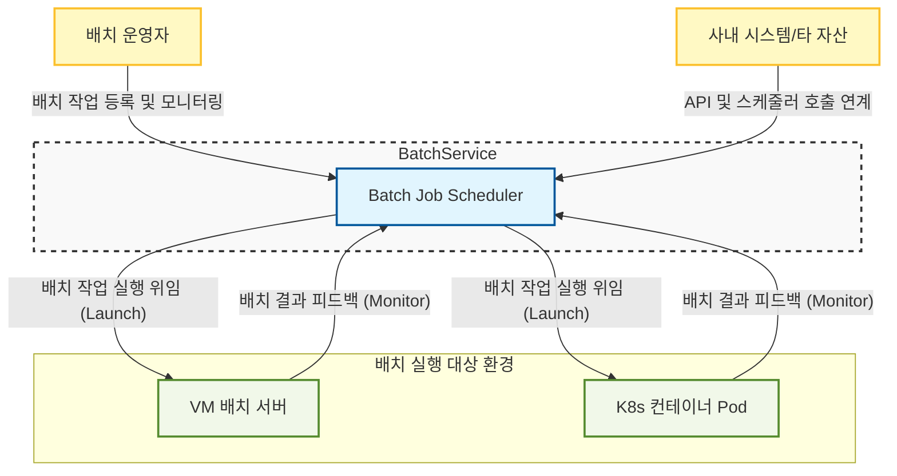

BatchService의 비즈니스 영역 경계와 외부 행위자/시스템 간의 관계를 다이어그램으로 나타냅니다.
![[Pasted image 20260615001919.png]]

```mermaid
graph TD
    %% Actors and Systems
    Operator[배치 운영자]
    Company[사내 시스템/타 자산]
    
    subgraph BatchService_Boundary [BatchService]
        Scheduler["Batch Job Scheduler"]
    end
    
    subgraph Execution_Env [배치 실행 대상 환경]
        VMEnv[VM 배치 서버]
        K8sEnv[K8s 컨테이너 Pod]
    end

    %% Relationships
    Operator -->|배치 작업 등록 및 모니터링| Scheduler
    Scheduler -->|"배치 작업 실행 위임 (Launch)"| VMEnv
    Scheduler -->|"배치 작업 실행 위임 (Launch)"| K8sEnv
    VMEnv -->|"배치 결과 피드백 (Monitor)"| Scheduler
    K8sEnv -->|"배치 결과 피드백 (Monitor)"| Scheduler
    Company -->|API 및 스케줄러 호출 연계| Scheduler

    %% Styling
    classDef boundary fill:#f9f9f9,stroke:#333,stroke-width:2px,stroke-dasharray: 5 5;
    classDef system fill:#e1f5fe,stroke:#01579b,stroke-width:2px;
    classDef actor fill:#fff9c4,stroke:#fbc02d,stroke-width:2px;
    classDef env fill:#f1f8e9,stroke:#558b2f,stroke-width:2px;
    
    class BatchService_Boundary boundary;
    class Scheduler system;
    class Operator,Company actor;
    class VMEnv,K8sEnv env;
```
