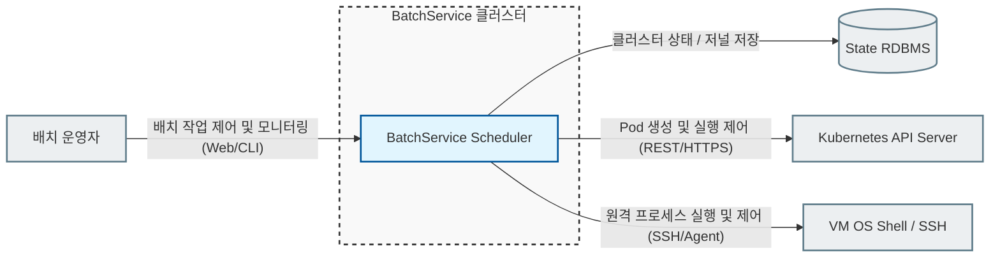

BatchService를 중심으로 상호작용하는 외부 시스템 및 운영자와의 관계를 시스템 관점에서 정의합니다.
![[Pasted image 20260615002015.png]]

```mermaid
graph LR
    %% External Entities
    Operator[배치 운영자]
    K8sAPI[Kubernetes API Server]
    VMServer[VM OS Shell / SSH]
    RDBMS[(State RDBMS)]

    %% System under development
    subgraph System_Boundary [BatchService 클러스터]
        Scheduler[BatchService Scheduler]
    end

    %% Interactions
    Operator -->|"배치 작업 제어 및 모니터링 (Web/CLI)"| Scheduler
    Scheduler -->|클러스터 상태 / 저널 저장| RDBMS
    Scheduler -->|"Pod 생성 및 실행 제어 (REST/HTTPS)"| K8sAPI
    Scheduler -->|"원격 프로세스 실행 및 제어 (SSH/Agent)"| VMServer
    
    %% Styling
    classDef boundary fill:#f9f9f9,stroke:#333,stroke-width:2px,stroke-dasharray: 5 5;
    classDef system fill:#e1f5fe,stroke:#01579b,stroke-width:2px;
    classDef external fill:#eceff1,stroke:#607d8b,stroke-width:2px;
    
    class System_Boundary boundary;
    class Scheduler system;
    class Operator,K8sAPI,VMServer,RDBMS external;
```
