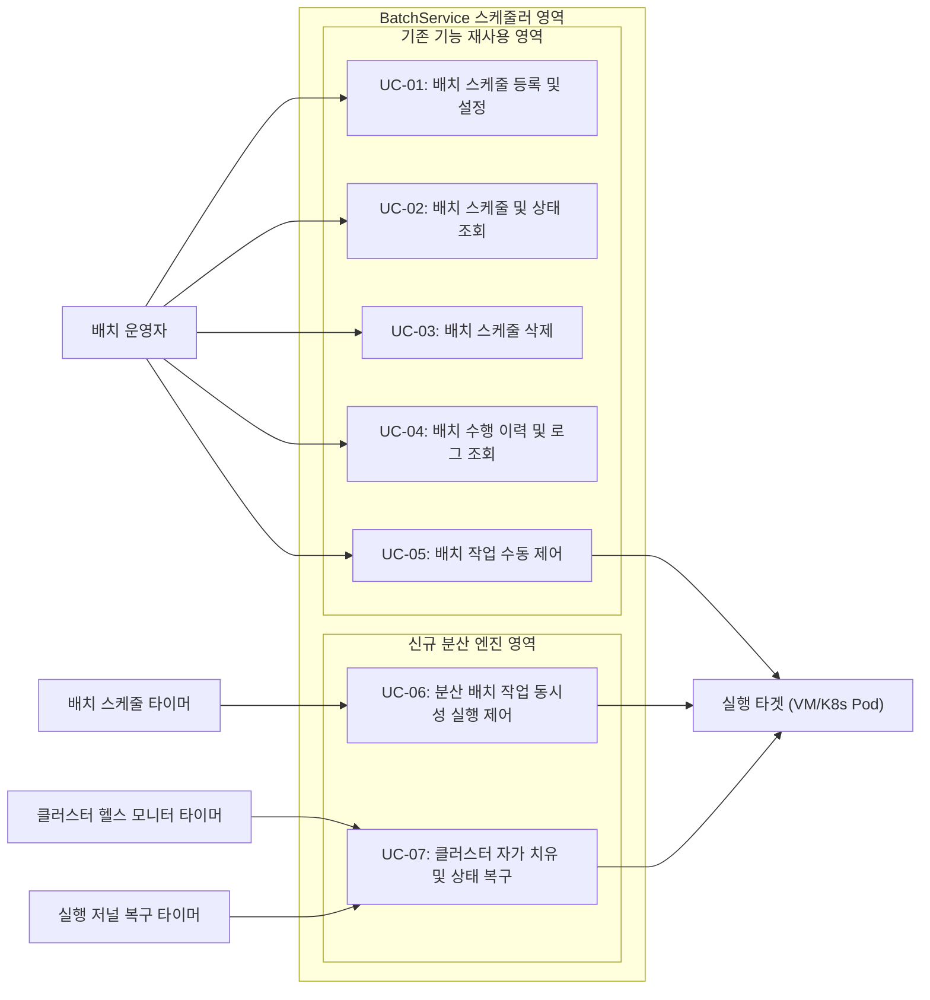

BatchService 핵심 클러스터링 엔진 교체와 관련하여 시스템이 처리해야 하는 주요 동작 시나리오를 정의합니다.

> [!NOTE]
> **유스케이스 설계 범위 및 구분 (Scope & Division)**
> 본 개편 명세서의 유스케이스 모델은 실제 배치 운영자가 수행하는 일반 배치 관리 기능과 분산 클러스터 엔진 교체에 따라 백그라운드에서 신규 구동되는 분산 동기화/자가 치유 흐름을 통합적으로 포함합니다. 
> 
> 독자의 흐름 파악을 돕기 위해, 유스케이스 목록 및 상세 정의 단계에서 **기존 기능 재사용(AS-IS 재사용)** 영역과 **신규 엔진 적용(TO-BE 신규 개발)** 영역을 엄격하게 구분하여 기술합니다.

#### 유스케이스 액터(Actor) 정의 및 분류
본 시스템은 백그라운드에서 상시 작동하는 무중단 분산 스케줄링 자산이므로, 사람 사용자, 외부 시스템, 시간 이벤트를 발생시키는 요소를 모두 아키텍처적인 액터로 정의합니다.

1. **사람 액터 (Human Actor)**: 
   * **배치 운영자 (Operator)**: 웹 UI 관리 화면을 통해 배치 스케줄을 CRUD 제어하거나 이력을 모니터링하고, 수동 즉시 실행 및 강제 종료 명령을 내리는 운영 담당 주체.
2. **외부 시스템 액터 (External System Actor)**: 
   * **실행 타겟 (Execution Target - VM/K8s Pod)**: 스케줄러 노드로부터 배치 실행 신호를 받아 실 배치 작업을 구동하거나, 중단 신호를 받아 프로세스를 소멸시키는 대상 인프라 환경.
3. **시간 액터 (Time / Temporal Actor)**: 
   * **배치 스케줄 타이머 (Batch Schedule Timer)**: 각 배치 작업에 지정된 크론(Cron) 실행 주기가 도달했을 때 구동 트리거를 송신하는 백그라운드 액터.
   * **클러스터 헬스 모니터 타이머 (Cluster Health Monitor Timer)**: 주기적으로 노드 간 활성 핑(Heartbeat) 및 메타 DB의 멤버십 로우를 확인하여 장애 유무를 진단하는 액터.
   * **실행 저널 복구 타이머 (Journal Recovery Scan Timer)**: 주기적으로 공유 저장소의 작업 저널을 스캔하여 비정상 종료된 미완료 태스크를 자동 스캔하는 액터.

### 3.1.1 유스케이스 다이어그램 (Use Case Diagram)

### 3.1.2 유스케이스 목록 (Use Case List)

| 구분 | ID | 유스케이스명 | 설명 | 중요도 | 난이도 | 관련 시스템 기능 |
| :---: | :---: | :--- | :--- | :---: | :---: | :--- |
| **기존 기능 재사용** | UC-01 | 배치 스케줄 등록 및 설정 | 웹 UI 화면을 통해 신규 배치를 등록하고, 배치 간 선후행(DAG) 흐름을 매핑함. | 상 | 하 | N/A (Out-of-Scope) |
| **기존 기능 재사용** | UC-02 | 배치 스케줄 및 상태 조회 | 스케줄러 노드 목록 및 기등록 배치들의 동작 주기와 실시간 가동 상태를 감시함. | 상 | 하 | N/A (Out-of-Scope) |
| **기존 기능 재사용** | UC-03 | 배치 스케줄 삭제 | 웹 UI 상에서 등록된 스케줄 항목을 선택하여 안전하게 삭제 처리함. | 중 | 하 | N/A (Out-of-Scope) |
| **기존 기능 재사용** | UC-04 | 배치 수행 이력 및 로그 조회 | 완료되었거나 구동 중인 배치의 세부 로그 및 최종 성공/실패 여부를 역추적함. | 상 | 하 | N/A (Out-of-Scope) |
| **기존 기능 재사용** | UC-05 | 배치 작업 수동 제어 | 특정 배치의 강제 즉시 실행(수동 트리거) 및 기동 중인 배치의 프로세스 강제 종료를 처리함. | 상 | 중 | SF-02, SF-03 |
| **신규 개발** | UC-06 | 분산 배치 작업 동시성 실행 제어 | 주기 도달 시 다중 노드가 분산 락 경쟁을 거쳐 단일 노드에서 중복 없이 분산 큐로 배치를 구동함. | 상 | 상 | SF-02, SF-03 |
| **신규 개발** | UC-07 | 클러스터 자가 치유 및 상태 복구 | 리더 다운 시 타 노드가 3~5초 내에 자동 복구 및 RDBMS 저널을 스캔하여 미처리 작업을 정상 복구함. | 상 | 상 | SF-01, SF-04, SF-05 |

### 3.1.3 유스케이스 상세 정의

#### UC-01 ~ UC-04: 배치 관리 기본 기능 (AS-IS 재사용)
* 본 기능들은 BatchService 고유의 비즈니스 영역(관리자 UI 및 메타데이터 CRUD)에 속하므로, Hazelcast 엔진 교체와 무관하게 기존 소스코드를 그대로 재사용하며 상세 흐름 기술을 생략합니다.

#### UC-05: 배치 작업 수동 제어 (기존 기능 / 분산 엔진 연계)
| 항목 | 내용 |
| :--- | :--- |
| 액터 (Actor) | 배치 운영자 (Operator), 실행 타겟 (VM/K8s Pod) |
| 사전 조건 | 운영자가 관리 툴에 로그인하여 특정 배치 제어 인터페이스에 접근함. |
| 기본 흐름 | 1. **수동 트리거**: 운영자가 특정 배치의 즉시 실행 명령을 내림 -> 스케줄러 코어가 해당 작업을 분산 큐(`SF-03`)의 최선두에 삽입하여 실행을 지시함. 2. **강제 종료**: 운영자가 실행 중인 배치에 종료 명령을 내림 -> 스케줄러가 타겟 실행 인프라에 중단 시그널(SIGTERM 등)을 전송하고, 즉시 분산 락(`SF-02`)을 강제 해제함. |
| 예외 흐름 | - **네트워크 단절로 강제 종료 불가 시**: 메타 DB 상에서 작업 상태를 강제로 취소(FAILED) 처리하고, 통신 복구 시 잔여 프로세스가 스스로 강제 해제 상태를 감지하여 실행을 자동 정지하게 함. |
| 사후 조건 | 수동 조작에 따른 실행 상태가 RDBMS 저널에 기록되고 공유 저장소가 즉시 최신화됨. |

#### UC-06: 분산 배치 작업 동시성 실행 제어 (신규 개발)
| 항목 | 내용 |
| :--- | :--- |
| 액터 (Actor) | 배치 스케줄 타이머 (Batch Schedule Timer), 실행 타겟 (VM/K8s Pod) |
| 사전 조건 | 3~5개 노드 클러스터가 정상 구성되어 하트비트를 주고받고 있으며, 분산 락 및 분산 큐 인터페이스가 활성화되어 있음. |
| 기본 흐름 | 1. 배치 주기에 맞추어 타이머가 이벤트를 발생시킴. 2. 클러스터 내의 노드들이 해당 배치 작업에 대한 분산 락(`SF-02`) 획득을 경쟁함. 3. 분산 락 획득에 성공한 단 하나의 노드(Worker)가 작업 실행 권한을 선점함. 4. 해당 노드가 작업을 분산 큐(`SF-03`)에 안전하게 적재함. 5. 큐에서 태스크를 인출하여 실행 타겟(VM/K8s)에 실행 위임 명령을 송신함. 6. 배치가 종료되면 락을 자동 해제하고 RDBMS 메타테이블에 이력을 저장함. |
| 예외 흐름 | - **락 획득 실패 시**: 타 노드가 이미 처리 중인 것으로 판단하여 실행 시도를 무시하고 대기 상태를 유지함 (중복 실행 완전 차단). - **원격 기동 실패 시**: 실패 로그를 기록하고, 설정된 재시도 규칙에 따라 재처리 큐로 이관함. |
| 사후 조건 | 작업 실행 결과가 정상 기록되고, 점유했던 분산 리소스(락, 큐 슬롯)가 온전히 반환됨. |

#### UC-07: 클러스터 자가 치유 및 상태 복구 (신규 개발)
| 항목 | 내용 |
| :--- | :--- |
| 액터 (Actor) | 클러스터 헬스 모니터 타이머, 실행 저널 복구 타이머, 실행 타겟 (VM/K8s Pod) |
| 사전 조건 | 1개의 리더 노드와 대기 노드군이 활성화된 상태이며, 일부 작업이 수행 중인 상황임. |
| 기본 흐름 | 1. **장애 감지**: 현재 리더 노드가 다운되거나 하트비트가 끊김. 2. **자가 치유**: 대기 노드가 3~5초 이내에 하트비트 유실을 감지(`SF-01`)하고, 자율 리더 선출 알고리즘(`SF-05`)을 가동하여 새로운 리더를 선출함. 3. **상태 복구**: 선출된 리더가 메타 DB의 실행 저널(`SF-04`)을 스캔하여 비정상 종료된 배치 태스크를 추적함. 4. **재스케줄링**: 식별된 작업을 복구 큐에 등록하여 지연이 없도록 신속하게 재처리를 예약 구동함. |
| 예외 흐름 | - **데이터베이스 장애로 저널 스캔 불가 시**: 복구 핸들러가 관리자 알람을 발생시키고, DB 커넥션이 복구될 때까지 10초 간격으로 스캔을 재시도함. |
| 사후 조건 | 새로운 리더 체제 하에 클러스터가 무중단 유지되며, 유실될 뻔한 누락 작업들이 안전하게 실행 완료됨. |
