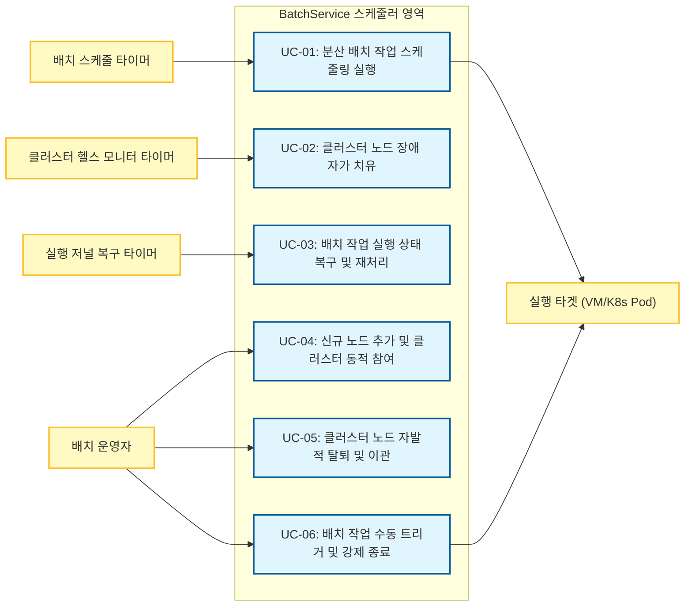

BatchService 핵심 클러스터링 엔진 교체와 관련하여 시스템이 처리해야 하는 주요 동작 시나리오를 정의합니다.

> [!NOTE]
> **유스케이스 모델링 설계 범위 (Scope)**
> 본 설계서의 유스케이스 모델은 기존 시스템(AS-IS)에서 이미 제공하고 있는 일반 기능(스케줄 등록/수정/삭제, 배치 수행 이력 및 로그 조회 등)은 설계 및 변경 범위에서 제외합니다. 
> 본 개편의 핵심인 **"순수 Java 기반의 고가용성 분산 클러스터링 엔진 및 Failover 처리(TO-BE)"** 영역에서 새롭게 추가되거나 비기능적 아키텍처 전략이 반영되는 핵심 제어 흐름에 집중하여 유스케이스를 구성하였습니다.

#### 유스케이스 액터(Actor) 정의 및 분류
본 시스템은 백그라운드에서 상시 작동하는 무중단 분산 스케줄링 자산이므로, 사람 사용자, 외부 시스템, 시간 이벤트를 발생시키는 요소를 모두 아키텍처적인 액터로 정의하여 설계의 타당성을 확보합니다. 클러스터를 이루는 각 스케줄러 노드 프로세스(JVM)는 시스템 자체(System under Design)에 해당하므로 액터에서 배제하며, 외부 실행 시스템 및 운영자와 3대 시간 트리거를 최종 액터로 정의합니다.

1. **사람 액터 (Human Actor)**: 
   * **배치 운영자 (Operator)**: 스케줄러 노드(프로세스)를 기동(추가)하거나 종료(탈퇴)시키고, 스케줄러 상태 모니터링 및 수동 개입(즉시 실행, 강제 종료 등)을 직접 수행하는 주체.
2. **외부 시스템 액터 (External System Actor)**: 
   * **실행 타겟 (Execution Target - VM/K8s Pod)**: 스케줄러로부터 배치 작업 실행 명령(Launch)을 수신받아 직접 프로세스를 구동하거나, 배치 중단 시 강제 종료 시그널을 수신받는 외부 실행 환경 주체.
3. **시간 액터 (Time / Temporal Actor)**: 
   * **배치 스케줄 타이머 (Batch Schedule Timer)**: 각 배치 작업의 고유 Cron 주기 또는 예약 주기가 도달했을 때 스케줄 실행 요청을 발생시키는 액터.
   * **클러스터 헬스 모니터 타이머 (Cluster Health Monitor Timer)**: 주기적(3~5초)으로 노드의 활성 상태(Heartbeat)를 점검하고 리더 탈락 여부를 모니터링하는 이벤트를 기동하는 액터.
   * **실행 저널 복구 타이머 (Journal Recovery Scan Timer)**: 주기적으로 공유 저장소의 실행 로그를 스캔하여 비정상 종료된 작업의 상태 복구 및 재처리를 감지하고 트리거하는 액터.

### 3.1.1 유스케이스 다이어그램 (Use Case Diagram)
![[ArchitectureSpecification/3. Architectural Driver/Untitled Diagram.svg]]

### 3.1.2 유스케이스 목록 (Use Case List)

| ID    | 유스케이스명                | 설명                                                                   | 중요도 | 난이도 | 관련 시스템 기능 (System Feature) |
| ----- | --------------------- | -------------------------------------------------------------------- | --- | --- | -------------------------- |
| UC-01 | 분산 배치 작업 스케줄링 실행      | 배치 예약 시간에 맞추어 다중 노드 중 하나가 분산 락을 획득하고, 중복 실행 없이 분산 큐를 통해 작업을 수행함.     | 상   | 상   | SF-02, SF-03               |
| UC-02 | 클러스터 노드 장애 자가 치유      | 리더 노드 장애 시, 대기 노드가 이를 실시간 감지하여 새로운 리더를 선출(Failover)하고 중단 업무를 승계함.    | 상   | 상   | SF-01, SF-05               |
| UC-03 | 배치 작업 실행 상태 복구 및 재처리  | 스케줄러 노드 또는 실행 환경 크래시 시, 공유 실행 저널 조회를 통해 미완료 작업을 자동으로 복구 및 재예약함.      | 상   | 중   | SF-01, SF-03, SF-04, SF-05 |
| UC-04 | 신규 노드 추가 및 클러스터 동적 참여 | 새로 기동된 노드가 공유 저장소 및 통신 체계를 통해 클러스터 멤버십을 자동으로 갱신하고 연계 동기화를 수행함.       | 중   | 중   | SF-01                      |
| UC-05 | 클러스터 노드 자발적 탈퇴 및 이관   | 유지보수 등을 위해 노드가 정상 종료될 때 보유한 분산 락/큐 자원을 안전하게 반환하고 멤버십에서 이탈함.          | 중   | 중   | SF-01, SF-02, SF-05        |
| UC-06 | 배치 작업 수동 트리거 및 강제 종료  | 배치 운영자가 수동 명령을 통해 특정 배치 작업을 강제 즉시 실행하거나 현재 실행 중인 장기 작업을 안전하게 강제 종료함. | 상   | 중   | SF-02, SF-03               |

### 3.1.3 유스케이스 상세 정의

#### UC-01: 분산 배치 작업 스케줄링 실행
| 항목         | 내용                                                                                                                                                                                                                                                                                             |
| ---------- | ---------------------------------------------------------------------------------------------------------------------------------------------------------------------------------------------------------------------------------------------------------------------------------------------- |
| 액터 (Actor) | 배치 스케줄 타이머 (Batch Schedule Timer)                                                                                                                                                                                                                                                              |
| 사전 조건      | - 3~5개 노드 클러스터가 정상 기동 및 연계 동기화된 상태임. - 분산 락 및 분산 큐 인터페이스가 정상 작동 중임.                                                                                                                                                                                                                         |
| 기본 흐름      | 1. 배치 주기 도달 시 타이머가 이벤트를 발생시킴. 2. 클러스터 내의 노드들이 해당 작업에 대한 분산 락(Distributed Lock) 획득을 경쟁함. 3. 분산 락 획득에 성공한 단 하나의 노드(Worker)가 작업을 인계받음. 4. 해당 노드가 대상 작업을 분산 큐(Distributed Queue)에 적재함. 5. 큐에 적재된 작업을 기반으로 실행 타겟(VM/K8s Pod)에 실행 위임 명령을 송신함. 6. 배치가 종료되면 분산 락을 해제하고 공유 저장소에 이력을 저장함. |
| 예외 흐름      | - **락 획득 실패 시:** 다른 노드가 이미 실행 중인 것으로 판단하여 실행 요청을 무시하고 대기함 (중복 실행 차단). - **원격 기동 실패 시:** 실패 이력을 저장하고 설정된 재시도 룰에 의거하여 재처리 큐로 이관함.                                                                                                                                                             |
| 사후 조건      | 배치 실행 상태가 정상 기록되고 점유했던 분산 자원(Lock/Queue)이 온전히 반환됨.                                                                                                                                                                                                                                             |

#### UC-02: 클러스터 노드 장애 자가 치유
| 항목             | 내용                                                                                                                                                                                                                                                                    |
| -------------- | --------------------------------------------------------------------------------------------------------------------------------------------------------------------------------------------------------------------------------------------------------------------- |
| 액터 (Actor) | 클러스터 헬스 모니터 타이머 (Cluster Health Monitor Timer)                                                                                                                                                                                                                                                            |
| 사전 조건      | 3~5개 노드로 구성된 클러스터에서 1개의 리더(Leader)와 나머지 팔로워(Follower) 노드가 활성화된 상태임.                                                                                                                                                                                                   |
| 기본 흐름      | 1. 현재 리더 노드가 프로세스 종료 또는 네트워크 단절 등으로 정지함. 2. 팔로워 노드들이 하트비트(Heartbeat) 유실을 감지함 (감지 시간 3~5초 이내). 3. 잔여 팔로워 노드 간에 리더 선출 알고리즘(공유 저장소 락 또는 분산 합의 프로토콜)이 기동됨. 4. 최다 표 혹은 최선 획득 노드가 새로운 리더 노드로 승격됨. 5. 새로운 리더 노드가 미처리 배치 작업 리스트를 공유 저장소에서 가져와 다시 스케줄링 큐에 바인딩함. |
| 예외 흐름      | - **쿼럼(과반수) 붕괴 시:** 활성 노드가 1개만 남은 경우, Split-Brain 방지를 위해 독립 모드로 다운그레이드 기동하거나 리더 승격을 차단하고 경고 알람을 발송함.                                                                                                                                                                  |
| 사후 조건      | 새로운 리더 노드 제어 하에 클러스터가 지속 가동되며 작업 유실이 없음이 보장됨.                                                                                                                                                                                                                         |

#### UC-03: 배치 작업 실행 상태 복구 및 재처리
| 항목             | 내용                                                                                                                                                                                                                                       |
| -------------- | ---------------------------------------------------------------------------------------------------------------------------------------------------------------------------------------------------------------------------------------- |
| 액터 (Actor) | 실행 저널 복구 타이머 (Journal Recovery Scan Timer)                                                                                                                                                                                                                  |
| 사전 조건      | 노드 장애 등으로 인해 배치 수행 도중 프로세스가 비정상 종료(Crash)되었거나 강제 종료된 작업이 존재함.                                                                                                                                                                            |
| 기본 흐름      | 1. 새롭게 리더 선출을 완료한 스케줄러 노드가 기동 시 또는 주기적으로 공유 저장소 상의 배치 저널(Journal) 데이터를 조회함. 2. 실행 중(Running) 상태로 장시간 대기 중인 비정상 종료 배치 태스크를 식별함. 3. 해당 태스크를 스케줄러가 차단 해제하고 복구 큐에 자동으로 적재함. 4. 큐에 적재된 태스크에 대해 재처리를 시작하고, 수행 완료 후 상태를 성공/실패로 정상화함. |
| 예외 흐름      | - **저널 저장소 장애 시:** 복구 핸들러가 경고 알람을 발송하고 연결이 복구될 때까지 10초 간격으로 재시도함. |
| 사후 조건      | 비정상 종료되어 누락될 뻔한 배치 작업이 데이터 유실 및 누락 없이 최종 실행 완료됨.                                                                                                                                                                                         |

#### UC-04: 신규 노드 추가 및 클러스터 동적 참여
| 항목             | 내용                                                                                                                                                                                                                                       |
| -------------- | ---------------------------------------------------------------------------------------------------------------------------------------------------------------------------------------------------------------------------------------- |
| 액터 (Actor) | 배치 운영자 (Operator)                                                                                                                                                                                                                      |
| 사전 조건      | 기존 클러스터 노드가 기동 및 활성화되어 정상 작동 중이며, 스케줄러 노드 인프라가 추가 배포됨.                                                                                                                                                                                 |
| 기본 흐름      | 1. 신규 노드 기동 시 공유 멤버십 저장소에 자신의 정보(IP, 포트, 기동 시각)를 등록함. 2. 신규 노드가 기존 리더 노드와 팔로워 노드에게 하트비트 전송을 통해 활성 상태를 최초 알림. 3. 기존 리더 노드가 신규 노드 진입을 멤버십 목록에 등록하고 동기화함. 4. 신규 노드가 클러스터 뷰 업데이트를 수신하고 대기 상태(작업 수신 가능 상태)로 전환됨. |
| 예외 흐름      | - **식별자 충돌 시:** 신규 노드 정보가 기존 활성 노드 정보와 일치할 경우 기동 에러 로그를 남기고 부트스트랩 단계를 즉시 종료(강제 중단)함.                                                                                                                                                         |
| 사후 조건      | 추가된 노드가 클러스터의 일원으로 정상 편입되어 작업 분산 및 폴링 가용 자원이 증가함.                                                                                                                                                                                        |

#### UC-05: 클러스터 노드 자발적 탈퇴 및 이관
| 항목         | 내용                                                                                                                                                                                                                                                |
| ---------- | ------------------------------------------------------------------------------------------------------------------------------------------------------------------------------------------------------------------------------------------------- |
| 액터 (Actor) | 배치 운영자 (Operator)                                                                                                                                                                                                                               |
| 사전 조건      | 운영자에 의한 유지보수 작업이나 스케일인(Scale-in) 정책 등에 의해 특정 노드에 대한 정상 종료(SIGTERM 등) 시그널이 발생함.                                                                                                                                                                    |
| 기본 흐름      | 1. 대상 노드가 정상 종료 시그널을 감지함. 2. 현재 자신이 점유하고 있던 모든 분산 락(Lock)을 즉시 해제함. 3. 분산 큐에서 새로운 작업 폴링을 중단하고, 공유 멤버십 저장소 상의 상태를 '정상 탈퇴'로 변경함. 4. 노드 프로세스가 사용 중이던 통신 리소스 및 메모리를 정상 해제한 후 완전 종료됨. 5. 잔여 리더 및 팔로워 노드가 멤버십에서 대상 노드를 제외하여 클러스터 구조를 재구성함. |
| 예외 흐름      | - **탈퇴 노드가 리더인 경우:** 종료 프로세스 즉시 리더 권한을 명시적으로 반환(Lock 해제)하여 잔여 노드들이 즉각 리더 선출(Failover) 프로세스(UC-02)를 실행할 수 있도록 유도함.                                                                                                                                 |
| 사후 조건      | 대상 노드가 정상 제거되고, 실행 중이던 미처리 작업들은 데이터 유실이나 락 점유 유지 현상 없이 온전히 타 노드로 승계됨.                                                                                                                                                                             |

#### UC-06: 배치 작업 수동 트리거 및 강제 종료
| 항목         | 내용                                                                                                                                                                                                           |
| ---------- | ------------------------------------------------------------------------------------------------------------------------------------------------------------------------------------------------------------ |
| 액터 (Actor) | 배치 운영자 (Operator)                                                                                                                                                                                            |
| 사전 조건      | 운영 상황 대응 또는 에러 분석을 위해 특정 배치를 제어할 수 있는 관리 명령 도구(CLI, API 등)에 접근함.                                                                                                                                             |
| 기본 흐름      | 1. **수동 트리거:** 운영자가 관리 인터페이스에서 배치 ID를 지정하여 즉시 실행 명령을 내림 -> 스케줄러가 이를 수신하여 분산 큐 맨 앞으로 작업을 밀어 넣음. 2. **강제 종료:** 운영자가 현재 구동 중인 태스크에 중단 명령을 전송함 -> 스케줄러가 타겟 실행 인프라(K8s Pod/VM)에 프로세스 종료 신호를 전달하고 분산 락을 강제 반환함. |
| 예외 흐름      | - **네트워크 단절로 강제 종료 불가 시:** 공유 저장소 상에서 작업 상태를 강제로 취소(FAILED/CANCELLED) 처리하고, 통신 복구 시 잔여 프로세스가 스스로 강제 해제 상태를 감지하여 실행을 자동 정지하게 함.                                                                               |
| 사후 조건      | 강제 조작 수행 결과가 공유 저널 정보에 기록되며 즉시 반영됨.                                                                                                                                                                          |
