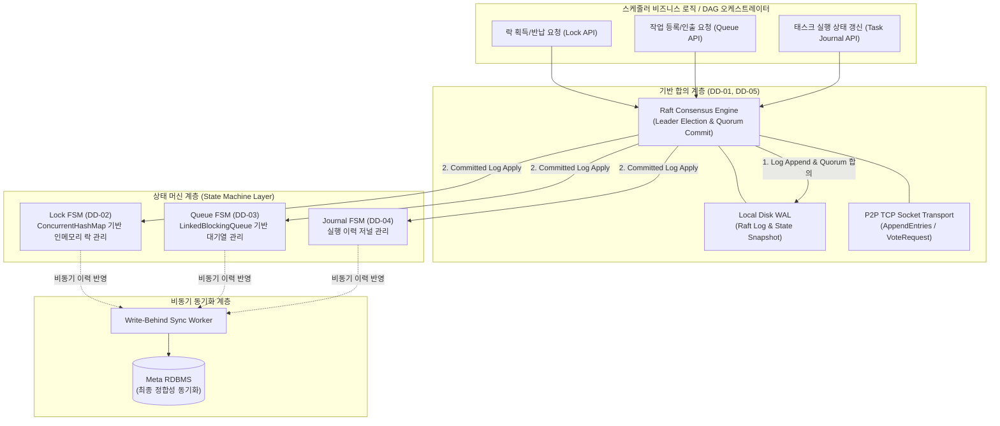

### 5.1.1 설계 전략 적용범위
| No.   | DD 명              | 채택 설계                                       | 설명                                                                                                                                                                                                                                                                      |
| :---- | :---------------- | :------------------------------------------ | :---------------------------------------------------------------------------------------------------------------------------------------------------------------------------------------------------------------------------------------------------------------------- |
| DD-01 | 클러스터 멤버십 및 리더 선출  | Raft 합의 알고리즘 기반 독립 코디네이터                    | 노드 간 TCP 소켓 기반 Raft 합의 알고리즘을 직접 구현하여 Leader/Follower/Candidate 상태 머신, VoteRequest/AppendEntries 메시지, Quorum(과반수) 합의로 DB 장애 중에도 단일 리더 선출 및 멤버십 상태를 지속함 (`QAS-03`, `QAS-04`, `QAS-05`, `NR-09`, `QAS-09`, `NR-01`, `NR-03`, `NR-04`, `NR-07`, `CR-01`).                   |
| DD-02 | 분산 락              | Raft FSM 기반 인메모리 Lock (`ConcurrentHashMap`) | Raft 리더 노드가 Raft FSM(Finite State Machine) 기반 인메모리 Lock을 관리하며, 모든 락 상태 변경은 Raft Log에 기록·복제되어 DB 장애 중에도 상호 배제를 유지하고 리더 장애 시 FSM 재적용으로 락 상태를 복원함 (`QAS-01`, `QAS-02`, `FR-01`, `NR-02`, `NR-06`, `NR-09`, `QAS-09`).                                                      |
| DD-03 | 분산 큐              | 인메모리 Queue (`LinkedBlockingQueue`) + 로컬 WAL | Raft 리더 노드의 인메모리 Queue와 로컬 WAL 조합으로 큐 내구성을 보장함. DB 정상 시 비동기 Write-Behind로 RDBMS에 이력을 반영하고, DB 장애 중에는 인메모리 Queue + 로컬 WAL로 큐 운영을 지속하며 복구 후 Reconciliation을 수행함 (`QAS-01`, `QAS-02`, `FR-02`, `NR-02`, `NR-09`, `QAS-09`).                                                |
| DD-04 | 장애 저널 복구 전략       | 로컬 WAL + Raft Log 복제 기반 분산 저널링              | 태스크 상태 변경을 로컬 WAL에 fsync 쓰기 후 Raft Log를 통해 피어에 복제함. DB 장애 중에도 저널 기록이 지속되며, DB 복구 후 Write-Behind Reconciliation으로 RDBMS와 정합하고 스케줄러 크래시 시 데이터 무유실 자동 복구를 수행함 (`QAS-06`, `FR-03`, `NR-05`, `NR-09`, `QAS-09`).                                                             |
| DD-05 | 분산 합의용 영속 저장소     | 로컬 디스크 WAL + Raft Log 피어 복제                 | 각 노드의 로컬 디스크 WAL과 Raft Log 피어 복제로 분산 합의 상태를 영속화함. DB는 최종 Write-Behind 동기화 대상으로만 활용하여 외부 미들웨어 의존성을 배제하고 DB 장애 내구성을 보장함 (`QAS-08`, `NR-01`, `NR-03`, `NR-07`, `NR-09`, `QAS-09`, `CR-01`, `CR-02`).                                                                       |
| DD-06 | 분산 코디네이터 엔진 배포 구조 | In-Process Embedded Library                 | 기존 배치 애플케이션 JAR 내에 Raft 엔진, 인메모리 Lock/Queue, 로컬 WAL 모듈을 내장 결합하여 IPC 지연 없이 구동함. 상주 메모리를 ~100MB 내외로 운영하여 기존 API 및 K8s 환경과의 하위 호환성을 유지함 (`QAS-07`, `QAS-08`, `NR-03`, `NR-05`, `NR-06`, `NR-07`, `NR-08`, `CR-02`, `BG-03`).                                               |
| DD-07 | K8s 복제본 관리 컨트롤러   | Kubernetes StatefulSet + Headless Service   | Kubernetes StatefulSet 및 Headless Service 오브젝트를 채택하여 파드별 고유 서술적 식별자(`batch-scheduler-0`)와 안정적 DNS 엔드포인트(`batch-0.batch-service`)를 부여함으로써 Raft P2P 통신 안정화 및 로컬 WAL 재접근을 보장하고 순차 롤링 배포를 지원함 (`QAS-04`, `QAS-05`, `QAS-06`, `NR-04`, `NR-08`, `NR-09`, `QAS-09`, `CR-02`). |

### 5.1.2 Raft 기반 핵심 설계 요소 간 아키텍처 관계 및 통합 구조

DD-01(클러스터 멤버십 및 리더 선출), DD-02(분산 락), DD-03(분산 큐), DD-04(장애 저널)는 개별 문제 영역(Concern)에 따라 독립적으로 정의되었으나, 구현 수준에서는 **단일 Raft 합의 엔진(Consensus Core)**을 기반으로 복수의 상태 머신(Multi-FSM)이 구동되는 통합 아키텍처로 구성됩니다.

#### 1. 계층적 분리 구조 (Consensus Core vs State Machine Layer)

1. **합의 코어 계층 (Consensus Core Layer - DD-01, DD-05)**
   - **역할**: 클러스터 내 단일 리더 선출, 과반수(Quorum) 기반 노드 멤버십 관리, P2P 소켓 통신을 통한 로그 분산 복제 및 로컬 WAL 기록을 전담합니다.
   - **독립성**: 상위 비즈니스 도메인의 세부 데이터 구조(락, 큐, 태스크 저널 등)를 인지하지 않으며, 오직 연속적인 바이트 스트림 형태의 '합의된 로그 엔트리(Committed Log Entry)'를 생성하고 순서를 보장합니다.

2. **상태 머신 계층 (State Machine Layer - DD-02, DD-03, DD-04)**
   - **역할**: 합의 코어 계층에서 커밋된 로그 엔트리를 순차적으로 수신(Apply)하여 각 도메인별 인메모리 상태를 전이(State Transition)시킵니다.
   - **직교성(Orthogonality)**: 
     - **Lock FSM (DD-02)**: `LockCommand(Acquire, Release)`를 수신하여 `ConcurrentHashMap`의 키 점유 상태를 갱신합니다.
     - **Queue FSM (DD-03)**: `QueueCommand(Enqueue, Dequeue, Ack)`를 수신하여 `LinkedBlockingQueue`의 작업 대기열 및 실행 상태를 갱신합니다.
     - **Journal FSM (DD-04)**: `TaskJournalCommand(StateChanged)`를 수신하여 태스크 실행 이력을 관리합니다.
   - 각 FSM은 완전히 독립적인 메모리 상태와 갱신 로직을 가지므로, 하나의 합의 파이프라인을 공유하면서도 도메인 간 간섭 없이 확장됩니다.

#### 2. 상태 변경 및 동기화 라이프사이클

1. **클라이언트 요청 수신**: 비즈니스 로직(DAG 엔진 등)이 리더 노드의 API를 통해 상태 변경(락/큐/저널)을 요청합니다.
2. **Raft Log 제안 및 Quorum 복제**: 리더 노드는 수신된 명령을 Raft Log 형태로 패키징하여 로컬 WAL에 기록하고, `AppendEntries` RPC를 통해 팔로워 노드들에 복제합니다.
3. **Quorum 합의 및 Commit**: 과반수 노드의 응답이 확인되면 해당 로그 엔트리를 `Committed` 상태로 확정합니다.
4. **FSM Apply (Deterministic State Transition)**: 확정된 로그 엔트리는 각 도메인 FSM(Lock/Queue/Journal)으로 전달되어 메모리 상태를 결정론적(Deterministic)으로 갱신한 후 클라이언트에 결과를 반환합니다.
5. **Write-Behind RDBMS 반영 (비동기)**: 인메모리 FSM의 상태 변화 이력은 백그라운드 Write-Behind Worker에 의해 RDBMS로 비동기 동기화됩니다. RDBMS 장애가 발생하더라도 1~4번의 인메모리 합의 및 로컬 WAL 파이프라인은 중단 없이 운영됩니다.

#### 3. 장애 복구 및 상태 재현 메커니즘

- **리더 노드 크래시 시**: DD-01에 의해 신규 리더가 선출되면, 신규 리더는 로컬 WAL에 영속화된 Raft Log 및 스냅샷을 기반으로 Lock FSM, Queue FSM, Journal FSM을 역순/순차 Replay하여 인메모리 상태를 복원합니다.
- **RDBMS 복구 시 (Reconciliation)**: 메타 DB 연결이 복구되면, WAL에 누적된 미반영 저널 로그를 RDBMS와 대조하여 최종 상태를 일치시킵니다.

#### 4. 상세 설계(5.2절) 전개 시 반영 방안

- **5.2.1 컴포넌트 내부 구조**: `RaftNode`, `ConsensusEngine`, `RaftLogManager(WAL)`, `LockStateMachine`, `QueueStateMachine`, `JournalStateMachine`, `WriteBehindSynchronizer` 간의 인터페이스 및 호출 관계를 정의합니다.
- **5.2.2 메시지 프로토콜 및 패킷 포맷**: Raft 제어 메시지(`VoteRequest`, `AppendEntries`)와 FSM 도메인 페이로드(`CommandType`, `PayloadData`)의 직렬화/역직렬화 규격을 명시합니다.
- **5.2.3 동시성 제어 및 스레드 모델**: 소켓 I/O 스레드, Raft 합의 루프 스레드, FSM 적용 스레드, Write-Behind 작업자 스레드 간의 큐잉 및 락 프리 동기화 구조를 상세화합니다.