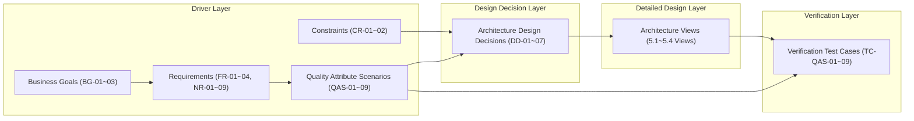

본 절은 1. Project Overview, 2. System Overview, 3. Architectural Driver에서 도출된 비즈니스 목표(BG), 제약 조건(CR), 가정 사항(ASM), 시스템 요구사항(FR/NR), 시스템 기능(SF), 품질 속성 시나리오(QAS)가 4. Top Level Design의 아키텍처 설계 의사결정(DD), 5. Detailed Design의 아키텍처 뷰, 그리고 7. Architecture Implementation and Verification의 검증 테스트 케이스(TC)로 누락 없이 일관되게 연결되었음을 입증하는 전구간 추적성(End-to-End Traceability)을 정의합니다.

---

### 6.1.1 아키텍처 전구간 추적 구조 (End-to-End Traceability Framework)

아키텍처 드라이버에서 검증까지의 연결 흐름은 다음과 같습니다. 모든 상위 요구사항은 최소 하나 이상의 아키텍처 설계 결정(DD)으로 구체화되며, 각 DD는 상세 설계 뷰(View) 및 검증 테스트 케이스(TC)로 추적됩니다.

---

### 6.1.2 종합 전구간 추적 매트릭스 (End-to-End Traceability Matrix)

아키텍처 드라이버(비즈니스 목표, 요구사항, 제약, 품질 속성)부터 설계 의사결정, 상세 뷰, 검증 테스트 케이스에 이르는 전체 추적 관계는 다음과 같습니다.

| QAS ID | QAS 명 | 관련 요구사항 (FR/NR) | 관련 기능 (SF) | 관련 BG / CR / ASM | 대응 설계 결정 (DD) | 대응 상세 설계 뷰 (View) | 대응 검증 테스트 케이스 (TC) |
| :---: | :--- | :---: | :---: | :---: | :---: | :---: | :---: |
| **QAS-01** | [일관성] 동시 100개 트래픽 상황에서 DAG 워크플로우 원자적 오케스트레이션 및 상태 정합성 보장 | FR-01 NR-02 | SF-02 SF-03 | BG-02 ASM-01 ASM-02 | **DD-02** (In-Memory 락) **DD-03** (In-Memory 큐) | 5.1 개념 아키텍처 5.2 모듈 뷰 (`api`, `fsm`) 5.3 런타임 뷰 (시퀀스 1, 2) | **TC-QAS-01** (`ArchitectureVerificationTest`) |
| **QAS-02** | [성능] 피크 타임 대규모 분산 큐 작업 인출 응답 시간 보장 | FR-02 NR-02 NR-06 | SF-02 SF-03 | BG-02 ASM-04 | **DD-02** (In-Memory 락) **DD-03** (In-Memory 큐) | 5.1 개념 아키텍처 5.2 모듈 뷰 (`fsm`, `api`) 5.3 런타임 뷰 (시퀀스 2) | **TC-QAS-02** (`ArchitectureVerificationTest`) |
| **QAS-03** | [신뢰성] 스플릿 브레인 상황 시 데이터 정합성 보장 | FR-04 NR-02 | SF-01 | BG-02 ASM-03 ASM-06 | **DD-01** (Socket P2P Raft) | 5.1 개념 아키텍처 5.2 모듈 뷰 (`consensus`) 5.3 런타임 뷰 (시퀀스 5) | **TC-QAS-03** (`ArchitectureVerificationTest`) |
| **QAS-04** | [운용성/가용성] 일반 멤버 노드 장애 감지 및 3초 이내 멤버십 자가 치유 | FR-04 NR-04 | SF-01 | BG-02 CR-02 ASM-03 | **DD-01** (Socket P2P Raft) **DD-07** (K8s StatefulSet) | 5.1 개념 아키텍처 5.2 모듈 뷰 (`consensus`) 5.3 런타임 뷰 (시퀀스 4) 5.4 배포 뷰 (StatefulSet) | **TC-QAS-04** (`ArchitectureVerificationTest`) |
| **QAS-05** | [가용성] 리더 노드 장애 시 3초 이내 신규 리더 자동 선출 및 서비스 정상화 | FR-04 NR-04 | SF-01 SF-05 | BG-02 CR-02 ASM-03 | **DD-01** (Socket P2P Raft) **DD-07** (K8s StatefulSet) | 5.1 개념 아키텍처 5.2 모듈 뷰 (`consensus`) 5.3 런타임 뷰 (시퀀스 3) 5.4 배포 뷰 (StatefulSet) | **TC-QAS-05** (`ArchitectureVerificationTest`) |
| **QAS-06** | [신뢰성] 예기치 못한 스케줄러 다운 시 상태 복원을 통한 데이터 무유실 복구 | FR-03 NR-05 | SF-04 | BG-02 ASM-05 | **DD-04** (Raft 저널링) **DD-07** (K8s StatefulSet) | 5.1 개념 아키텍처 5.2 모듈 뷰 (`fsm`, `storage`) 5.3 런타임 뷰 (시퀀스 6) 5.4 배포 뷰 (전용 PVC) | **TC-QAS-06** (`ArchitectureVerificationTest`) |
| **QAS-07** | [효율성] 클러스터 노드당 자원(메모리/CPU) 점유율 최적화 | NR-06 | SF-01 SF-02 SF-03 | BG-01 BG-03 | **DD-06** (Embedded Library) | 5.1 개념 아키텍처 5.2 모듈 뷰 (`AutoConfiguration`) 5.4 배포 뷰 (In-Process) | **TC-QAS-07** (`ArchitectureVerificationTest`) |
| **QAS-08** | [이식성/운용성] 별도 외부 미들웨어 종속 없는 VM/K8s 하이브리드 환경 자동 구성 및 배포 | NR-01 NR-03 NR-07 NR-08 | SF-01 ~ SF-05 | BG-01 BG-03 CR-01 CR-02 | **DD-05** (Local WAL) **DD-06** (Embedded Library) | 5.1 개념 아키텍처 5.2 모듈 뷰 (`storage`, `cluster`) 5.4 배포 뷰 (단일 JAR) | **TC-QAS-08** (`ArchitectureVerificationTest`) |
| **QAS-09** | [가용성/내구성] 메타 DB 장기 장애 중 분산 락·큐 무중단 운영 및 DB 복구 후 정합성 복원 | NR-09 | SF-01 ~ SF-05 | BG-02 CR-02 ASM-05 | **DD-01** (Raft 리더선출) **DD-02** (In-Memory 락) **DD-03** (In-Memory 큐) **DD-04** (저널 복구) **DD-05** (Local WAL 영속) | 5.1 개념 아키텍처 5.2 모듈 뷰 (`fsm`, `storage`) 5.3 런타임 뷰 (시퀀스 7, 8) 5.4 배포 뷰 (StatefulSet PVC) | **TC-QAS-09** (`ArchitectureVerificationTest`) |

---

### 6.1.3 추적성 정합성 검증 결과

1. **요구사항 커버리지 100% 달성**:
   - 4개 기능 요구사항(FR-01 ~ FR-04), 9개 비기능 요구사항(NR-01 ~ NR-09), 5개 시스템 기능(SF-01 ~ SF-05), 9개 품질 속성 시나리오(QAS-01 ~ QAS-09)가 모두 최소 하나 이상의 아키텍처 설계 결정(DD)에 매핑되었습니다.
   - 근거 없이 도입된 고립된 설계 결정(Unmotivated Design Decision)이나 누락된 요구사항(Orphan Requirement)이 존재하지 않습니다.
2. **제약 조건 및 비즈니스 목표 정합성**:
   - 유료 라이선스 배제(CR-01, BG-01, NR-01)는 DD-01, DD-05, DD-06을 통해 완전히 충족되었습니다.
   - 기존 K8s 배포 호환성 및 아키텍처 영향 최소화(CR-02, BG-03, NR-03, NR-08)는 DD-06(임베디드 라이브러리) 및 DD-07(StatefulSet Headless 연계)을 통해 충족되었습니다.
   - 기술 내재화(BG-02)는 자체 경량 Raft 합의 엔진 및 Multi-FSM 모듈 구현을 통해 달성되었습니다.
