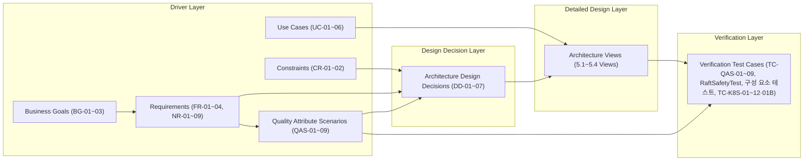

본 절은 1. Project Overview, 2. System Overview, 3. Architectural Driver에서 도출된 비즈니스 목표(BG), 제약 조건(CR), 가정 사항(ASM), 시스템 요구사항(FR/NR), 시스템 기능(SF), 유스케이스(UC), 외부 엔티티·인터페이스(EE/INF), 품질 속성 시나리오(QAS)가 4. Top Level Design의 아키텍처 설계 의사결정(DD), 5. Detailed Design의 아키텍처 뷰, 그리고 7. Architecture Implementation and Verification의 검증 테스트 케이스(TC)로 연결되는 전구간 추적성(End-to-End Traceability)을 정의합니다.

### 6.1.1 아키텍처 전구간 추적 구조 (End-to-End Traceability Framework)

아키텍처 드라이버에서 검증까지의 연결 흐름은 다음과 같습니다. 상위 요구사항은 최소 하나 이상의 아키텍처 설계 결정(DD)으로 구체화되며, 각 DD는 상세 설계 뷰(View) 및 검증 수단(TC 또는 7.1.5 보완 계획)으로 추적됩니다.

### 6.1.2 품질 속성 시나리오 기준 추적 매트릭스 (QAS Traceability Matrix)

품질 속성 시나리오(QAS)를 기준으로 드라이버, 설계 의사결정, 상세 뷰, 검증 테스트 케이스에 이르는 추적 관계는 다음과 같습니다.

| QAS ID | QAS 명                                                    |     관련 요구사항 (FR/NR)     |            관련 기능 (SF)            |     관련 BG / CR / ASM      |                                                            대응 설계 결정 (DD)                                                            |                                                     대응 상세 설계 뷰 (View)                                                      |                                                        대응 검증 테스트 케이스 (TC)                                                         |
| :----: | :------------------------------------------------------- | :---------------------: | :------------------------------: | :-----------------------: | :---------------------------------------------------------------------------------------------------------------------------------: | :------------------------------------------------------------------------------------------------------------------------: | :-------------------------------------------------------------------------------------------------------------------------------: |
| QAS-01 | [일관성] 동시 100개 트래픽 상황에서 DAG 워크플로우 원자적 오케스트레이션 및 상태 정합성 보장 |     FR-01 NR-02      |          SF-02 SF-03          | BG-02 ASM-01 ASM-02 |                                             DD-02 (In-Memory 락) DD-03 (In-Memory 큐)                                              |                           5.1 개념 아키텍처 5.2 모듈 뷰 (`api`, `fsm`) 5.3 런타임 뷰 (C&C, Scenario 1)                            | TC-QAS-01 (`ArchitectureVerificationTest`) `RaftSafetyTest.leaseSurvivesLeaderChangeWithClockSkew` TC-K8S-01, TC-K8S-01B |
| QAS-02 | [성능] 피크 타임 대규모 분산 큐 작업 인출 응답 시간 보장                       |     FR-02 NR-02      |              SF-03               |      BG-02 ASM-04      |                                                         DD-03 (In-Memory 큐)                                                         |                           5.1 개념 아키텍처 5.2 모듈 뷰 (`api`, `fsm`) 5.3 런타임 뷰 (C&C, Scenario 1)                            |                                    TC-QAS-02 (`ArchitectureVerificationTest`) TC-K8S-02                                     |
| QAS-03 | [신뢰성] 스플릿 브레인 상황 시 데이터 정합성 보장                            |     FR-04 NR-02      | SF-01 SF-02 SF-03 SF-05 | BG-02 ASM-03 ASM-06 |                                           DD-01 (Socket P2P Raft) DD-03 (In-Memory 큐)                                            |             5.1 개념 아키텍처 5.2 모듈 뷰 (`consensus`, `consensus.transport`, `fsm`) 5.3 런타임 뷰 (C&C, Scenario 5)             |                         TC-QAS-03 (`ArchitectureVerificationTest`) TC-K8S-03, TC-K8S-11, TC-K8S-12                          |
| QAS-04 | [운용성/가용성] 일반 멤버 노드 장애 감지 및 3초 이내 멤버십 자가 치유               |     FR-04 NR-04      |              SF-01               | BG-02 CR-02 ASM-03  |                                         DD-01 (Socket P2P Raft) DD-07 (K8s StatefulSet)                                          |            5.1 개념 아키텍처 5.2 모듈 뷰 (`consensus`, `health`) 5.3 런타임 뷰 (Scenario 3) 5.4 배포 뷰 (StatefulSet)             |                               TC-QAS-04 (`ArchitectureVerificationTest`) TC-K8S-04, TC-K8S-12                               |
| QAS-05 | [가용성] 리더 노드 장애 시 3초 이내 신규 리더 자동 선출 및 서비스 정상화             |     FR-04 NR-04      |          SF-01 SF-05          | BG-02 CR-02 ASM-03  |                                         DD-01 (Socket P2P Raft) DD-07 (K8s StatefulSet)                                          |            5.1 개념 아키텍처 5.2 모듈 뷰 (`consensus`, `health`) 5.3 런타임 뷰 (Scenario 2) 5.4 배포 뷰 (StatefulSet)             |                               TC-QAS-05 (`ArchitectureVerificationTest`) TC-K8S-05, TC-K8S-11                               |
| QAS-06 | [신뢰성] 예기치 못한 스케줄러 다운 시 상태 복원을 통한 데이터 무유실 복구              |          FR-03          |              SF-04               | BG-02 CR-02 ASM-05  |                                             DD-04 (Raft 저널링) DD-07 (K8s StatefulSet)                                             |         5.1 개념 아키텍처 5.2 모듈 뷰 (`fsm`, `storage`, `recovery`) 5.3 런타임 뷰 (C&C, Scenario 2) 5.4 배포 뷰 (전용 PVC)         | TC-QAS-06 (`ArchitectureVerificationTest`) `RaftSafetyTest.restartedNodeRecoversFromWalAndRejoins` TC-K8S-06, TC-K8S-10  |
| QAS-07 | [효율성] 클러스터 노드당 자원(메모리/CPU) 점유율 최적화                       |          NR-06          |     SF-01 SF-02 SF-03      |           BG-01           |                                                      DD-06 (Embedded Library)                                                       |                   5.1 개념 아키텍처 5.2 모듈 뷰 (Bootstrap) 5.3 런타임 뷰 (C&C 스레드 모델) 5.4 배포 뷰 (In-Process)                   |                                    TC-QAS-07 (`ArchitectureVerificationTest`) TC-K8S-07                                     |
| QAS-08 | [이식성/운용성] 별도 외부 미들웨어 종속 없는 VM/K8s 하이브리드 환경 자동 구성 및 배포    | NR-03 NR-07 NR-08 |          SF-01 ~ SF-05           |  BG-02 BG-03 CR-02  |     DD-01 (Socket P2P Raft) DD-03 (In-Memory 큐) DD-05 (Local WAL) DD-06 (Embedded Library) DD-07 (K8s StatefulSet)      | 5.1 개념 아키텍처 5.2 모듈 뷰 (`consensus.transport`, `storage`, Bootstrap) 5.3 런타임 뷰 (C&C) 5.4 배포 뷰 (단일 JAR, StatefulSet) |                                    TC-QAS-08 (`ArchitectureVerificationTest`) TC-K8S-08                                     |
| QAS-09 | [가용성/내구성] 메타 DB 장기 장애 중 분산 락·큐 무중단 운영 및 DB 복구 후 정합성 복원   |          NR-09          |          SF-01 ~ SF-05           | BG-02 CR-02 ASM-05  | DD-01 (Raft 리더선출) DD-02 (In-Memory 락) DD-03 (In-Memory 큐) DD-04 (저널 복구) DD-05 (Local WAL 영속) DD-07 (K8s StatefulSet) |          5.1 개념 아키텍처 5.2 모듈 뷰 (`sync`, `storage`) 5.3 런타임 뷰 (C&C, Scenario 4) 5.4 배포 뷰 (StatefulSet PVC)          |                                    TC-QAS-09 (`ArchitectureVerificationTest`) TC-K8S-09                                     |

- 관련 요구사항(FR/NR)은 3.2.1의 QAS별 관련 요구사항과 같고, 대응 DD는 4.1.0.2와 같습니다. 관련 BG는 1.3의 BG ↔ 요구사항 매핑에서 도출합니다. 관련 기능(SF)은 해당 QAS의 응답이 직접 동작하는 시스템 기능을 표기합니다. 관련 CR은 대응 DD에 DD-07(StatefulSet 전환)이 포함되어 기존 K8s 실행 환경 변경을 수반하는 QAS에 CR-02를 표기하고(6.4 Trade-off 1), 관련 ASM은 해당 QAS 응답의 전제가 되는 가정을 표기합니다.
- 7.2 각 TC의 대응 요구사항에는 해당 테스트가 직접 실행하는 DD를 표기합니다. QAS의 대응 DD 중 DD-07(K8s StatefulSet)은 로컬 환경에서 크래시·동일 WAL 재기동 시뮬레이션으로 확인하고, 매니페스트 동작(`Parallel` 기동, Pod 재생성 후 동일 PVC 재마운트, 롤링 업데이트)은 4단계 K8s 통합 검증(TC-K8S-08, TC-K8S-10, TC-K8S-11)으로 확인합니다. 싱글노드에서 재현하지 않는 `podAntiAffinity`, VM 장애, 노드 드레인 시 PDB 동작은 7.1.5의 운영 규격 스테이징 검증 계획으로 보완합니다.
- TC-K8S는 7.1.2의 4단계 검증으로, 로컬 테스트(TC-QAS)와 같은 QAS를 실제 TCP·PVC·Pod 생명주기 위에서 검증합니다 (7.2.13).

### 6.1.3 QAS 외 드라이버 추적 매트릭스

#### 6.1.3.1 QAS로 표현되지 않은 요구사항 및 제약

| ID | 내용 | 대응 설계 결정 (DD) | 대응 설계 근거 | 검증 |
| :---: | :--- | :---: | :--- | :--- |
| NR-01 CR-01 | 유료 라이선스 모듈 배제 | DD-01, DD-03, DD-05 | 4.2.1 의존성 정책 (Apache-2.0·MIT 모듈만 사용), 5.2.1 패키지 의존 규칙 | 빌드 의존성 목록 점검 (4.2.1) |
| NR-05 | 기존 API 및 메타 스키마 호환 | DD-02, DD-04, DD-06 | 5.2.3 기존 분산 락 API 호환, 5.4.2.5-3 메타 DB 동기화 스키마 | `DistributedLockExecutorTest` (7.2.11) |
| NR-06 | 추가 CPU 사용률 5% 미만 | DD-06 | 5.4.2.4 CPU 사이징 | TC-QAS-07·TC-K8S-07은 Heap·메모리만 측정하며, CPU는 7.1.5 보완 계획으로 확인 |

#### 6.1.3.2 유스케이스 추적

|  UC   | 유스케이스                |               관련 SF               |        대응 DD        | 대응 런타임·배포 뷰                                                                                                | 검증                                                                                                            |
| :---: | :------------------- | :-------------------------------: | :-----------------: | :--------------------------------------------------------------------------------------------------------- | :------------------------------------------------------------------------------------------------------------ |
| UC-01 | 분산 배치 작업 스케줄링 실행     |           SF-02, SF-03            | DD-02, DD-03, DD-04 | 5.3.2 Scenario 1                                                                                           | TC-QAS-01, TC-QAS-02, TC-K8S-01, TC-K8S-01B, TC-K8S-02                                                        |
| UC-02 | 클러스터 노드 장애 자가 치유     |           SF-01, SF-05            |    DD-01, DD-07     | 5.3.2 Scenario 2 (1~3단계), Scenario 5 (쿼럼 붕괴 시 쓰기 차단)                                                       | TC-QAS-03, TC-QAS-05, TC-K8S-03, TC-K8S-05                                                                    |
| UC-03 | 배치 작업 실행 상태 복구 및 재처리 |    SF-01, SF-03, SF-04, SF-05     |    DD-03, DD-04     | 5.3.2 Scenario 2 (4~5단계)                                                                                   | TC-QAS-06, TC-K8S-06                                                                                          |
| UC-04 | 신규 노드 추가 및 클러스터 참여   |               SF-01               | DD-01, DD-05, DD-07 | 5.3.2 Scenario 3 (3~5단계), 5.4.2.1 복제본 수 변경                                                                 | TC-QAS-08, `RaftSafetyTest.restartedNodeRecoversFromWalAndRejoins`, TC-K8S-08, TC-K8S-10 (노드 수 변경 재배포는 7.1.5) |
| UC-05 | 클러스터 노드 자발적 탈퇴 및 이관  | SF-01, SF-02, SF-03, SF-04, SF-05 | DD-01, DD-04, DD-07 | 5.3.2 Scenario 3 (1~2단계), Scenario 2, 5.4.2.1 롤링 업데이트·PDB                                                  | TC-QAS-04, TC-QAS-05, TC-QAS-06 (비정상 종료), TC-K8S-10, TC-K8S-11 (SIGTERM 정상 종료, 노드 드레인은 7.1.5)                 |
| UC-06 | 배치 작업 수동 트리거 및 강제 종료 |           SF-03, SF-04            |    DD-03, DD-04     | 5.3.2 공통 런타임 규약 2 (`QUEUE_ENQUEUE` front, `JOURNAL_RECORD`, `QUEUE_ACK`), Scenario 1 3~4단계 (leaseToken 펜싱) | TC-QAS-06 펜싱 assertion (수동 제어 경로는 7.1.5)                                                                      |

#### 6.1.3.3 외부 엔티티 및 인터페이스 추적

| EE / INF | 대상 | 런타임 요소 (5.3.1) | 배포 할당 (5.4.1) | 비고 |
| :---: | :--- | :--- | :--- | :--- |
| EE-01, EE-05 INF-01 | 배치 운영자, 사내 연계 시스템 / 운영자 제어 API | Scheduler Core (BatchService) | `8080/TCP` HTTP API | BatchService 기존 기능 재사용 (1.1 Out-of-Scope) |
| EE-02 INF-02 | Kubernetes API Server / K8s Job 제어 | Execution Target, C-23, C-24 | `ns-batch`, RBAC (5.4.2.5-2) | 실행 기동은 BatchService 구현, 상태 조회는 `ExecutionStatusProvider` |
| EE-03 INF-03 | VM 호스트 / VM 실행 제어 | Execution Target (VM) | 수요처 프로젝트 실행 환경 | BatchService 구현, 상태 조회는 `ExecutionStatusProvider`로 연계 |
| EE-04 INF-04 | 배치 메타 DB / 데이터베이스 연계 | Meta RDBMS, C-20 | 사내 중앙 DB (`batch_journal_log`, `batch_sync_checkpoint`) | 리더의 `WriteBehindSynchronizer`만 연결 |

### 6.1.4 추적성 정합성 검증 결과

1. **드라이버 커버리지**:
   - 기능 요구사항 4개(FR-01 ~ FR-04), 비기능 요구사항 9개(NR-01 ~ NR-09), 시스템 기능 5개(SF-01 ~ SF-05), 유스케이스 6개(UC-01 ~ UC-06), 가정 사항 6개(ASM-01 ~ ASM-06), 외부 엔티티 5개(EE-01 ~ EE-05), 외부 인터페이스 4개(INF-01 ~ INF-04), 품질 속성 시나리오 9개(QAS-01 ~ QAS-09)가 6.1.2와 6.1.3에서 설계 결정, 상세 뷰, 검증 수단에 연결됩니다.
   - 모든 DD는 4.1.0.1의 관련 드라이버를 가지므로 근거 없이 도입된 설계 결정은 없습니다.
2. **로컬 테스트 외 검증이 필요한 항목**: UC-05의 정상 종료와 DD-07의 매니페스트 동작(`Parallel` 기동, Pod 재생성 후 동일 PVC 재마운트, 롤링 업데이트)은 4단계 K8s 통합 검증(TC-K8S-08, TC-K8S-10, TC-K8S-11)으로 확인합니다. NR-06의 CPU 사용률, UC-04의 노드 수 변경 재배포, UC-06의 수동 제어 경로, 싱글노드에서 재현하지 않는 `podAntiAffinity`·노드 드레인 동작은 7.1.5의 보완 계획으로 관리합니다.
3. **제약 조건 및 비즈니스 목표 정합성**:
   - 유료 라이선스 배제(CR-01, BG-01, NR-01)는 DD-01, DD-03, DD-05의 자체 합의·큐·영속화 구현과 4.2.1 의존성 정책(Apache-2.0·MIT 모듈만 사용)으로 충족됩니다.
   - 기존 K8s 배포 호환성 및 아키텍처 영향 최소화(CR-02, BG-03, NR-03, NR-08)는 외부 미들웨어 없이 DD-06(임베디드 라이브러리)과 DD-07(StatefulSet) 표준 매니페스트로 대응하며, 3노드 구성·StatefulSet 전환·Raft 포트·전용 PVC 추가에 따른 변경은 6.4 Trade-off 1로 관리합니다.
   - 기술 내재화(BG-02)는 자체 경량 Raft 합의 엔진 및 Multi-FSM 모듈 구현을 통해 달성되었습니다.
   - 기존 API 호환(NR-05)은 DD-02의 `DistributedLockExecutor`가 AS-IS Hazelcast 공통모듈의 메소드 시그니처와 락 의미(스레드 단위 소유, 획득할 때까지 대기, 재진입)를 유지하는 방식으로 충족되었습니다 (5.2.3).
