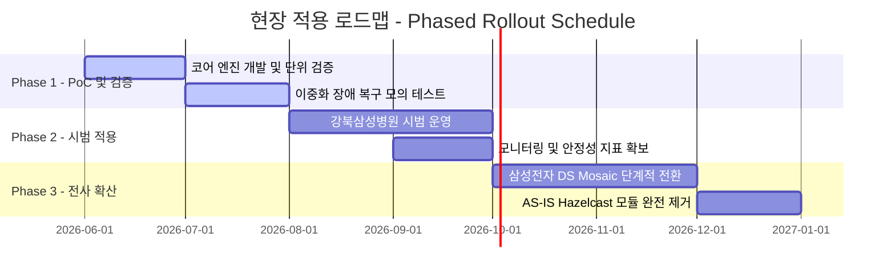

## 8.1 현장 활용 효과

본 아키텍처 개편을 통해 비용 절감, 기술 내재화, 시스템 안정성을 달성하고, 사내 재사용 자산으로서의 가치를 극대화함. 임원 및 비즈니스 관점의 핵심 기대효과는 다음과 같음.

### 8.1.1 비용 절감 및 재무적 효과 (Cost Saving)
* **라이선스 Opex 영(0)원화:** 오픈소스 라이브러리 Hazelcast의 유료화 정책 변경에 따른 연간 서브스크립션 비용 리스크를 원천적으로 제거함.
* **인프라 TCO 절감:** 고성능 인메모리 데이터 그리드(IMDG) 구동을 위한 무거운 메모리 자원 요구사항이 사라짐에 따라, 소규모 클러스터 노드만으로 경량 동작이 가능하여 인프라 도입/운영 비용을 최소화함.
* **도입 비용 제거:** 타 사내 프로젝트에서 배치 스케줄러 공통자산을 도입할 때 발생하는 추가 서드파티 라이선스 구매 허들을 제거하여 전사적 IT 투자 효율을 높임.

### 8.1.2 기술 독립성 및 품질 향상 (Technical Independence & Quality)
* **Vendor Lock-in 탈피:** 특정 벤더나 특정 프레임워크 기술에 종속되지 않고, JDK Standard API만을 활용한 분산 합의 및 동시성 제어 원천 기술을 확보함.
* **고가용성(HA) 및 무중단 운영:** 스케줄러 노드 다운 시 3~5초 이내 자동 리더 선출 및 데이터 정합성을 보장하는 저널링 기반 Fault Tolerance를 실현하여 배치 운영 가용성(SLA)을 극대화함.
* **이식성 향상:** 무거운 클러스터 인프라 설정이 생략되므로 VM 환경뿐만 아니라 Kubernetes(K8s) 컨테이너 환경에도 즉시 이식 가능함.

## 8.2 적용 대상 사이트 현황

기존 BatchService가 적용되어 운영 중이며, 본 아키텍처 개편에 따른 Hazelcast 대체 마이그레이션이 필요한 실 대상 프로젝트 현황은 다음과 같음.

| 프로젝트명                      | 시스템 성격                  | AS-IS 구성                             | TO-BE 구성                           |
| -------------------------- | ----------------------- | ------------------------------------ | ---------------------------------- |
| 삼성전자 반도체(DS) MOSAIC PJT | 반도체 제조/물류 분석 및 배치 관리    | Hazelcast 2-Node Cluster (이중화 구성) | Java Standard 기반 2-Node Cluster |
| 강북삼성병원 건강검진 시스템 PJT     | 병원 건강검진 예약 및 결과 배치 스케줄러 | Hazelcast 2-Node Cluster (이중화 구성) | Java Standard 기반 2-Node Cluster |

## 8.3 현장 적용 일정

안정적인 마이그레이션과 현장 적용을 위해 3단계(Phase)의 단계적 적용 로드맵을 적용.

* **Phase 1: 개발 및 기술 검증 (PoC) [2026.06 ~ 2026.08]**
  * Java Standard 기반의 분산 락, 분산 큐, 자가 치유 프로토타입 구현 및 시뮬레이션 환경 검증.
  * 테스트 케이스([[7.2 Test Cases]]) 기준의 모의 장애 테스트 통과 검증.
* **Phase 2: 시범 적용 (Pilot Run) [2026.08 ~ 2026.10]**
  * 배치 수행 패턴이 비교적 규칙적이고 정적인 스케줄(일 배치 등)을 보유한 **강북삼성병원 건강검진 시스템 PJT**를 파일럿 타겟으로 선정하여 안정성 시범 운영을 진행함.
  * 실환경 하트비트 레이턴시 및 락 획득 지연 시간 측정 등 정량적 안정성 지표 확보.
* **Phase 3: 전사 확산 및 마이그레이션 (Full Rollout) [2026.10 ~ 2026.12]**
  * 파일럿 검증 성공 후, 실시간 제조/물류 분석 연계로 인한 유동적인 동시성 제어가 필요한 **삼성전자 반도체(DS) Mosaic PJT**에 단계적(Canary 방식)으로 스케줄러 엔진을 적용 및 마이그레이션 완료함.
  * 안정화 기간(약 1개월)을 거친 후 기존 Hazelcast 기반 모듈을 완전 폐기함.

## 8.4 리스크 관리 및 안정화 대책

이전 및 전환 시점에 발생 가능한 시스템 마찰을 예방하기 위한 전술적 대책을 정의함.

* **병행 가동 (Dual-Run) 검토:**
  * 마이그레이션 초기 단계에는 기존 AS-IS 스케줄러(Hazelcast 기반)와 신규 자체 스케줄러(Java Standard 기반)를 물리/논리적으로 완전히 격리된 독립 인스턴스로 동시 구동하되, 스케줄 대상 업무를 순차적으로 신규 스케줄러로 이관하며 안정성을 대조 검증함.
* **안전한 복구(Recovery) 시나리오 구비:**
  * 신규 분산 엔진의 구동 오류나 예기치 못한 크래시 발생 시, 메타 데이터베이스 상에 기록되는 트랜잭션 단위 실행 저널 로그를 기반으로 중단되었던 배치 작업을 10초 이내에 자동 복구 및 재처리하여 배치 정합성을 안전하게 확보함.