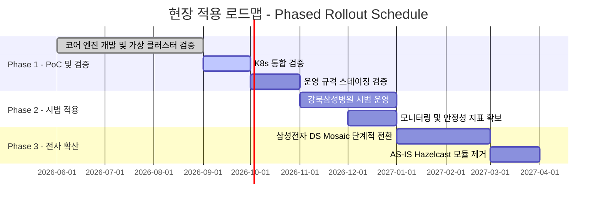

## 8.1 현장 활용 효과

본 아키텍처 개편을 통해 비용 절감, 기술 내재화, 시스템 안정성을 달성하고, 사내 재사용 자산으로서의 가치를 높입니다. 임원 및 비즈니스 관점의 핵심 기대효과는 다음과 같습니다.

### 8.1.1 비용 절감 및 재무적 효과 (Cost Saving)
* **라이선스 Opex 영(0)원화:** 오픈소스 라이브러리 Hazelcast의 유료화 정책 변경에 따른 연간 서브스크립션 비용 리스크를 배제합니다.
* **인프라 자원 부담 경감:** 인메모리 데이터 그리드(IMDG) 구동을 위한 별도 메모리 자원 없이 노드당 추가 Heap 50MB 이하로 동작합니다(`QAS-07`). 단, 1개 노드 장애 허용을 위한 3개 노드 구성과 스케줄러 전용 노드 배치(5.4)는 AS-IS 2개 노드 구성 대비 인프라 변경을 수반합니다(6.4 Trade-off 1).
* **도입 비용 제거:** 타 사내 프로젝트에서 배치 스케줄러 공통자산을 도입할 때 발생하는 추가 서드파티 라이선스 구매 허들을 제거하여 전사적 IT 투자 효율을 높입니다.

### 8.1.2 기술 독립성 및 품질 향상 (Technical Independence & Quality)
* **Vendor Lock-in 탈피:** 특정 벤더나 외부 분산 미들웨어에 종속되지 않고, JDK 표준 API 기반으로 구현한 분산 합의 및 동시성 제어 핵심 기술을 확보합니다.
* **고가용성(HA) 및 무중단 운영:** 스케줄러 리더 노드 다운 시 3초 이내 신규 리더 자동 선출(`QAS-05`), 10초 이내 미완료 작업 복구(`QAS-06`)를 수행하고, 메타 DB 장애 중에도 분산 락·큐를 중단 없이 운영하여(`QAS-09`) 배치 운영 가용성(SLA)을 향상합니다.
* **이식성 향상:** 별도 분산 미들웨어 설치 없이(설치 시간 0분) VM 환경과 Kubernetes(K8s) 컨테이너 환경에서 신규 노드가 2분 이내에 클러스터에 참여합니다(`QAS-08`).

## 8.2 적용 대상 사이트 현황

기존 BatchService가 적용되어 운영 중이며, 본 아키텍처 개편에 따른 Hazelcast 대체 마이그레이션이 필요한 실 대상 프로젝트 현황은 다음과 같습니다.

| 프로젝트명                      | 시스템 성격                  | AS-IS 구성                             | TO-BE 구성                           |
| -------------------------- | ----------------------- | ------------------------------------ | ---------------------------------- |
| 삼성전자 반도체(DS) MOSAIC PJT | 반도체 제조/물류 분석 및 배치 관리    | Hazelcast 2-Node Cluster (이중화 구성) | Java Standard 기반 3-Node Cluster (Quorum 2) |
| 강북삼성병원 건강검진 시스템 PJT     | 병원 건강검진 예약 및 결과 배치 스케줄러 | Hazelcast 2-Node Cluster (이중화 구성) | Java Standard 기반 3-Node Cluster (Quorum 2) |

> TO-BE는 1개 노드 장애 시에도 과반수 합의로 리더 선출과 분산 락·큐를 유지하기 위해 3개 노드로 구성합니다 (`QAS-03`, `QAS-05`).

## 8.3 현장 적용 일정

안정적인 마이그레이션과 현장 적용을 위해 3단계(Phase)의 단계적 적용 로드맵을 적용합니다.

* **Phase 1: 개발 및 기술 검증 (PoC) [2026.06 ~ 2026.10]**
  * Java Standard 기반의 분산 락, 분산 큐, 자가 치유 엔진 구현 및 로컬 가상 클러스터 검증 (2026.06 ~ 2026.08).
  * minikube·Chaos Mesh 기반 K8s 통합 검증 (2026.09, 테스트 케이스: [[7.2 Test Cases]]).
  * 전용 노드 풀 3대 이상의 운영 규격 스테이징에서 7.1.5의 잔여 검증 항목(`podAntiAffinity`, 노드 드레인 시 PDB, CPU 사용률, SSD 계열 StorageClass 성능) 확인 (2026.10).
* **Phase 2: 시범 적용 (Pilot Run) [2026.11 ~ 2027.01]**
  * 배치 수행 패턴이 비교적 규칙적이고 정적인 스케줄(일 배치 등)을 보유한 **강북삼성병원 건강검진 시스템 PJT**를 파일럿 타겟으로 선정하여 안정성 시범 운영을 진행합니다.
  * 실환경 하트비트 레이턴시 및 락 획득 지연 시간 측정 등 정량적 안정성 지표 확보합니다.
* **Phase 3: 전사 확산 및 마이그레이션 (Full Rollout) [2027.01 ~ 2027.04]**
  * 파일럿 검증 성공 후, 실시간 제조/물류 분석 연계로 인한 유동적인 동시성 제어가 필요한 **삼성전자 반도체(DS) Mosaic PJT**에 단계적(Canary 방식)으로 스케줄러 엔진을 적용 및 마이그레이션 완료합니다.
  * 안정화 기간(약 1개월)을 거친 후 기존 Hazelcast 기반 모듈을 폐기합니다.

## 8.4 리스크 관리 및 안정화 대책

이전 및 전환 시점에 발생 가능한 시스템 마찰을 예방하기 위한 전술적 대책을 정의합니다.

* **병행 가동 (Dual-Run) 검토:**
  * 마이그레이션 초기 단계에는 기존 AS-IS 스케줄러(Hazelcast 기반)와 신규 자체 스케줄러(Java Standard 기반)를 물리/논리적으로 격리된 독립 인스턴스로 동시 구동하되, 스케줄 대상 업무를 순차적으로 신규 스케줄러로 이관하며 안정성을 대조 검증합니다.
* **API 호환 전환:**
  * BatchService의 `DistributedLockExecutor` 호출 코드는 유지하고, import 경로(`com.sds.batchservice.cluster.api`), Hazelcast 의존성, `hazelcast.yaml` 설정만 엔진 JAR와 `batch.cluster.*` 설정으로 교체합니다. 대기 중 인터럽트 처리 등 AS-IS와 다른 동작은 전환 전에 5.2.3의 항목으로 점검합니다.
* **복구(Recovery) 시나리오 구비:**
  * 신규 분산 엔진의 구동 오류나 예기치 못한 크래시 발생 시, 각 노드의 로컬 WAL과 Raft 로그로 복제된 실행 저널을 기반으로 신규 리더가 중단된 배치 작업을 10초 이내에 자동 복구 및 재처리합니다(`QAS-06`). 메타 DB 장애 중에도 복구가 가능하며, DB 복구 후 30초 이내에 실행 이력을 동기화합니다(`QAS-09`).
